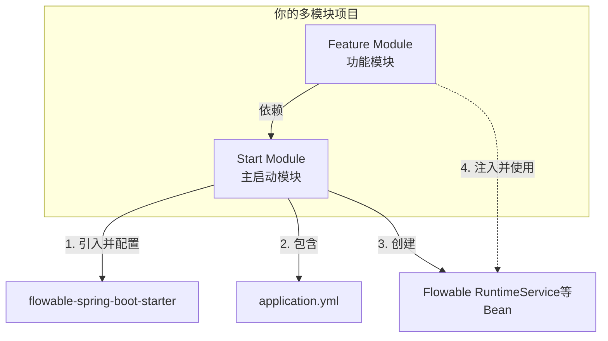

# 坑-启动配置

## 问题

我是在一个功能module中的pom引入了包，也是在这个module想使用Autowired引入。  但application.yml 在Start模块配置了Flowable，问题是没有执行自动装配。

## 问题原因

这是一个非常经典的 **Spring Boot 多模块项目** 的配置问题。你的情况描述得非常清楚，这也是很多开发者会踩的坑。

**核心结论：你的配置方式是错误的。** 在 Spring Boot 多模块项目中，**所有 Spring Boot Starter 依赖和相关的 `application.yml` 配置，都必须统一放在主启动模块（即你的 “Start模块”）中。**

让我详细解释为什么以及如何正确配置。

### 🧩 问题根源：模块间的职责混淆

一个典型的 Spring Boot 多模块项目结构如下：

```
my-project (父工程)
├── start-module      (主启动模块，包含 main 方法)
└── feature-module    (功能模块，写业务代码)
```

1. **Spring Boot 应用是一个“单体”**：虽然代码可以分模块，但最终打包运行时，它**只有一个 Spring 应用上下文**。这个上下文是由**主启动模块**的 `main` 方法和 `@SpringBootApplication` 注解来引导创建的。

2. **自动装配的起点是主模块**：Spring Boot 的自动装配机制（读取 `application.yml`、扫描 `@Component`、创建 `DataSource`、创建 `Flowable` 的 `ProcessEngine` 等）**只在主启动模块的类路径下生效**。

3. **你当前的情况导致了“割裂”**：
    * **Start模块**：有 `application.yml` 配置，但**没有**引入 `flowable-spring-boot-starter` 依赖。所以，Spring Boot 在启动时，即使看到了 Flowable 的配置，也**找不到对应的自动配置类**，因此不会创建任何 Flowable 的 Bean（`RuntimeService` 等）。
    * **Feature模块**：引入了 `flowable-spring-boot-starter` 依赖，所以代码里能识别 `RuntimeService` 这个类，编译不会报错。但是，**由于主启动模块的 Spring 上下文里根本没有这些 Bean，所以运行时注入一定会失败**。

这就像是你只在“功能模块”的图纸上画了发动机，但实际组装汽车（启动主模块）时，却试图从“启动模块”的仓库里去找这个发动机，自然是找不到的。

### 🔧 正确配置方案

你需要把**依赖**和**配置**都收敛到 **主启动模块（Start模块）**。

#### 方案一（推荐）：主模块统一管理

这是最清晰、最标准的做法。

1. **修改 Start模块 的 `pom.xml`**：
    将 `flowable-spring-boot-starter` 依赖从 `feature-module` 移动到 `start-module`。

    ```xml
    <!-- 在 start-module 的 pom.xml 中添加 -->
    <dependency>
        <groupId>org.flowable</groupId>
        <artifactId>flowable-spring-boot-starter-process</artifactId>
        <version>7.2.0</version>
    </dependency>
    ```

2. **修改 Feature模块 的 `pom.xml`**：
    移除 `flowable-spring-boot-starter` 依赖。它现在通过模块依赖传递过来。

    ```xml
    <!-- 在 feature-module 的 pom.xml 中，移除此依赖 -->
    <!-- 如果只是为了使用 Flowable 的 API 类进行编译，可以改为引入 flowable-engine -->
    <dependency>
        <groupId>org.flowable</groupId>
        <artifactId>flowable-engine</artifactId>
        <version>7.2.0</version>
        <scope>provided</scope> <!-- 因为运行时主模块已提供 -->
    </dependency>
    ```

3. **保持 Start模块 的 `application.yml`** 配置不变。
4. **在 Feature模块 的 Service 类中，直接 `@Autowired` 即可**：
    因为主模块已经创建了 Flowable 的 Bean，并且所有模块共享同一个 Spring 上下文，所以可以正常注入。

#### 方案二：使用 `@Import`（较复杂，不推荐）

如果出于某些强架构要求，必须将 Flowable 限定在功能模块内，你需要：

1. 在 `feature-module` 中创建一个 `FlowableConfig` 配置类，用 `@Bean` 手动创建 `ProcessEngine` 等。
2. 在 `start-module` 的主类上使用 `@Import(FeatureModuleFlowableConfig.class)` 来显式导入这个配置。

这种方法非常繁琐，容易出错，破坏了 Spring Boot “约定优于配置” 的理念，除非有极端需求，否则不建议。

### 📦 模块依赖关系图

为了更直观，正确的依赖关系应该如下：



### ✅ 总结与检查清单

请按以下步骤检查和修改你的项目：

1. **依赖位置**：确保 `flowable-spring-boot-starter` 依赖在 **`start-module` 的 `pom.xml`** 中。
2. **配置位置**：确保 `application.yml` 中的 `flowable:` 相关配置在 **`start-module` 的 `src/main/resources/`** 下。
3. **清理工作**：从 `feature-module` 的 `pom.xml` 中移除 `flowable-spring-boot-starter` 依赖。
4. **验证传递**：确保 `feature-module` 的 `pom.xml` 中正确依赖了 `start-module`。

    ```xml
    <!-- 在 feature-module 的 pom.xml 中应有 -->
    <dependency>
        <groupId>com.yourcompany</groupId>
        <artifactId>start-module</artifactId>
        <version>1.0.0</version>
    </dependency>
    ```

5. **重启应用**：完成以上修改后，**重新启动**你的 Spring Boot 应用（从 `start-module` 的主类启动）。

按照这个模式修改后，你的 `@Autowired` 注入应该就能正常工作了。如果还有问题，请提供你修改后的模块 `pom.xml` 结构，我可以帮你进一步分析。
