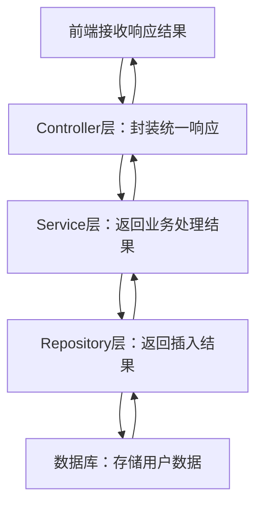

# 各层级代码示例

你希望我对 Spring Boot 项目的**完整分层架构**进行深度拆解，包括每一层的核心定位、职责边界、命名规范、核心技术/注解、实战代码示例，以及层与层之间的交互逻辑和企业级最佳实践，帮你掌握规范、可维护的项目分层设计思路。

## 一、分层架构的核心原则（先立规矩，再讲分层）

Spring Boot 分层设计遵循「高内聚、低耦合」的核心思想，所有分层都围绕以下 3 个原则展开（新手务必牢记）：

1. **单一职责**：每一层只做一件事，比如 Controller 只处理请求/响应，Service 只处理业务逻辑；
2. **依赖向下**：上层可依赖下层，下层绝对不依赖上层（如 Controller → Service → Repository，反之不可）；
3. **面向接口编程**：复杂项目中，Service/Repository 层优先定义接口，再写实现类，降低耦合。

## 二、核心分层（企业级项目必备，90% 场景覆盖）

标准 Spring Boot 项目的核心分层从「前端请求」到「数据库交互」分为 5 层，以下是每一层的详细拆解：

### 1. 表现层（Controller / API 层）

#### 定位与核心职责

整个项目的「入口」，直接对接前端（浏览器/小程序/第三方系统），是「用户请求」和「后端业务」的桥梁，**不处理任何业务逻辑**。

- 通俗理解：像公司的「前台」，只负责接收访客（请求），引导到对应的业务部门（Service），不处理具体业务。
- 核心职责：
  ✅ 接收 HTTP 请求（GET/POST/PUT/DELETE 等）；
  ✅ 解析请求参数（路径参数、请求体、请求头）；
  ✅ 参数合法性校验（如非空、格式校验）；
  ✅ 调用 Service 层处理业务；
  ✅ 封装响应结果（统一返回格式、状态码、数据）；
  ❌ 绝对不写业务逻辑（如判断用户是否存在、计算价格）。

#### 核心注解/组件

| 注解/组件                | 作用                                                                 |
|--------------------------|----------------------------------------------------------------------|
| `@RestController`        | 核心注解（`@Controller + @ResponseBody`），标记为接口控制器，返回 JSON；|
| `@GetMapping/@PostMapping`| 映射 GET/POST 请求（替代 `@RequestMapping`，更语义化）；|
| `@RequestParam`          | 接收 URL 拼接参数（如 `?name=张三`）；|
| `@PathVariable`          | 接收路径参数（如 `/user/{id}`）；|
| `@RequestBody`           | 接收 JSON 格式的请求体；|
| `@Valid/@Validated`      | 触发参数校验（配合 `@NotBlank`/`@NotNull` 等）；|
| `@ControllerAdvice`      | 全局异常处理、统一响应封装；|

#### 命名规范

- 包名：`com.xxx.controller`（或 `com.xxx.api`）；
- 类名：`XXXController`（如 `UserController`、`OrderController`）；
- 方法名：`listXXX`（查询列表）、`getXXXById`（查询详情）、`addXXX`（新增）、`updateXXX`（修改）、`deleteXXX`（删除）。

#### 实战代码示例

```java
package com.example.demo.controller;

import com.example.demo.dto.UserAddDTO;
import com.example.demo.dto.UserVO;
import com.example.demo.service.UserService;
import com.example.demo.common.Result;
import jakarta.validation.Valid;
import org.springframework.web.bind.annotation.*;

import javax.annotation.Resource;
import java.util.List;

// 前后端分离首选 @RestController，返回 JSON
@RestController
@RequestMapping("/api/user") // 统一接口前缀
public class UserController {

    // 依赖 Service 层（仅注入，不创建）
    @Resource
    private UserService userService;

    // 查询用户列表：GET 请求
    @GetMapping("/list")
    public Result<List<UserVO>> listUser() {
        List<UserVO> userList = userService.listUser();
        // 统一返回结果（Result 是自定义的响应封装类）
        return Result.success(userList);
    }

    // 新增用户：POST 请求 + 参数校验
    @PostMapping("/add")
    public Result<Void> addUser(@Valid @RequestBody UserAddDTO userAddDTO) {
        userService.addUser(userAddDTO);
        return Result.success();
    }

    // 根据ID查询用户：路径参数
    @GetMapping("/{id}")
    public Result<UserVO> getUserById(@PathVariable Long id) {
        UserVO user = userService.getUserById(id);
        return Result.success(user);
    }
}
```

#### 关键注意事项

- 禁止在 Controller 中写业务逻辑（比如不要在 `addUser` 里判断手机号是否重复）；
- 必须做参数校验（用 `@Valid + 校验注解`），避免脏数据进入业务层；
- 所有接口返回**统一格式**（如自定义 `Result` 类，包含 `code`/`msg`/`data`），方便前端解析。

### 2. 业务层（Service 层）

#### 定位与核心职责

项目的「大脑」，处理**所有核心业务逻辑**，是整个项目的核心层。

- 通俗理解：像公司的「业务部门」，前台（Controller）把需求转过来后，具体的业务操作（如注册、下单、计算折扣）都在这里完成。
- 核心职责：
  ✅ 接收 Controller 传递的参数，处理业务逻辑（如校验、计算、流程控制）；
  ✅ 调用 Repository 层操作数据库；
  ✅ 控制事务（如下单时「扣库存+生成订单」必须原子性）；
  ✅ 封装业务结果，返回给 Controller；
  ❌ 绝对不直接接收前端请求，不直接操作数据库。

#### 核心注解/组件

| 注解/组件                | 作用                                                                 |
|--------------------------|----------------------------------------------------------------------|
| `@Service`               | 标记类为业务层 Bean，纳入 IoC 容器管理；|
| `@Transactional`         | 声明事务（控制业务操作的原子性，如「要么全成，要么全败」）；|
| `@Resource/@Autowired`   | 注入 Repository 层依赖；|

#### 命名规范（分「接口+实现类」，复杂项目必做）

- 包名：`com.xxx.service`（接口）、`com.xxx.service.impl`（实现类）；
- 接口名：`XXXService`（如 `UserService`）；
- 实现类名：`XXXServiceImpl`（如 `UserServiceImpl`）；
- 方法名：和 Controller 对应，但更贴近业务（如 `addUser`、`listUser`、`checkPhoneExist`）。

#### 实战代码示例

```java
// 第一步：定义 Service 接口（面向接口编程）
package com.example.demo.service;

import com.example.demo.dto.UserAddDTO;
import com.example.demo.dto.UserVO;

import java.util.List;

public interface UserService {
    // 新增用户
    void addUser(UserAddDTO userAddDTO);
    // 查询用户列表
    List<UserVO> listUser();
    // 根据ID查询用户
    UserVO getUserById(Long id);
}

// 第二步：实现 Service 接口
package com.example.demo.service.impl;

import com.baomidou.mybatisplus.core.conditions.query.LambdaQueryWrapper;
import com.example.demo.dto.UserAddDTO;
import com.example.demo.dto.UserVO;
import com.example.demo.entity.UserEntity;
import com.example.demo.exception.BusinessException;
import com.example.demo.mapper.UserMapper;
import com.example.demo.service.UserService;
import com.example.demo.util.BeanCopyUtil;
import org.springframework.stereotype.Service;
import org.springframework.transaction.annotation.Transactional;

import javax.annotation.Resource;
import java.util.List;
import java.util.stream.Collectors;

// 标记为业务层 Bean
@Service
public class UserServiceImpl implements UserService {

    // 注入数据访问层依赖
    @Resource
    private UserMapper userMapper;

    // 新增用户：带事务（如果有多个数据库操作，保证原子性）
    @Override
    @Transactional(rollbackFor = Exception.class) // 所有异常都回滚
    public void addUser(UserAddDTO userAddDTO) {
        // 1. 业务校验：手机号是否已存在（核心业务逻辑）
        LambdaQueryWrapper<UserEntity> wrapper = new LambdaQueryWrapper<>();
        wrapper.eq(UserEntity::getPhone, userAddDTO.getPhone());
        UserEntity existUser = userMapper.selectOne(wrapper);
        if (existUser != null) {
            // 抛自定义业务异常（全局异常处理器会捕获）
            throw new BusinessException("手机号已注册");
        }

        // 2. 转换 DTO 到 Entity（数据载体转换）
        UserEntity userEntity = BeanCopyUtil.copyBean(userAddDTO, UserEntity.class);

        // 3. 调用 Repository 层保存数据
        userMapper.insert(userEntity);
    }

    @Override
    public List<UserVO> listUser() {
        // 1. 查询数据库
        List<UserEntity> userEntityList = userMapper.selectList(null);
        // 2. 转换 Entity 到 VO（隐藏敏感字段，如密码）
        return userEntityList.stream()
                .map(entity -> BeanCopyUtil.copyBean(entity, UserVO.class))
                .collect(Collectors.toList());
    }

    @Override
    public UserVO getUserById(Long id) {
        UserEntity userEntity = userMapper.selectById(id);
        if (userEntity == null) {
            throw new BusinessException("用户不存在");
        }
        return BeanCopyUtil.copyBean(userEntity, UserVO.class);
    }
}
```

#### 关键注意事项

- 复杂业务必须拆分为多个小方法（如 `checkPhoneExist`、`saveUser`），提高可读性；
- 事务注解 `@Transactional` 要加在**实现类方法**上（加在接口上可能失效）；
- 业务异常要抛自定义异常（如 `BusinessException`），不要抛通用 `Exception`。

### 3. 数据访问层（Repository / DAO / Mapper 层）

#### 定位与核心职责

项目的「手」，仅负责和**数据库交互**，是业务层和数据库之间的桥梁，**不包含任何业务逻辑**。

- 通俗理解：像公司的「后勤部门」，只负责按业务部门（Service）的要求，去仓库（数据库）取/存东西，不关心业务目的。
- 核心职责：
  ✅ 执行数据库增删改查（CRUD）操作；
  ✅ 封装 SQL 逻辑（或用 ORM 框架简化）；
  ✅ 接收 Service 层的参数，返回数据库查询结果；
  ❌ 绝对不处理业务逻辑（如不要在这层判断手机号是否重复）。

#### 核心注解/组件

| 注解/组件                | 作用                                                                 |
|--------------------------|----------------------------------------------------------------------|
| `@Repository`            | 标记类为数据访问层 Bean（MyBatis 中常用 `@Mapper` 替代）；|
| `@Mapper`（MyBatis）     | 标记接口为 MyBatis 映射接口，自动生成实现类；|
| `@Param`（MyBatis）      | 给 SQL 参数命名，方便 XML/注解中引用；|
| JPA 接口（`JpaRepository`） | 简化 CRUD，无需手写 SQL；|

#### 命名规范

- 包名：`com.xxx.mapper`（MyBatis）、`com.xxx.repository`（JPA）、`com.xxx.dao`（传统）；
- 接口名：`XXXMapper`/`XXXRepository`（如 `UserMapper`、`OrderRepository`）；
- 方法名：贴近数据库操作（如 `selectById`、`insert`、`deleteById`、`existsByPhone`）。

#### 实战代码示例（MyBatis-Plus 版，企业主流）

```java
package com.example.demo.mapper;

import com.baomidou.mybatisplus.core.mapper.BaseMapper;
import com.example.demo.entity.UserEntity;
import org.apache.ibatis.annotations.Mapper;

// MyBatis 核心注解：标记为映射接口，自动生成实现类
@Mapper
public interface UserMapper extends BaseMapper<UserEntity> {
    // MyBatis-Plus 已封装基础 CRUD（selectById/insert/deleteById 等），无需手写
    // 自定义 SQL：比如根据手机号查询
    // @Select("SELECT * FROM user WHERE phone = #{phone}")
    // UserEntity selectByPhone(@Param("phone") String phone);
}
```

#### 关键注意事项

- 只写数据库操作逻辑，哪怕是简单的 `WHERE` 条件，也不要加业务判断；
- 避免在这层写复杂 SQL（如多表联查），复杂查询建议用 MyBatis XML 或分页插件；
- 不要返回前端直接用的 VO，只返回和数据库映射的 Entity。

### 4. 实体层（Entity / Model 层）

#### 定位与核心职责

项目的「数据载体」，封装所有数据，分为 3 类（企业级必分，新手易混），**仅包含属性和 getter/setter，无业务逻辑**。

- 通俗理解：像公司的「表单/文件」，只记录数据，不处理数据。

#### 实体分类与职责

| 实体类型       | 核心作用                                                                 | 命名规范                |
|----------------|--------------------------------------------------------------------------|-------------------------|
| Entity（实体） | 和数据库表一一映射（字段名、类型完全对应），存储数据库原始数据；| `XXXEntity`（如 `UserEntity`） |
| DTO（数据传输对象） | 前端→后端的参数载体（如注册时接收「手机号+密码」），仅包含前端需要传递的字段； | `XXXDTO`（如 `UserAddDTO`）|
| VO（视图对象） | 后端→前端的返回载体（如返回用户信息时隐藏密码），仅包含前端需要展示的字段； | `XXXVO`（如 `UserVO`）|

#### 核心注解/组件

| 注解/组件                | 作用                                                                 |
|--------------------------|----------------------------------------------------------------------|
| `@Data`（Lombok）        | 自动生成 getter/setter/toString 等方法，简化代码；|
| `@TableName`（MyBatis-Plus） | 指定 Entity 对应的数据库表名；|
| `@TableId`（MyBatis-Plus）| 指定主键字段；|
| `@NotBlank/@NotNull`     | 参数校验注解（加在 DTO 上）；|

#### 命名规范

- 包名：`com.xxx.entity`（Entity）、`com.xxx.dto`（DTO）、`com.xxx.vo`（VO）；
- 类名：见上表（`XXXEntity`/`XXXDTO`/`XXXVO`）；
- 属性名：和数据库字段/前端参数一致（如 `phone`、`password`）。

#### 实战代码示例

```java
// 1. Entity：映射数据库表（user 表）
package com.example.demo.entity;

import com.baomidou.mybatisplus.annotation.IdType;
import com.baomidou.mybatisplus.annotation.TableId;
import com.baomidou.mybatisplus.annotation.TableName;
import lombok.Data;

import java.time.LocalDateTime;

@Data // Lombok 核心注解：简化 getter/setter
@TableName("user") // 指定数据库表名
public class UserEntity {
    // 主键：自增
    @TableId(type = IdType.AUTO)
    private Long id;
    // 手机号（和数据库字段一致）
    private String phone;
    // 密码（敏感字段，不返回给前端）
    private String password;
    // 昵称
    private String nickname;
    // 创建时间
    private LocalDateTime createTime;
}

// 2. DTO：接收前端新增用户的参数
package com.example.demo.dto;

import jakarta.validation.constraints.NotBlank;
import lombok.Data;

@Data
public class UserAddDTO {
    // 参数校验：手机号不能为空
    @NotBlank(message = "手机号不能为空")
    private String phone;
    // 参数校验：密码不能为空
    @NotBlank(message = "密码不能为空")
    private String password;
    // 昵称（非必传）
    private String nickname;
}

// 3. VO：返回给前端的用户信息（隐藏密码）
package com.example.demo.vo;

import lombok.Data;

import java.time.LocalDateTime;

@Data
public class UserVO {
    private Long id;
    private String phone;
    private String nickname;
    private LocalDateTime createTime;
    // 无 password 字段，避免敏感信息泄露
}
```

#### 关键注意事项

- 绝对不要混用 Entity/DTO/VO（比如用 Entity 接收前端参数，会暴露敏感字段）；
- DTO 只包含前端需要传递的字段，VO 只包含前端需要展示的字段；
- 用 Lombok 的 `@Data` 简化代码，避免手写大量 getter/setter。

### 5. 配置层（Config 层）

#### 定位与核心职责

项目的「全局设置中心」，配置所有非业务相关的全局规则，**不处理任何业务逻辑**。

- 通俗理解：像公司的「行政部门」，制定全局规则（如考勤、采购），不参与具体业务。
- 核心职责：
  ✅ 配置数据源（连接 MySQL/Redis）；
  ✅ 配置拦截器/过滤器（如登录拦截、跨域）；
  ✅ 注册第三方 Bean（如 RedisTemplate、RestTemplate）；
  ✅ 配置全局参数（如分页插件、时间格式化）。

#### 核心注解/组件

| 注解/组件                | 作用                                                                 |
|--------------------------|----------------------------------------------------------------------|
| `@Configuration`         | 标记类为配置类，纳入 IoC 容器管理；|
| `@Bean`                  | 注册自定义 Bean（如第三方组件）；|
| `@ComponentScan`         | 指定 Bean 扫描路径；|
| `@EnableWebMvc`          | 开启 Spring MVC 自定义配置；|

#### 命名规范

- 包名：`com.xxx.config`；
- 类名：`XXXConfig`（如 `WebConfig`、`MyBatisConfig`、`RedisConfig`）。

#### 实战代码示例

```java
package com.example.demo.config;

import com.baomidou.mybatisplus.extension.plugins.MybatisPlusInterceptor;
import com.baomidou.mybatisplus.extension.plugins.inner.PaginationInnerInterceptor;
import org.springframework.context.annotation.Bean;
import org.springframework.context.annotation.Configuration;
import org.springframework.web.servlet.config.annotation.CorsRegistry;
import org.springframework.web.servlet.config.annotation.WebMvcConfigurer;

// 标记为配置类
@Configuration
public class WebConfig implements WebMvcConfigurer {

    // 1. 跨域配置（解决前端跨域请求问题）
    @Override
    public void addCorsMappings(CorsRegistry registry) {
        registry.addMapping("/api/**") // 仅对 /api 前缀的接口生效
                .allowedOriginPatterns("*") // 允许所有域名
                .allowedMethods("GET", "POST", "PUT", "DELETE") // 允许的请求方法
                .allowCredentials(true) // 允许携带 Cookie
                .maxAge(3600); // 预检请求缓存时间
    }

    // 2. 注册 MyBatis-Plus 分页插件（Bean 方式注册）
    @Bean
    public MybatisPlusInterceptor mybatisPlusInterceptor() {
        MybatisPlusInterceptor interceptor = new MybatisPlusInterceptor();
        interceptor.addInnerInterceptor(new PaginationInnerInterceptor());
        return interceptor;
    }
}
```

#### 关键注意事项

- 配置类只做全局设置，不要写业务逻辑；
- 第三方组件（如 Redis、MQ）的配置统一放在这层；
- 避免重复配置（如跨域配置不要既写在 Config 又写在 Controller）。

## 三、扩展分层（复杂项目补充，可选）

核心分层之外，复杂项目（如中大型系统、微服务）会增加以下分层，进一步解耦：

| 扩展分层         | 核心作用                                                                 | 包名规范                |
|------------------|--------------------------------------------------------------------------|-------------------------|
| 拦截器层（Interceptor） | 统一拦截请求（如登录校验、接口限流、日志记录）；| `com.xxx.interceptor`   |
| 异常层（Exception）| 自定义异常类（如 `BusinessException` 业务异常、`SystemException` 系统异常）； | `com.xxx.exception`     |
| 工具层（Util）| 封装通用工具方法（如日期格式化、Bean 拷贝、加密解密）；| `com.xxx.util`          |
| 枚举层（Enum）| 封装固定值（如订单状态：`ORDER_STATUS_PENDING`、`ORDER_STATUS_PAID`）；| `com.xxx.enums`         |
| 常量层（Constant）| 封装全局常量（如接口前缀、缓存键、状态码）；| `com.xxx.constant`      |
| 网关层（Gateway）| 微服务场景：统一入口、路由转发、鉴权（基于 Spring Cloud Gateway）；| `com.xxx.gateway`       |

## 四、分层交互完整流程（从前端到数据库）

用流程图展示一次「新增用户」请求的完整路径，直观理解层与层的交互：



## 五、常见误区（新手必避）

1. **Controller 写业务逻辑**：比如在 Controller 中判断手机号是否重复，违反单一职责；
2. **Service 直接操作数据库**：跳过 Repository 层，直接在 Service 中写 JDBC，耦合过高；
3. **Entity/DTO/VO 混用**：用 Entity 返回给前端，暴露敏感字段（如密码）；
4. **配置散落在业务层**：比如在 Service 中配置 RedisTemplate，不符合分层原则；
5. **事务注解加在接口上**：`@Transactional` 加在 Service 接口上，可能导致事务失效（Spring 事务基于动态代理）。

## 总结

1. Spring Boot 核心分层为：**表现层（Controller）→ 业务层（Service）→ 数据访问层（Repository）→ 实体层（Entity/DTO/VO）→ 配置层（Config）**，每层遵循「单一职责、依赖向下」原则；
2. 实体层必须拆分 Entity/DTO/VO，避免敏感信息泄露和数据冗余；
3. 业务逻辑只允许写在 Service 层，Controller 只处理请求/响应，Repository 只操作数据库；
4. 复杂项目可补充拦截器、枚举、工具等扩展分层，进一步提升代码可维护性。

这套分层架构是企业级 Spring Boot 项目的标准设计，掌握后能写出规范、易维护、可扩展的代码，也是面试中考察的核心要点。
