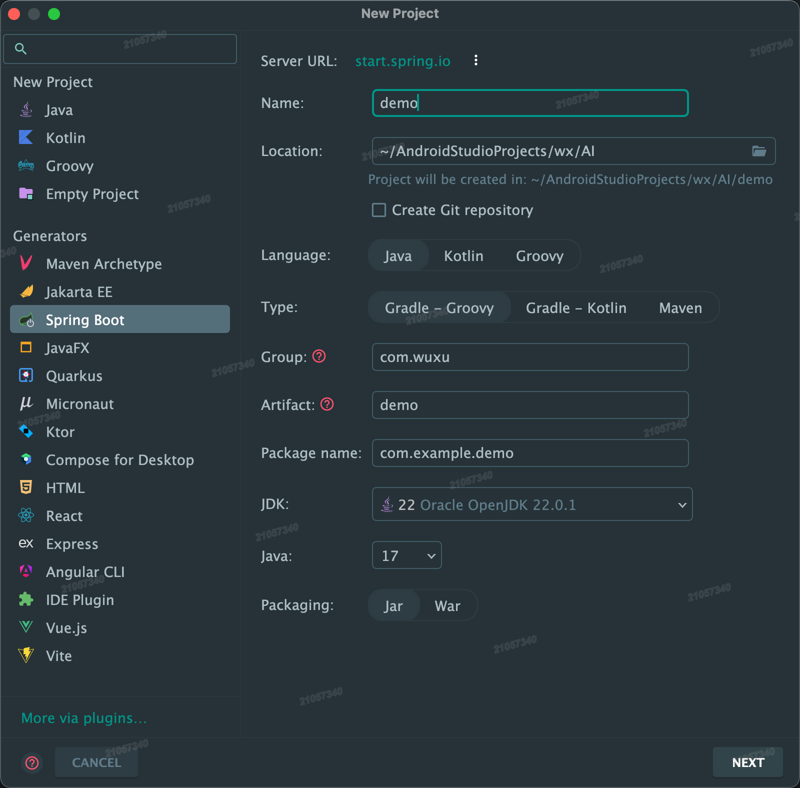

# 项目配置Spring Boot

## 新项目配置Spring Boot



---

## 现有项目配置Spring Boot

在现有Java工程中集成Spring Boot的步骤如下：

### 1. 添加Spring Boot依赖（Maven/Gradle）

#### Maven配置

```xml
<parent>
    <groupId>org.springframework.boot</groupId>
    <artifactId>spring-boot-starter-parent</artifactId>
    <version>3.2.0</version> <!-- 这里是示例，需要从官网（在本文最后）找可用版本 -->
</parent>

<dependencies>
    <dependency>
        <groupId>org.springframework.boot</groupId>
        <artifactId>spring-boot-starter-web</artifactId> <!-- Web应用基础依赖 -->
    </dependency>
</dependencies>

<build>
    <plugins>
        <plugin>
            <groupId>org.springframework.boot</groupId>
            <artifactId>spring-boot-maven-plugin</artifactId>
        </plugin>
    </plugins>
</build>
```

#### Gradle配置

```groovy
plugins {
    id 'org.springframework.boot' version '3.2.0'
    id 'io.spring.dependency-management' version '1.1.4'
}

dependencies {
    implementation 'org.springframework.boot:spring-boot-starter-web'
}
```

### 2. 创建主启动类

```java
package com.yourpackage;

import org.springframework.boot.SpringApplication;
import org.springframework.boot.autoconfigure.SpringBootApplication;

@SpringBootApplication
public class Application {
    public static void main(String[] args) {
        SpringApplication.run(Application.class, args);
    }
}
```

关键点：

- 类位置应在根包（包含所有子包的父包）
- `@SpringBootApplication` 包含自动配置、组件扫描等功能

### 3. 配置文件（application.properties/yml）

在`src/main/resources`下创建：

```properties
# application.properties示例
server.port=8081
spring.application.name=YourAppName

# 数据库配置示例（如果使用JPA）
spring.datasource.url=jdbc:mysql://localhost:3306/mydb
spring.datasource.username=root
spring.datasource.password=secret
```

### 4. 项目结构调整建议

```txt
src/
├── main/
│   ├── java/
│   │   └── com.yourpackage/
│   │       ├── Application.java          # 主类
│   │       ├── controller/               # Controller层
│   │       ├── service/                  # Service层
│   │       └── repository/               # DAO层
│   └── resources/
│       ├── static/                       # 静态资源
│       ├── templates/                    # 模板文件
│       └── application.properties        # 配置文件
```

### 5. 添加业务组件示例

```java
@RestController
public class DemoController {
    
    @GetMapping("/hello")
    public String hello() {
        return "Hello Spring Boot!";
    }
}
```

### 6. 运行与测试

- 运行方式：

  ```bash
  mvn spring-boot:run   # Maven
  ./gradlew bootRun     # Gradle
  ```

  或直接运行`Application`类的main方法

- 测试端点：

  ```bash
  curl http://localhost:8081/hello
  ```

### 7. 打包部署

生成可执行JAR：

```bash
mvn clean package      # Maven
./gradlew bootJar      # Gradle
```

生成的jar文件可通过以下命令运行：

```bash
java -jar target/your-app-name.jar
```

### 常见问题处理

1. **组件扫描失败**：
   - 确保主类位于根包
   - 检查`@ComponentScan`是否覆盖需要扫描的包

2. **端口冲突**：

   ```properties
   server.port=0  # 随机端口
   ```

3. **依赖冲突**：
   使用`mvn dependency:tree`分析依赖关系

4. **配置覆盖**：
   使用`@Profile`区分不同环境配置

### 版本选择建议

- Java 17+ 推荐使用 Spring Boot 3.x
- Java 8 需使用 Spring Boot 2.7.x（官方已停止维护）

建议通过[start.spring.io](https://start.spring.io/)生成基础项目结构，再将现有代码迁移到新项目中。
