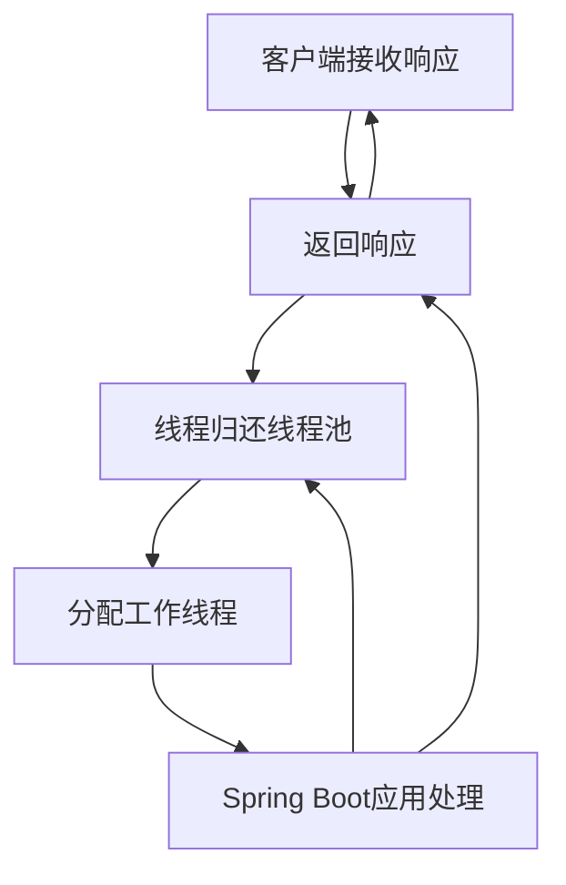
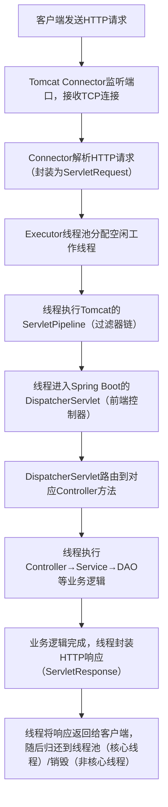

# 请求-线程知识

## 一、核心结论：默认场景下，每个HTTP请求对应一个线程

Spring Boot默认使用Tomcat（也可切换Jetty/Undertow）作为嵌入式Servlet容器，**Servlet容器采用“线程池模型”处理请求**：

- 每个进入的HTTP请求，会由容器的线程池分配一个独立的工作线程处理，直到请求响应完成；
- 线程不会随请求销毁，处理完请求后会归还到线程池复用（核心线程），避免频繁创建/销毁线程的性能损耗；
- 只有当请求量超过线程池最大容量时，才会触发队列/拒绝策略，而非直接创建新线程。

> 例外场景：使用Spring WebFlux（响应式编程）时，采用“事件循环+非阻塞IO”模型，不再是“一个请求一个线程”，后文会单独说明。

## 二、Spring Boot（Tomcat）请求处理的线程流程（完整拆解）

以最常用的Tomcat容器为例，从“请求进入”到“响应返回”，线程的处理流程如下：

### 2.1 前置：Tomcat的核心线程模型

Tomcat的线程模型由`Connector`（连接器）和`Executor`（线程池）组成，核心结构：



- `Connector`：监听指定端口（默认8080），接收TCP连接，解析HTTP请求；
- `Executor`：Tomcat的内置线程池（默认名为`tomcatThreadPool`），负责为每个请求分配工作线程；
- 工作线程：处理请求的核心线程，生命周期与请求绑定（但线程本身可复用）。

### 2.2 完整请求-线程处理流程（10步）



#### 关键步骤详解：

1. **线程分配规则**：
   - 若线程池有空闲核心线程，直接分配；
   - 若无空闲核心线程，将请求放入任务队列；
   - 队列满后，创建非核心线程处理；
   - 非核心线程也达上限时，触发拒绝策略（默认抛`ConnectionRefused`）。
2. **线程的生命周期**：
   - 核心线程：默认长期存活（即使空闲），处理完请求后归还线程池，等待下一个请求；
   - 非核心线程：空闲超过指定时间（默认60秒）会被销毁，释放资源。
3. **Spring层面的线程绑定**：
   - Spring通过`RequestContextHolder`（基于`ThreadLocal`）将当前请求的`HttpServletRequest`/`HttpServletResponse`绑定到工作线程，方便业务代码任意位置获取（如`RequestContextHolder.getRequestAttributes()`）；
   - Spring Security的`SecurityContextHolder`也是基于`ThreadLocal`，将用户认证信息绑定到当前工作线程。

### 2.3 Tomcat线程池的默认配置（Spring Boot）

Spring Boot对Tomcat线程池的默认配置（可通过`application.yml`覆盖）：

| 配置项 | 默认值 | 含义 |
|--------|--------|------|
| `server.tomcat.threads.core` | 10 | 核心线程数（常驻线程，即使空闲也不销毁） |
| `server.tomcat.threads.max` | 200 | 线程池最大线程数（核心+非核心） |
| `server.tomcat.threads.keep-alive-time` | 60s | 非核心线程空闲超时时间（超时销毁） |
| `server.tomcat.accept-count` | 100 | 请求队列容量（核心线程满后，请求进入队列） |
| `server.tomcat.max-connections` | 8192 | Tomcat最大TCP连接数（超过后拒绝新连接） |

#### 配置示例（自定义Tomcat线程池）：

```yaml
server:
  port: 8080
  tomcat:
    threads:
      core: 20 # 核心线程数（根据CPU核心数调整，如CPU 4核设为20-40）
      max: 200 # 最大线程数（避免设太大，导致CPU/内存过载）
      keep-alive-time: 30s # 非核心线程空闲30秒销毁
    accept-count: 200 # 队列容量扩大到200
    max-connections: 10000 # 最大TCP连接数
    connection-timeout: 2000ms # 连接超时时间
```

## 三、Spring Boot中线程的核心场景与组件

### 3.1 同步请求（默认）：一个请求一个线程

这是最基础的场景，Controller/Service/DAO的所有代码都在同一个工作线程中执行，直到响应返回。
**示例**：

```java
@RestController
@RequestMapping("/demo")
public class DemoController {
    @GetMapping("/sync")
    public String syncRequest() throws InterruptedException {
        // 所有代码在Tomcat分配的同一个线程中执行
        String threadName = Thread.currentThread().getName(); // 格式：http-nio-8080-exec-1
        Thread.sleep(1000); // 模拟业务耗时
        return "当前处理线程：" + threadName;
    }
}
```

访问`/demo/sync`，返回的线程名是Tomcat线程池的工作线程（如`http-nio-8080-exec-1`），多次访问会看到线程名复用（线程池复用）。

### 3.2 异步请求：突破“一个请求一个线程”

Spring Boot支持**异步处理请求**（`@Async`/`Callable`/`DeferredResult`），此时“请求线程”和“业务线程”分离，核心目的是释放Tomcat工作线程，提高并发能力。

#### 场景1：@Async 异步方法（业务逻辑异步执行）

- Tomcat工作线程仅处理“接收请求→触发异步方法”，随后立即归还线程池；
- 业务逻辑在Spring的异步线程池中执行，不占用Tomcat工作线程。

**实现步骤**：

1. 启动类开启异步：

   ```java
   @SpringBootApplication
   @EnableAsync // 开启异步支持
   public class ThreadDemoApplication {
       public static void main(String[] args) {
           SpringApplication.run(ThreadDemoApplication.class, args);
       }
   }
   ```

2. 配置异步线程池：

   ```java
   @Configuration
   public class AsyncConfig {
       @Bean("asyncTaskExecutor")
       public Executor asyncTaskExecutor() {
           ThreadPoolTaskExecutor executor = new ThreadPoolTaskExecutor();
           executor.setCorePoolSize(10);
           executor.setMaxPoolSize(50);
           executor.setQueueCapacity(100);
           executor.setThreadNamePrefix("async-");
           executor.setRejectedExecutionHandler(new ThreadPoolExecutor.CallerRunsPolicy()); // 拒绝策略
           executor.initialize();
           return executor;
       }
   }
   ```

3. 异步方法示例：

   ```java
   @Service
   public class DemoService {
       @Async("asyncTaskExecutor") // 指定异步线程池
       public CompletableFuture<String> asyncBusiness() throws InterruptedException {
           String threadName = Thread.currentThread().getName(); // async-1
           Thread.sleep(1000); // 模拟耗时业务
           return CompletableFuture.completedFuture("异步线程：" + threadName);
       }
   }

   @RestController
   @RequestMapping("/demo")
   public class DemoController {
       @Autowired
       private DemoService demoService;

       @GetMapping("/async")
       public CompletableFuture<String> asyncRequest() {
           String tomcatThread = Thread.currentThread().getName(); // Tomcat工作线程
           System.out.println("Tomcat线程：" + tomcatThread);
           return demoService.asyncBusiness();
       }
   }
   ```

**效果**：Tomcat线程处理完请求分发后立即释放，业务逻辑在`async-*`线程中执行，可支撑更高的并发请求（因为Tomcat工作线程被快速复用）。

#### 场景2：响应式编程（WebFlux）：非“一个请求一个线程”

Spring WebFlux基于Reactor框架，采用“事件循环+非阻塞IO”模型（Netty作为容器），核心特点：

- 少量的事件循环线程（如CPU核心数×2）处理所有请求，而非为每个请求分配线程；
- 业务逻辑通过非阻塞IO执行，线程不会被“阻塞等待”（如数据库/网络请求）；
- 适合高并发、IO密集型场景（如微服务网关、大数据接口）。

**示例（WebFlux）**：

```java
// 需引入WebFlux依赖，移除spring-boot-starter-web
@RestController
@RequestMapping("/flux")
public class FluxController {
    @GetMapping("/demo")
    public Mono<String> fluxRequest() {
        String threadName = Thread.currentThread().getName(); // reactor-http-nio-2（事件循环线程）
        return Mono.just("WebFlux线程：" + threadName)
                .delayElement(Duration.ofSeconds(1)); // 非阻塞延迟
    }
}
```

WebFlux的线程数远少于Tomcat（默认核心线程数=CPU核心数），但能支撑更高的并发（因为无线程阻塞）。

### 3.3 ThreadLocal的核心使用（请求上下文传递）

Spring Boot中大量使用`ThreadLocal`实现“线程内上下文共享”，核心场景：

1. `RequestContextHolder`：存储当前请求的`HttpServletRequest`/`HttpServletResponse`，任意位置可获取：

   ```java
   // 获取当前请求对象
   HttpServletRequest request = ((ServletRequestAttributes) RequestContextHolder.getRequestAttributes()).getRequest();
   String requestURI = request.getRequestURI();
   ```

2. `SecurityContextHolder`：存储当前用户的认证信息（Spring Security）；
3. 自定义ThreadLocal：存储请求级别的上下文（如traceId、租户ID）：

   ```java
   // 自定义上下文工具类
   public class RequestContextUtil {
       private static final ThreadLocal<String> TRACE_ID = new ThreadLocal<>();

       // 设置traceId（过滤器中调用）
       public static void setTraceId(String traceId) {
           TRACE_ID.set(traceId);
       }

       // 获取traceId（任意业务代码中调用）
       public static String getTraceId() {
           return TRACE_ID.get();
       }

       // 清理（必须！否则内存泄漏）
       public static void clear() {
           TRACE_ID.remove();
       }
   }

   // 过滤器中设置并清理traceId
   @Component
   public class TraceIdFilter extends OncePerRequestFilter {
       @Override
       protected void doFilterInternal(HttpServletRequest request, HttpServletResponse response, FilterChain filterChain) throws ServletException, IOException {
           try {
               String traceId = UUID.randomUUID().toString();
               RequestContextUtil.setTraceId(traceId);
               filterChain.doFilter(request, response);
           } finally {
               RequestContextUtil.clear(); // 必须清理
           }
       }
   }
   ```

## 四、高并发下的线程管理与线程安全

### 4.1 线程池调优核心原则

Tomcat/自定义线程池的参数不是越大越好，需结合服务器配置（CPU/内存）调优：

| 服务器配置 | 核心线程数（Tomcat） | 最大线程数 | 队列容量 |
|------------|----------------------|------------|----------|
| 4核8G     | 20-40                | 100-200    | 200-500  |
| 8核16G    | 40-80                | 200-400    | 500-1000 |

- **核心线程数**：建议设为 `CPU核心数 × 2` ~ `CPU核心数 × 4`（IO密集型场景）；
- **最大线程数**：避免超过500，否则会导致线程切换开销过大（CPU上下文切换）；
- **拒绝策略**：生产环境避免使用默认的`AbortPolicy`（直接抛异常），建议用`CallerRunsPolicy`（调用者线程执行，兜底处理）。

### 4.2 线程安全的核心坑点与解决方案

#### 坑点1：ThreadLocal未清理导致内存泄漏/上下文污染

- **原因**：ThreadLocal的`Entry`是弱引用，但线程池复用线程时，若未清理ThreadLocal，会导致旧的上下文残留（如用户A的信息被用户B获取）；
- **解决方案**：
  1. 必须在`finally`块中调用`ThreadLocal.remove()`；
  2. 自定义过滤器兜底清理（如前文TraceIdFilter）；
  3. 避免将ThreadLocal的引用缓存到静态变量/全局对象中。

#### 坑点2：共享变量的线程安全问题

Controller/Service默认是单例的，若包含共享变量，会导致多线程并发修改：

```java
// 错误示例：单例Controller中的共享变量导致线程安全问题
@RestController
@RequestMapping("/unsafe")
public class UnsafeController {
    private int count = 0; // 共享变量，多线程并发修改

    @GetMapping("/count")
    public int count() {
        count++; // 非原子操作，会出现计数错误
        return count;
    }
}
```

**解决方案**：

1. 避免在单例Bean中定义可变共享变量；
2. 若必须使用，加锁（`synchronized`/`ReentrantLock`）或使用原子类（`AtomicInteger`）：

   ```java
   private AtomicInteger count = new AtomicInteger(0);

   @GetMapping("/count")
   public int count() {
       return count.incrementAndGet(); // 原子操作，线程安全
   }
   ```

#### 坑点3：异步线程的上下文传递

- **问题**：`@Async`异步线程默认无法获取Tomcat线程的`RequestContextHolder`/`SecurityContextHolder`上下文；
- **解决方案**：
  1. 传递上下文到异步线程：

     ```java
     @Async
     public CompletableFuture<String> asyncWithContext() {
         // 手动传递traceId
         String traceId = RequestContextUtil.getTraceId();
         return CompletableFuture.supplyAsync(() -> {
             RequestContextUtil.setTraceId(traceId); // 异步线程中设置
             try {
                 // 业务逻辑
                 return "异步线程traceId：" + RequestContextUtil.getTraceId();
             } finally {
                 RequestContextUtil.clear(); // 清理
             }
         });
     }
     ```

  2. 使用`DelegatingSecurityContextAsyncTaskExecutor`传递Security上下文（前文SecurityContextHolder部分已讲）。

## 五、核心总结

### 关键要点回顾

1. **默认线程模型**：Spring Boot（Tomcat）中，每个HTTP请求由线程池分配一个独立工作线程处理，线程处理完请求后归还复用，符合“一个请求一个线程”；
2. **线程池核心**：Tomcat的线程池参数（核心线程、最大线程、队列）决定了并发能力，需结合服务器配置调优；
3. **异步场景**：`@Async`/WebFlux会打破“一个请求一个线程”，核心是释放工作线程、提高并发；
4. **ThreadLocal使用**：是请求上下文传递的核心，但必须在`finally`中清理，避免内存泄漏/上下文污染；
5. **线程安全**：单例Bean的共享变量需注意线程安全，优先使用原子类/锁，避免并发修改问题。

简单来说：Spring Boot的线程模型以“线程池复用”为核心，默认适配高并发，掌握线程池调优、ThreadLocal安全使用、异步处理，就能解决绝大多数线程相关的问题。

---

## 补充

1. 默认情况下，Controller 和 Service 都是 Spring 容器中的单例（Singleton）Bean，多个请求会共用同一个 Service 实例，不会为每个请求重复创建。
