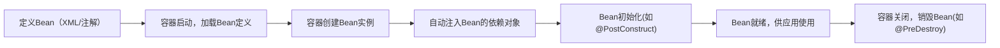

# 控制反转与依赖注入

## 一、核心概念：先搞懂「是什么」（通俗比喻+官方定义）

### 1. IoC（控制反转，Inversion of Control）

#### （1）通俗理解

传统开发中，**你（程序员）掌控对象的创建和依赖关系**：比如你需要一个`UserService`，还要手动new它的依赖`UserDao`，像这样：

```java
// 传统方式：程序员手动创建对象、管理依赖
public class UserService {
    private UserDao userDao = new UserDao(); // 手动new依赖
    public void getUser() {
        userDao.queryUser();
    }
}

// 调用时还要手动new UserService
public class Test {
    public static void main(String[] args) {
        UserService userService = new UserService(); // 手动创建核心对象
        userService.getUser();
    }
}
```

而IoC的核心是：**把对象的创建权、依赖关系的管理权，从「程序员」转移到「Spring容器」** —— 控制权发生了「反转」，不再是你主动new对象，而是容器帮你创建、管理对象，你只需要「声明需求」即可。

#### （2）官方定义

IoC是一种**设计思想**，而非具体技术：它将对象的创建、组装、生命周期管理等控制权，从应用程序代码转移到外部容器（Spring IoC容器），目的是降低代码耦合度，提高可维护性。

#### （3）IoC解决的核心问题

- 消除硬编码的依赖关系（不再手动new对象）；
- 降低类与类之间的耦合（修改依赖只需改配置，无需改代码）；
- 统一管理对象生命周期（容器负责对象的创建、销毁）。

### 2. DI（依赖注入，Dependency Injection）

#### （1）通俗理解

DI是IoC思想的**具体实现方式**：Spring容器在创建对象时，自动将该对象所依赖的其他对象「注入」（赋值）进去，无需你手动new。

比如上面的`UserService`依赖`UserDao`，容器创建`UserService`时，会自动把`UserDao`对象塞到`UserService`里，你不用再写`new UserDao()`。

#### （2）官方定义

DI是指：对象无需自行创建或查找依赖对象，而是由容器在创建对象时，通过构造器、Setter方法、字段等方式，将依赖对象「注入」到当前对象中。

### 3. IoC和DI的关系（关键误区澄清）

- **IoC是思想**：「反转控制权」的设计理念；
- **DI是实现**：Spring通过DI的方式，落地了IoC思想；
- 一句话总结：**IoC是“目的”，DI是“手段”** —— Spring通过DI实现了IoC，没有DI，IoC只是空泛的思想。

## 二、Spring IoC容器：IoC的核心载体

IoC的核心是「容器」，Spring中IoC容器有两个核心接口（父子关系）：

| 接口          | 定位                | 核心特点                                  | 常用实现类               |
|---------------|---------------------|-------------------------------------------|--------------------------|
| BeanFactory   | 基础容器（根接口）| 懒加载（获取Bean时才创建）、轻量级        | DefaultListableBeanFactory |
| ApplicationContext | 高级容器（子接口） | 预加载（启动时创建所有Bean）、功能更丰富  | AnnotationConfigApplicationContext（注解）、ClassPathXmlApplicationContext（XML） |

### 容器的核心工作流程



## 三、DI的3种实现方式（代码示例+优缺点）

Spring支持3种主流的依赖注入方式，推荐优先级：**构造器注入 > Setter注入 > 字段注入**。

### 前置准备：定义基础类

```java
// 依赖的对象：UserDao
public class UserDao {
    public void queryUser() {
        System.out.println("查询用户信息");
    }
}

// 核心对象：UserService（依赖UserDao）
public class UserService {
    private UserDao userDao; // 依赖项

    // 后续会通过不同方式注入userDao
    public void getUser() {
        userDao.queryUser(); // 使用依赖对象
    }
}
```

### 方式1：构造器注入（推荐，强制依赖）

#### 实现方式

通过类的构造方法注入依赖，Spring容器调用构造器时传入依赖对象：

```java
public class UserService {
    private final UserDao userDao; // 推荐final，确保依赖不可变

    // 构造器注入：容器调用此构造器，传入UserDao实例
    public UserService(UserDao userDao) {
        this.userDao = userDao;
    }

    public void getUser() {
        userDao.queryUser();
    }
}
```

#### 配置（注解方式）

```java
import org.springframework.context.annotation.AnnotationConfigApplicationContext;
import org.springframework.context.annotation.Bean;
import org.springframework.context.annotation.Configuration;

// 配置类：告诉容器要管理哪些Bean
@Configuration
public class SpringConfig {
    // 注册UserDao到容器
    @Bean
    public UserDao userDao() {
        return new UserDao();
    }

    // 注册UserService到容器，容器自动传入userDao（构造器注入）
    @Bean
    public UserService userService(UserDao userDao) {
        return new UserService(userDao);
    }
}

// 测试类
public class TestIoC {
    public static void main(String[] args) {
        // 启动Spring容器，加载配置类
        AnnotationConfigApplicationContext context = 
            new AnnotationConfigApplicationContext(SpringConfig.class);
        
        // 从容器获取UserService（无需手动new）
        UserService userService = context.getBean(UserService.class);
        userService.getUser(); // 输出：查询用户信息
        
        context.close(); // 关闭容器
    }
}
```

#### 优缺点

- ✅ 优点：
  1. 依赖强制注入（创建对象必须传依赖，避免空指针）；
  2. 依赖不可变（可加final），线程安全；
  3. 适合「必须依赖」的场景（如Service依赖Dao）。
- ❌ 缺点：依赖过多时，构造器参数会很长（可通过拆分类解决）。

### 方式2：Setter注入（可选依赖）

#### 实现方式

通过Setter方法注入依赖，适合「可选依赖」的场景：

```java
public class UserService {
    private UserDao userDao; // 可选依赖

    // Setter方法：容器调用此方法注入UserDao
    public void setUserDao(UserDao userDao) {
        this.userDao = userDao;
    }

    public void getUser() {
        if (userDao != null) { // 需判空，因为是可选依赖
            userDao.queryUser();
        }
    }
}
```

#### 配置（修改SpringConfig）

```java
@Configuration
public class SpringConfig {
    @Bean
    public UserDao userDao() {
        return new UserDao();
    }

    @Bean
    public UserService userService() {
        UserService userService = new UserService();
        userService.setUserDao(userDao()); // 调用Setter注入
        return userService;
    }
}
```

#### 优缺点

- ✅ 优点：
  1. 适合「可选依赖」（不注入也能创建对象）；
  2. 可在运行时动态修改依赖（调用Setter重新赋值）。
- ❌ 缺点：
  1. 依赖可能为空（需手动判空）；
  2. 依赖可变（不能加final），线程不安全。

### 方式3：字段注入（@Autowired，不推荐）

#### 实现方式

直接在字段上加`@Autowired`注解，容器自动注入（底层用反射）：

```java
import org.springframework.beans.factory.annotation.Autowired;
import org.springframework.stereotype.Service;

// @Service：将UserService注册到容器
@Service
public class UserService {
    // 字段注入：容器自动给userDao赋值
    @Autowired
    private UserDao userDao;

    public void getUser() {
        userDao.queryUser();
    }
}

// UserDao也注册到容器
import org.springframework.stereotype.Repository;
@Repository
public class UserDao {
    public void queryUser() {
        System.out.println("查询用户信息");
    }
}

// 配置类：扫描包下的注解
@Configuration
@ComponentScan("com.example") // 扫描指定包下的@Service/@Repository等注解
public class SpringConfig {
}

// 测试类不变
```

#### 优缺点

- ✅ 优点：代码简洁，无需写构造器/Setter；
- ❌ 缺点（致命，不推荐在生产使用）：
  1. 字段必须是private，无法加final，依赖可变；
  2. 只能通过Spring容器创建对象，手动new时依赖为null（测试困难）；
  3. 依赖过多时，无法直观发现（构造器注入会有参数列表提醒）。

## 四、IoC/DI的核心注解（快速上手）

Spring Boot中常用注解替代XML配置，核心注解如下：

| 注解          | 作用                                  | 适用场景                  |
|---------------|---------------------------------------|---------------------------|
| @Configuration | 标记配置类，替代XML配置文件           | 全局配置                  |
| @Component    | 通用注解，将类注册到容器              | 通用组件                  |
| @Service      | 特殊的@Component，标记业务层组件      | Service层                 |
| @Repository   | 特殊的@Component，标记数据访问层组件  | Dao/Mapper层              |
| @Controller   | 特殊的@Component，标记控制层组件      | Controller层              |
| @Bean         | 方法注解，注册返回对象到容器          | 第三方类（如RedisTemplate） |
| @Autowired    | 自动注入依赖（按类型）                | 字段/Setter/构造器        |
| @Qualifier    | 配合@Autowired，按名称注入            | 同类型多个Bean时          |
| @Resource     | JDK注解，按名称注入（替代@Autowired+@Qualifier） | 字段/Setter       |
| @ComponentScan | 扫描指定包下的注解组件                | 配置类                    |

## 五、IoC/DI的核心价值（为什么要用）

1. **解耦**：类与类之间不再硬编码依赖（如`new UserDao()`），修改依赖只需改配置；
2. **复用**：容器中的Bean是单例（默认），可被多个类复用，减少对象创建开销；
3. **可测试**：可轻松替换依赖为Mock对象（如测试时用MockUserDao替代真实UserDao）；
4. **可扩展**：容器统一管理对象生命周期，可轻松添加切面、缓存等功能；
5. **简化开发**：无需手动管理对象创建和依赖，专注业务逻辑。

---

### 总结

1. **核心关系**：IoC是「控制反转」的设计思想（反转对象创建权），DI是IoC的具体实现方式（容器自动注入依赖）；
2. **注入方式**：推荐使用「构造器注入」（强制依赖、线程安全），避免字段注入（测试困难、依赖可变）；
3. **核心载体**：Spring IoC容器（ApplicationContext）是实现IoC/DI的核心，负责Bean的创建、注入、生命周期管理；
4. **核心价值**：最大程度降低代码耦合，提高代码可维护性、可测试性和复用性。

如果需要进一步了解「Bean的作用域（单例/原型）」「循环依赖解决机制」「注解注入的底层原理」等进阶内容，我可以针对性讲解。
