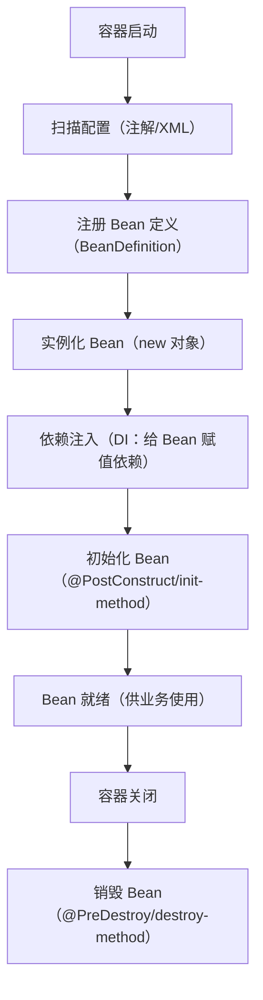

# IOC

## 一、先搞懂核心概念：IoC 是什么？

IoC 的全称是 **Inversion of Control（控制反转）**，是 Spring 框架的核心思想，而「IoC 容器」是实现这个思想的核心载体。

### 1. 通俗理解：从「自己掌控」到「容器托管」

举个生活例子：

- **传统开发（无 IoC）**：你想喝水，需要自己「new 一个水杯」→「接水」→「喝水」→「最后还要自己洗水杯、收起来」，所有对象的创建、依赖、销毁都由你（开发者）手动控制。
- **IoC 开发（容器托管）**：你想喝水，直接告诉「厨房（IoC 容器）」要水杯，厨房会提前准备好水杯（创建对象）、接好水（注入依赖），直接递给你用；用完后，厨房还会负责清洗、回收（销毁对象）——你只需要用，不用管对象的生命周期。

### 2. 技术层面定义

IoC 本质是：**将对象的创建权、依赖关系的管理权，从开发者编写的业务代码中「反转」到 Spring 的 IoC 容器中**。

- 开发者只需要「声明」：我需要一个 XX 对象，以及这个对象依赖哪些其他对象；
- IoC 容器负责「实现」：创建对象、解决对象之间的依赖、管理对象的生命周期（创建→初始化→使用→销毁）。

补充：DI（Dependency Injection，依赖注入）是 IoC 思想的**具体实现方式**——IoC 是「思想」，DI 是「手段」，IoC 容器通过 DI 完成对象依赖的自动注入。

## 二、IoC 容器的核心作用

IoC 容器是 Spring 的「核心引擎」，核心职责有 4 个：

1. **Bean 注册**：扫描并识别哪些类需要被容器管理（通过注解/XML 配置），将这些类标记为「Bean」；
2. **Bean 实例化**：根据注册信息，在容器启动时（或首次使用时）创建 Bean 对象；
3. **依赖注入（DI）**：自动为 Bean 注入它所依赖的其他 Bean（比如 Service 依赖 Repository）；
4. **生命周期管理**：统一管理 Bean 的初始化、使用、销毁全过程，还支持自定义生命周期方法。

## 三、Spring 中 IoC 容器的两大核心实现

Spring 提供了两个核心接口来实现 IoC 容器，其中 `ApplicationContext` 是日常开发的核心：

| 接口          | 定位                | 核心特点                                                                 | 适用场景                     |
|---------------|---------------------|--------------------------------------------------------------------------|------------------------------|
| `BeanFactory` | 基础 IoC 容器       | 1. 轻量级，启动时不立即创建 Bean（懒加载）；<br>2. 仅提供最基础的 IoC 功能；<br>3. 性能高但功能少 | 极少直接使用，是 Spring 底层基础 |
| `ApplicationContext` | 增强版 IoC 容器 | 1. 继承 `BeanFactory`，功能更全；<br>2. 启动时立即创建所有单例 Bean（饿加载）；<br>3. 支持国际化、事件发布、资源加载等；<br>4. 是 SpringBoot 默认使用的容器 | 日常开发（99% 场景）|

### `ApplicationContext` 的常见实现类（SpringBoot 底层）

- `AnnotationConfigApplicationContext`：基于注解配置的容器（SpringBoot 核心）；
- `ClassPathXmlApplicationContext`：基于 XML 配置的容器（传统 Spring 常用）；
- `AnnotationConfigServletWebServerApplicationContext`：SpringBoot Web 项目的默认容器。

## 四、IoC 容器管理 Bean 的完整流程



## 五、向 IoC 容器注册 Bean 的 3 种方式（实战）

注册 Bean 就是告诉 IoC 容器：「这个类需要你管理」，SpringBoot 中最常用「注解式」。

### 方式 1：注解式（推荐，SpringBoot 标配）

通过 `@Component` 及其派生注解标记类，容器启动时自动扫描并注册：

- `@Component`：通用注解，标记任意类为 Bean；
- `@Controller`：控制器层 Bean（你之前问的）；
- `@Service`：业务逻辑层 Bean；
- `@Repository`：数据访问层（DAO/Repository）Bean。

**示例代码**：

```java
// 1. 业务层 Bean（@Service 是 @Component 的派生注解）
@Service
public class UserService {
    // 依赖数据访问层 Bean（容器会自动注入）
    @Autowired
    private UserRepository userRepository;

    public void addUser() {
        userRepository.save();
    }
}

// 2. 数据访问层 Bean（@Repository 是 @Component 的派生注解）
@Repository
public class UserRepository {
    public void save() {
        System.out.println("保存用户");
    }
}

// 3. SpringBoot 启动类（@SpringBootApplication 包含扫描注解的功能）
@SpringBootApplication
// 扫描指定包下的 Bean（默认扫描启动类所在包及子包）
// @ComponentScan(basePackages = "com.example")
public class IocDemoApplication {
    public static void main(String[] args) {
        // 启动容器，返回 ApplicationContext 实例（IoC 容器本身）
        ApplicationContext context = SpringApplication.run(IocDemoApplication.class, args);
        
        // 从容器中获取 Bean（两种方式：按类型/按名称）
        UserService userService1 = context.getBean(UserService.class);
        UserService userService2 = (UserService) context.getBean("userService");
        
        // 验证：IoC 容器中单例 Bean 是同一个实例（默认 Bean 是单例）
        System.out.println(userService1 == userService2); // 输出 true
    }
}
```

### 方式 2：配置类 + @Bean（适用于第三方类）

如果要管理「第三方库的类」（比如 RedisTemplate、DataSource），无法加 `@Component`，就用 `@Configuration` + `@Bean`：

```java
// 配置类（@Configuration 标记类为配置类，容器会扫描）
@Configuration
public class ThirdPartyConfig {
    // @Bean 标记方法，方法返回值会被注册为 IoC 容器中的 Bean
    @Bean("myRedisTemplate") // 自定义 Bean 名称，默认是方法名（redisTemplate）
    public RedisTemplate<String, Object> redisTemplate() {
        RedisTemplate<String, Object> template = new RedisTemplate<>();
        // 配置 RedisTemplate（省略）
        return template;
    }
}

// 使用时直接注入
@Service
public class UserService {
    @Autowired
    private RedisTemplate<String, Object> myRedisTemplate;
}
```

### 方式 3：XML 配置（传统方式，SpringBoot 极少用）

```xml
<!-- applicationContext.xml -->
<beans xmlns="http://www.springframework.org/schema/beans"
       xmlns:xsi="http://www.w3.org/2001/XMLSchema-instance"
       xsi:schemaLocation="http://www.springframework.org/schema/beans
                           http://www.springframework.org/schema/beans/spring-beans.xsd">
    <!-- 注册 UserRepository Bean -->
    <bean id="userRepository" class="com.example.repository.UserRepository"/>
    
    <!-- 注册 UserService Bean，并注入 UserRepository 依赖 -->
    <bean id="userService" class="com.example.service.UserService">
        <property name="userRepository" ref="userRepository"/>
    </bean>
</beans>
```

## 六、依赖注入（DI）的 3 种实现方式

IoC 容器通过 DI 为 Bean 注入依赖，推荐「构造器注入」：

### 1. 构造器注入（推荐，强制依赖）

```java
@Service
public class UserService {
    private final UserRepository userRepository;

    // 构造器注入（容器自动匹配参数类型）
    // Spring 4.3+ 中，单构造器可省略 @Autowired
    @Autowired
    public UserService(UserRepository userRepository) {
        this.userRepository = userRepository;
    }
}
```

### 2. Setter 注入（可选依赖）

```java
@Service
public class UserService {
    private UserRepository userRepository;

    @Autowired
    public void setUserRepository(UserRepository userRepository) {
        this.userRepository = userRepository;
    }
}
```

### 3. 字段注入（不推荐，耦合高、难测试）

```java
@Service
public class UserService {
    // 字段注入（直接在字段上加 @Autowired）
    @Autowired
    private UserRepository userRepository;
}
```

## 七、Bean 的作用域（IoC 容器管理 Bean 的范围）

默认情况下，IoC 容器中的 Bean 是「单例（singleton）」，即整个应用只有一个实例；也可自定义作用域：

| 作用域       | 含义                                                                 |
|--------------|----------------------------------------------------------------------|
| singleton    | 单例（默认），容器启动时创建，全局唯一                               |
| prototype    | 原型，每次从容器获取 Bean 时都创建新实例                             |
| request      | Web 场景，每个 HTTP 请求创建一个 Bean                                |
| session      | Web 场景，每个 HTTP Session 创建一个 Bean                            |
| application  | Web 场景，每个 ServletContext 创建一个 Bean                          |

**示例：设置原型作用域**

```java
@Service
@Scope("prototype") // 或 @Scope(ConfigurableBeanFactory.SCOPE_PROTOTYPE)
public class UserService {
    // ...
}
```

## 八、Bean 的生命周期自定义

可通过注解自定义 Bean 的初始化和销毁逻辑：

```java
@Service
public class UserService {
    @Autowired
    private UserRepository userRepository;

    // 初始化方法：Bean 实例化 + 依赖注入后执行
    @PostConstruct
    public void init() {
        System.out.println("UserService 初始化完成");
    }

    // 销毁方法：容器关闭时执行（仅单例 Bean 生效）
    @PreDestroy
    public void destroy() {
        System.out.println("UserService 销毁");
    }
}
```

## 总结

1. **核心思想**：IoC 容器是 Spring 的核心，通过「控制反转」将对象的创建、依赖、生命周期管理权从业务代码转移到容器，开发者只需关注业务逻辑；
2. **核心操作**：注册 Bean（注解/@Bean/XML）→ 容器实例化 → 依赖注入 → 初始化 → 使用 → 销毁；
3. **最佳实践**：
   - 注册 Bean 优先用 `@Component` 派生注解（@Controller/@Service/@Repository），第三方类用 `@Configuration + @Bean`；
   - 依赖注入优先用「构造器注入」，避免字段注入；
   - 默认 Bean 是单例，需多实例时设置 `prototype` 作用域。
