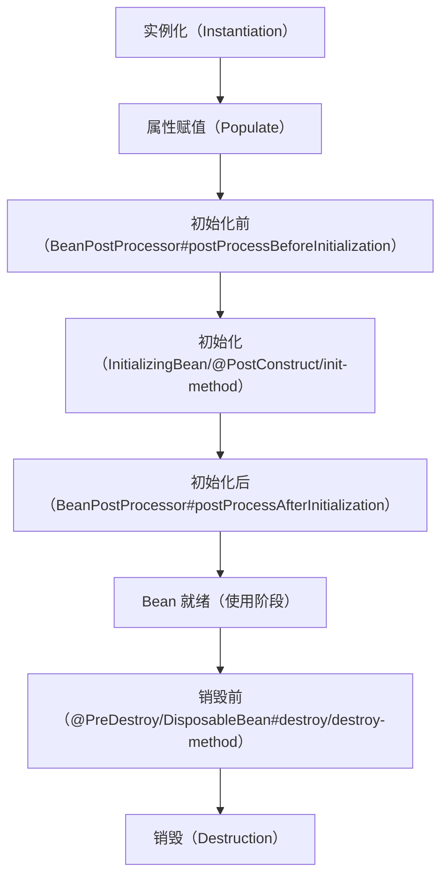

# Bean

## 一、Bean 的核心概念

在 Spring/Spring Boot 中，**Bean 是由 Spring IoC（控制反转）容器管理的对象**，本质上是应用程序中的普通 Java 对象（POJO），但通过 Spring 容器赋予了依赖注入、生命周期管理、AOP 增强等核心能力。

- **IoC 容器**：Spring 的核心是 ApplicationContext（BeanFactory 的高级实现），它负责 Bean 的实例化、配置、组装和管理。
- **Bean 定义**：Spring 通过 `BeanDefinition` 描述 Bean 的元信息（类名、作用域、初始化方法、销毁方法、依赖等），容器根据这些元信息创建 Bean 实例。
- **核心目标**：将对象的创建、依赖关系的维护从代码中解耦，交由容器统一管理，降低耦合度，提高可维护性。

---

## 二、Bean 的创建方式（全场景）

Spring Boot 中创建 Bean 有 6 种核心方式，覆盖从基础注解到手动注册的所有场景：

### 1. 基础注解扫描（最常用）

通过 `@Component` 及其派生注解标记类，Spring 容器会自动扫描并创建 Bean。

- **核心注解**：
  - `@Component`：通用注解，标记任意类为 Bean。
  - `@Controller`：MVC 控制器层 Bean（派生自 `@Component`）。
  - `@Service`：业务逻辑层 Bean（派生自 `@Component`）。
  - `@Repository`：数据访问层（DAO）Bean（派生自 `@Component`，额外提供异常转换）。
- **扫描规则**：
  Spring Boot 默认扫描 `@SpringBootApplication` 注解所在包及其子包下的注解类。可通过 `@ComponentScan` 自定义扫描范围：

```java
// 自定义扫描包，排除指定类
@SpringBootApplication
@ComponentScan(basePackages = "com.example.demo", excludeFilters = {
    @ComponentScan.Filter(type = FilterType.ASSIGNABLE_TYPE, value = TestService.class)
})
public class DemoApplication {
    public static void main(String[] args) {
        SpringApplication.run(DemoApplication.class, args);
    }
}
```

### 2. `@Configuration + @Bean`（配置类方式）

适用于第三方类（无法加 `@Component`）或需要自定义实例化逻辑的场景，通过配置类手动声明 Bean：

```java
// 配置类（@Configuration 本身也是 @Component）
@Configuration
public class BeanConfig {

    // 声明 Bean，方法名默认是 Bean 名称，返回值是 Bean 类型
    @Bean(name = "userService", initMethod = "init", destroyMethod = "destroy")
    public UserService userService() {
        // 自定义实例化逻辑（比如设置属性、依赖）
        UserService userService = new UserService();
        userService.setUserName("test");
        return userService;
    }

    // 依赖其他 Bean（直接调用方法，Spring 会自动注入，而非重复创建）
    @Bean
    public OrderService orderService(UserService userService) {
        OrderService orderService = new OrderService();
        orderService.setUserService(userService);
        return orderService;
    }
}
```

### 3. 手动注册 Bean（编程式）

通过 `BeanDefinitionRegistry` 手动注册 Bean，适用于动态创建 Bean 的场景：

```java
@Component
public class CustomBeanRegistrar implements BeanDefinitionRegistryPostProcessor {

    @Override
    public void postProcessBeanDefinitionRegistry(BeanDefinitionRegistry registry) throws BeansException {
        // 1. 构建 BeanDefinition（描述 Bean 元信息）
        RootBeanDefinition beanDefinition = new RootBeanDefinition(ProductService.class);
        // 2. 设置属性（可选）
        beanDefinition.getPropertyValues().add("productName", "手机");
        // 3. 注册 Bean（指定 Bean 名称）
        registry.registerBeanDefinition("productService", beanDefinition);
    }

    @Override
    public void postProcessBeanFactory(ConfigurableListableBeanFactory beanFactory) throws BeansException {
        // 可选：对 BeanFactory 做额外处理
    }
}
```

### 4. `@Import` 导入 Bean

适用于批量导入 Bean 或导入第三方配置类：

- 导入普通类：直接将类注册为 Bean（无需加 `@Component`）。
- 导入 `ImportSelector`：动态选择要导入的类。
- 导入 `ImportBeanDefinitionRegistrar`：自定义注册逻辑。

```java
// 1. 普通导入
@SpringBootApplication
@Import({PayService.class, ThirdPartyConfig.class})
public class DemoApplication {}

// 2. ImportSelector 动态导入
public class MyImportSelector implements ImportSelector {
    @Override
    public String[] selectImports(AnnotationMetadata importingClassMetadata) {
        // 返回要导入的类全限定名
        return new String[]{"com.example.demo.service.PayService", "com.example.demo.service.RefundService"};
    }
}

// 3. 导入 ImportSelector
@SpringBootApplication
@Import(MyImportSelector.class)
public class DemoApplication {}
```

### 5. `FactoryBean` 工厂 Bean（特殊）

`FactoryBean` 是一个“Bean 工厂”，用于创建复杂对象（比如 MyBatis 的 `MapperFactoryBean`）：

```java
// 1. 实现 FactoryBean 接口
@Component
public class UserFactoryBean implements FactoryBean<User> {

    // 核心方法：创建 Bean 实例
    @Override
    public User getObject() throws Exception {
        User user = new User();
        user.setId(1L);
        user.setName("张三");
        return user;
    }

    // 返回 Bean 类型
    @Override
    public Class<?> getObjectType() {
        return User.class;
    }

    // 是否单例（默认 true）
    @Override
    public boolean isSingleton() {
        return true;
    }
}

// 2. 获取 FactoryBean 本身 vs 获取创建的 Bean
@RestController
public class TestController {
    @Autowired
    private ApplicationContext context;

    @GetMapping("/test")
    public void test() {
        // 获取 FactoryBean 创建的 User 实例（默认）
        User user = (User) context.getBean("userFactoryBean");
        // 获取 FactoryBean 本身（加 & 前缀）
        UserFactoryBean factoryBean = (UserFactoryBean) context.getBean("&userFactoryBean");
    }
}
```

### 6. 注解驱动的其他方式

- `@ConditionalOnMissingBean`：当容器中不存在指定 Bean 时才创建（避免重复注册）。
- `@EnableXxx`：本质是封装了 `@Import`，比如 `@EnableAsync`、`@EnableCaching`。

---

## 三、Bean 的作用域（Scope）

Bean 的作用域决定了容器创建 Bean 实例的数量和生命周期，Spring Boot 支持 6 种作用域（核心 2 种）：

| 作用域       | 说明                                                                 | 适用场景                     |
|--------------|----------------------------------------------------------------------|------------------------------|
| `singleton`  | 默认，容器中只有 **一个实例**，启动时创建（除非 @Lazy），全局共享。   | 无状态 Bean（Service/DAO）   |
| `prototype`  | 每次获取（getBean/注入）都创建 **新实例**，容器只创建，不管理销毁。   | 有状态 Bean（比如请求上下文）|
| `request`    | Web 环境，**每个 HTTP 请求** 一个实例，请求结束销毁。                 | Web 层请求级数据             |
| `session`    | Web 环境，**每个 HTTP Session** 一个实例，会话结束销毁。              | 用户会话级数据               |
| `application`| Web 环境，**整个 ServletContext** 一个实例，与 singleton 类似但范围更大 | 应用级全局数据               |
| `websocket`  | WebSocket 环境，**每个 WebSocket 连接** 一个实例。                    | 实时通信场景                 |

### 作用域使用示例

```java
// 1. 原型作用域
@Component
@Scope(ConfigurableBeanFactory.SCOPE_PROTOTYPE)
// 等价于 @Scope("prototype")
public class OrderBean {
    private Long orderId;
    // getter/setter
}

// 2. Request 作用域（Web 环境）
@Component
@Scope(value = WebApplicationContext.SCOPE_REQUEST, proxyMode = ScopedProxyMode.TARGET_CLASS)
public class RequestBean {
    private String requestId;
    // getter/setter
}
```

- **注意**：`request/session` 作用域的 Bean 注入到 singleton Bean 时，需要加 `proxyMode`（代理模式），否则会因为生命周期不匹配报错。

---

## 四、Bean 的生命周期（最核心，超详细）

Bean 的生命周期是 Spring 中最细的知识点之一，完整流程包含 **8 个核心阶段**，结合接口、注解、配置可精准控制每个阶段：

### 完整生命周期流程图



### 各阶段详细说明

#### 1. 实例化（Instantiation）

- 容器根据 `BeanDefinition` 创建 Bean 实例（调用无参构造器/有参构造器）。
- 仅创建对象，未设置任何属性（依赖）。

#### 2. 属性赋值（Populate）

- 容器将依赖的 Bean 注入到当前 Bean 的属性中（比如 `@Autowired` 注入）。
- 处理 `@Value` 注解的属性赋值（读取配置文件/环境变量）。

#### 3. 初始化前（BeanPostProcessor 前置处理）

- 调用所有 `BeanPostProcessor` 的 `postProcessBeforeInitialization` 方法。
- 可在此阶段修改 Bean 属性、替换 Bean 实例（AOP 增强的核心入口）。

#### 4. 初始化（Initialization）

触发顺序（优先级从高到低）：

1. `@PostConstruct` 注解的方法（JSR-250 标准）。
2. `InitializingBean` 接口的 `afterPropertiesSet()` 方法。
3. 自定义 `init-method`（`@Bean(initMethod = "init")` 或 XML 配置）。

#### 5. 初始化后（BeanPostProcessor 后置处理）

- 调用所有 `BeanPostProcessor` 的 `postProcessAfterInitialization` 方法。
- AOP 动态代理就是在此阶段生成代理对象并替换原 Bean。

#### 6. 使用阶段

- Bean 完全就绪，可被应用程序调用（注入到其他 Bean/直接通过上下文获取）。

#### 7. 销毁前（Destroy 前置处理）

触发顺序（优先级从高到低）：

1. `@PreDestroy` 注解的方法（JSR-250 标准）。
2. `DisposableBean` 接口的 `destroy()` 方法。
3. 自定义 `destroy-method`（`@Bean(destroyMethod = "destroy")` 或 XML 配置）。

#### 8. 销毁（Destruction）

- 容器关闭时（比如 Spring Boot 应用停止），销毁 Bean 实例（仅 singleton Bean 会被容器销毁，prototype Bean 由用户自行管理）。

### 生命周期实战示例

```java
@Component
public class LifeCycleBean implements InitializingBean, DisposableBean {

    // 1. 实例化：构造器
    public LifeCycleBean() {
        System.out.println("1. Bean 实例化：调用构造器");
    }

    // 2. 属性赋值：setter 方法（如果有依赖注入）
    @Autowired
    public void setTestService(TestService testService) {
        System.out.println("2. Bean 属性赋值：注入 TestService");
    }

    // 3. 初始化前：自定义 BeanPostProcessor
    @Component
    static class MyBeanPostProcessor implements BeanPostProcessor {
        @Override
        public Object postProcessBeforeInitialization(Object bean, String beanName) throws BeansException {
            if (bean instanceof LifeCycleBean) {
                System.out.println("3. Bean 初始化前：BeanPostProcessor 前置处理");
            }
            return bean;
        }

        @Override
        public Object postProcessAfterInitialization(Object bean, String beanName) throws BeansException {
            if (bean instanceof LifeCycleBean) {
                System.out.println("5. Bean 初始化后：BeanPostProcessor 后置处理");
            }
            return bean;
        }
    }

    // 4. 初始化：@PostConstruct（优先级最高）
    @PostConstruct
    public void postConstruct() {
        System.out.println("4.1 Bean 初始化：@PostConstruct 注解方法");
    }

    // 4. 初始化：InitializingBean 接口方法
    @Override
    public void afterPropertiesSet() throws Exception {
        System.out.println("4.2 Bean 初始化：InitializingBean#afterPropertiesSet");
    }

    // 4. 初始化：自定义 init-method（需在 @Bean 中指定）
    public void init() {
        System.out.println("4.3 Bean 初始化：自定义 init-method");
    }

    // 7. 销毁前：@PreDestroy（优先级最高）
    @PreDestroy
    public void preDestroy() {
        System.out.println("7.1 Bean 销毁前：@PreDestroy 注解方法");
    }

    // 7. 销毁前：DisposableBean 接口方法
    @Override
    public void destroy() throws Exception {
        System.out.println("7.2 Bean 销毁前：DisposableBean#destroy");
    }

    // 7. 销毁前：自定义 destroy-method（需在 @Bean 中指定）
    public void destroyMethod() {
        System.out.println("7.3 Bean 销毁前：自定义 destroy-method");
    }
}

// 配置类指定 init-method 和 destroy-method
@Configuration
public class LifeCycleConfig {
    @Bean(initMethod = "init", destroyMethod = "destroyMethod")
    public LifeCycleBean lifeCycleBean() {
        return new LifeCycleBean();
    }
}
```

**输出顺序**：

```
1. Bean 实例化：调用构造器
2. Bean 属性赋值：注入 TestService
3. Bean 初始化前：BeanPostProcessor 前置处理
4.1 Bean 初始化：@PostConstruct 注解方法
4.2 Bean 初始化：InitializingBean#afterPropertiesSet
4.3 Bean 初始化：自定义 init-method
5. Bean 初始化后：BeanPostProcessor 后置处理
（使用阶段）
7.1 Bean 销毁前：@PreDestroy 注解方法
7.2 Bean 销毁前：DisposableBean#destroy
7.3 Bean 销毁前：自定义 destroy-method
```

---

## 五、Bean 的依赖注入（DI）

依赖注入是将 Bean 的依赖（其他 Bean/配置值）注入到当前 Bean 的过程，Spring Boot 支持 4 种核心注入方式：

### 1. 构造器注入（推荐）

- 优点：强制依赖（构造器参数必须传）、不可变、避免空指针、支持循环依赖（单例）。
- 最佳实践：所有依赖通过构造器注入，标记为 `final` 提高不可变性。

```java
@Component
public class OrderService {
    private final UserService userService;
    private final String orderPrefix;

    // 构造器注入（Spring 4.3+ 无需加 @Autowired，只有一个构造器时自动注入）
    public OrderService(UserService userService, @Value("${order.prefix}") String orderPrefix) {
        this.userService = userService;
        this.orderPrefix = orderPrefix;
    }
}
```

### 2. Setter 注入

- 优点：可选依赖（可省略 setter）、支持重新赋值。
- 适用场景：非必须的依赖。

```java
@Component
public class OrderService {
    private UserService userService;

    @Autowired(required = false) // 可选依赖
    public void setUserService(UserService userService) {
        this.userService = userService;
    }
}
```

### 3. 字段注入（不推荐）

- 优点：代码简洁；缺点：无法设置 `final`、依赖隐藏、难以单元测试（需反射）、不支持循环依赖（极端场景）。

```java
@Component
public class OrderService {
    // 不推荐！
    @Autowired
    private UserService userService;
}
```

### 4. 方法注入（灵活）

- 注入到任意方法（非 setter），适用于批量注入。

```java
@Component
public class OrderService {
    private UserService userService;
    private PayService payService;

    @Autowired
    public void injectDependencies(UserService userService, PayService payService) {
        this.userService = userService;
        this.payService = payService;
    }
}
```

### 注入注解对比（@Autowired vs @Resource vs @Inject）

| 特性                | @Autowired                | @Resource                  | @Inject                    |
|---------------------|---------------------------|----------------------------|----------------------------|
| 来源                | Spring 注解               | JSR-250 标准（Java EE）    | JSR-330 标准（Java EE）    |
| 匹配规则            | 先按类型（byType），再按名 | 先按名称（byName），再按类型 | 先按类型（byType）         |
| 依赖是否必须        | 默认必须（required=true） | 默认必须                   | 默认必须（需配合 @Nullable）|
| 支持属性            | required、qualifier       | name、type                 | qualifier                  |
| 是否需要额外依赖    | 无需                      | 无需                       | 需要导入 javax.inject 依赖  |

**示例**：

```java
@Component
public class TestService {
    // 按名称注入（指定 name）
    @Resource(name = "userServiceImpl")
    private UserService userService;

    // 按类型注入 + 限定符（解决同类型多个 Bean）
    @Autowired
    @Qualifier("payServiceImpl")
    private PayService payService;

    // 按类型注入 + 可选依赖
    @Inject
    @Nullable
    private RefundService refundService;
}
```

---

## 六、Bean 的高级特性

### 1. 延迟初始化（@Lazy）

- 作用：默认 singleton Bean 在容器启动时创建，`@Lazy` 使其**第一次使用时才创建**。
- 适用场景：Bean 创建成本高、启动时不需要的 Bean（比如后台任务）。

```java
// 1. 类级别：延迟初始化当前 Bean
@Component
@Lazy
public class LazyBean {}

// 2. 方法级别：延迟初始化 @Bean 声明的 Bean
@Configuration
public class BeanConfig {
    @Bean
    @Lazy
    public TestService testService() {
        return new TestService();
    }
}

// 3. 注入时延迟（覆盖 Bean 本身的 @Lazy）
@Component
public class UserService {
    @Autowired
    @Lazy // 即使 TestService 不是延迟 Bean，注入时也延迟创建
    private TestService testService;
}
```

### 2. 条件注册（@Conditional）

- 作用：满足指定条件时才创建 Bean。
- 常用派生注解（Spring Boot 提供）：
  - `@ConditionalOnClass`：类路径存在指定类时创建。
  - `@ConditionalOnMissingClass`：类路径不存在指定类时创建。
  - `@ConditionalOnBean`：容器中存在指定 Bean 时创建。
  - `@ConditionalOnMissingBean`：容器中不存在指定 Bean 时创建。
  - `@ConditionalOnProperty`：配置文件中存在指定属性时创建。

```java
// 自定义条件
public class WindowsCondition implements Condition {
    @Override
    public boolean matches(ConditionContext context, AnnotatedTypeMetadata metadata) {
        // 判断操作系统是否为 Windows
        return context.getEnvironment().getProperty("os.name").contains("Windows");
    }
}

// 使用自定义条件
@Configuration
public class ConditionConfig {
    @Bean
    @Conditional(WindowsCondition.class)
    public OsService windowsOsService() {
        return new WindowsOsService();
    }

    @Bean
    @ConditionalOnProperty(name = "feature.pay.enable", havingValue = "true")
    public PayService payService() {
        return new PayService();
    }
}
```

### 3. 循环依赖处理

- **什么是循环依赖**：A 依赖 B，B 又依赖 A（或 A→B→C→A）。
- **Spring 解决方式**：
  - 单例 Bean：通过 **三级缓存** 解决（singletonObjects → earlySingletonObjects → singletonFactories）。
  - 原型 Bean：不支持循环依赖（每次创建新实例，会导致无限递归）。
- **无法解决的场景**：
  - 构造器注入的循环依赖（三级缓存仅解决属性注入）。
  - 原型 Bean 的循环依赖。

**示例（可解决的循环依赖）**：

```java
@Component
public class AService {
    @Autowired
    private BService bService;
}

@Component
public class BService {
    @Autowired
    private AService aService;
}
```

**示例（无法解决的循环依赖）**：

```java
@Component
@Scope("prototype") // 原型 Bean，无法解决
public class AService {
    @Autowired
    private BService bService;
}

@Component
@Scope("prototype")
public class BService {
    @Autowired
    private AService aService;
}
```

### 4. Bean 的别名与命名

- **默认命名规则**：`@Component` 注解的类，默认 Bean 名称是类名首字母小写（比如 `UserService` → `userService`）。
- **手动指定名称**：

  ```java
  // 单个名称
  @Component("myUserService")
  public class UserService {}

  // 多个别名
  @Bean(name = {"orderService", "myOrderService"})
  public OrderService orderService() {
      return new OrderService();
  }

  // @AliasFor 别名（Spring 注解特性）
  @Target(ElementType.TYPE)
  @Retention(RetentionPolicy.RUNTIME)
  @Component
  public @interface MyService {
      @AliasFor(annotation = Component.class)
      String value() default "";
  }

  // 使用自定义注解指定名称
  @MyService("customService")
  public class CustomService {}
  ```

---

## 七、Bean 的销毁

- **触发条件**：
  1. Spring 容器关闭（`ApplicationContext.close()`）。
  2. Spring Boot 应用正常停止（Ctrl+C / 优雅停机）。
- **仅 singleton Bean 会被销毁**：prototype Bean 由用户自行管理，容器不跟踪其生命周期。
- **优雅停机配置（Spring Boot）**：

  ```properties
  # 开启优雅停机
  spring.lifecycle.timeout-per-shutdown-phase=30s
  # Tomcat 优雅停机
  server.tomcat.shutdown=graceful
  ```

---

### 总结

1. **Bean 核心本质**：由 Spring IoC 容器管理的 POJO，容器负责其创建、依赖注入、生命周期管理，核心目标是解耦。
2. **核心生命周期**：实例化 → 属性赋值 → 初始化前 → 初始化（@PostConstruct > InitializingBean > init-method）→ 初始化后 → 使用 → 销毁前（@PreDestroy > DisposableBean > destroy-method）→ 销毁。
3. **关键实践**：
   - 推荐使用构造器注入（不可变、避免空指针），避免字段注入。
   - singleton 是默认作用域，prototype 需手动管理销毁。
   - @Lazy 用于延迟创建 Bean，@Conditional 用于条件注册，解决不同环境的 Bean 适配。
4. **循环依赖**：Spring 仅解决单例 Bean 的属性注入循环依赖，构造器/原型 Bean 循环依赖需手动拆解。
