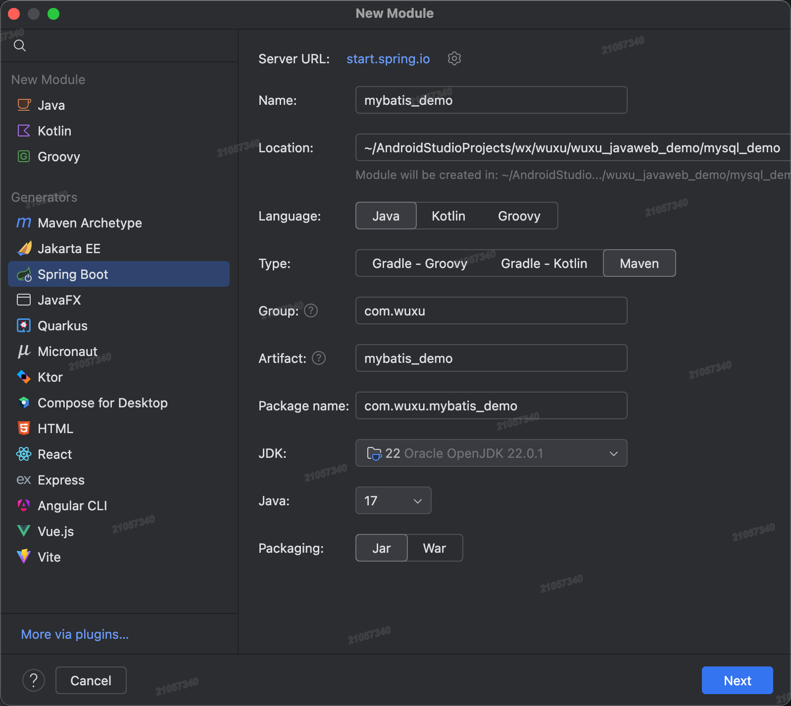
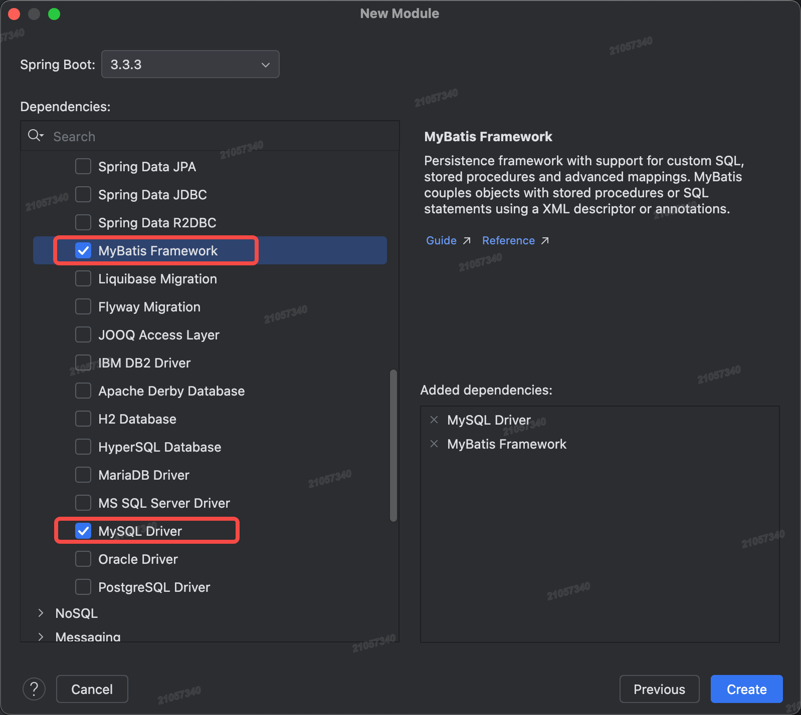
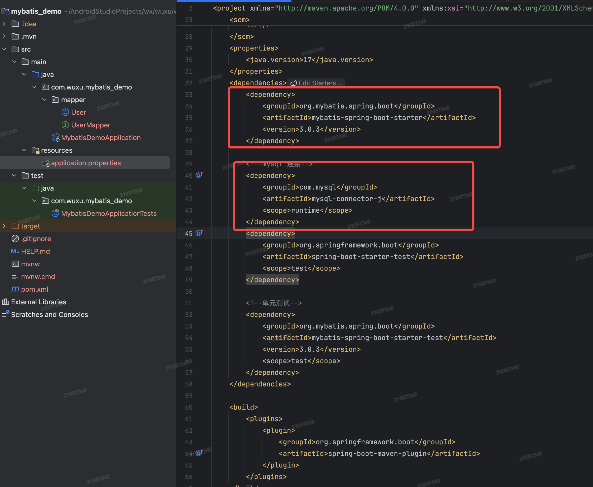
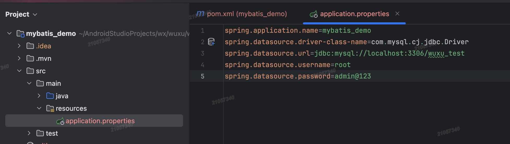
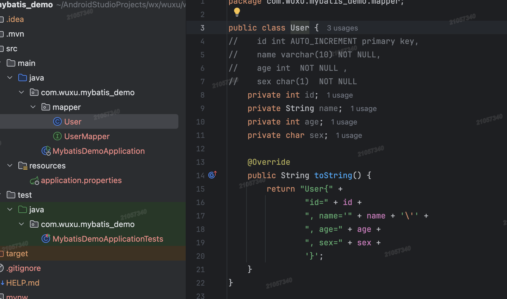
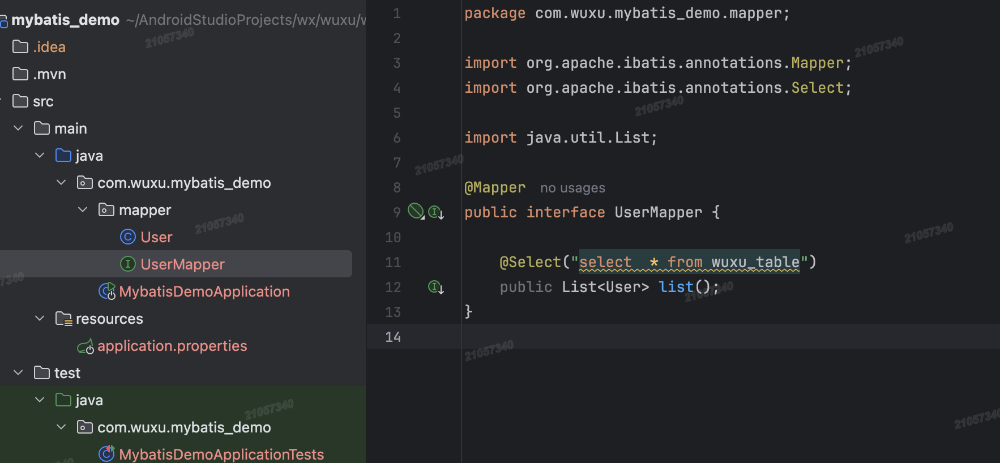

# 通过idea直接配置

1. 创建springboot工程、创建本地数据库

    - 创建springboot工程

        
        

    - 创建本地数据库

        ```sql
        CREATE TABLE wuxu_table(
            id int AUTO_INCREMENT primary key,
            name varchar(10) NOT NULL,
            age int  NOT NULL ,
            sex char(1)  NOT NULL
        );

        ```

2. 依赖MyBatis，配置MyBatis数据库连接信息

    
    

    补充：`application.properties`中可以增加配置`mybatis.configuration.log-impl=org.apache.ibatis.logging.stdout.StdOutImpl`打开mybatis日志并输出到控制台。

3. 创建实体类

    

4. 创建数据库接口，编写SQL语句，并通过注解标注在实体类中

    

5. 通过依赖注入，直接使用实体类。

    ```java
    @SpringBootTest
    class MybatisDemoApplicationTests {

        @Autowired
        private UserMapper userMapper;

        @Test
        void testListUser(){
            List<User> userList = userMapper.list();
            userList.forEach(user ->{
                System.out.println("user:"+ user.toString());
            });
        }
    }

    /*
     输出结果：
        user:User{id=1, name='哈哈', age=18, sex=男}
        user:User{id=2, name='刘', age=13, sex=男}
        user:User{id=3, name='关', age=13, sex=男}
        user:User{id=4, name='张', age=13, sex=男}
     */
    ```
