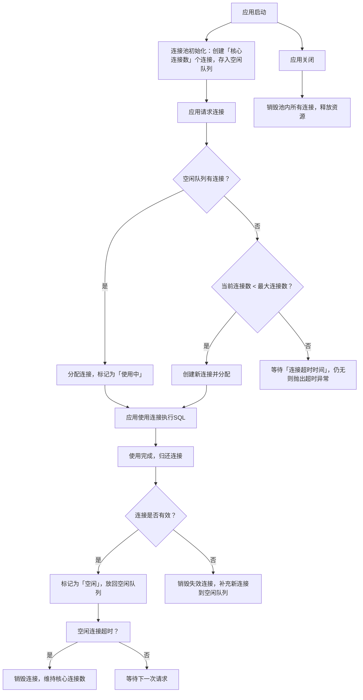

# 数据库连接池介绍

## 一、数据库连接池的核心定义与设计初衷

### 1.1 什么是数据库连接池？

**技术定义**：数据库连接池（Database Connection Pool）是一种「资源池化」技术，它在应用启动时预先创建指定数量的数据库连接（`Connection`）并存储在内存的「连接池」中；当应用需要访问数据库时，直接从池中获取空闲连接，使用完成后将连接归还给池（而非销毁），实现连接的复用。

**通俗类比**：

- 无连接池：就像「临时打车」—— 每次出门（访问数据库）都临时叫车（创建连接），到达目的地后车就开走（销毁连接），叫车/等车（创建连接）的时间成本高；
- 有连接池：就像「公司自有车队」—— 公司预先采购一批车（初始化连接），员工出门直接从车队领车（获取连接），用完后归还车队（归还连接），无需重复采购/报废车辆，效率极高。

### 1.2 为什么必须使用连接池？

原生JDBC直接创建/销毁连接的方式存在致命问题，这也是连接池成为「生产环境必备」的核心原因：

| 问题 | 具体表现 | 影响 |
|------|----------|------|
| 连接创建开销大 | 创建`Connection`需经历：TCP三次握手 → 数据库认证 → 创建连接对象，单次耗时约10-100ms | 高并发场景下，连接创建耗时会成为系统性能瓶颈 |
| 资源泄漏风险 | 若代码中忘记关闭`Connection`/`Statement`，会导致数据库连接被永久占用 | 数据库连接数耗尽，新请求无法访问数据库，系统崩溃 |
| 无连接管控 | 无法限制并发连接数，高并发时可能创建上千个连接 | 数据库服务器因连接过多导致CPU/内存耗尽，宕机 |
| 连接销毁浪费 | 每次使用后销毁连接，重复创建/销毁会增加GC压力 | 应用服务器性能下降，响应延迟增加 |

### 1.3 连接池的核心设计目标

1. **连接复用**：核心目标，避免重复创建/销毁连接，降低性能开销；
2. **连接管控**：限制最大连接数，防止数据库被过多连接压垮；
3. **高效分配**：快速获取/归还连接，支持超时等待、公平分配等策略；
4. **异常恢复**：自动检测失效连接并重建，保证连接可用性；
5. **监控运维**：记录连接使用情况、空闲时间、SQL执行耗时等，便于问题排查。

---

## 二、数据库连接池的核心工作原理

### 2.1 连接池的完整生命周期



### 2.2 核心机制详解

1. **连接初始化**：应用启动时，连接池根据「核心连接数」创建初始连接，存入空闲队列；
2. **连接分配策略**：
   - 优先分配空闲队列中的连接；
   - 无空闲连接且未达「最大连接数」时，创建新连接；
   - 无空闲连接且已达「最大连接数」时，请求进入等待队列，超时未获取则抛出`TimeoutException`；
3. **连接归还**：应用调用`conn.close()`时（实际是连接池的代理方法），连接池不会真正关闭连接，仅将其标记为空闲并放回队列；
4. **空闲清理**：定期检查空闲队列，超过「空闲超时时间」的连接会被销毁，保证池内连接数不低于「核心连接数」；
5. **连接校验**：分配/归还连接时，通过「测试SQL」（如`SELECT 1`）校验连接有效性，失效则自动重建。

---

## 三、连接池核心配置参数（通用+主流实现）

连接池的性能和稳定性完全依赖参数配置，以下是通用核心参数及主流连接池（HikariCP/Druid）的具体配置：

### 3.1 通用核心参数（所有连接池都具备）

| 参数名称 | 核心作用 | 合理取值建议 |
|----------|----------|--------------|
| 核心连接数（corePoolSize） | 连接池维持的「最小空闲连接数」，初始化时创建，即使空闲也不会销毁 | 参考：CPU核心数 × 2（如8核CPU设为16） |
| 最大连接数（maxPoolSize） | 连接池允许创建的「最大连接数」，限制并发连接数 | 参考：业务峰值QPS ÷ 单连接QPS（如峰值QPS=1000，单连接QPS=100 → 设为10） |
| 连接超时时间（connectionTimeout） | 获取连接的等待超时时间，超时未获取则抛异常 | 1000-3000ms（1-3秒），太短易超时，太长易阻塞 |
| 空闲超时时间（idleTimeout） | 空闲连接的最大存活时间，超时则销毁 | 600000ms（10分钟），太短会频繁销毁/创建，太长会占用资源 |
| 最大存活时间（maxLifetime） | 连接的最大生命周期，无论是否空闲，到期必销毁 | 1800000ms（30分钟），避免长时间连接导致的数据库端资源泄漏 |
| 测试SQL（validationQuery） | 校验连接有效性的SQL语句 | MySQL：`SELECT 1`；Oracle：`SELECT 1 FROM DUAL` |

### 3.2 HikariCP 核心配置（SpringBoot默认，性能最优）

HikariCP是目前性能最好的连接池，代码简洁（仅1300行），无冗余功能，以下是SpringBoot中`application.yml`配置示例：

```yaml
spring:
  datasource:
    # HikariCP核心配置
    hikari:
      jdbc-url: jdbc:mysql://localhost:3306/test?useSSL=false&serverTimezone=UTC&characterEncoding=utf8
      username: root
      password: 123456
      driver-class-name: com.mysql.cj.jdbc.Driver
      # 核心连接数（默认10）
      minimum-idle: 8
      # 最大连接数（默认10，建议根据业务调整）
      maximum-pool-size: 20
      # 获取连接超时时间（默认30秒，建议缩短）
      connection-timeout: 3000
      # 空闲连接超时时间（默认10分钟）
      idle-timeout: 600000
      # 连接最大存活时间（默认30分钟）
      max-lifetime: 1800000
      # 测试连接有效性的SQL（默认关闭，建议开启）
      connection-test-query: SELECT 1
      # 连接池名称（便于监控）
      pool-name: TestHikariPool
```

### 3.3 Druid 核心配置（阿里出品，功能最全）

Druid是国内主流连接池，内置SQL监控、防SQL注入、慢SQL记录等功能，SpringBoot配置示例：

```yaml
spring:
  datasource:
    # Druid核心配置
    type: com.alibaba.druid.pool.DruidDataSource
    url: jdbc:mysql://localhost:3306/test?useSSL=false&serverTimezone=UTC
    username: root
    password: 123456
    driver-class-name: com.mysql.cj.jdbc.Driver
    druid:
      # 核心连接数
      initial-size: 8
      # 最小空闲连接数
      min-idle: 8
      # 最大连接数
      max-active: 20
      # 获取连接超时时间
      max-wait: 3000
      # 空闲连接清理周期（毫秒）
      time-between-eviction-runs-millis: 60000
      # 连接最小存活时间
      min-evictable-idle-time-millis: 300000
      # 测试SQL
      validation-query: SELECT 1
      # 申请连接时校验有效性
      test-on-borrow: false
      # 归还连接时校验有效性
      test-on-return: false
      # 空闲时校验有效性（推荐开启）
      test-while-idle: true
      # 开启慢SQL记录（超过500ms视为慢SQL）
      filter:
        stat:
          log-slow-sql: true
          slow-sql-millis: 500
      # 开启Web监控（访问http://localhost:8080/druid/）
      web-stat-filter:
        enabled: true
      stat-view-servlet:
        enabled: true
        login-username: admin
        login-password: admin
```

---

## 四、主流数据库连接池对比与选型

### 4.1 四大主流连接池核心对比

| 连接池 | 性能 | 功能丰富度 | 监控能力 | 社区活跃度 | 适用场景 |
|--------|------|------------|----------|------------|----------|
| HikariCP | 🌟🌟🌟🌟🌟（最优） | 基础功能（连接复用、超时管理） | 基础（仅连接数/空闲数） | 高（SpringBoot默认） | 生产环境首选（追求高性能、无复杂监控需求） |
| Druid（阿里） | 🌟🌟🌟🌟（优秀） | 最全（SQL监控、防注入、慢SQL、加密） | 极致（连接池/SQL/并发监控） | 高（国内主流） | 国内生产环境（需要监控、安全、审计） |
| C3P0 | 🌟🌟🌟（一般） | 基础功能（支持连接池动态调整） | 弱 | 低（维护少） | 老项目兼容、传统企业项目 |
| DBCP | 🌟🌟🌟（一般） | 基础功能（Apache出品） | 弱 | 低 | Spring早期项目、简单场景 |

### 4.2 选型建议

1. **优先选HikariCP**：SpringBoot默认，性能最优，配置简单，适合大多数高性能场景；
2. **需要监控/安全选Druid**：国内企业首选，内置监控面板、慢SQL记录、防SQL注入，适合需要运维审计的场景；
3. **老项目兼容选C3P0/DBCP**：仅用于维护遗留系统，新项目不推荐。

---

## 五、实战使用示例

### 5.1 原生Java使用HikariCP（无框架）

```java
import com.zaxxer.hikari.HikariConfig;
import com.zaxxer.hikari.HikariDataSource;

import java.sql.Connection;
import java.sql.PreparedStatement;
import java.sql.ResultSet;

public class HikariDemo {
    public static void main(String[] args) {
        // 1. 创建配置对象
        HikariConfig config = new HikariConfig();
        config.setJdbcUrl("jdbc:mysql://localhost:3306/test?useSSL=false&serverTimezone=UTC");
        config.setUsername("root");
        config.setPassword("123456");
        config.setDriverClassName("com.mysql.cj.jdbc.Driver");
        config.setMinimumIdle(8);
        config.setMaximumPoolSize(20);
        config.setConnectionTimeout(3000);

        // 2. 创建数据源（连接池）
        HikariDataSource dataSource = new HikariDataSource(config);

        // 3. 获取连接（从池内获取，非新建）
        try (Connection conn = dataSource.getConnection()) {
            String sql = "SELECT id, username FROM user WHERE id = ?";
            try (PreparedStatement pstmt = conn.prepareStatement(sql)) {
                pstmt.setInt(1, 1);
                try (ResultSet rs = pstmt.executeQuery()) {
                    while (rs.next()) {
                        System.out.println("id: " + rs.getInt("id") + ", username: " + rs.getString("username"));
                    }
                }
            }
        } catch (Exception e) {
            e.printStackTrace();
        } finally {
            // 4. 应用关闭时销毁数据源
            dataSource.close();
        }
    }
}
```

### 5.2 SpringBoot整合Druid（含监控）

#### 步骤1：引入依赖

```xml
<dependencies>
    <dependency>
        <groupId>org.springframework.boot</groupId>
        <artifactId>spring-boot-starter-web</artifactId>
    </dependency>
    <dependency>
        <groupId>com.alibaba</groupId>
        <artifactId>druid-spring-boot-starter</artifactId>
        <version>1.2.20</version>
    </dependency>
    <dependency>
        <groupId>mysql</groupId>
        <artifactId>mysql-connector-java</artifactId>
        <scope>runtime</scope>
    </dependency>
</dependencies>
```

#### 步骤2：配置`application.yml`（同3.3节）

#### 步骤3：访问监控面板

启动应用后，访问 `http://localhost:8080/druid/`，输入配置的用户名/密码（admin/admin），即可看到：

- 连接池监控：活跃连接数、空闲连接数、最大连接数；
- SQL监控：执行次数、耗时、慢SQL记录；
- 并发监控：请求数、响应时间分布。

---

## 六、连接池性能调优技巧

### 6.1 核心参数调优依据

| 参数 | 调优原则 | 反例 |
|------|----------|------|
| 最大连接数（maxPoolSize） | 避免设置过大（如超过50），数据库单实例的并发连接数建议≤30 | 设为100 → 数据库上下文切换频繁，性能下降 |
| 核心连接数（corePoolSize） | 等于业务「平均并发连接数」，避免空闲连接过多 | 设为50（实际平均仅10）→ 浪费数据库资源 |
| 连接超时时间 | 设为1-3秒，快速失败，避免请求长时间阻塞 | 设为30秒 → 连接池满时，请求阻塞30秒才报错 |
| 空闲超时时间 | 设为5-10分钟，兼顾复用和资源释放 | 设为1分钟 → 频繁销毁/创建连接，性能开销大 |

### 6.2 关键调优步骤

1. **压测确定峰值连接数**：通过JMeter/LoadRunner压测，找到业务峰值时的实际连接数，将`maxPoolSize`设为峰值的1.2倍；
2. **开启连接校验**：启用`test-while-idle`（空闲时校验），避免分配失效连接；
3. **关闭不必要的校验**：关闭`test-on-borrow`（申请时校验），减少性能开销；
4. **监控慢SQL**：慢SQL会占用连接长时间不释放，需优化慢SQL（加索引、拆分SQL）。

---

## 七、常见问题与解决方案

### 7.1 连接泄漏（最常见）

**现象**：连接池活跃连接数持续上涨，最终达到最大连接数，新请求超时。
**原因**：代码中未正确关闭`Connection`/`Statement`/`ResultSet`，或使用了未释放连接的第三方组件。
**解决方案**：

1. 强制使用`try-with-resources`语法（自动关闭资源）：

   ```java
   // 正确写法
   try (Connection conn = dataSource.getConnection();
        PreparedStatement pstmt = conn.prepareStatement(sql)) {
       // 执行SQL
   } catch (Exception e) {
       e.printStackTrace();
   }
   ```

2. 开启Druid的连接泄漏监控：

   ```yaml
   druid:
     remove-abandoned: true
     remove-abandoned-timeout-millis: 300000 # 超过5分钟未释放的连接强制回收
     log-abandoned: true # 记录泄漏连接的堆栈信息
   ```

### 7.2 连接池满（请求超时）

**现象**：应用日志频繁出现`Timeout waiting for connection from pool`。
**解决方案**：

1. 检查是否有连接泄漏（优先）；
2. 检查是否有慢SQL占用连接；
3. 适当调大`maxPoolSize`（不建议超过30）；
4. 优化业务逻辑，减少数据库访问次数（如加缓存）。

### 7.3 连接失效（SQL执行报错）

**现象**：偶尔出现`Communications link failure`（连接失效）。
**解决方案**：

1. 开启连接空闲校验（`test-while-idle: true`）；
2. 缩短`maxLifetime`（如设为20分钟），避免连接长时间存活；
3. 检查数据库端的`wait_timeout`（建议设为比连接池`idleTimeout`大）。

---

### 总结

1. **核心价值**：数据库连接池是解决原生JDBC连接创建开销大、资源泄漏的必备技术，所有生产环境必须使用，优先选HikariCP（性能）或Druid（监控）；
2. **配置关键**：核心参数（最大连接数、连接超时、空闲超时）需根据业务压测结果调整，避免盲目调大；
3. **排障重点**：连接泄漏是最常见问题，需通过`try-with-resources`和连接池监控定位，慢SQL是连接池满的核心诱因。

如果需要针对具体场景（如高并发下的连接池调优、多数据源连接池配置）做更深入的讲解，可以告诉我。
