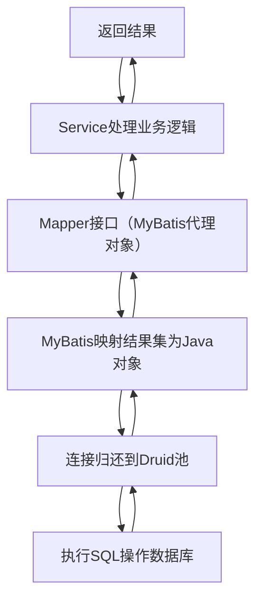

# Springboot+Druid+Mybatis配合使用

## 一、三者的核心角色（配合逻辑）

在整合架构中，三者各司其职、互补配合：

- **SpringBoot**：作为基础框架，提供自动配置、依赖管理、容器管理等核心能力，简化XML配置，快速启动项目；
- **MyBatis**：作为数据访问框架，负责SQL编写、参数映射、结果集转换，简化JDBC操作；
- **Druid**：作为数据库连接池（替代SpringBoot默认的HikariCP），负责数据库连接的复用、管控和监控，同时提供SQL监控、慢SQL记录、防注入等附加功能。

整体流程：`SpringBoot容器启动` → `Druid连接池初始化` → `MyBatis加载Mapper配置` → `业务代码通过MyBatis操作Druid提供的数据库连接` → `Druid监控连接使用和SQL执行`。

---

## 二、整合步骤（完整实操）

### 2.1 环境准备

- JDK：1.8+（SpringBoot 2.x推荐）
- Maven：3.6+
- MySQL：5.7+/8.0+
- SpringBoot版本：2.7.x（稳定版）

### 2.2 步骤1：引入Maven依赖（pom.xml）

核心依赖包括：SpringBoot基础、MyBatis整合包、Druid整合包、MySQL驱动，无需手动引入其他依赖（SpringBoot自动管理版本）。

```xml
<?xml version="1.0" encoding="UTF-8"?>
<project xmlns="http://maven.apache.org/POM/4.0.0"
         xmlns:xsi="http://www.w3.org/2001/XMLSchema-instance"
         xsi:schemaLocation="http://maven.apache.org/POM/4.0.0 http://maven.apache.org/xsd/maven-4.0.0.xsd">
    <modelVersion>4.0.0</modelVersion>

    <!-- SpringBoot父工程（核心：依赖版本管理） -->
    <parent>
        <groupId>org.springframework.boot</groupId>
        <artifactId>spring-boot-starter-parent</artifactId>
        <version>2.7.18</version>
        <relativePath/>
    </parent>

    <groupId>com.example</groupId>
    <artifactId>springboot-mybatis-druid</artifactId>
    <version>1.0-SNAPSHOT</version>

    <dependencies>
        <!-- SpringBoot Web（可选，用于接口测试） -->
        <dependency>
            <groupId>org.springframework.boot</groupId>
            <artifactId>spring-boot-starter-web</artifactId>
        </dependency>

        <!-- MyBatis整合SpringBoot -->
        <dependency>
            <groupId>org.mybatis.spring.boot</groupId>
            <artifactId>mybatis-spring-boot-starter</artifactId>
            <version>2.3.2</version>
        </dependency>

        <!-- Druid整合SpringBoot（阿里官方starter） -->
        <dependency>
            <groupId>com.alibaba</groupId>
            <artifactId>druid-spring-boot-starter</artifactId>
            <version>1.2.20</version>
        </dependency>

        <!-- MySQL驱动 -->
        <dependency>
            <groupId>mysql</groupId>
            <artifactId>mysql-connector-java</artifactId>
            <scope>runtime</scope>
        </dependency>

        <!-- SpringBoot测试（用于单元测试） -->
        <dependency>
            <groupId>org.springframework.boot</groupId>
            <artifactId>spring-boot-starter-test</artifactId>
            <scope>test</scope>
        </dependency>
    </dependencies>

    <!-- 打包插件 -->
    <build>
        <plugins>
            <plugin>
                <groupId>org.springframework.boot</groupId>
                <artifactId>spring-boot-maven-plugin</artifactId>
            </plugin>
        </plugins>
    </build>
</project>
```

### 2.3 步骤2：核心配置（application.yml）

在`resources`目录下创建`application.yml`，配置Druid连接池、MyBatis、数据库信息，这是三者整合的核心配置文件。

```yaml
# 服务器配置
server:
  port: 8080 # 应用端口

# 数据源配置（核心：Druid连接池）
spring:
  datasource:
    # 指定数据源类型为Druid
    type: com.alibaba.druid.pool.DruidDataSource
    # Druid连接池配置
    druid:
      # 数据库连接信息
      url: jdbc:mysql://localhost:3306/test_db?useSSL=false&serverTimezone=UTC&characterEncoding=utf8&allowPublicKeyRetrieval=true
      username: root # 你的MySQL用户名
      password: 123456 # 你的MySQL密码
      driver-class-name: com.mysql.cj.jdbc.Driver

      # Druid连接池核心参数（重点）
      initial-size: 5 # 初始化连接数
      min-idle: 5 # 最小空闲连接数
      max-active: 20 # 最大活跃连接数
      max-wait: 3000 # 获取连接的最大等待时间（ms）
      time-between-eviction-runs-millis: 60000 # 空闲连接检查周期（ms）
      min-evictable-idle-time-millis: 300000 # 连接最小空闲时间（ms）
      validation-query: SELECT 1 # 校验连接有效性的SQL
      test-while-idle: true # 空闲时校验连接（推荐开启）
      test-on-borrow: false # 申请连接时不校验（提升性能）
      test-on-return: false # 归还连接时不校验（提升性能）

      # Druid监控配置（可选，但推荐开启）
      stat-view-servlet:
        enabled: true # 开启监控面板
        url-pattern: /druid/* # 监控面板访问路径
        login-username: admin # 监控面板登录用户名
        login-password: admin # 监控面板登录密码
        allow: 127.0.0.1 # 允许访问的IP（默认所有）
      filter:
        stat:
          enabled: true # 开启SQL监控
          slow-sql-millis: 500 # 慢SQL阈值（ms），超过则记录
          log-slow-sql: true # 记录慢SQL
        wall:
          enabled: true # 开启防SQL注入

# MyBatis配置
mybatis:
  # Mapper.xml文件路径（默认：resources/mapper/**/*.xml）
  mapper-locations: classpath:mapper/*.xml
  # 实体类别名包（简化resultType写法，无需写全类名）
  type-aliases-package: com.example.pojo
  # 开启驼峰命名自动映射（数据库user_name → Java userName）
  configuration:
    map-underscore-to-camel-case: true
    # 开启日志（打印SQL，便于调试）
    log-impl: org.apache.ibatis.logging.stdout.StdOutImpl
```

### 2.4 步骤3：数据库表准备

在MySQL中创建测试库`test_db`和表`user`：

```sql
-- 创建数据库
CREATE DATABASE IF NOT EXISTS test_db DEFAULT CHARACTER SET utf8mb4;
USE test_db;

-- 创建用户表
CREATE TABLE IF NOT EXISTS `user` (
  `id` INT PRIMARY KEY AUTO_INCREMENT COMMENT '主键ID',
  `user_name` VARCHAR(50) NOT NULL COMMENT '用户名',
  `age` INT COMMENT '年龄',
  `email` VARCHAR(100) COMMENT '邮箱',
  `create_time` DATETIME DEFAULT CURRENT_TIMESTAMP COMMENT '创建时间'
) ENGINE=InnoDB DEFAULT CHARSET=utf8mb4;

-- 插入测试数据
INSERT INTO `user` (user_name, age, email) VALUES ('张三', 20, 'zhangsan@test.com'), ('李四', 22, 'lisi@test.com');
```

### 2.5 步骤4：编写实体类（POJO）

创建`com.example.pojo.User`类，对应数据库`user`表：

```java
package com.example.pojo;

import lombok.Data; // 可选：用Lombok简化getter/setter，需引入lombok依赖
import java.time.LocalDateTime;

// 若不用Lombok，需手动编写getter/setter/toString
@Data
public class User {
    private Integer id;
    private String userName; // 对应数据库user_name（驼峰映射）
    private Integer age;
    private String email;
    private LocalDateTime createTime; // 对应数据库create_time
}
```

> 若使用Lombok，需在pom.xml中添加依赖：
>
> ```xml
> <dependency>
>     <groupId>org.projectlombok</groupId>
>     <artifactId>lombok</artifactId>
>     <optional>true</optional>
> </dependency>
> ```

### 2.6 步骤5：编写MyBatis Mapper接口和XML

#### 5.1 Mapper接口（DAO层）

创建`com.example.mapper.UserMapper`接口，定义数据库操作方法：

```java
package com.example.mapper;

import com.example.pojo.User;
import org.apache.ibatis.annotations.Mapper;
import org.apache.ibatis.annotations.Param;

import java.util.List;

// 注解标记为MyBatis Mapper（也可在启动类加@MapperScan扫描包）
@Mapper
public interface UserMapper {
    // 根据ID查询用户
    User findById(@Param("id") Integer id);

    // 查询所有用户
    List<User> findAll();

    // 添加用户
    int insertUser(User user);

    // 更新用户
    int updateUser(User user);

    // 删除用户
    int deleteUser(@Param("id") Integer id);
}
```

#### 5.2 Mapper XML文件

在`resources/mapper`目录下创建`UserMapper.xml`，编写SQL语句：

```xml
<?xml version="1.0" encoding="UTF-8"?>
<!DOCTYPE mapper
        PUBLIC "-//mybatis.org//DTD Mapper 3.0//EN"
        "https://mybatis.org/dtd/mybatis-3-mapper.dtd">
<!-- namespace：绑定对应的Mapper接口全类名 -->
<mapper namespace="com.example.mapper.UserMapper">
    <!-- 结果映射（可选：若驼峰映射已开启，基础字段可省略，此处演示完整配置） -->
    <resultMap id="UserResultMap" type="User">
        <id column="id" property="id"/>
        <result column="user_name" property="userName"/>
        <result column="age" property="age"/>
        <result column="email" property="email"/>
        <result column="create_time" property="createTime"/>
    </resultMap>

    <!-- 根据ID查询（使用resultMap） -->
    <select id="findById" resultMap="UserResultMap">
        SELECT id, user_name, age, email, create_time FROM user WHERE id = #{id}
    </select>

    <!-- 查询所有（直接用resultType，因开启驼峰映射） -->
    <select id="findAll" resultType="User">
        SELECT id, user_name, age, email, create_time FROM user
    </select>

    <!-- 插入用户（获取自增ID） -->
    <insert id="insertUser" useGeneratedKeys="true" keyProperty="id">
        INSERT INTO user (user_name, age, email) VALUES (#{userName}, #{age}, #{email})
    </insert>

    <!-- 更新用户 -->
    <update id="updateUser">
        UPDATE user SET user_name = #{userName}, age = #{age}, email = #{email} WHERE id = #{id}
    </update>

    <!-- 删除用户 -->
    <delete id="deleteUser">
        DELETE FROM user WHERE id = #{id}
    </delete>
</mapper>
```

### 2.7 步骤6：编写Service层（业务层，可选但规范）

创建`com.example.service.UserService`接口和实现类，封装业务逻辑：

```java
// 接口
package com.example.service;

import com.example.pojo.User;

import java.util.List;

public interface UserService {
    User findById(Integer id);
    List<User> findAll();
    int insertUser(User user);
    int updateUser(User user);
    int deleteUser(Integer id);
}

// 实现类
package com.example.service.impl;

import com.example.mapper.UserMapper;
import com.example.pojo.User;
import com.example.service.UserService;
import org.springframework.stereotype.Service;

import javax.annotation.Resource;
import java.util.List;

@Service // 标记为Spring服务类
public class UserServiceImpl implements UserService {

    // 注入Mapper（也可用@Autowired）
    @Resource
    private UserMapper userMapper;

    @Override
    public User findById(Integer id) {
        return userMapper.findById(id);
    }

    @Override
    public List<User> findAll() {
        return userMapper.findAll();
    }

    @Override
    public int insertUser(User user) {
        return userMapper.insertUser(user);
    }

    @Override
    public int updateUser(User user) {
        return userMapper.updateUser(user);
    }

    @Override
    public int deleteUser(Integer id) {
        return userMapper.deleteUser(id);
    }
}
```

### 2.8 步骤7：编写启动类

创建`com.example.SpringbootMybatisDruidApplication`，作为项目入口：

```java
package com.example;

import org.mybatis.spring.annotation.MapperScan;
import org.springframework.boot.SpringApplication;
import org.springframework.boot.autoconfigure.SpringBootApplication;

// SpringBoot核心注解（扫描当前包及子包）
@SpringBootApplication
// 扫描Mapper接口包（若Mapper接口已加@Mapper，此注解可选）
@MapperScan("com.example.mapper")
public class SpringbootMybatisDruidApplication {
    public static void main(String[] args) {
        SpringApplication.run(SpringbootMybatisDruidApplication.class, args);
    }
}
```

### 2.9 步骤8：测试验证

#### 8.1 单元测试（推荐）

在`src/test/java/com/example`下创建`UserServiceTest`：

```java
package com.example;

import com.example.pojo.User;
import com.example.service.UserService;
import org.junit.jupiter.api.Test;
import org.springframework.boot.test.context.SpringBootTest;

import javax.annotation.Resource;
import java.util.List;

// 标记为SpringBoot测试，启动容器
@SpringBootTest
public class UserServiceTest {

    @Resource
    private UserService userService;

    // 测试查询所有用户
    @Test
    public void testFindAll() {
        List<User> userList = userService.findAll();
        userList.forEach(System.out::println);
    }

    // 测试根据ID查询
    @Test
    public void testFindById() {
        User user = userService.findById(1);
        System.out.println(user);
    }
}
```

运行测试方法，控制台会打印SQL和查询结果，说明整合成功。

#### 8.2 接口测试（可选）

创建`com.example.controller.UserController`，提供HTTP接口：

```java
package com.example.controller;

import com.example.pojo.User;
import com.example.service.UserService;
import org.springframework.web.bind.annotation.GetMapping;
import org.springframework.web.bind.annotation.PathVariable;
import org.springframework.web.bind.annotation.RequestMapping;
import org.springframework.web.bind.annotation.RestController;

import javax.annotation.Resource;
import java.util.List;

@RestController // 标记为REST接口，返回JSON
@RequestMapping("/user")
public class UserController {

    @Resource
    private UserService userService;

    // 查询所有用户：http://localhost:8080/user/all
    @GetMapping("/all")
    public List<User> findAll() {
        return userService.findAll();
    }

    // 根据ID查询：http://localhost:8080/user/1
    @GetMapping("/{id}")
    public User findById(@PathVariable Integer id) {
        return userService.findById(id);
    }
}
```

启动项目后，访问`http://localhost:8080/user/all`，会返回JSON格式的用户列表，说明接口正常。

#### 8.3 Druid监控面板验证

访问`http://localhost:8080/druid/`，输入配置的用户名/密码（admin/admin），可看到：

- **数据源监控**：连接池的活跃数、空闲数、最大数等；
- **SQL监控**：执行过的SQL语句、执行次数、耗时、慢SQL记录；
- **URI监控**：接口访问次数、耗时等。

---

## 三、核心配置解释（关键要点）

### 3.1 Druid与SpringBoot的配合

- `spring.datasource.type`指定数据源为Druid，SpringBoot会自动初始化Druid连接池；
- Druid的连接池参数（`initial-size`/`max-active`等）控制连接的创建和复用；
- Druid的监控配置（`stat-view-servlet`/`filter`）提供可视化监控和SQL审计能力。

### 3.2 MyBatis与SpringBoot的配合

- `mybatis.mapper-locations`指定Mapper XML文件路径，SpringBoot会自动加载；
- `mybatis.type-aliases-package`简化XML中`resultType`的写法（如`User`替代`com.example.pojo.User`）；
- `@Mapper`或`@MapperScan`让Spring识别MyBatis的Mapper接口，自动生成代理对象；
- MyBatis通过Spring的数据源（Druid）获取数据库连接，无需手动管理`SqlSession`。

### 3.3 三者的调用链路



---

## 四、常见问题与解决方案

### 4.1 Mapper XML文件找不到

**现象**：启动报错`Invalid bound statement (not found)`。
**原因**：XML文件路径与`mybatis.mapper-locations`配置不一致，或打包时XML未被复制到target目录。
**解决方案**：

1. 检查`mybatis.mapper-locations`配置是否正确（如`classpath:mapper/*.xml`对应`resources/mapper`目录）；
2. 在pom.xml中添加资源扫描配置（确保XML被打包）：

   ```xml
   <build>
       <resources>
           <resource>
               <directory>src/main/resources</directory>
               <includes>
                   <include>**/*.yml</include>
                   <include>**/*.xml</include>
               </includes>
           </resource>
       </resources>
   </build>
   ```

### 4.2 Druid监控面板无法访问

**现象**：访问`/druid`报404。
**解决方案**：

1. 检查`spring.datasource.druid.stat-view-servlet.enabled`是否为`true`；
2. 检查`url-pattern`是否为`/druid/*`；
3. 若有拦截器（如Spring Security），需放行`/druid/**`路径。

### 4.3 驼峰映射不生效

**现象**：数据库`user_name`无法映射到Java`userName`。
**解决方案**：

1. 确保`mybatis.configuration.map-underscore-to-camel-case`设为`true`；
2. 或在XML中手动配置`resultMap`指定字段映射。

---

### 总结

1. **整合核心**：SpringBoot作为容器，自动初始化Druid连接池和MyBatis的Mapper代理对象，MyBatis通过Druid获取数据库连接，三者通过Spring的依赖注入完成协同；
2. **关键配置**：Druid的连接池参数控制资源复用，MyBatis的XML路径和别名配置简化开发，Druid的监控配置便于运维；
3. **规范要点**：Mapper接口加`@Mapper`、Service加`@Service`、Controller加`@RestController`，通过依赖注入解耦各层。

这套整合方案是企业级开发的标准配置，掌握后可直接应用到实际项目中，若需要扩展（如多数据源、分页插件PageHelper），可以告诉我，我会补充对应的配置和代码。
