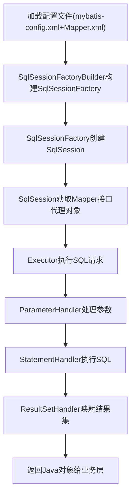

# MyBatis

java中的数据库操作语句框架，可减少sql注入（因为MyBatis是预编译处理，语法规则天然减少sql注入的情况），简化JDBC的使用。（JDBC 大学里学习java网页用的数据库连接调用，它是一套接口规范，具体实现交由具体数据库驱动实现如mysql。）

[官方文档](https://mybatis.org/mybatis-3/zh_CN/index.html)

说明：

1. xml定义sql映射，可以去看官方文档，比较全面。

## 一、MyBatis 基础认知

### 1.1 什么是MyBatis？

MyBatis 是一款**半自动的ORM（Object Relational Mapping，对象关系映射）框架**，前身是Apache的iBatis，2010年迁移到Google Code并更名MyBatis，2013年迁移到GitHub。

它的核心定位是**简化JDBC操作**：

- 摒弃了JDBC繁琐的手动参数设置、结果集遍历、资源关闭等操作；
- 无需编写实体类与数据库表的映射关系（全手动），但需要手动编写SQL（区别于Hibernate的全自动ORM）；
- 将SQL语句与Java代码解耦，便于SQL优化和维护。

### 1.2 MyBatis 核心优势

| 优势 | 说明 |
|------|------|
| 低侵入性 | 基于接口编程，无需继承/实现特定类/接口，业务代码与框架解耦 |
| SQL可控 | 手动编写SQL，可精准优化执行效率（适合复杂查询、性能要求高的场景） |
| 灵活度高 | 支持动态SQL、存储过程、多数据库适配 |
| 轻量级 | 配置简单，学习成本低于Hibernate，运行时开销小 |
| 结果映射 | 强大的结果集映射能力，支持一对一、一对多等关联查询 |

### 1.3 MyBatis vs JDBC vs Hibernate

| 特性 | JDBC | MyBatis | Hibernate |
|------|------|---------|-----------|
| SQL编写 | 硬编码在Java中 | 独立XML/注解，解耦 | 自动生成，无需手动编写 |
| 参数处理 | 手动setXxx() | 自动映射（#{}） | 完全自动 |
| 结果映射 | 手动遍历ResultSet | 自动映射/自定义resultMap | 完全自动 |
| 灵活性 | 最高（完全手动） | 高（SQL可控） | 低（依赖框架生成） |
| 学习成本 | 低（基础API） | 中（配置+SQL） | 高（ORM概念+HQL） |
| 性能 | 高（无框架开销） | 较高（少量框架开销） | 中（自动SQL可能低效） |

---

## 二、MyBatis 核心架构与组件

MyBatis的执行流程可拆解为「初始化 → SQL执行 → 结果返回」，核心组件如下：

### 2.1 核心组件说明

| 组件 | 作用 | 生命周期 |
|------|------|----------|
| `SqlSessionFactoryBuilder` | 构建`SqlSessionFactory`，通过配置文件/代码生成 | 方法级（用完即丢） |
| `SqlSessionFactory` | 生产`SqlSession`的工厂，MyBatis的核心单例 | 应用级（全局唯一） |
| `SqlSession` | 与数据库的会话，封装CRUD方法，非线程安全 | 请求/方法级（用完关闭） |
| `Executor` | 执行器，SqlSession的底层执行引擎（真正执行SQL） | 随SqlSession创建/销毁 |
| `MappedStatement` | 封装Mapper中的SQL配置（SQL语句、参数、结果映射等） | 应用级（全局缓存） |
| `StatementHandler` | 处理JDBC的Statement（PreparedStatement/Statement） | 随SQL执行创建/销毁 |
| `ParameterHandler` | 处理SQL参数（将Java参数映射到JDBC参数） | 随SQL执行创建/销毁 |
| `ResultSetHandler` | 处理结果集（将JDBC ResultSet映射为Java对象） | 随SQL执行创建/销毁 |

### 2.2 MyBatis 执行流程（流程图）



---

## 三、MyBatis 环境搭建（完整示例）

以Maven + MySQL为例，搭建基础MyBatis环境：

### 3.1 步骤1：引入依赖（pom.xml）

```xml
<dependencies>
    <!-- MyBatis核心依赖 -->
    <dependency>
        <groupId>org.mybatis</groupId>
        <artifactId>mybatis</artifactId>
        <version>3.5.16</version> <!-- 推荐使用稳定版 -->
    </dependency>
    
    <!-- MySQL驱动 -->
    <dependency>
        <groupId>mysql</groupId>
        <artifactId>mysql-connector-java</artifactId>
        <version>8.0.33</version>
        <scope>runtime</scope>
    </dependency>
    
    <!-- JUnit测试 -->
    <dependency>
        <groupId>junit</groupId>
        <artifactId>junit</artifactId>
        <version>4.13.2</version>
        <scope>test</scope>
    </dependency>
</dependencies>
```

### 3.2 步骤2：核心配置文件（mybatis-config.xml）

放在`resources`目录下，是MyBatis的全局配置文件：

```xml
<?xml version="1.0" encoding="UTF-8"?>
<!DOCTYPE configuration
        PUBLIC "-//mybatis.org//DTD Config 3.0//EN"
        "https://mybatis.org/dtd/mybatis-3-config.dtd">
<configuration>
    <!-- 环境配置：可配置多环境（开发/测试/生产） -->
    <environments default="development">
        <environment id="development">
            <!-- 事务管理器：JDBC（使用JDBC的事务控制）/MANAGED（交由容器管理） -->
            <transactionManager type="JDBC"/>
            <!-- 数据源：POOLED（连接池）/UNPOOLED（非连接池）/JNDI（容器数据源） -->
            <dataSource type="POOLED">
                <property name="driver" value="com.mysql.cj.jdbc.Driver"/>
                <property name="url" value="jdbc:mysql://localhost:3306/mybatis_demo?useSSL=false&amp;serverTimezone=UTC&amp;characterEncoding=utf8"/>
                <property name="username" value="root"/>
                <property name="password" value="你的数据库密码"/>
            </dataSource>
        </environment>
    </environments>
    
    <!-- 配置Mapper映射文件/接口的位置 -->
    <mappers>
        <!-- 方式1：指定XML文件路径 -->
        <mapper resource="mapper/UserMapper.xml"/>
        <!-- 方式2：指定接口全类名（需接口与XML同包同名） -->
        <!-- <mapper class="com.example.mapper.UserMapper"/> -->
        <!-- 方式3：扫描指定包下所有Mapper -->
        <!-- <package name="com.example.mapper"/> -->
    </mappers>
</configuration>
```

### 3.3 步骤3：实体类（POJO）

```java
package com.example.pojo;

// 对应数据库表user
public class User {
    private Integer id;
    private String username;
    private String password;
    private Integer age;
    private String email;

    // 无参构造（MyBatis反射需要）
    public User() {}

    // 有参构造、getter/setter、toString()（省略，建议用Lombok简化）
    public Integer getId() { return id; }
    public void setId(Integer id) { this.id = id; }
    // ... 其他getter/setter
    @Override
    public String toString() {
        return "User{" +
                "id=" + id +
                ", username='" + username + '\'' +
                ", age=" + age +
                ", email='" + email + '\'' +
                '}';
    }
}
```

### 3.4 步骤4：Mapper接口（DAO层）

MyBatis基于接口编程，无需实现类（框架动态生成代理对象）：

```java
package com.example.mapper;

import com.example.pojo.User;
import org.apache.ibatis.annotations.Param;

import java.util.List;

public interface UserMapper {
    // 根据ID查询用户
    User findById(@Param("id") Integer id);
    
    // 查询所有用户
    List<User> findAll();
    
    // 添加用户
    int insertUser(User user);
    
    // 更新用户
    int updateUser(User user);
    
    // 删除用户
    int deleteUser(@Param("id") Integer id);
}
```

### 3.5 步骤5：Mapper映射文件（UserMapper.xml）

放在`resources/mapper`目录下，与接口解耦存储SQL：

```xml
<?xml version="1.0" encoding="UTF-8"?>
<!DOCTYPE mapper
        PUBLIC "-//mybatis.org//DTD Mapper 3.0//EN"
        "https://mybatis.org/dtd/mybatis-3-mapper.dtd">
<!-- namespace：绑定对应的Mapper接口全类名 -->
<mapper namespace="com.example.mapper.UserMapper">
    <!-- id：对应接口中的方法名；resultType：返回值类型（全类名） -->
    <select id="findById" resultType="com.example.pojo.User">
        SELECT id, username, password, age, email FROM user WHERE id = #{id}
    </select>

    <select id="findAll" resultType="com.example.pojo.User">
        SELECT id, username, password, age, email FROM user
    </select>

    <insert id="insertUser" parameterType="com.example.pojo.User">
        INSERT INTO user (username, password, age, email) 
        VALUES (#{username}, #{password}, #{age}, #{email})
    </insert>

    <update id="updateUser" parameterType="com.example.pojo.User">
        UPDATE user 
        SET username = #{username}, password = #{password}, age = #{age}, email = #{email}
        WHERE id = #{id}
    </update>

    <delete id="deleteUser">
        DELETE FROM user WHERE id = #{id}
    </delete>
</mapper>
```

### 3.6 步骤6：工具类（获取SqlSession）

封装SqlSession的创建逻辑，避免重复代码：

```java
package com.example.util;

import org.apache.ibatis.io.Resources;
import org.apache.ibatis.session.SqlSession;
import org.apache.ibatis.session.SqlSessionFactory;
import org.apache.ibatis.session.SqlSessionFactoryBuilder;

import java.io.IOException;
import java.io.InputStream;

public class MyBatisUtil {
    // 静态常量：SqlSessionFactory（全局唯一）
    private static SqlSessionFactory sqlSessionFactory;

    // 静态代码块：初始化SqlSessionFactory
    static {
        try {
            // 加载核心配置文件
            String resource = "mybatis-config.xml";
            InputStream inputStream = Resources.getResourceAsStream(resource);
            // 构建SqlSessionFactory
            sqlSessionFactory = new SqlSessionFactoryBuilder().build(inputStream);
        } catch (IOException e) {
            e.printStackTrace();
        }
    }

    // 获取SqlSession：默认非自动提交事务（参数true为自动提交）
    public static SqlSession getSqlSession() {
        return sqlSessionFactory.openSession(true); // 测试阶段可设为自动提交
    }
}
```

### 3.7 步骤7：测试代码

```java
package com.example.test;

import com.example.mapper.UserMapper;
import com.example.pojo.User;
import com.example.util.MyBatisUtil;
import org.apache.ibatis.session.SqlSession;
import org.junit.Test;

import java.util.List;

public class UserMapperTest {
    @Test
    public void testFindById() {
        // 1. 获取SqlSession
        try (SqlSession sqlSession = MyBatisUtil.getSqlSession()) {
            // 2. 获取Mapper代理对象
            UserMapper userMapper = sqlSession.getMapper(UserMapper.class);
            // 3. 执行方法
            User user = userMapper.findById(1);
            System.out.println(user);
        } // try-with-resources自动关闭SqlSession
    }

    @Test
    public void testFindAll() {
        try (SqlSession sqlSession = MyBatisUtil.getSqlSession()) {
            UserMapper userMapper = sqlSession.getMapper(UserMapper.class);
            List<User> userList = userMapper.findAll();
            userList.forEach(System.out::println);
        }
    }
}
```

---

## 四、MyBatis 核心配置详解（mybatis-config.xml）

mybatis-config.xml是MyBatis的全局配置文件，标签有严格的顺序要求（错序会报错）：  
`properties → settings → typeAliases → typeHandlers → objectFactory → plugins → environments → databaseIdProvider → mappers`

### 4.1 properties（属性配置）

用于引入外部属性文件（如数据库配置），解耦硬编码：

```xml
<!-- 方式1：直接配置 -->
<properties>
    <property name="jdbc.driver" value="com.mysql.cj.jdbc.Driver"/>
</properties>

<!-- 方式2：引入外部文件（推荐） -->
<properties resource="db.properties"/>

<!-- db.properties内容 -->
jdbc.driver=com.mysql.cj.jdbc.Driver
jdbc.url=jdbc:mysql://localhost:3306/mybatis_demo?useSSL=false&serverTimezone=UTC
jdbc.username=root
jdbc.password=123456

<!-- 引用方式 -->
<dataSource type="POOLED">
    <property name="driver" value="${jdbc.driver}"/>
    <property name="url" value="${jdbc.url}"/>
    <property name="username" value="${jdbc.username}"/>
    <property name="password" value="${jdbc.password}"/>
</dataSource>
```

### 4.2 settings（全局设置）

MyBatis的核心配置，控制框架行为（部分常用配置）：

```xml
<settings>
    <!-- 开启日志（可选SLF4J/LOG4J/STDOUT_LOGGING等） -->
    <setting name="logImpl" value="STDOUT_LOGGING"/>
    <!-- 开启驼峰命名自动映射（如数据库user_name → Java userName） -->
    <setting name="mapUnderscoreToCamelCase" value="true"/>
    <!-- 开启二级缓存 -->
    <setting name="cacheEnabled" value="true"/>
    <!-- 延迟加载开关 -->
    <setting name="lazyLoadingEnabled" value="true"/>
    <!-- 参数映射时是否允许列名为空 -->
    <setting name="jdbcTypeForNull" value="NULL"/>
</settings>
```

### 4.3 typeAliases（类型别名）

简化全类名的书写，减少XML中的冗余：

```xml
<!-- 方式1：单个别名 -->
<typeAliases>
    <typeAlias type="com.example.pojo.User" alias="User"/>
</typeAliases>

<!-- 方式2：扫描包（推荐），别名默认为类名小写（User → user），可通过@Alias注解自定义 -->
<typeAliases>
    <package name="com.example.pojo"/>
</typeAliases>

<!-- 注解自定义别名 -->
@Alias("userInfo")
public class User { ... }
```

### 4.4 environments（环境配置）

配置数据库连接环境，支持多环境切换：

```xml
<environments default="prod">
    <!-- 开发环境 -->
    <environment id="dev">
        <transactionManager type="JDBC"/>
        <dataSource type="POOLED">...</dataSource>
    </environment>
    <!-- 生产环境 -->
    <environment id="prod">
        <transactionManager type="JDBC"/>
        <dataSource type="POOLED">...</dataSource>
    </environment>
</environments>
```

### 4.5 mappers（映射器）

配置Mapper的位置，三种方式（见3.2节）：

- `resource`：指定XML文件路径（推荐，解耦）；
- `class`：指定接口全类名（需接口与XML同包同名）；
- `package`：扫描包下所有Mapper（需接口与XML同包同名）。

---

## 五、Mapper映射文件详解（XXXMapper.xml）

Mapper.xml是SQL的核心存储文件，核心标签如下：

### 5.1 核心标签

| 标签 | 作用 | 关键属性 |
|------|------|----------|
| `<select>` | 查询语句 | id、resultType/resultMap、parameterType |
| `<insert>` | 插入语句 | id、parameterType、useGeneratedKeys（获取自增ID） |
| `<update>` | 更新语句 | id、parameterType |
| `<delete>` | 删除语句 | id、parameterType |
| `<resultMap>` | 自定义结果映射（解决字段名与属性名不一致、关联查询） | id、type |
| `<sql>` | 可复用的SQL片段（如字段列表） | id |
| `<include>` | 引用`<sql>`片段 | refid |

### 5.2 参数传递（#{} vs ${}）

| 语法 | 本质 | 安全性 | 适用场景 |
|------|------|--------|----------|
| `#{}` | 预编译（PreparedStatement），参数占位符 | 安全（防止SQL注入） | 传递参数（99%场景） |
| `${}` | 字符串拼接（Statement），直接替换 | 不安全（易注入） | 动态表名/列名（需手动过滤） |

示例：

```xml
<!-- 安全：#{} -->
<select id="findByUsername" resultType="User">
    SELECT * FROM user WHERE username = #{username}
</select>

<!-- 特殊场景：${}（需谨慎） -->
<select id="findByColumn" resultType="User">
    SELECT * FROM user WHERE ${column} = #{value}
</select>
```

### 5.3 结果映射（resultMap）

解决「数据库字段名 ≠ Java属性名」或「关联查询」的核心标签：

#### 5.3.1 基础使用（字段名不一致）

数据库字段：`user_name`，Java属性：`userName`（已开启驼峰可省略，此处演示手动映射）：

```xml
<resultMap id="UserResultMap" type="User">
    <!-- id：主键映射；result：普通字段映射 -->
    <id column="id" property="id"/>
    <result column="user_name" property="userName"/>
    <result column="password" property="password"/>
    <result column="age" property="age"/>
    <result column="email" property="email"/>
</resultMap>

<select id="findById" resultMap="UserResultMap">
    SELECT id, user_name, password, age, email FROM user WHERE id = #{id}
</select>
```

#### 5.3.2 关联查询（一对一）

示例：用户（User）关联订单（Order），一个用户对应一个订单：

```xml
<!-- 订单ResultMap -->
<resultMap id="OrderResultMap" type="Order">
    <id column="order_id" property="id"/>
    <result column="order_no" property="orderNo"/>
    <!-- association：一对一关联，property为User属性名，javaType为关联对象类型 -->
    <association property="user" javaType="User">
        <id column="user_id" property="id"/>
        <result column="user_name" property="userName"/>
    </association>
</resultMap>

<select id="findOrderWithUser" resultMap="OrderResultMap">
    SELECT o.order_id, o.order_no, u.id as user_id, u.user_name 
    FROM `order` o LEFT JOIN user u ON o.user_id = u.id 
    WHERE o.order_id = #{id}
</select>
```

#### 5.3.3 关联查询（一对多）

示例：用户（User）关联多个订单（Order）：

```xml
<resultMap id="UserWithOrdersResultMap" type="User">
    <id column="id" property="id"/>
    <result column="user_name" property="userName"/>
    <!-- collection：一对多关联，property为List<Order>属性名，ofType为集合元素类型 -->
    <collection property="orders" ofType="Order">
        <id column="order_id" property="id"/>
        <result column="order_no" property="orderNo"/>
    </collection>
</resultMap>

<select id="findUserWithOrders" resultMap="UserWithOrdersResultMap">
    SELECT u.id, u.user_name, o.order_id, o.order_no 
    FROM user u LEFT JOIN `order` o ON u.id = o.user_id 
    WHERE u.id = #{id}
</select>
```

### 5.4 动态SQL

MyBatis的核心特性，根据条件动态拼接SQL，避免手动拼接的繁琐和错误：

#### 5.4.1 `<if>`：条件判断

```xml
<select id="findUserByCondition" resultType="User">
    SELECT * FROM user WHERE 1=1
    <if test="username != null and username != ''">
        AND username LIKE CONCAT('%', #{username}, '%')
    </if>
    <if test="age != null">
        AND age = #{age}
    </if>
</select>
```

#### 5.4.2 `<where>`：自动处理AND/OR

替代`WHERE 1=1`，自动移除多余的AND/OR：

```xml
<select id="findUserByCondition" resultType="User">
    SELECT * FROM user
    <where>
        <if test="username != null and username != ''">
            AND username LIKE CONCAT('%', #{username}, '%')
        </if>
        <if test="age != null">
            AND age = #{age}
        </if>
    </where>
</select>
```

#### 5.4.3 `<set>`：更新时自动处理逗号

```xml
<update id="updateUserSelective">
    UPDATE user
    <set>
        <if test="username != null and username != ''">
            username = #{username},
        </if>
        <if test="age != null">
            age = #{age},
        </if>
    </set>
    WHERE id = #{id}
</update>
```

#### 5.4.4 `<foreach>`：遍历集合（批量操作）

```xml
<!-- 批量查询 -->
<select id="findByIds" resultType="User">
    SELECT * FROM user WHERE id IN
    <foreach collection="ids" item="id" open="(" separator="," close=")">
        #{id}
    </foreach>
</select>

<!-- 批量插入 -->
<insert id="batchInsert">
    INSERT INTO user (username, age) VALUES
    <foreach collection="list" item="user" separator=",">
        (#{user.username}, #{user.age})
    </foreach>
</insert>
```

- `collection`：参数类型（List→list，Array→array，Map→key名）；
- `item`：遍历的元素别名；
- `open/close`：拼接的前后符号；
- `separator`：元素间的分隔符。

#### 5.4.5 `<choose>/<when>/<otherwise>`：多条件分支（类似switch）

```xml
<select id="findUserByChoose" resultType="User">
    SELECT * FROM user
    <where>
        <choose>
            <when test="id != null">
                AND id = #{id}
            </when>
            <when test="username != null and username != ''">
                AND username = #{username}
            </when>
            <otherwise>
                AND age > 18
            </otherwise>
        </choose>
    </where>
</select>
```

### 5.5 SQL片段复用

```xml
<!-- 定义片段 -->
<sql id="userColumns">
    id, username, password, age, email
</sql>

<!-- 引用片段 -->
<select id="findAll" resultType="User">
    SELECT <include refid="userColumns"/> FROM user
</select>
```

---

## 六、MyBatis 高级特性

### 6.1 缓存机制

MyBatis提供两级缓存，减少数据库查询次数，提升性能：

#### 6.1.1 一级缓存（本地缓存）

- 作用域：`SqlSession`级别（默认开启，无需配置）；
- 原理：同一个SqlSession中，多次执行相同SQL，仅第一次查询数据库，后续从缓存获取；
- 失效场景：SqlSession关闭/提交/回滚、执行增删改操作、手动清除缓存（`sqlSession.clearCache()`）。

#### 6.1.2 二级缓存（全局缓存）

- 作用域：`SqlSessionFactory`级别（跨SqlSession）；
- 开启方式：
  1. 全局配置开启：`<setting name="cacheEnabled" value="true"/>`；
  2. Mapper.xml中配置`<cache/>`：

     ```xml
     <mapper namespace="com.example.mapper.UserMapper">
         <!-- 开启二级缓存 -->
         <cache eviction="LRU" flushInterval="60000" size="512" readOnly="true"/>
         <!-- eviction：缓存淘汰策略（LRU/FIFO/SOFT/WEAK） -->
         <!-- flushInterval：自动刷新时间（毫秒） -->
         <!-- size：缓存对象数量 -->
         <!-- readOnly：是否只读（true：只读，性能高；false：可修改，需序列化） -->
     </mapper>
     ```

- 注意：实体类需实现`Serializable`接口；增删改操作会清空当前Mapper的二级缓存。

### 6.2 分页处理

#### 6.2.1 原生分页（RowBounds）

无需依赖插件，但仍会查询全表（性能低，不推荐）：

```java
@Test
public void testPage() {
    try (SqlSession sqlSession = MyBatisUtil.getSqlSession()) {
        UserMapper mapper = sqlSession.getMapper(UserMapper.class);
        // 参数：offset（起始行），limit（每页条数）
        RowBounds rowBounds = new RowBounds(0, 5);
        List<User> list = sqlSession.selectList("com.example.mapper.UserMapper.findAll", null, rowBounds);
        list.forEach(System.out::println);
    }
}
```

#### 6.2.2 分页插件（PageHelper，推荐）

MyBatis最常用的分页插件，基于拦截器实现：

1. 引入依赖：

   ```xml
   <dependency>
       <groupId>com.github.pagehelper</groupId>
       <artifactId>pagehelper</artifactId>
       <version>5.3.2</version>
   </dependency>
   ```

2. 配置插件（mybatis-config.xml）：

   ```xml
   <plugins>
       <plugin interceptor="com.github.pagehelper.PageInterceptor">
           <!-- 指定数据库方言 -->
           <property name="helperDialect" value="mysql"/>
           <!-- 分页参数合理化 -->
           <property name="reasonable" value="true"/>
       </plugin>
   </plugins>
   ```

3. 使用示例：

   ```java
   @Test
   public void testPageHelper() {
       try (SqlSession sqlSession = MyBatisUtil.getSqlSession()) {
           UserMapper mapper = sqlSession.getMapper(UserMapper.class);
           // 开启分页：第1页，每页5条
           PageHelper.startPage(1, 5);
           List<User> list = mapper.findAll();
           // 封装分页结果
           PageInfo<User> pageInfo = new PageInfo<>(list);
           System.out.println("总条数：" + pageInfo.getTotal());
           System.out.println("总页数：" + pageInfo.getPages());
           System.out.println("当前页数据：" + list);
       }
   }
   ```

### 6.3 注解开发

MyBatis支持注解替代XML，适合简单SQL场景（复杂SQL仍推荐XML）：

#### 6.3.1 常用注解

| 注解 | 作用 | 对应XML标签 |
|------|------|-------------|
| `@Select` | 查询 | `<select>` |
| `@Insert` | 插入 | `<insert>` |
| `@Update` | 更新 | `<update>` |
| `@Delete` | 删除 | `<delete>` |
| `@ResultMap` | 引用resultMap | `resultMap` |
| `@Results` | 定义结果映射 | `<resultMap>` |
| `@Param` | 命名参数 | `#{参数名}` |

#### 6.3.2 示例

```java
public interface UserMapper {
    @Select("SELECT * FROM user WHERE id = #{id}")
    User findById(@Param("id") Integer id);

    // 自定义结果映射
    @Select("SELECT id, user_name as userName, age FROM user")
    @Results({
        @Result(id = true, column = "id", property = "id"),
        @Result(column = "userName", property = "userName"),
        @Result(column = "age", property = "age")
    })
    List<User> findAll();

    @Insert("INSERT INTO user (username, age) VALUES (#{username}, #{age})")
    @Options(useGeneratedKeys = true, keyProperty = "id") // 获取自增ID
    int insertUser(User user);
}
```

### 6.4 事务管理

MyBatis的事务管理分为两种：

1. **JDBC事务**：依赖JDBC的`Connection`，通过`commit()`/`rollback()`控制（默认）；
2. **MANAGED事务**：交由容器管理（如Spring），MyBatis不做事务控制。

在Spring整合MyBatis时，通常由Spring的事务管理器接管，通过`@Transactional`注解控制事务。

### 6.5 插件开发

MyBatis插件基于**拦截器**实现，可拦截`Executor`/`StatementHandler`/`ParameterHandler`/`ResultSetHandler`四大组件，实现自定义功能（如分页、日志、数据脱敏）。

示例：简单的日志拦截器（拦截Executor的query方法）：

```java
@Intercepts({@Signature(
    type = Executor.class,
    method = "query",
    args = {MappedStatement.class, Object.class, RowBounds.class, ResultHandler.class}
)})
public class LogInterceptor implements Interceptor {
    @Override
    public Object intercept(Invocation invocation) throws Throwable {
        // 执行前打印日志
        System.out.println("执行SQL：" + invocation.getArgs()[0]);
        // 执行原方法
        Object result = invocation.proceed();
        // 执行后打印日志
        System.out.println("SQL执行完成，结果：" + result);
        return result;
    }

    @Override
    public Object plugin(Object target) {
        // 生成代理对象
        return Plugin.wrap(target, this);
    }

    @Override
    public void setProperties(Properties properties) {
        // 读取插件配置属性
    }
}
```

配置插件（mybatis-config.xml）：

```xml
<plugins>
    <plugin interceptor="com.example.plugin.LogInterceptor">
        <property name="logLevel" value="INFO"/>
    </plugin>
</plugins>
```

---

## 七、MyBatis-Plus（扩展）

MyBatis-Plus（MP）是MyBatis的增强工具，在MyBatis基础上只做增强不做改变，提供了CRUD封装、条件构造器、自动填充、逻辑删除等功能，大幅减少重复代码：

- 核心优势：无需编写基础CRUD SQL，支持Lambda表达式查询，内置分页插件；
- 官网：<https://baomidou.com/>

示例（MP实现基础查询）：

```java
// Mapper接口继承BaseMapper
public interface UserMapper extends BaseMapper<User> {}

// 测试代码
@Test
public void testMP() {
    // 条件构造器
    QueryWrapper<User> wrapper = new QueryWrapper<>();
    wrapper.eq("age", 18);
    // 无需编写SQL，直接调用方法
    List<User> list = userMapper.selectList(wrapper);
}
```

---

### 总结

1. **核心定位**：MyBatis是半自动ORM框架，核心价值是简化JDBC、解耦SQL与Java代码，兼顾SQL可控性和开发效率；
2. **核心组件**：`SqlSessionFactory`（全局单例）、`SqlSession`（会话）、Mapper接口（代理模式）、Executor（执行引擎）是MyBatis的核心执行链路；
3. **关键特性**：动态SQL（`<if>/<where>/<foreach>`）、结果映射（resultMap）、缓存机制（一级默认开启，二级需配置）、分页（PageHelper）是MyBatis开发的核心高频知识点，掌握这些可覆盖90%的业务场景。

如果需要针对某一具体模块（如关联查询、动态SQL、插件开发）做更深入的讲解，或者想要Spring整合MyBatis的示例，可以告诉我。
