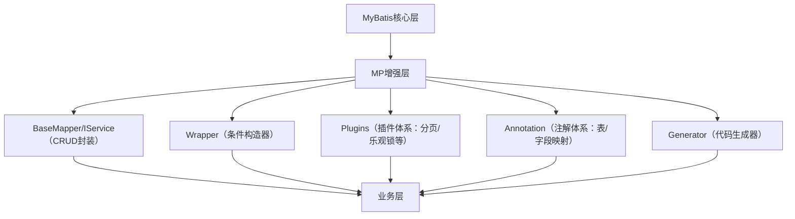
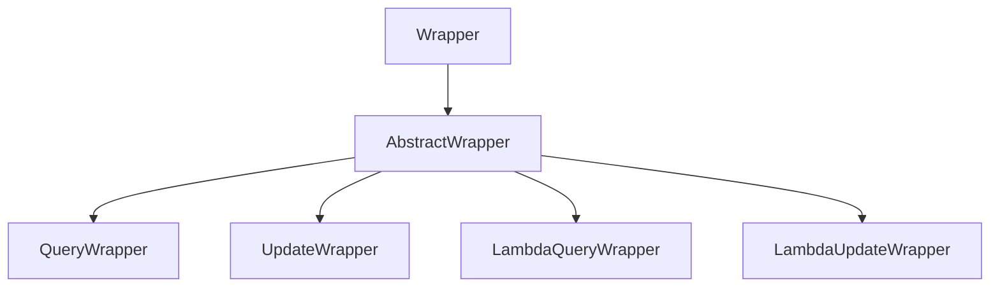

# MyBatis-Plus

## 一、MyBatis-Plus 核心概述

### 1.1 什么是MyBatis-Plus？

MyBatis-Plus是**MyBatis的增强工具**（非替代），由国内团队（苞米豆）开发，遵循「无侵入、低耦合」原则，在MyBatis基础上仅做增强不做改变，核心目标是**简化CRUD操作、提升开发效率**。

### 1.2 核心优势

| 优势 | 具体说明 |
|------|----------|
| 无侵入 | 完全兼容MyBatis，原有代码无需修改，可无缝切换 |
| 免写CRUD | 继承`BaseMapper`/`IService`即可获得全套增删改查方法，无需编写XML/注解SQL |
| 强大的条件构造器 | 支持Lambda表达式，避免硬编码字段名，动态SQL构建更优雅 |
| 丰富的内置功能 | 分页、逻辑删除、自动填充、乐观锁、枚举映射、代码生成器等，覆盖80%+业务场景 |
| 低学习成本 | 熟悉MyBatis后，1小时即可上手，API设计符合直觉 |
| 高性能 | 底层基于MyBatis，无额外性能损耗，支持自定义优化 |
| 易扩展 | 支持自定义插件、自定义SQL、多数据源等高级场景 |

### 1.3 核心架构（组件关系）



### 1.4 版本适配（关键，避免兼容问题）

| MP版本 | 适配SpringBoot版本 | 适配MyBatis版本 | JDK版本 |
|--------|--------------------|-----------------|---------|
| 3.5.5+ | 2.7.x（推荐）/2.6.x | 3.5.9+ | 1.8+ |
| 3.4.x | 2.5.x/2.4.x | 3.5.6+ | 1.8+ |
| 3.3.x | 2.3.x/2.2.x | 3.5.3+ | 1.8+ |
| 3.0.x | 2.0.x/1.5.x | 3.4.6+ | 1.8+ |

> 建议：优先使用`3.5.5`（稳定版）+ SpringBoot `2.7.x`，避免版本兼容问题。

---

## 二、环境搭建（全覆盖）

### 2.1 依赖配置（Maven/Gradle）

#### 2.1.1 SpringBoot整合（推荐）

```xml
<!-- SpringBoot父工程 -->
<parent>
    <groupId>org.springframework.boot</groupId>
    <artifactId>spring-boot-starter-parent</artifactId>
    <version>2.7.18</version>
</parent>

<dependencies>
    <!-- MP核心依赖（自动引入MyBatis+MyBatis-Spring） -->
    <dependency>
        <groupId>com.baomidou</groupId>
        <artifactId>mybatis-plus-boot-starter</artifactId>
        <version>3.5.5</version>
    </dependency>

    <!-- MySQL驱动 -->
    <dependency>
        <groupId>mysql</groupId>
        <artifactId>mysql-connector-java</artifactId>
        <scope>runtime</scope>
    </dependency>

    <!-- Lombok（可选，简化实体类） -->
    <dependency>
        <groupId>org.projectlombok</groupId>
        <artifactId>lombok</artifactId>
        <optional>true</optional>
    </dependency>

    <!-- SpringBoot测试 -->
    <dependency>
        <groupId>org.springframework.boot</groupId>
        <artifactId>spring-boot-starter-test</artifactId>
        <scope>test</scope>
    </dependency>
</dependencies>
```

#### 2.1.2 纯Spring整合（非Boot）

```xml
<!-- MP核心依赖 -->
<dependency>
    <groupId>com.baomidou</groupId>
    <artifactId>mybatis-plus</artifactId>
    <version>3.5.5</version>
</dependency>

<!-- MyBatis-Spring -->
<dependency>
    <groupId>org.mybatis</groupId>
    <artifactId>mybatis-spring</artifactId>
    <version>2.0.7</version>
</dependency>

<!-- Spring核心 -->
<dependency>
    <groupId>org.springframework</groupId>
    <artifactId>spring-context</artifactId>
    <version>5.3.30</version>
</dependency>

<!-- 数据源（如Druid） -->
<dependency>
    <groupId>com.alibaba</groupId>
    <artifactId>druid</artifactId>
    <version>1.2.20</version>
</dependency>
```

#### 2.1.3 Gradle依赖

```groovy
dependencies {
    implementation 'com.baomidou:mybatis-plus-boot-starter:3.5.5'
    runtimeOnly 'mysql:mysql-connector-java:8.0.33'
    compileOnly 'org.projectlombok:lombok:1.18.30'
    annotationProcessor 'org.projectlombok:lombok:1.18.30'
    testImplementation 'org.springframework.boot:spring-boot-starter-test:2.7.18'
}
```

### 2.2 核心配置（application.yml 全详解）

```yaml
# 服务器配置
server:
  port: 8080

# 数据源配置（默认HikariCP，也可配置Druid）
spring:
  datasource:
    # 数据库连接URL（MySQL8.0+需指定serverTimezone）
    url: jdbc:mysql://localhost:3306/test_db?useSSL=false&serverTimezone=UTC&characterEncoding=utf8&allowPublicKeyRetrieval=true
    username: root
    password: 123456
    driver-class-name: com.mysql.cj.jdbc.Driver
    # 若使用Druid，需指定类型
    # type: com.alibaba.druid.pool.DruidDataSource

# MyBatis-Plus 核心配置（全量）
mybatis-plus:
  # 1. Mapper XML文件路径（自定义SQL时需要）
  mapper-locations: classpath:mapper/**/*.xml
  # 2. 实体类别名包（简化XML中resultType写法）
  type-aliases-package: com.example.pojo
  # 3. 类型处理器包（自定义TypeHandler时配置）
  type-handlers-package: com.example.handler
  # 4. 全局配置（核心）
  global-config:
    # 是否开启Banner（启动时打印MP标识）
    banner: false
    # 数据库配置
    db-config:
      # 主键生成策略（全局默认）
      # AUTO：数据库自增；NONE：手动输入；ASSIGN_ID：雪花算法；ASSIGN_UUID：UUID
      id-type: AUTO
      # 表前缀（若所有表都有前缀，如t_user，可配置table-prefix: t_）
      table-prefix: ""
      # 逻辑删除配置
      logic-delete-field: isDeleted # 逻辑删除字段名（实体类字段）
      logic-delete-value: 1 # 已删除值
      logic-not-delete-value: 0 # 未删除值
      # 更新策略：字段为null时是否更新（默认IGNORED：忽略；NOT_NULL：不更新null；NOT_EMPTY：不更新空字符串）
      update-strategy: NOT_NULL
      # 插入策略：同上
      insert-strategy: NOT_NULL
      # 查询策略：字段为null时是否参与查询（默认IGNORED）
      select-strategy: IGNORED
  # 5. MyBatis原生配置（覆盖MyBatis默认配置）
  configuration:
    # 是否开启驼峰命名自动映射（默认true，如user_name → userName）
    map-underscore-to-camel-case: true
    # 是否开启二级缓存（默认false，按需开启）
    cache-enabled: false
    # SQL日志实现（打印SQL，调试用）
    log-impl: org.apache.ibatis.logging.stdout.StdOutImpl
    # 参数映射时是否忽略未知列（避免控制台警告）
    unknown-column-behavior: IGNORE
    # 设置超时时间（单位：秒）
    default-statement-timeout: 30
```

### 2.3 启动类配置

```java
package com.example;

import org.mybatis.spring.annotation.MapperScan;
import org.springframework.boot.SpringApplication;
import org.springframework.boot.autoconfigure.SpringBootApplication;

@SpringBootApplication
// 扫描Mapper接口包（必须配置，否则Mapper无法被Spring管理）
@MapperScan("com.example.mapper")
public class MpDemoApplication {
    public static void main(String[] args) {
        SpringApplication.run(MpDemoApplication.class, args);
    }
}
```

---

## 三、核心注解详解（全量）

MP通过注解实现「实体类 ↔ 数据库表」的映射，以下是所有核心注解的详细说明：

### 3.1 表映射注解：@TableName

| 参数 | 类型 | 作用 | 示例 |
|------|------|------|------|
| value | String | 指定数据库表名 | `@TableName("t_user")`（实体类User → 表t_user） |
| schema | String | 指定数据库schema（多租户/多schema场景） | `@TableName(schema = "test", value = "user")` |
| keepGlobalPrefix | boolean | 是否保留全局表前缀（配合global-config的table-prefix） | `@TableName(value = "user", keepGlobalPrefix = true)`（全局prefix=t_→ 表t_user） |
| autoResultMap | boolean | 是否自动生成ResultMap（解决复杂字段映射） | `@TableName(autoResultMap = true)` |
| excludeProperty | String[] | 排除实体类中不对应表字段的属性 | `@TableName(excludeProperty = {"tempField"})` |

### 3.2 主键注解：@TableId

| 参数 | 类型 | 作用 | 示例 |
|------|------|------|------|
| value | String | 指定数据库主键列名（若实体类字段与列名不一致） | `@TableId(value = "user_id")`（实体类id → 列user_id） |
| type | IdType | 主键生成策略（优先级高于全局配置） | `@TableId(type = IdType.ASSIGN_ID)` |

#### IdType 枚举值详解

| 枚举值 | 作用 | 适用场景 |
|--------|------|----------|
| AUTO | 数据库自增 | 主键为INT/BIGINT，且数据库设置自增 |
| NONE | 无策略，手动输入 | 主键为自定义字符串/数字 |
| ASSIGN_ID | 雪花算法生成Long型ID | 分布式系统，主键为BIGINT |
| ASSIGN_UUID | 生成UUID（去掉横线） | 主键为VARCHAR，分布式系统 |
| INPUT | 手动输入（同NONE） | 兼容旧版本 |
| ID_WORKER | 已废弃（同ASSIGN_ID） | - |
| UUID | 已废弃（同ASSIGN_UUID） | - |

### 3.3 字段注解：@TableField

| 参数 | 类型 | 作用 | 示例 |
|------|------|------|------|
| value | String | 指定数据库列名 | `@TableField("user_name")`（实体类userName → 列user_name） |
| exist | boolean | 是否为数据库表字段（默认true） | `@TableField(exist = false)`（实体类临时字段，不映射） |
| fill | FieldFill | 自动填充策略 | `@TableField(fill = FieldFill.INSERT)`（插入时自动填充） |
| select | boolean | 是否参与查询（默认true） | `@TableField(select = false)`（查询时忽略该字段） |
| update | String | 更新条件（自定义更新SQL） | `@TableField(update = "age = age + 1")`（更新时自增） |
| insertStrategy | FieldStrategy | 插入策略 | `@TableField(insertStrategy = FieldStrategy.NOT_NULL)` |
| updateStrategy | FieldStrategy | 更新策略 | `@TableField(updateStrategy = FieldStrategy.NOT_EMPTY)` |
| selectStrategy | FieldStrategy | 查询策略 | `@TableField(selectStrategy = FieldStrategy.IGNORED)` |

#### FieldFill 枚举值

| 枚举值 | 作用 |
|--------|------|
| DEFAULT | 默认不填充 |
| INSERT | 插入时填充 |
| UPDATE | 更新时填充 |
| INSERT_UPDATE | 插入+更新时填充 |

#### FieldStrategy 枚举值

| 枚举值 | 作用 |
|--------|------|
| IGNORED | 忽略null/空字符串，始终参与操作 |
| NOT_NULL | 字段为null时不参与操作 |
| NOT_EMPTY | 字段为null/空字符串时不参与操作（仅对字符串有效） |
| NEVER | 永远不参与操作 |

### 3.4 逻辑删除注解：@TableLogic

| 参数 | 类型 | 作用 | 示例 |
|------|------|------|------|
| value | String | 未删除值（默认0） | `@TableLogic(value = "0")` |
| delval | String | 已删除值（默认1） | `@TableLogic(delval = "1")` |

> 注：`@TableLogic`优先级高于全局逻辑删除配置。

### 3.5 乐观锁注解：@Version

用于乐观锁控制，标记字段为版本号列，示例：

```java
@Version
private Integer version; // 版本号字段，每次更新自动+1
```

### 3.6 枚举映射注解：@EnumValue

标记枚举类中对应数据库值的属性，示例：

```java
public enum SexEnum {
    MALE(1, "男"),
    FEMALE(2, "女");

    @EnumValue // 标记数据库存储的数值
    private final int code;
    private final String desc;

    // 构造器+getter
}
```

### 3.7 其他注解

| 注解 | 作用 | 示例 |
|------|------|------|
| @SqlParser | 控制SQL解析（多租户场景） | `@SqlParser(filter = true)`（过滤解析） |
| @KeySequence | 主键序列（Oracle） | `@KeySequence("SEQ_USER")` |

---

## 四、核心组件详解

### 4.1 BaseMapper（DAO层核心）

`BaseMapper<T>`是MP的核心接口，封装了单表所有CRUD操作，泛型`T`为实体类。以下是**所有方法的详细说明**：

| 方法 | 返回值 | 作用 | 参数说明 |
|------|--------|------|----------|
| `insert(T entity)` | int | 新增一条记录 | entity：新增实体 |
| `deleteById(Serializable id)` | int | 根据主键删除 | id：主键值 |
| `deleteByMap(Map<String, Object> map)` | int | 根据Map条件删除 | map：key=列名，value=值 |
| `delete(Wrapper<T> wrapper)` | int | 根据Wrapper条件删除 | wrapper：条件构造器 |
| `deleteBatchIds(Collection<? extends Serializable> idList)` | int | 批量删除 | idList：主键集合 |
| `updateById(T entity)` | int | 根据主键更新 | entity：更新实体（需含主键） |
| `update(T entity, Wrapper<T> wrapper)` | int | 根据Wrapper条件更新 | entity：更新字段；wrapper：更新条件 |
| `selectById(Serializable id)` | T | 根据主键查询 | id：主键值 |
| `selectBatchIds(Collection<? extends Serializable> idList)` | List<T> | 批量查询 | idList：主键集合 |
| `selectByMap(Map<String, Object> map)` | List<T> | 根据Map条件查询 | map：key=列名，value=值 |
| `selectOne(Wrapper<T> wrapper)` | T | 根据Wrapper查询单条 | 若结果多条，抛异常 |
| `selectCount(Wrapper<T> wrapper)` | Long | 根据Wrapper查询总数 | wrapper：条件构造器 |
| `selectList(Wrapper<T> wrapper)` | List<T> | 根据Wrapper查询列表 | wrapper：条件构造器（null=查询所有） |
| `selectPage(Page<T> page, Wrapper<T> wrapper)` | Page<T> | 分页查询 | page：分页对象；wrapper：条件 |
| `selectMaps(Page<T> page, Wrapper<T> wrapper)` | List<Map<String, Object>> | 分页查询（返回Map） | 字段名=列名，值=字段值 |
| `selectObjs(Wrapper<T> wrapper)` | List<Object> | 查询指定字段（默认主键） | wrapper：指定select字段 |

#### BaseMapper 使用示例

```java
// DAO层接口
public interface UserMapper extends BaseMapper<User> {
    // 无需编写任何方法，直接继承BaseMapper即可
}

// 测试类
@SpringBootTest
public class BaseMapperTest {
    @Autowired
    private UserMapper userMapper;

    // 新增
    @Test
    public void testInsert() {
        User user = new User();
        user.setUserName("张三");
        user.setAge(20);
        int rows = userMapper.insert(user);
        System.out.println("新增行数：" + rows + "，主键：" + user.getId());
    }

    // 批量删除
    @Test
    public void testDeleteBatchIds() {
        List<Integer> ids = Arrays.asList(1,2,3);
        int rows = userMapper.deleteBatchIds(ids);
        System.out.println("删除行数：" + rows);
    }

    // 条件更新
    @Test
    public void testUpdate() {
        User user = new User();
        user.setAge(21); // 更新字段
        LambdaUpdateWrapper<User> wrapper = new LambdaUpdateWrapper<>();
        wrapper.eq(User::getUserName, "张三"); // 更新条件
        int rows = userMapper.update(user, wrapper);
        System.out.println("更新行数：" + rows);
    }
}
```

### 4.2 IService & ServiceImpl（服务层核心）

`IService`是MP对服务层的封装，提供了更丰富的CRUD操作（如批量操作、链式调用），需配合`ServiceImpl<M extends BaseMapper<T>, T>`使用。

#### 4.2.1 核心优势

- 封装批量操作（`saveBatch`/`updateBatch`）；
- 提供链式调用（`lambdaQuery`/`lambdaUpdate`）；
- 封装分页查询（`page`）；
- 提供更多便捷方法（`getOne`/`listByIds`/`count`等）。

#### 4.2.2 定义Service

```java
// 接口
public interface UserService extends IService<User> {
    // 自定义业务方法
}

// 实现类
@Service
public class UserServiceImpl extends ServiceImpl<UserMapper, User> implements UserService {
    // 自定义业务方法实现
}
```

#### 4.2.3 IService 核心方法（部分）

| 方法 | 返回值 | 作用 |
|------|--------|------|
| `save(T entity)` | boolean | 新增 |
| `saveBatch(Collection<T> entityList)` | boolean | 批量新增（默认批次1000） |
| `saveBatch(Collection<T> entityList, int batchSize)` | boolean | 批量新增（指定批次） |
| `removeById(Serializable id)` | boolean | 根据主键删除 |
| `removeBatchByIds(Collection<? extends Serializable> idList)` | boolean | 批量删除 |
| `remove(Wrapper<T> wrapper)` | boolean | 条件删除 |
| `updateById(T entity)` | boolean | 根据主键更新 |
| `updateBatchById(Collection<T> entityList)` | boolean | 批量更新 |
| `update(T entity, Wrapper<T> wrapper)` | boolean | 条件更新 |
| `getById(Serializable id)` | T | 根据主键查询 |
| `listByIds(Collection<? extends Serializable> idList)` | List<T> | 批量查询 |
| `list(Wrapper<T> wrapper)` | List<T> | 条件查询 |
| `page(Page<T> page, Wrapper<T> wrapper)` | Page<T> | 分页查询 |
| `count(Wrapper<T> wrapper)` | long | 条件计数 |
| `lambdaQuery()` | LambdaQueryChainWrapper<T> | 链式查询 |
| `lambdaUpdate()` | LambdaUpdateChainWrapper<T> | 链式更新 |

#### 4.2.4 IService 使用示例

```java
@SpringBootTest
public class IServiceTest {
    @Autowired
    private UserService userService;

    // 批量新增
    @Test
    public void testSaveBatch() {
        List<User> userList = new ArrayList<>();
        userList.add(new User(null, "李四", 22, "lisi@test.com"));
        userList.add(new User(null, "王五", 25, "wangwu@test.com"));
        boolean success = userService.saveBatch(userList, 2); // 批次大小2
        System.out.println("批量新增是否成功：" + success);
    }

    // 链式查询
    @Test
    public void testLambdaQuery() {
        List<User> userList = userService.lambdaQuery()
                .gt(User::getAge, 20) // 年龄>20
                .like(User::getUserName, "李") // 用户名含“李”
                .orderByDesc(User::getId)
                .list();
        userList.forEach(System.out::println);
    }

    // 链式更新
    @Test
    public void testLambdaUpdate() {
        boolean success = userService.lambdaUpdate()
                .eq(User::getId, 1)
                .set(User::getAge, 23)
                .update();
        System.out.println("更新是否成功：" + success);
    }
}
```

### 4.3 条件构造器（Wrapper 体系）

Wrapper是MP构建动态SQL的核心，分为**查询构造器**和**更新构造器**，推荐使用Lambda版本（类型安全，避免硬编码字段名）。

#### 4.3.1 Wrapper 体系结构



#### 4.3.2 核心方法（LambdaQueryWrapper 为例）

| 方法 | 作用 | 示例 |
|------|------|------|
| `eq(R column, Object val)` | 等于 | `eq(User::getAge, 20)` |
| `ne(R column, Object val)` | 不等于 | `ne(User::getAge, 20)` |
| `gt(R column, Object val)` | 大于 | `gt(User::getAge, 20)` |
| `ge(R column, Object val)` | 大于等于 | `ge(User::getAge, 20)` |
| `lt(R column, Object val)` | 小于 | `lt(User::getAge, 20)` |
| `le(R column, Object val)` | 小于等于 | `le(User::getAge, 20)` |
| `like(R column, Object val)` | 模糊查询（%val%） | `like(User::getUserName, "张")` |
| `likeLeft(R column, Object val)` | 左模糊（%val） | `likeLeft(User::getUserName, "张")` |
| `likeRight(R column, Object val)` | 右模糊（val%） | `likeRight(User::getUserName, "张")` |
| `isNull(R column)` | 字段为null | `isNull(User::getEmail)` |
| `isNotNull(R column)` | 字段不为null | `isNotNull(User::getEmail)` |
| `in(R column, Collection<?> coll)` | IN查询 | `in(User::getId, Arrays.asList(1,2,3))` |
| `notIn(R column, Collection<?> coll)` | NOT IN查询 | `notIn(User::getId, Arrays.asList(1,2,3))` |
| `between(R column, Object val1, Object val2)` | 区间查询 | `between(User::getAge, 20, 30)` |
| `notBetween(R column, Object val1, Object val2)` | 非区间查询 | `notBetween(User::getAge, 20, 30)` |
| `orderByAsc(R... columns)` | 升序排序 | `orderByAsc(User::getAge, User::getId)` |
| `orderByDesc(R... columns)` | 降序排序 | `orderByDesc(User::getAge)` |
| `groupBy(R... columns)` | 分组 | `groupBy(User::getAge)` |
| `having(String sqlHaving, Object... params)` | 分组筛选 | `having("COUNT(*) > ?", 1)` |
| `or()` | 或条件 | `eq(User::getAge,20).or().eq(User::getName,"张三")` |
| `and()` | 与条件 | `eq(User::getAge,20).and().eq(User::getName,"张三")` |
| `nested(Consumer<LambdaQueryWrapper<T>> consumer)` | 嵌套条件 | `nested(w -> w.eq(User::getAge,20).or().eq(User::getName,"张三"))` |
| `select(R... columns)` | 指定查询字段 | `select(User::getId, User::getUserName)` |

#### 4.3.3 Wrapper 高级用法（嵌套条件）

```java
@Test
public void testNestedWrapper() {
    LambdaQueryWrapper<User> wrapper = new LambdaQueryWrapper<>();
    // 条件：(年龄>20 且 用户名含“张”) 或 (邮箱不为null)
    wrapper.nested(w -> w.gt(User::getAge, 20).like(User::getUserName, "张"))
           .or()
           .isNotNull(User::getEmail);
    List<User> userList = userMapper.selectList(wrapper);
    userList.forEach(System.out::println);
}
```

### 4.4 分页插件（全配置）

MP的分页插件是高频使用的功能，支持多种数据库（MySQL/Oracle/PostgreSQL等）。

#### 4.4.1 分页插件配置（核心）

```java
@Configuration
public class MyBatisPlusConfig {
    /**
     * 分页插件 + 其他插件（如乐观锁）
     */
    @Bean
    public MybatisPlusInterceptor mybatisPlusInterceptor() {
        MybatisPlusInterceptor interceptor = new MybatisPlusInterceptor();
        
        // 1. 分页插件
        PaginationInnerInterceptor paginationInterceptor = new PaginationInnerInterceptor();
        // 设置数据库类型（必填）
        paginationInterceptor.setDbType(DbType.MYSQL);
        // 分页合理化：页码<=0时查第1页，页码>总页数时查最后一页
        paginationInterceptor.setReasonable(true);
        // 溢出处理：默认NONE（抛出异常），可选PAGE（查最后一页）/IGNORE（返回空）
        paginationInterceptor.setOverflow(PaginationInnerInterceptor.Overflow.PAGE);
        // 设置最大单页限制（默认500条，-1无限制）
        paginationInterceptor.setMaxLimit(1000L);
        interceptor.addInnerInterceptor(paginationInterceptor);
        
        // 2. 乐观锁插件（可选）
        OptimisticLockerInnerInterceptor optimisticLockerInterceptor = new OptimisticLockerInnerInterceptor();
        interceptor.addInnerInterceptor(optimisticLockerInterceptor);
        
        return interceptor;
    }
}
```

#### 4.4.2 分页查询示例

```java
@Test
public void testPage() {
    // 1. 构建分页对象：第1页，每页2条
    Page<User> page = new Page<>(1, 2);
    
    // 2. 构建查询条件
    LambdaQueryWrapper<User> wrapper = new LambdaQueryWrapper<>();
    wrapper.gt(User::getAge, 20);
    
    // 3. 执行分页查询（BaseMapper）
    Page<User> userPage = userMapper.selectPage(page, wrapper);
    
    // 4. 获取分页结果
    System.out.println("总记录数：" + userPage.getTotal());
    System.out.println("总页数：" + userPage.getPages());
    System.out.println("当前页：" + userPage.getCurrent());
    System.out.println("每页条数：" + userPage.getSize());
    System.out.println("是否有下一页：" + userPage.hasNext());
    System.out.println("是否有上一页：" + userPage.hasPrevious());
    System.out.println("当前页数据：");
    userPage.getRecords().forEach(System.out::println);
}
```

#### 4.4.3 自定义SQL分页

若需自定义SQL实现分页，需在Mapper接口中接收`Page<T>`参数：

```java
// Mapper接口
public interface UserMapper extends BaseMapper<User> {
    // 自定义分页查询
    Page<User> selectUserPage(Page<User> page, @Param("age") Integer age);
}

// Mapper XML
<select id="selectUserPage" resultType="User">
    SELECT id, user_name, age, email FROM user WHERE age > #{age}
</select>

// 测试
@Test
public void testCustomPage() {
    Page<User> page = new Page<>(1, 2);
    Page<User> userPage = userMapper.selectUserPage(page, 20);
    System.out.println("总记录数：" + userPage.getTotal());
}
```

---

## 五、高级特性全解

### 5.1 逻辑删除（原理+配置+注意事项）

#### 5.1.1 核心原理

逻辑删除并非真正删除数据，而是**更新逻辑删除字段的值**（如`is_deleted=1`），且MP会自动在查询/更新时过滤已删除数据。

#### 5.1.2 配置步骤

1. **数据库添加逻辑删除字段**：

   ```sql
   ALTER TABLE user ADD COLUMN is_deleted TINYINT DEFAULT 0 COMMENT '逻辑删除（0-未删，1-已删）';
   ```

2. **实体类标记@TableLogic**：

   ```java
   @TableLogic // 优先级高于全局配置
   private Integer isDeleted;
   ```

3. **全局配置（可选）**：

   ```yaml
   mybatis-plus:
     global-config:
       db-config:
         logic-delete-field: isDeleted
         logic-delete-value: 1
         logic-not-delete-value: 0
   ```

#### 5.1.3 注意事项

- 逻辑删除仅对MP的自动CRUD生效，自定义SQL需手动添加`AND is_deleted=0`；
- 恢复已删除数据需手动更新`is_deleted=0`；
- 若需物理删除，可自定义方法或关闭逻辑删除。

### 5.2 自动填充（MetaObjectHandler）

用于自动填充`create_time`、`update_time`、`create_by`等公共字段，无需手动设置。

#### 5.2.1 实现步骤

1. **实体类标记填充字段**：

   ```java
   @TableField(fill = FieldFill.INSERT) // 插入时填充
   private LocalDateTime createTime;

   @TableField(fill = FieldFill.INSERT_UPDATE) // 插入+更新时填充
   private LocalDateTime updateTime;
   ```

2. **实现MetaObjectHandler接口**：

   ```java
   @Component // 必须交给Spring管理
   public class MyMetaObjectHandler implements MetaObjectHandler {
       /**
        * 插入时自动填充
        */
       @Override
       public void insertFill(MetaObject metaObject) {
           // 严格填充（推荐）：仅填充实体类中标记的字段
           this.strictInsertFill(metaObject, "createTime", LocalDateTime.class, LocalDateTime.now());
           this.strictInsertFill(metaObject, "updateTime", LocalDateTime.class, LocalDateTime.now());
           
           // 非严格填充：可填充未标记的字段（不推荐）
           // this.fillStrategy(metaObject, "createTime", LocalDateTime.now());
       }

       /**
        * 更新时自动填充
        */
       @Override
       public void updateFill(MetaObject metaObject) {
           this.strictUpdateFill(metaObject, "updateTime", LocalDateTime.class, LocalDateTime.now());
       }
   }
   ```

#### 5.2.2 注意事项

- `MetaObjectHandler`必须加`@Component`，否则不生效；
- 严格填充（`strictInsertFill`/`strictUpdateFill`）仅填充实体类中标记`@TableField(fill)`的字段，更安全；
- 若手动设置了填充字段的值，自动填充会被覆盖。

### 5.3 乐观锁（OptimisticLocker）

用于解决并发更新冲突，核心原理是「版本号控制」：更新时对比版本号，仅当版本号匹配时才更新，且版本号自动+1。

#### 5.3.1 实现步骤

1. **数据库添加版本号字段**：

   ```sql
   ALTER TABLE user ADD COLUMN version INT DEFAULT 1 COMMENT '乐观锁版本号';
   ```

2. **实体类标记@Version**：

   ```java
   @Version
   private Integer version;
   ```

3. **配置乐观锁插件**（见4.4.1节）；
4. **使用示例**：

   ```java
   @Test
   public void testOptimisticLocker() {
       // 1. 查询用户（获取版本号）
       User user = userMapper.selectById(1);
       System.out.println("当前版本号：" + user.getVersion()); // 1

       // 2. 更新用户（版本号自动+1）
       user.setAge(24);
       int rows = userMapper.updateById(user);
       System.out.println("更新行数：" + rows); // 1

       // 3. 再次查询（版本号已更新）
       User user2 = userMapper.selectById(1);
       System.out.println("更新后版本号：" + user2.getVersion()); // 2
   }
   ```

#### 5.3.2 并发冲突示例

```java
@Test
public void testOptimisticLockerConflict() {
    // 线程1查询
    User user1 = userMapper.selectById(1); // version=1
    // 线程2查询
    User user2 = userMapper.selectById(1); // version=1

    // 线程1更新成功（version=1→2）
    user1.setAge(25);
    userMapper.updateById(user1);

    // 线程2更新失败（version=1≠2）
    user2.setAge(26);
    int rows = userMapper.updateById(user2);
    System.out.println("线程2更新行数：" + rows); // 0
}
```

#### 5.3.3 注意事项

- 乐观锁仅对`updateById`/`update`（条件更新）生效；
- 若更新时未查询版本号（如直接new User()设置ID和版本号），乐观锁不生效；
- 乐观锁适合「读多写少」的场景，「写多读少」建议用悲观锁。

### 5.4 枚举映射

MP支持将枚举类型映射到数据库字段，避免硬编码枚举值。

#### 5.4.1 实现步骤

1. **定义枚举类并标记@EnumValue**：

   ```java
   public enum StatusEnum {
       ENABLE(1, "启用"),
       DISABLE(0, "禁用");

       @EnumValue // 标记数据库存储的数值
       private final int code;
       private final String desc;

       StatusEnum(int code, String desc) {
           this.code = code;
           this.desc = desc;
       }

       // getter
       public int getCode() {
           return code;
       }

       public String getDesc() {
           return desc;
       }
   }
   ```

2. **实体类使用枚举字段**：

   ```java
   private StatusEnum status; // 数据库字段为int类型
   ```

3. **全局配置枚举扫描（可选）**：

   ```yaml
   mybatis-plus:
     type-enums-package: com.example.enums # 枚举类所在包
   ```

4. **使用示例**：

   ```java
   @Test
   public void testEnum() {
       User user = new User();
       user.setUserName("赵六");
       user.setAge(28);
       user.setStatus(StatusEnum.ENABLE); // 设置枚举值
       userMapper.insert(user);

       // 查询
       User user2 = userMapper.selectById(user.getId());
       System.out.println("状态：" + user2.getStatus().getDesc()); // 启用
   }
   ```

### 5.5 代码生成器（AutoGenerator/FastAutoGenerator）

MP提供代码生成器，可自动生成实体类、Mapper、Service、Controller等代码，大幅提升开发效率（新版推荐`FastAutoGenerator`）。

#### 5.5.1 引入依赖

```xml
<!-- 代码生成器 -->
<dependency>
    <groupId>com.baomidou</groupId>
    <artifactId>mybatis-plus-generator</artifactId>
    <version>3.5.5</version>
</dependency>

<!-- 模板引擎（Freemarker） -->
<dependency>
    <groupId>org.freemarker</groupId>
    <artifactId>freemarker</artifactId>
    <version>2.3.32</version>
</dependency>
```

#### 5.5.2 生成代码示例（FastAutoGenerator）

```java
public class CodeGenerator {
    public static void main(String[] args) {
        // 数据库连接配置
        String url = "jdbc:mysql://localhost:3306/test_db?useSSL=false&serverTimezone=UTC";
        String username = "root";
        String password = "123456";

        // 代码生成器
        FastAutoGenerator.create(url, username, password)
                // 全局配置
                .globalConfig(builder -> {
                    builder.author("test") // 设置作者
                            .outputDir(System.getProperty("user.dir") + "/src/main/java") // 输出目录
                            .enableSwagger() // 启用Swagger（需引入swagger依赖）
                            .commentDate("yyyy-MM-dd") // 注释日期格式
                            .disableOpenDir(); // 生成后不打开目录
                })
                // 包配置
                .packageConfig(builder -> {
                    builder.parent("com.example") // 父包名
                            .moduleName("mp") // 模块名
                            .entity("pojo") // 实体类包名
                            .mapper("mapper") // Mapper包名
                            .service("service") // Service包名
                            .controller("controller"); // Controller包名
                })
                // 策略配置
                .strategyConfig(builder -> {
                    builder.addInclude("user") // 生成的表名
                            .addTablePrefix("t_") // 表前缀（生成实体类时去掉）
                            // 实体类策略
                            .entityBuilder()
                            .enableLombok() // 启用Lombok
                            .enableTableFieldAnnotation() // 生成字段注解
                            .idType(IdType.AUTO) // 主键策略
                            // Mapper策略
                            .mapperBuilder()
                            .enableBaseResultMap() // 生成BaseResultMap
                            .enableBaseColumnList() // 生成BaseColumnList
                            // Service策略
                            .serviceBuilder()
                            .formatServiceFileName("%sService") // Service名称格式
                            .formatServiceImplFileName("%sServiceImpl")
                            // Controller策略
                            .controllerBuilder()
                            .enableRestStyle() // 启用RestController
                            .enableHyphenStyle(); // URL中驼峰转连字符
                })
                // 模板引擎（Freemarker）
                .templateEngine(new FreemarkerTemplateEngine())
                // 执行生成
                .execute();
    }
}
```

### 5.6 多数据源（dynamic-datasource）

MP结合`dynamic-datasource-spring-boot-starter`可实现多数据源、读写分离。

#### 5.6.1 引入依赖

```xml
<dependency>
    <groupId>com.baomidou</groupId>
    <artifactId>dynamic-datasource-spring-boot-starter</artifactId>
    <version>3.6.1</version>
</dependency>
```

#### 5.6.2 配置多数据源

```yaml
spring:
  datasource:
    dynamic:
      primary: master # 默认数据源
      strict: false # 关闭严格模式
      datasource:
        # 主库
        master:
          url: jdbc:mysql://localhost:3306/test_db_master?useSSL=false&serverTimezone=UTC
          username: root
          password: 123456
          driver-class-name: com.mysql.cj.jdbc.Driver
        # 从库
        slave:
          url: jdbc:mysql://localhost:3306/test_db_slave?useSSL=false&serverTimezone=UTC
          username: root
          password: 123456
          driver-class-name: com.mysql.cj.jdbc.Driver
```

#### 5.6.3 使用多数据源

```java
@Service
public class UserServiceImpl extends ServiceImpl<UserMapper, User> implements UserService {
    // 使用主库（默认）
    @Override
    public User getMasterUser(Integer id) {
        return getById(id);
    }

    // 使用从库
    @DS("slave") // 注解指定数据源
    @Override
    public User getSlaveUser(Integer id) {
        return getById(id);
    }
}
```

---

## 六、自定义扩展

### 6.1 自定义SQL（注解/XML）

MP完全兼容MyBatis的自定义SQL，支持注解和XML两种方式。

#### 6.1.1 注解方式（简单SQL）

```java
public interface UserMapper extends BaseMapper<User> {
    // 注解自定义SQL
    @Select("SELECT id, user_name, age FROM user WHERE age > #{age}")
    List<User> selectByAge(@Param("age") Integer age);
}
```

#### 6.1.2 XML方式（复杂SQL）

1. **Mapper接口**：

   ```java
   public interface UserMapper extends BaseMapper<User> {
       // 自定义分页查询
       Page<User> selectUserByCondition(Page<User> page, @Param("condition") String condition);
   }
   ```

2. **Mapper XML（resources/mapper/UserMapper.xml）**：

   ```xml
   <?xml version="1.0" encoding="UTF-8"?>
   <!DOCTYPE mapper
           PUBLIC "-//mybatis.org//DTD Mapper 3.0//EN"
           "https://mybatis.org/dtd/mybatis-3-mapper.dtd">
   <mapper namespace="com.example.mapper.UserMapper">
       <select id="selectUserByCondition" resultType="User">
           SELECT id, user_name, age, email 
           FROM user 
           WHERE user_name LIKE CONCAT('%', #{condition}, '%')
           AND is_deleted = 0
       </select>
   </mapper>
   ```

#### 6.1.3 结合Wrapper的自定义SQL

```java
public interface UserMapper extends BaseMapper<User> {
    // 自定义SQL + Wrapper条件
    @Select("SELECT id, user_name FROM user ${ew.customSqlSegment}")
    List<User> selectCustom(@Param(Constants.WRAPPER) Wrapper<User> wrapper);
}

// 测试
@Test
public void testCustomWrapper() {
    LambdaQueryWrapper<User> wrapper = new LambdaQueryWrapper<>();
    wrapper.eq(User::getAge, 20);
    List<User> userList = userMapper.selectCustom(wrapper);
}
```

### 6.2 多表查询

MP主打单表操作，多表查询需通过自定义SQL实现，以下是联表查询示例：

```xml
<!-- UserMapper.xml -->
<resultMap id="UserOrderResultMap" type="com.example.pojo.UserOrderVO">
    <id column="id" property="id"/>
    <result column="user_name" property="userName"/>
    <result column="order_id" property="orderId"/>
    <result column="order_name" property="orderName"/>
</resultMap>

<select id="selectUserOrder" resultMap="UserOrderResultMap">
    SELECT u.id, u.user_name, o.id as order_id, o.order_name
    FROM user u
    LEFT JOIN `order` o ON u.id = o.user_id
    WHERE u.id = #{userId}
</select>
```

---

## 七、性能优化

### 7.1 SQL优化

- 避免全表扫描：给查询字段加索引（如`user_name`、`age`）；
- 减少查询字段：使用`select(User::getId, User::getUserName)`指定必要字段；
- 批量操作：使用`saveBatch`/`updateBatchById`代替循环单条操作（减少数据库交互）；
- 分页优化：限制单页最大条数（`setMaxLimit`），避免查询大量数据。

### 7.2 MP配置优化

- 关闭Banner：`mybatis-plus.global-config.banner=false`，减少启动耗时；
- 关闭二级缓存：`mybatis-plus.configuration.cache-enabled=false`，避免缓存不一致；
- 设置SQL超时时间：`mybatis-plus.configuration.default-statement-timeout=30`，避免慢SQL阻塞；
- 开启驼峰映射：默认开启，无需手动配置，减少字段映射错误。

### 7.3 批量操作优化

- `saveBatch`的批次大小建议设置为500-1000（过大易导致数据库锁表，过小增加交互次数）；
- 批量操作时关闭自动填充（若无需），减少性能损耗；
- 批量更新时使用`updateBatchById`，而非循环`updateById`。

---

## 八、常见问题与解决方案

### 8.1 分页查询总记录数为0

- **原因**：未配置分页插件，或插件配置错误；
- **解决方案**：确保配置了`MybatisPlusInterceptor`并添加`PaginationInnerInterceptor`，且指定了正确的`DbType`。

### 8.2 逻辑删除不生效

- **原因**：实体类未加`@TableLogic`，或全局配置错误，或自定义SQL未加过滤条件；
- **解决方案**：检查`@TableLogic`注解和全局配置，自定义SQL手动添加`AND is_deleted=0`。

### 8.3 自动填充不生效

- **原因**：`MetaObjectHandler`未加`@Component`，或填充字段未标记`@TableField(fill)`，或手动设置了字段值；
- **解决方案**：添加`@Component`，检查字段注解，避免手动设置填充字段的值。

### 8.4 乐观锁不生效

- **原因**：未配置乐观锁插件，或实体类未加`@Version`，或更新时未查询版本号；
- **解决方案**：配置乐观锁插件，添加`@Version`注解，更新前先查询获取版本号。

### 8.5 Invalid bound statement (not found)

- **原因**：Mapper XML的`namespace`与接口全类名不一致，或XML文件路径错误，或打包时XML未被复制；
- **解决方案**：
  1. 检查`namespace`是否等于接口全类名；
  2. 在pom.xml中添加资源扫描配置：

     ```xml
     <build>
         <resources>
             <resource>
                 <directory>src/main/resources</directory>
                 <includes>
                     <include>**/*.xml</include>
                     <include>**/*.yml</include>
                 </includes>
             </resource>
         </resources>
     </build>
     ```

### 8.6 枚举映射不生效

- **原因**：枚举类未加`@EnumValue`，或未配置`type-enums-package`，或数据库字段类型与枚举值类型不匹配；
- **解决方案**：添加`@EnumValue`注解，配置枚举扫描包，确保字段类型一致（如枚举值为int，数据库字段为int）。

---

## 总结

1. **核心定位**：MP是MyBatis的增强工具，无侵入、低耦合，核心目标是简化CRUD，覆盖80%+单表业务场景；
2. **核心组件**：`BaseMapper`（DAO层）、`IService`（服务层）、`Wrapper`（条件构造器）、分页插件是高频使用的核心组件；
3. **高级特性**：逻辑删除、自动填充、乐观锁、枚举映射、代码生成器是提升开发效率的关键，需掌握配置和使用细节；
4. **扩展能力**：MP完全兼容MyBatis的自定义SQL，多表查询/复杂SQL需通过XML/注解实现；
5. **性能优化**：批量操作、索引优化、配置调优是提升MP性能的核心手段；
6. **最佳实践**：优先使用Lambda条件构造器（类型安全）、IService（批量操作）、代码生成器（减少重复代码）。

掌握以上内容，可覆盖MP在企业开发中的所有使用场景，从基础CRUD到高级特性，再到性能优化和问题排查，形成完整的知识体系。若需进一步讲解某一特性的深度用法（如多租户、动态表名），可随时告知。
