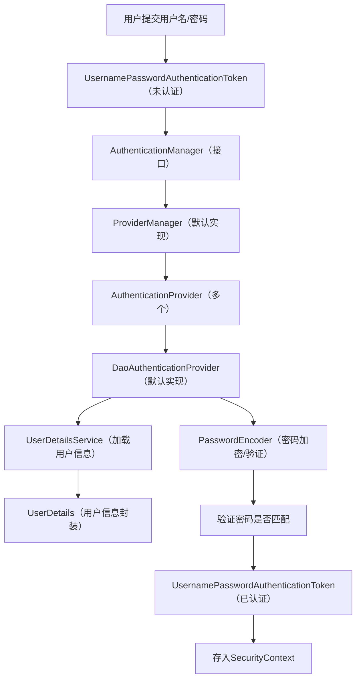

# Spring Security

Spring Security 是 Spring 生态中用于处理**认证（Authentication）** 和**授权（Authorization）** 的核心安全框架，相比 Shiro 等同类框架，它与 Spring 体系深度集成，提供了更丰富的安全特性（如 CSRF 防护、会话管理、OAuth2 支持等），是企业级 Spring 应用的首选安全解决方案。

## 一、核心概念（基础必懂）

先明确 Spring Security 中的核心术语，这是理解后续内容的基础：

| 术语                | 核心含义                                                                 |
|---------------------|--------------------------------------------------------------------------|
| 认证（Authentication） | 验证“你是谁”，比如登录时验证用户名/密码、手机号/验证码是否正确。|
| 授权（Authorization）  | 验证“你能做什么”，比如判断用户是否有权限访问某个接口、操作某个资源。|
| 主体（Principal）| 认证的主体，通常是用户、设备、应用等（在 Spring Security 中一般指 `UserDetails`）。 |
| 权限（Authority）| 细粒度的操作权限，比如 `READ_ORDER`、`WRITE_USER`。|
| 角色（Role）| 权限的集合，比如 `ROLE_ADMIN`（管理员）包含 `READ_ORDER`、`WRITE_USER` 等权限。 |
| 凭证（Credentials）| 认证的凭证，比如密码、验证码、token 等。|
| 安全上下文（SecurityContext） | 存储当前认证用户的信息（`Authentication`），线程绑定，可通过 `SecurityContextHolder` 获取。 |

## 二、核心架构与组件

Spring Security 的核心是**过滤器链（Filter Chain）** + **认证/授权核心组件**，以下是关键组件的详细说明：

### 1. 核心过滤器链（FilterChainProxy）

Spring Security 的所有安全逻辑都通过过滤器链实现，`FilterChainProxy` 是入口，内部包含多个专用过滤器，核心过滤器及作用如下（按执行顺序）：

| 过滤器名称                | 核心作用                                                                 |
|---------------------------|--------------------------------------------------------------------------|
| `WebAsyncManagerIntegrationFilter` | 整合异步请求与 SecurityContext。|
| `SecurityContextPersistenceFilter` | 从会话中加载/保存 SecurityContext（核心：保证每次请求都能获取当前用户）。 |
| `HeaderWriterFilter`      | 向响应头添加安全相关头信息（如 X-Frame-Options、X-XSS-Protection）。|
| `CsrfFilter`              | 防御 CSRF 攻击（默认开启，前后端分离需特殊配置）。|
| `LogoutFilter`            | 处理退出登录请求（默认路径 `/logout`）。|
| `UsernamePasswordAuthenticationFilter` | 处理表单登录请求（默认路径 `/login`，处理用户名/密码认证）。|
| `BasicAuthenticationFilter` | 处理 HTTP Basic 认证（基于请求头 `Authorization: Basic xxx`）。|
| `RequestCacheAwareFilter` | 缓存请求，认证成功后重定向到原请求（比如未登录时访问 `/user`，登录后跳回 `/user`）。 |
| `SecurityContextHolderAwareRequestFilter` | 包装请求，提供 `getRequest().isUserInRole()` 等方法。|
| `AnonymousAuthenticationFilter` | 为未认证用户创建匿名认证对象（默认匿名用户：`anonymousUser`，角色 `ROLE_ANONYMOUS`）。 |
| `SessionManagementFilter` | 管理会话（如会话固定保护、最大并发会话数、会话过期处理）。|
| `ExceptionTranslationFilter` | 捕获认证/授权异常，转换为 HTTP 响应（如 401 未认证、403 未授权）。|
| `FilterSecurityInterceptor` | 核心授权过滤器，判断当前用户是否有权限访问请求的资源（URL/方法）。|

### 2. 认证核心组件

认证流程的核心是 `AuthenticationManager` 及其子组件，负责验证用户凭证：



关键组件详解：

- **Authentication**：表示认证信息的接口，有两个核心实现：
  - `UsernamePasswordAuthenticationToken`：存储用户名/密码的认证对象（未认证/已认证）。
  - `AnonymousAuthenticationToken`：匿名用户的认证对象。
- **AuthenticationManager**：认证的核心接口，唯一方法 `authenticate(Authentication)`，返回**已认证**的 `Authentication`（失败则抛异常）。
- **ProviderManager**：`AuthenticationManager` 的默认实现，内部维护多个 `AuthenticationProvider`，逐个尝试认证（一个成功即返回）。
- **AuthenticationProvider**：具体的认证提供者，核心实现 `DaoAuthenticationProvider`（处理用户名/密码认证）。
- **UserDetailsService**：加载用户信息的接口，核心方法 `loadUserByUsername(String username)`，返回 `UserDetails`（用户信息）。
  - 你需要**自定义实现**这个接口，从数据库/缓存/第三方服务加载用户的用户名、密码、权限等信息。
- **UserDetails**：封装用户核心信息的接口，默认实现 `User`（包含 username、password、authorities 等字段）。
- **PasswordEncoder**：密码加密/验证接口，Spring Security 5+ 强制要求使用（禁止明文密码），核心实现：
  - `BCryptPasswordEncoder`：基于 BCrypt 算法（推荐，自带盐值，不可逆）。
  - `NoOpPasswordEncoder`：明文密码（仅测试用，已标记为过时）。
  - `DelegatingPasswordEncoder`：适配多种加密算法（默认使用，可兼容不同加密方式的密码）。

### 3. 授权核心组件

授权的核心是 `AccessDecisionManager`，负责判断用户是否有权限访问资源：

- **SecurityMetadataSource**：加载资源的权限元数据（比如某个 URL 需要 `ROLE_ADMIN` 权限）。
- **AccessDecisionManager**：授权决策管理器，核心方法 `decide(Authentication, Object, Collection<ConfigAttribute>)`，判断当前用户是否有权限访问资源。
- **ConfigAttribute**：资源的权限属性（比如 `ROLE_ADMIN`、`PERMIT_ALL`）。

## 三、快速上手：基础配置（Spring Boot 集成）

Spring Boot 对 Spring Security 做了自动配置，只需引入依赖即可快速搭建基础认证体系。

### 1. 引入依赖（Maven）

```xml
<!-- Spring Security 核心依赖 -->
<dependency>
    <groupId>org.springframework.boot</groupId>
    <artifactId>spring-boot-starter-security</artifactId>
</dependency>
<!-- Web 依赖（基础） -->
<dependency>
    <groupId>org.springframework.boot</groupId>
    <artifactId>spring-boot-starter-web</artifactId>
</dependency>
```

### 2. 最简配置（默认行为）

引入依赖后，Spring Security 会自动生效，默认行为：

- 所有接口需要认证才能访问。
- 生成默认用户：用户名 `user`，密码随机生成（控制台输出，格式：`Using generated security password: xxxxxxxx-xxxx-xxxx-xxxx-xxxxxxxxxxxx`）。
- 提供默认登录页（`/login`），退出页（`/logout`）。

### 3. 自定义基础配置（配置类）

创建 `SecurityConfig` 类，自定义用户、密码、URL 权限：

```java
import org.springframework.context.annotation.Bean;
import org.springframework.context.annotation.Configuration;
import org.springframework.security.config.annotation.web.builders.HttpSecurity;
import org.springframework.security.config.annotation.web.configuration.EnableWebSecurity;
import org.springframework.security.core.userdetails.User;
import org.springframework.security.core.userdetails.UserDetails;
import org.springframework.security.core.userdetails.UserDetailsService;
import org.springframework.security.crypto.bcrypt.BCryptPasswordEncoder;
import org.springframework.security.crypto.password.PasswordEncoder;
import org.springframework.security.provisioning.InMemoryUserDetailsManager;
import org.springframework.security.web.SecurityFilterChain;

@Configuration
@EnableWebSecurity // 启用 Web 安全配置（Spring Boot 2.7+ 可省略，但显式声明更清晰）
public class SecurityConfig {

    // 1. 配置密码编码器（必须，Spring Security 5+ 强制要求）
    @Bean
    public PasswordEncoder passwordEncoder() {
        return new BCryptPasswordEncoder(); // 推荐使用 BCrypt 加密
    }

    // 2. 配置用户信息（内存版，仅测试用，生产需替换为数据库版）
    @Bean
    public UserDetailsService userDetailsService() {
        // 构建管理员用户（用户名 admin，密码 123456，角色 ADMIN）
        UserDetails admin = User.withUsername("admin")
                .password(passwordEncoder().encode("123456")) // 密码加密
                .roles("ADMIN") // 等价于 authorities("ROLE_ADMIN")
                .build();
        
        // 构建普通用户（用户名 user，密码 123456，角色 USER）
        UserDetails user = User.withUsername("user")
                .password(passwordEncoder().encode("123456"))
                .roles("USER")
                .build();
        
        // 内存用户管理器
        return new InMemoryUserDetailsManager(admin, user);
    }

    // 3. 配置 HTTP 安全规则（URL 权限、登录、退出等）
    @Bean
    public SecurityFilterChain securityFilterChain(HttpSecurity http) throws Exception {
        http
            // 关闭 CSRF（仅测试用，前后端分离需根据场景配置）
            .csrf(csrf -> csrf.disable())
            // 配置 URL 权限规则
            .authorizeHttpRequests(auth -> auth
                // 放行 /public/** 接口（无需认证）
                .requestMatchers("/public/**").permitAll()
                // /admin/** 接口仅 ADMIN 角色可访问
                .requestMatchers("/admin/**").hasRole("ADMIN")
                // /user/** 接口需 USER 或 ADMIN 角色
                .requestMatchers("/user/**").hasAnyRole("USER", "ADMIN")
                // 其他所有接口需认证
                .anyRequest().authenticated()
            )
            // 配置表单登录（默认 /login 接口，POST 提交 username/password）
            .formLogin(form -> form
                // 自定义登录页（若不需要默认页，可配置前后端分离的 JSON 登录）
                .loginPage("/login")
                // 登录成功后的跳转路径（前后端分离可配置 successHandler 返回 JSON）
                .defaultSuccessUrl("/index")
                // 放行登录页（否则会陷入无限认证）
                .permitAll()
            )
            // 配置退出登录（默认 /logout 接口，GET 提交）
            .logout(logout -> logout
                // 退出成功后的跳转路径
                .logoutSuccessUrl("/login?logout")
                // 清除会话
                .invalidateHttpSession(true)
                // 放行退出接口
                .permitAll()
            );
        
        return http.build();
    }
}
```

### 4. 生产级配置：数据库加载用户（MyBatis 示例）

实际项目中，用户信息存储在数据库，需自定义 `UserDetailsService`：

#### （1）数据库表设计（简化版）

```sql
-- 用户表
CREATE TABLE sys_user (
    id BIGINT PRIMARY KEY AUTO_INCREMENT,
    username VARCHAR(50) NOT NULL UNIQUE,
    password VARCHAR(100) NOT NULL, -- 存储加密后的密码
    status TINYINT DEFAULT 1, -- 1：启用，0：禁用
    create_time DATETIME DEFAULT CURRENT_TIMESTAMP
);

-- 角色表
CREATE TABLE sys_role (
    id BIGINT PRIMARY KEY AUTO_INCREMENT,
    role_name VARCHAR(50) NOT NULL, -- 角色名，如 ROLE_ADMIN
    role_desc VARCHAR(100)
);

-- 用户-角色关联表
CREATE TABLE sys_user_role (
    user_id BIGINT NOT NULL,
    role_id BIGINT NOT NULL,
    PRIMARY KEY (user_id, role_id),
    FOREIGN KEY (user_id) REFERENCES sys_user(id),
    FOREIGN KEY (role_id) REFERENCES sys_role(id)
);
```

#### （2）自定义 UserDetailsService 实现

```java
import org.springframework.beans.factory.annotation.Autowired;
import org.springframework.security.core.authority.SimpleGrantedAuthority;
import org.springframework.security.core.userdetails.User;
import org.springframework.security.core.userdetails.UserDetails;
import org.springframework.security.core.userdetails.UserDetailsService;
import org.springframework.security.core.userdetails.UsernameNotFoundException;
import org.springframework.stereotype.Service;

import java.util.List;
import java.util.stream.Collectors;

@Service
public class CustomUserDetailsService implements UserDetailsService {

    @Autowired
    private SysUserMapper sysUserMapper; // MyBatis Mapper

    @Override
    public UserDetails loadUserByUsername(String username) throws UsernameNotFoundException {
        // 1. 根据用户名查询用户
        SysUser sysUser = sysUserMapper.selectByUsername(username);
        if (sysUser == null) {
            throw new UsernameNotFoundException("用户不存在：" + username);
        }

        // 2. 查询用户的角色
        List<String> roles = sysUserMapper.selectRolesByUserId(sysUser.getId());
        // 转换为 GrantedAuthority（Spring Security 要求的权限格式）
        List<SimpleGrantedAuthority> authorities = roles.stream()
                .map(SimpleGrantedAuthority::new)
                .collect(Collectors.toList());

        // 3. 封装为 UserDetails（核心：用户名、密码、权限、是否启用等）
        return User.withUsername(sysUser.getUsername())
                .password(sysUser.getPassword()) // 数据库中已加密的密码
                .authorities(authorities) // 权限/角色
                .accountExpired(false) // 账户未过期
                .accountLocked(false) // 账户未锁定
                .credentialsExpired(false) // 凭证未过期
                .enabled(sysUser.getStatus() == 1) // 账户是否启用
                .build();
    }
}
```

## 四、核心功能详解

### 1. 认证功能

#### （1）表单登录（前后端分离适配）

默认的表单登录是跳转页面，前后端分离需自定义登录成功/失败处理器，返回 JSON：

```java
// 在 SecurityConfig 的 securityFilterChain 中配置
.formLogin(form -> form
    .loginProcessingUrl("/api/login") // 登录接口（POST）
    .usernameParameter("username") // 自定义用户名参数名（默认 username）
    .passwordParameter("password") // 自定义密码参数名（默认 password）
    // 登录成功处理器
    .successHandler((request, response, authentication) -> {
        response.setContentType("application/json;charset=UTF-8");
        // 获取当前用户信息
        UserDetails userDetails = (UserDetails) authentication.getPrincipal();
        // 构造返回结果
        String json = "{\"code\":200,\"msg\":\"登录成功\",\"data\":{\"username\":\"" + userDetails.getUsername() + "\",\"roles\":\"" + userDetails.getAuthorities() + "\"}}";
        response.getWriter().write(json);
    })
    // 登录失败处理器
    .failureHandler((request, response, exception) -> {
        response.setContentType("application/json;charset=UTF-8");
        String msg = "登录失败";
        if (exception instanceof UsernameNotFoundException) {
            msg = "用户不存在";
        } else if (exception instanceof BadCredentialsException) {
            msg = "密码错误";
        }
        String json = "{\"code\":401,\"msg\":\"" + msg + "\"}";
        response.getWriter().write(json);
    })
    .permitAll()
)
```

#### （2）HTTP Basic 认证

适合简单的接口测试/内部系统，基于请求头传递凭证：

```java
// 在 SecurityConfig 的 securityFilterChain 中启用
.httpBasic(basic -> basic
    .authenticationEntryPoint((request, response, authException) -> {
        // 自定义 Basic 认证失败返回 JSON
        response.setContentType("application/json;charset=UTF-8");
        String json = "{\"code\":401,\"msg\":\"请先进行Basic认证\"}";
        response.getWriter().write(json);
    })
)
```

使用方式：请求头添加 `Authorization: Basic base64(用户名:密码)`，比如 `Basic YWRtaW46MTIzNDU2`（对应 admin:123456）。

#### （3）记住我（Remember Me）

实现“记住登录状态”，即使关闭浏览器，下次访问仍无需重新登录：

```java
// 在 SecurityConfig 中添加 Bean
@Bean
public PersistentTokenRepository persistentTokenRepository() {
    // 基于数据库存储记住我令牌（推荐生产使用）
    JdbcTokenRepositoryImpl tokenRepository = new JdbcTokenRepositoryImpl();
    tokenRepository.setDataSource(dataSource); // 注入数据源
    // 首次启动时创建表（仅首次执行，后续注释掉）
    // tokenRepository.setCreateTableOnStartup(true);
    return tokenRepository;
}

// 在 securityFilterChain 中配置
.rememberMe(remember -> remember
    .tokenRepository(persistentTokenRepository()) // 令牌存储
    .tokenValiditySeconds(86400 * 7) // 有效期 7 天
    .userDetailsService(userDetailsService()) // 加载用户信息
)
```

前端登录时需传递参数 `remember-me: true`（默认参数名）。

#### （4）集成 JWT（前后端分离核心）

Spring Security 原生不支持 JWT，需结合 `jjwt` 库实现，核心步骤：

1. 引入 JWT 依赖：

```xml
<dependency>
    <groupId>io.jsonwebtoken</groupId>
    <artifactId>jjwt-api</artifactId>
    <version>0.11.5</version>
</dependency>
<dependency>
    <groupId>io.jsonwebtoken</groupId>
    <artifactId>jjwt-impl</artifactId>
    <version>0.11.5</version>
    <scope>runtime</scope>
</dependency>
<dependency>
    <groupId>io.jsonwebtoken</groupId>
    <artifactId>jjwt-jackson</artifactId>
    <version>0.11.5</version>
    <scope>runtime</scope>
</dependency>
```

2. 编写 JWT 工具类（生成、解析、验证 token）：

```java
import io.jsonwebtoken.*;
import org.springframework.beans.factory.annotation.Value;
import org.springframework.security.core.userdetails.UserDetails;
import org.springframework.stereotype.Component;

import java.util.Date;
import java.util.HashMap;
import java.util.Map;
import java.util.function.Function;

@Component
public class JwtUtil {

    @Value("${jwt.secret}")
    private String secret; // 密钥（生产需配置在配置文件，且足够复杂）

    @Value("${jwt.expiration}")
    private long expiration; // 过期时间（毫秒，如 3600000 = 1 小时）

    // 从 token 中提取用户名
    public String extractUsername(String token) {
        return extractClaim(token, Claims::getSubject);
    }

    // 提取自定义声明
    public <T> T extractClaim(String token, Function<Claims, T> claimsResolver) {
        final Claims claims = extractAllClaims(token);
        return claimsResolver.apply(claims);
    }

    // 解析 token 获取所有声明
    private Claims extractAllClaims(String token) {
        return Jwts.parserBuilder()
                .setSigningKey(secret.getBytes())
                .build()
                .parseClaimsJws(token)
                .getBody();
    }

    // 生成 token
    public String generateToken(UserDetails userDetails) {
        Map<String, Object> claims = new HashMap<>();
        // 可添加自定义声明（如用户ID、角色）
        claims.put("roles", userDetails.getAuthorities());
        return createToken(claims, userDetails.getUsername());
    }

    // 创建 token
    private String createToken(Map<String, Object> claims, String subject) {
        return Jwts.builder()
                .setClaims(claims)
                .setSubject(subject) // 用户名
                .setIssuedAt(new Date(System.currentTimeMillis())) // 签发时间
                .setExpiration(new Date(System.currentTimeMillis() + expiration)) // 过期时间
                .signWith(SignatureAlgorithm.HS256, secret.getBytes()) // 签名算法+密钥
                .compact();
    }

    // 验证 token 是否有效（用户名匹配 + 未过期）
    public boolean validateToken(String token, UserDetails userDetails) {
        final String username = extractUsername(token);
        return (username.equals(userDetails.getUsername()) && !isTokenExpired(token));
    }

    // 检查 token 是否过期
    private boolean isTokenExpired(String token) {
        return extractExpiration(token).before(new Date());
    }

    // 提取过期时间
    public Date extractExpiration(String token) {
        return extractClaim(token, Claims::getExpiration);
    }
}
```

3. 自定义 JWT 过滤器（拦截请求，验证 token）：

```java
import jakarta.servlet.FilterChain;
import jakarta.servlet.ServletException;
import jakarta.servlet.http.HttpServletRequest;
import jakarta.servlet.http.HttpServletResponse;
import org.springframework.beans.factory.annotation.Autowired;
import org.springframework.security.authentication.UsernamePasswordAuthenticationToken;
import org.springframework.security.core.context.SecurityContextHolder;
import org.springframework.security.core.userdetails.UserDetails;
import org.springframework.security.web.authentication.WebAuthenticationDetailsSource;
import org.springframework.stereotype.Component;
import org.springframework.web.filter.OncePerRequestFilter;

import java.io.IOException;

@Component
public class JwtAuthenticationFilter extends OncePerRequestFilter {

    @Autowired
    private JwtUtil jwtUtil;

    @Autowired
    private CustomUserDetailsService userDetailsService;

    @Override
    protected void doFilterInternal(HttpServletRequest request, HttpServletResponse response, FilterChain chain)
            throws ServletException, IOException {
        // 1. 从请求头获取 token（默认 Bearer 前缀）
        final String authorizationHeader = request.getHeader("Authorization");

        String username = null;
        String jwt = null;

        if (authorizationHeader != null && authorizationHeader.startsWith("Bearer ")) {
            jwt = authorizationHeader.substring(7); // 去掉 Bearer 前缀
            username = jwtUtil.extractUsername(jwt);
        }

        // 2. 验证 token 并设置 SecurityContext
        if (username != null && SecurityContextHolder.getContext().getAuthentication() == null) {
            UserDetails userDetails = this.userDetailsService.loadUserByUsername(username);

            // 验证 token 有效性
            if (jwtUtil.validateToken(jwt, userDetails)) {
                // 创建已认证的 Authentication 对象
                UsernamePasswordAuthenticationToken authenticationToken = new UsernamePasswordAuthenticationToken(
                        userDetails, null, userDetails.getAuthorities());
                authenticationToken.setDetails(new WebAuthenticationDetailsSource().buildDetails(request));
                // 存入 SecurityContext
                SecurityContextHolder.getContext().setAuthentication(authenticationToken);
            }
        }

        // 继续执行过滤器链
        chain.doFilter(request, response);
    }
}
```

4. 在 SecurityConfig 中添加 JWT 过滤器：

```java
@Autowired
private JwtAuthenticationFilter jwtAuthenticationFilter;

// 在 securityFilterChain 中配置
http
    .addFilterBefore(jwtAuthenticationFilter, UsernamePasswordAuthenticationFilter.class) // 添加 JWT 过滤器
    .csrf(csrf -> csrf.disable()) // JWT 模式下关闭 CSRF
    .sessionManagement(session -> session
        .sessionCreationPolicy(SessionCreationPolicy.STATELESS) // 无状态（不创建会话）
    );
```

### 2. 授权功能

#### （1）URL 级授权（已在基础配置中演示）

核心方法：

- `permitAll()`：所有人可访问。
- `denyAll()`：所有人不可访问。
- `authenticated()`：需认证。
- `hasRole("ADMIN")`：需指定角色（自动拼接 `ROLE_` 前缀）。
- `hasAnyRole("ADMIN", "USER")`：需任意指定角色。
- `hasAuthority("READ_ORDER")`：需指定权限（不拼接前缀）。
- `hasAnyAuthority("READ_ORDER", "WRITE_ORDER")`：需任意指定权限。
- `access("表达式")`：使用 SpEL 表达式（灵活），比如 `access("hasRole('ADMIN') and hasAuthority('WRITE_ORDER')")`。

#### （2）方法级授权

需启用注解 `@EnableMethodSecurity`（Spring Boot 3+ 推荐），然后在 Controller/Service 方法上添加注解：

```java
import org.springframework.security.access.prepost.PreAuthorize;
import org.springframework.web.bind.annotation.GetMapping;
import org.springframework.web.bind.annotation.RequestMapping;
import org.springframework.web.bind.annotation.RestController;

@RestController
@RequestMapping("/api")
@EnableMethodSecurity // 启用方法级授权（可加在配置类或启动类）
public class TestController {

    // 仅 ADMIN 角色可访问
    @PreAuthorize("hasRole('ADMIN')")
    @GetMapping("/admin")
    public String admin() {
        return "管理员接口";
    }

    // 需 READ_ORDER 权限
    @PreAuthorize("hasAuthority('READ_ORDER')")
    @GetMapping("/order")
    public String order() {
        return "订单查询接口";
    }

    // 结合 SpEL 表达式，灵活授权
    @PreAuthorize("hasRole('ADMIN') or #username == authentication.name")
    @GetMapping("/user/{username}")
    public String user(@PathVariable String username) {
        return "用户接口：" + username;
    }
}
```

常用方法级注解：

- `@PreAuthorize`：方法执行前授权（最常用）。
- `@PostAuthorize`：方法执行后授权（用于验证返回值）。
- `@Secured`：简化版角色授权（需 `@EnableMethodSecurity(securedEnabled = true)`），比如 `@Secured("ROLE_ADMIN")`。

#### （3）自定义授权决策

当内置的授权规则无法满足需求时，可自定义 `AccessDecisionManager`：

```java
import org.springframework.security.access.AccessDecisionManager;
import org.springframework.security.access.AccessDeniedException;
import org.springframework.security.access.ConfigAttribute;
import org.springframework.security.authentication.InsufficientAuthenticationException;
import org.springframework.security.core.Authentication;
import org.springframework.security.core.GrantedAuthority;
import org.springframework.stereotype.Component;

import java.util.Collection;

@Component
public class CustomAccessDecisionManager implements AccessDecisionManager {

    @Override
    public void decide(Authentication authentication, Object object, Collection<ConfigAttribute> configAttributes)
            throws AccessDeniedException, InsufficientAuthenticationException {
        // 1. 无权限要求，直接放行
        if (configAttributes == null || configAttributes.isEmpty()) {
            return;
        }

        // 2. 未认证，拒绝访问
        if (authentication == null || !authentication.isAuthenticated()) {
            throw new InsufficientAuthenticationException("未认证");
        }

        // 3. 遍历资源所需权限，判断用户是否拥有
        for (ConfigAttribute attribute : configAttributes) {
            String needAuthority = attribute.getAttribute();
            // 遍历用户的权限
            for (GrantedAuthority authority : authentication.getAuthorities()) {
                if (needAuthority.equals(authority.getAuthority())) {
                    return; // 拥有权限，放行
                }
            }
        }

        // 4. 无匹配权限，拒绝访问
        throw new AccessDeniedException("无访问权限");
    }

    @Override
    public boolean supports(ConfigAttribute attribute) {
        return true;
    }

    @Override
    public boolean supports(Class<?> clazz) {
        return true;
    }
}
```

在 SecurityConfig 中配置：

```java
@Autowired
private CustomAccessDecisionManager customAccessDecisionManager;

// 自定义 FilterSecurityInterceptor
@Bean
public FilterSecurityInterceptor filterSecurityInterceptor() throws Exception {
    FilterSecurityInterceptor interceptor = new FilterSecurityInterceptor();
    interceptor.setAuthenticationManager(authenticationManager); // 注入 AuthenticationManager
    interceptor.setAccessDecisionManager(customAccessDecisionManager); // 注入自定义授权管理器
    // 配置资源权限元数据（可自定义 SecurityMetadataSource）
    interceptor.setSecurityMetadataSource(filterSecurityMetadataSource());
    return interceptor;
}
```

### 3. 安全防护特性

#### （1）CSRF 防护

默认开启，原理是生成 CSRF Token，前端提交请求时需携带该 Token（表单隐藏域/请求头）。

- 前后端分离场景：若使用 JWT 且无会话，可关闭 CSRF（`csrf(csrf -> csrf.disable())`）。
- 表单提交场景：需在表单中添加 `<input type="hidden" th:value="${_csrf.token}" name="${_csrf.parameterName}"/>`。

#### （2）会话管理

```java
// 在 securityFilterChain 中配置
.sessionManagement(session -> session
    .sessionCreationPolicy(SessionCreationPolicy.STATELESS) // 无状态（JWT 用）
    .invalidSessionUrl("/login?invalid") // 会话失效跳转地址
    .maximumSessions(1) // 单用户最大并发会话数
    .expiredUrl("/login?expired") // 会话过期跳转地址
    .sessionFixation().migrateSession() // 会话固定保护（迁移会话）
)
```

#### （3）密码加密（核心）

Spring Security 5+ 强制要求密码加密，推荐使用 `BCryptPasswordEncoder`：

```java
// 加密密码
String encodedPassword = passwordEncoder.encode("123456");
// 验证密码
boolean matches = passwordEncoder.matches("123456", encodedPassword); // 返回 true
```

## 五、异常处理

Spring Security 的异常主要分为两类：

1. **认证异常**：`AuthenticationException`（如用户名不存在、密码错误、未认证）。
2. **授权异常**：`AccessDeniedException`（权限不足）。

自定义异常处理器，返回统一 JSON 格式：

```java
import jakarta.servlet.http.HttpServletRequest;
import jakarta.servlet.http.HttpServletResponse;
import org.springframework.security.access.AccessDeniedException;
import org.springframework.security.core.AuthenticationException;
import org.springframework.security.web.AuthenticationEntryPoint;
import org.springframework.security.web.access.AccessDeniedHandler;
import org.springframework.stereotype.Component;

import java.io.IOException;

// 认证异常处理器（未认证）
@Component
public class CustomAuthenticationEntryPoint implements AuthenticationEntryPoint {
    @Override
    public void commence(HttpServletRequest request, HttpServletResponse response, AuthenticationException authException) throws IOException {
        response.setContentType("application/json;charset=UTF-8");
        response.setStatus(HttpServletResponse.SC_UNAUTHORIZED); // 401
        response.getWriter().write("{\"code\":401,\"msg\":\"未认证，请先登录\"}");
    }
}

// 授权异常处理器（权限不足）
@Component
public class CustomAccessDeniedHandler implements AccessDeniedHandler {
    @Override
    public void handle(HttpServletRequest request, HttpServletResponse response, AccessDeniedException accessDeniedException) throws IOException {
        response.setContentType("application/json;charset=UTF-8");
        response.setStatus(HttpServletResponse.SC_FORBIDDEN); // 403
        response.getWriter().write("{\"code\":403,\"msg\":\"权限不足，无法访问\"}");
    }
}
```

在 SecurityConfig 中配置：

```java
@Autowired
private CustomAuthenticationEntryPoint customAuthenticationEntryPoint;

@Autowired
private CustomAccessDeniedHandler customAccessDeniedHandler;

// 在 securityFilterChain 中配置
http
    .exceptionHandling(ex -> ex
        .authenticationEntryPoint(customAuthenticationEntryPoint) // 认证异常
        .accessDeniedHandler(customAccessDeniedHandler) // 授权异常
    );
```

## 六、高级特性

### 1. 自定义过滤器

若需扩展自定义安全逻辑（如验证码验证、IP 白名单），可自定义过滤器：

```java
import jakarta.servlet.FilterChain;
import jakarta.servlet.ServletException;
import jakarta.servlet.http.HttpServletRequest;
import jakarta.servlet.http.HttpServletResponse;
import org.springframework.stereotype.Component;
import org.springframework.web.filter.OncePerRequestFilter;

import java.io.IOException;

@Component
public class IpWhitelistFilter extends OncePerRequestFilter {

    // 模拟 IP 白名单
    private static final String[] WHITE_LIST = {"127.0.0.1", "192.168.1.1"};

    @Override
    protected void doFilterInternal(HttpServletRequest request, HttpServletResponse response, FilterChain filterChain) throws ServletException, IOException {
        // 获取客户端 IP
        String clientIp = request.getRemoteAddr();
        // 检查是否在白名单中
        boolean isInWhitelist = false;
        for (String ip : WHITE_LIST) {
            if (ip.equals(clientIp)) {
                isInWhitelist = true;
                break;
            }
        }
        // 不在白名单，拒绝访问
        if (!isInWhitelist) {
            response.setContentType("application/json;charset=UTF-8");
            response.setStatus(HttpServletResponse.SC_FORBIDDEN);
            response.getWriter().write("{\"code\":403,\"msg\":\"IP 不在白名单，禁止访问\"}");
            return;
        }
        // 继续执行过滤器链
        filterChain.doFilter(request, response);
    }

    // 指定过滤器仅拦截哪些 URL
    @Override
    protected boolean shouldNotFilter(HttpServletRequest request) throws ServletException {
        String path = request.getRequestURI();
        return path.startsWith("/public/"); // 放行 /public/**
    }
}
```

在 SecurityConfig 中添加：

```java
@Autowired
private IpWhitelistFilter ipWhitelistFilter;

// 在 securityFilterChain 中配置
http
    .addFilterBefore(ipWhitelistFilter, SecurityContextPersistenceFilter.class); // 添加到指定过滤器之前
```

### 2. 集成 OAuth2/OpenID Connect

Spring Security 提供了对 OAuth2（授权码、密码、客户端凭证、隐式）和 OpenID Connect 的完整支持，适用于第三方登录（如微信、GitHub、企业微信），核心依赖：

```xml
<dependency>
    <groupId>org.springframework.boot</groupId>
    <artifactId>spring-boot-starter-oauth2-client</artifactId>
</dependency>
```

基础配置（以 GitHub 登录为例）：

```yaml
spring:
  security:
    oauth2:
      client:
        registration:
          github:
            client-id: your-github-client-id
            client-secret: your-github-client-secret
            scope: user:email
```

## 总结

Spring Security 的核心知识点可归纳为以下 3 点：

1. **核心架构**：基于**过滤器链**实现所有安全逻辑，核心过滤器 `FilterChainProxy` 管理多个专用过滤器，认证流程由 `AuthenticationManager` + `UserDetailsService` + `PasswordEncoder` 支撑，授权流程由 `AccessDecisionManager` 支撑。
2. **核心功能**：认证（表单登录、HTTP Basic、JWT、OAuth2）解决“你是谁”，授权（URL 级、方法级、自定义）解决“你能做什么”，同时内置 CSRF、会话管理、密码加密等安全防护特性。
3. **核心配置**：Spring Boot 中通过 `SecurityFilterChain` 配置 HTTP 安全规则，自定义 `UserDetailsService` 加载用户信息，结合 `PasswordEncoder` 处理密码，前后端分离场景需适配 JWT（无状态、关闭 CSRF）。

掌握以上内容，即可覆盖 Spring Security 在企业级项目中的绝大多数使用场景，如需更深入的内容（如源码解析、多租户、细粒度权限），可针对具体场景进一步学习。
