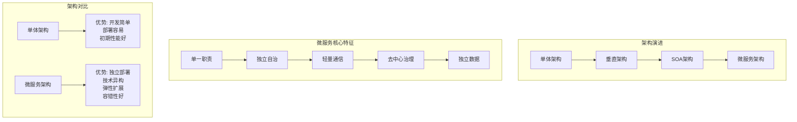

# 微服务

## 🔍 什么是微服务架构？

微服务架构是一种**将单一应用程序拆分为一组小型服务**的架构风格，每个服务都运行在自己的进程中，通过**轻量级通信机制（通常是HTTP/REST或消息队列）** 进行协作。每个服务围绕特定业务能力构建，可以**独立部署和扩展**，并使用不同的编程语言和数据存储技术。

## 📊 微服务与单体架构的详细对比

| **比较维度** | **单体架构** | **微服务架构** |
| :--- | :--- | :--- |
| **代码组织** | 单一代码库，所有功能模块耦合在一起 | 多个独立代码库，按业务领域垂直拆分 |
| **技术栈** | 通常统一的技术栈，难以异构 | 各服务可选择最适合的技术栈，技术异构性强 |
| **数据库** | 共享单一数据库，数据耦合度高 | 每个服务拥有专属数据库，数据库彻底解耦 |
| **部署与扩展** | 整体部署，扩展时需要复制整个应用 | 独立部署，可按需扩展特定服务，资源利用率高 |
| **团队协作** | 按职能划分团队（前端、后端、DBA），沟通成本高 | 按业务领域划分跨职能小团队（全栈特性），权责清晰 |
| **容错性** | 单点故障可能导致整个系统崩溃 | 故障被隔离在单个服务内，系统整体更健壮 |
| **开发与交付** | 迭代速度慢，任何修改都需要全量回归测试和发布 | 迭代速度快，可独立开发、测试、部署，持续交付能力强 |

## 🎯 微服务的核心特征与设计原则

1. **单一职责与领域驱动**：每个微服务应对应一个**有界的上下文**，专注于解决一个明确的业务领域问题。
2. **独立自治**：服务应能**独立开发、测试、构建、部署和扩展**。这是实现敏捷和DevOps的基础。
3. **轻量级通信**：服务间通过定义良好、版本化的**API**进行通信，通常采用HTTP/REST或异步消息传递，保持松耦合。
4. **去中心化治理**：鼓励“**选择合适的工具做合适的事**”，不同服务可以使用不同的编程语言、数据库和技术栈。
5. **去中心化数据管理**：每个服务管理自己的数据库，可以使用不同类型（SQL或NoSQL）。数据一致性通过**最终一致性**模式保证。
6. **基础设施自动化**：微服务的部署、监控、运维复杂度极高，必须依赖**CI/CD、容器化（Docker）和编排（Kubernetes）** 等自动化工具。

## ⚖️ 微服务的优势与挑战

**主要优势：**

- **高敏捷性**：小团队可独立、快速迭代，加速产品交付。
- **弹性扩展**：可按需精准扩展高性能服务，节省资源成本。
- **技术自由**：可为不同服务选择最合适的技术栈。
- **容错与隔离**：故障被隔离，避免系统级雪崩。
- **易于理解**：每个服务代码库相对较小，新成员更容易上手。

**主要挑战与应对策略：**

1. **复杂性剧增**：分布式系统固有的网络、容错、数据一致性难题。
    - **应对**：引入成熟的**服务网格（如Istio）** 处理服务通信、可观察性和安全性。
2. **运维与监控困难**：需要跟踪数十甚至数百个服务。
    - **应对**：建立强大的**集中式日志（ELK）、链路追踪（SkyWalking）和监控（Prometheus）** 体系。
3. **数据一致性**：跨服务事务难以保证强一致性。
    - **应对**：采用**最终一致性、Saga模式（通过事件/消息）或使用Seata等分布式事务框架**。
4. **测试复杂度**：服务间依赖使集成测试和端到端测试复杂。
    - **应对**：推行**契约测试（如Pact）**，确保API接口的兼容性。
5. **网络延迟与通信成本**：服务间远程调用带来额外开销。
    - **应对**：设计合理的服务粒度，避免过度拆分；使用**高效的序列化协议（如gRPC/Protobuf）**。

## 🚀 何时选择微服务？

- **团队与组织**：拥有多个功能团队（通常10人以上），需要独立开发和发布权。
- **业务复杂度**：产品业务领域复杂，功能模块多，且需要长期快速迭代。
- **可扩展性需求**：系统需要应对高并发，且不同模块的负载特征差异明显。
- **技术异构需求**：不同部分需要使用不同的技术栈（例如，AI模块用Python，交易模块用Java）。

**不适合微服务的情况**：

- 项目处于**探索验证期**，业务边界模糊。
- 团队规模小，**运维和分布式系统经验不足**。
- 应用本身简单，**迭代速度要求不高**。

## 🛠️ 如何演进到微服务？

1. **从单体开始**：在业务初期，优先构建一个**结构良好、模块清晰的单体应用**。
2. **识别拆分边界**：随着业务发展，使用**领域驱动设计（DDD）** 识别出限界上下文，作为潜在的服务拆分候选。
3. **优先拆分“痛点”**：首先将**变更最频繁、性能瓶颈最明显或可独立运行的模块**拆分为服务。
4. **建立基础设施**：在拆分前或同时，搭建好**CI/CD流水线、容器化平台和基本的监控日志**。
5. **逐步拆分，小步快跑**：采用**绞杀者模式或修缮者模式**，逐步将功能从单体中剥离，形成新服务。

总而言之，微服务是一种应对**复杂业务、大规模团队和快速迭代需求**的高效架构范式，但它也带来了显著的复杂度。成功的关键在于**根据实际需求审慎评估**，并持续投资于**自动化工具、监控体系和团队能力建设**。

如果你有具体的业务场景或技术痛点，我可以帮你进一步分析是否适合采用微服务架构，以及如何规划演进路径。
