# Spring Cloud微服务

你希望了解基于当前主流技术库的Spring微服务完整架构，不仅要明确各环节使用的主流框架/组件，还需要一份完整的架构图，并且针对架构中的每一个节点，详细说明其存在的原因（即解决了什么核心问题、承担什么核心职责）。

## 一、Spring微服务技术栈

基于 **Spring Boot 3.x + Spring Cloud 2023.x + Spring Cloud Alibaba 2022.x** 体系，核心组件选型如下（已剔除停更/非主流组件）：

| 功能域                | 主流组件/库                          | 解决的核心问题                          | 淘汰/非主流组件       |
|-----------------------|--------------------------------------|-----------------------------------------|----------------------|
| 服务注册与发现        | Nacos                                | 服务寻址、实例管理                      | Eureka、Consul（国内）|
| 配置中心              | Nacos Config                         | 配置集中管理、动态刷新                  | Spring Cloud Config  |
| 服务网关              | Spring Cloud Gateway                 | 统一入口、鉴权、限流                    | Zuul 1.x             |
| 远程调用              | OpenFeign                            | 简化HTTP远程调用                        | RestTemplate（仅辅助）|
| 负载均衡              | Spring Cloud LoadBalancer            | 请求均匀分发到多实例                    | Ribbon（已弃用）     |
| 服务容错              | Sentinel                             | 熔断、限流、降级                        | Hystrix              |
| 分布式事务            | Seata（AT模式为主）                  | 跨服务事务一致性                        | TCC-Transaction      |
| 链路追踪              | SkyWalking                           | 调用链追踪、故障定位                    | Sleuth+Zipkin        |
| 监控告警              | Prometheus + Grafana + Actuator      | 指标监控、可视化、异常告警              | Spring Boot Admin    |
| 日志收集              | ELK/PLG（Promtail+Loki+Grafana）     | 日志集中管理、检索                      | 单机日志             |
| 容器编排              | Docker + Kubernetes（K8s）           | 自动化部署、弹性扩缩容                  | 物理机/虚拟机部署    |
| 分布式缓存            | Redis（Redisson）                    | 热点数据缓存、分布式锁                  | Memcached            |
| 消息队列              | RocketMQ（业务消息）/ Kafka（高吞吐） | 异步解耦、削峰填谷                      | ActiveMQ             |

## 二、生产级Spring微服务完整架构图

以下是覆盖「客户端→网关→业务服务→中间件→基础设施」的全链路架构图（基于Mermaid语法，可直接渲染）：

```mermaid
flowchart TB
    %% 1. 客户端层
    Client[客户端：Web/APP/小程序] --> CDN[CDN：静态资源加速]
    CDN --> SLB[负载均衡器：Nginx/SLB]
    
    %% 2. 网关层
    SLB --> Gateway[服务网关：Spring Cloud Gateway]
    
    %% 3. 核心业务服务层
    Gateway --> UserSvc[用户服务：user-service]
    Gateway --> OrderSvc[订单服务：order-service]
    Gateway --> PaySvc[支付服务：pay-service]
    Gateway --> InventorySvc[库存服务：inventory-service]
    Gateway --> ProductSvc[商品服务：product-service]
    
    %% 4. 服务治理层（微服务核心支撑）
    UserSvc & OrderSvc & PaySvc & InventorySvc & ProductSvc --> Nacos[Nacos：注册中心+配置中心]
    UserSvc & OrderSvc & PaySvc & InventorySvc & ProductSvc --> Sentinel[Sentinel：熔断/限流/降级]
    UserSvc & OrderSvc & PaySvc & InventorySvc & ProductSvc --> OpenFeign[OpenFeign：远程调用]
    UserSvc & OrderSvc & PaySvc & InventorySvc & ProductSvc --> LoadBalancer[LoadBalancer：负载均衡]
    UserSvc & OrderSvc & PaySvc & InventorySvc & ProductSvc --> Seata[Seata：分布式事务]
    UserSvc & OrderSvc & PaySvc & InventorySvc & ProductSvc --> SkyWalking[SkyWalking：链路追踪]
    
    %% 5. 中间件层（数据/异步通信）
    UserSvc & OrderSvc & PaySvc & InventorySvc & ProductSvc --> Redis[Redis：分布式缓存]
    UserSvc & OrderSvc & PaySvc & InventorySvc & ProductSvc --> MQ[消息队列：RocketMQ/Kafka]
    UserSvc --> MysqlUser[MySQL-用户库]
    OrderSvc --> MysqlOrder[MySQL-订单库]
    PaySvc --> MysqlPay[MySQL-支付库]
    InventorySvc --> MysqlInventory[MySQL-库存库]
    ProductSvc --> MysqlProduct[MySQL-商品库]
    
    %% 6. 可观测性层（监控/日志）
    UserSvc & OrderSvc & PaySvc & InventorySvc & ProductSvc --> LogCollect[日志收集：ELK/PLG]
    UserSvc & OrderSvc & PaySvc & InventorySvc & ProductSvc --> Monitor[监控告警：Prometheus+Grafana]
    
    %% 7. 基础设施层（部署/安全）
    subgraph 基础设施层
        Docker[容器化：Docker] --> K8s[容器编排：K8s]
        K8s --> Server[服务器集群]
        Backup[数据备份：快照/主从复制]
        Security[安全防护：WAF/防火墙/权限控制]
    end
    MysqlUser & MysqlOrder & MysqlPay & MysqlInventory & MysqlProduct --> Backup
    Gateway & UserSvc & OrderSvc & PaySvc & InventorySvc & ProductSvc --> Security
    Docker --> UserSvc & OrderSvc & PaySvc & InventorySvc & ProductSvc
```

## 三、架构各节点详细说明（存在原因+核心价值）

### 1. 客户端层

| 节点                | 主流实现       | 存在的核心原因                                                                 |
|---------------------|----------------|------------------------------------------------------------------------------|
| 客户端（Web/APP/小程序） | -              | 微服务系统的最终服务对象，是用户与系统交互的入口，所有后端服务的功能最终需通过客户端呈现。 |
| CDN（内容分发网络）| 阿里云/腾讯云CDN | 解决「静态资源（图片/JS/CSS/视频）加载慢」问题，将静态资源缓存到就近节点，降低源站压力、提升访问速度。 |
| 负载均衡器（Nginx/SLB） | Nginx/SLB      | 解决「单网关节点单点故障、压力过大」问题，将客户端请求分发到多个网关实例，实现网关层的高可用。 |

### 2. 网关层（Spring Cloud Gateway）

| 节点         | 主流实现               | 存在的核心原因                                                                 |
|--------------|------------------------|------------------------------------------------------------------------------|
| 服务网关     | Spring Cloud Gateway   | 1. 统一入口：所有外部请求必经网关，避免直接访问后端服务，降低安全风险； 2. 统一鉴权：集中处理Token校验、权限控制，无需每个服务重复开发； 3. 路由转发：按URL规则将请求路由到对应微服务； 4. 限流/跨域：集中配置限流规则、解决前端跨域问题； 5. 日志埋点：集中记录所有请求的入参/出参/耗时，方便排查。 |

### 3. 核心业务服务层（用户/订单/支付等）

| 节点         | 示例               | 存在的核心原因                                                                 |
|--------------|--------------------|------------------------------------------------------------------------------|
| 业务微服务   | user-service/order-service | 1. 解耦：按「业务域」拆分（单一职责），每个服务只处理一类核心业务（如订单服务仅处理订单生命周期）； 2. 独立扩缩容：某个服务压力大（如秒杀时订单服务）可单独扩容，无需扩容整个系统； 3. 故障隔离：单个服务故障（如库存服务挂了）不会导致全系统崩溃； 4. 技术灵活：不同服务可按需选择技术栈（如支付服务用Java，数据分析服务用Python）。 |

### 4. 服务治理层（微服务核心支撑）

| 节点                | 主流实现       | 存在的核心原因                                                                 |
|---------------------|----------------|------------------------------------------------------------------------------|
| Nacos（注册+配置）| Nacos          | 1. 注册中心：解决「服务寻址」问题，服务启动时注册到Nacos，消费者拉取服务列表（无需硬编码IP）； 2. 配置中心：解决「多服务配置分散、修改需重启」问题，集中管理配置并支持动态刷新； 3. 环境隔离：支持开发/测试/生产配置隔离，避免配置混乱。 |
| OpenFeign（远程调用） | OpenFeign      | 解决「HTTP远程调用繁琐」问题，基于注解的声明式调用，像调用本地方法一样调用远程服务（如订单服务调用库存服务扣库存）。 |
| LoadBalancer（负载均衡） | Spring Cloud LoadBalancer | 解决「请求分发不均」问题，将请求均匀分发到多个服务实例，支持轮询/权重/最小并发等策略，自动感知实例上下线。 |
| Sentinel（服务容错） | Sentinel       | 解决「微服务雪崩」问题： 1. 熔断：服务异常率超阈值时暂时切断调用，避免持续报错； 2. 限流：限制接口QPS，防止突发流量打垮服务； 3. 降级：压力过大时返回兜底数据（如“系统繁忙”）。 |
| Seata（分布式事务）| Seata          | 解决「跨服务事务一致性」问题（如订单创建+库存扣减+支付扣款），AT模式无侵入实现事务最终一致性，支持TCC/SAGA适配复杂场景。 |
| SkyWalking（链路追踪） | SkyWalking     | 解决「微服务调用链长、故障定位难」问题，追踪一次请求的完整链路（客户端→网关→订单→库存），记录每个节点耗时/异常，快速定位慢接口/故障服务。 |

### 5. 中间件层（数据存储/异步通信）

| 节点                | 主流实现       | 存在的核心原因                                                                 |
|---------------------|----------------|------------------------------------------------------------------------------|
| Redis（分布式缓存） | Redis+Redisson  | 1. 缓存热点数据（如商品详情），降低数据库查询压力； 2. 实现分布式锁（如秒杀防超卖）； 3. 支持多种数据结构（Hash/List），满足购物车/排行榜等场景。 |
| 消息队列（RocketMQ/Kafka） | RocketMQ/Kafka | 1. 异步解耦：订单创建后异步通知库存扣减，避免同步依赖； 2. 削峰填谷：秒杀时将请求写入MQ，服务消费处理，防止打垮数据库； 3. 最终一致性：结合Seata实现跨服务事务。 |
| 分库分表MySQL       | MySQL+Sharding-JDBC | 1. 持久化核心业务数据（用户/订单/支付）； 2. 分库分表解决「单表千万级数据查询慢」问题； 3. 主从复制实现读写分离，提升查询性能。 |

### 6. 可观测性层

| 节点                | 主流实现       | 存在的核心原因                                                                 |
|---------------------|----------------|------------------------------------------------------------------------------|
| 日志收集（ELK/PLG） | ELK/PLG        | 解决「微服务日志分散」问题，集中收集多服务器/多服务的日志，支持关键字检索（如按订单号查日志），快速定位问题。 |
| 监控告警（Prometheus+Grafana） | Prometheus+Grafana | 1. 实时监控服务指标（CPU/内存/QPS/响应时间/错误率）； 2. 可视化仪表盘展示系统状态； 3. 指标超阈值时（如错误率>10%）自动告警（邮件/钉钉）。 |

### 7. 基础设施层

| 节点                | 主流实现       | 存在的核心原因                                                                 |
|---------------------|----------------|------------------------------------------------------------------------------|
| Docker（容器化）| Docker         | 解决「环境不一致」问题，将服务打包成镜像（包含所有依赖），实现「一次打包，到处运行」，轻量级且启动快。 |
| K8s（容器编排）| K8s/ACK/TKE    | 1. 自动化部署：一键部署多服务实例； 2. 弹性扩缩容：按CPU/流量自动增减实例； 3. 自愈能力：实例挂掉自动重启，节点故障自动迁移。 |
| 数据备份            | 快照/主从复制  | 解决「数据丢失」问题，防止误删库/服务器故障导致数据丢失，保障业务连续性。 |
| 安全防护            | WAF/防火墙/Spring Security | 1. 防止恶意攻击（SQL注入/XSS/DDoS）； 2. 细粒度权限控制（如普通用户只能查自己的订单）； 3. 敏感数据加密（如支付密码）。 |

---

### 总结

1. 完整的Spring微服务架构是「分层设计」的，每个节点都解决了特定的核心问题（如网关解决统一入口，Nacos解决注册发现，Sentinel解决容错），缺一不可；
2. 当前主流技术栈以「Spring Boot 3.x + Spring Cloud 2023.x + Spring Cloud Alibaba 2022.x」为核心，搭配Nacos、Gateway、Sentinel、Seata等组件，容器化采用Docker+K8s；
3. 微服务架构设计的核心逻辑是「解耦、容错、可观测、可扩展」：按业务域解耦服务，通过容错组件保障稳定性，通过监控/日志实现可观测，通过容器编排实现弹性扩展。

## 💡 架构设计与选型建议

1. **避免“一步到位”的拆分**：初期可先采用**粗粒度拆分**，随着业务和团队成长再逐步细化，避免因过度拆分带来巨大运维和通信复杂度。
2. **统一技术栈与版本**：特别是Spring Cloud Alibaba各组件间**版本依赖严格**，务必参考官方版本兼容性列表，这是减少诡异问题的最有效方法。
3. **容错设计先行**：在服务联调阶段，就应使用 **Sentinel** 配置基本的熔断和降级规则，而不是等到线上出问题后再补救。
4. **为可观测性投资**：在项目早期就集成**链路追踪和监控**。当系统出现问题时，良好的可观测性工具能帮你快速定位，节省大量排错时间。

如果你想深入了解某个特定组件（如Sentinel的熔断规则如何配置）或场景（如如何设计一个可靠的消息最终一致性方案），我可以为你提供更详细的解释。
