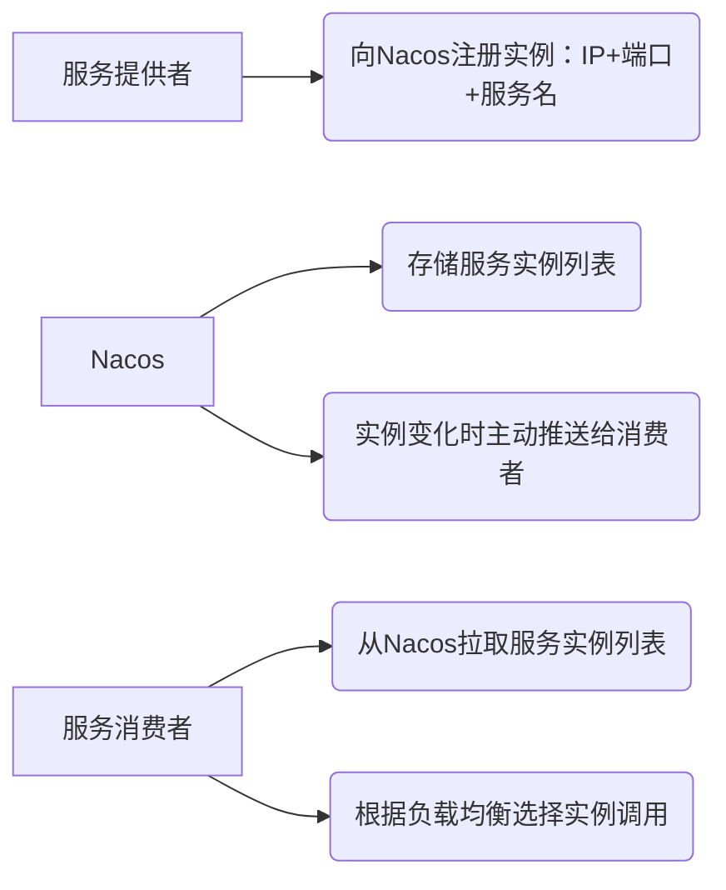
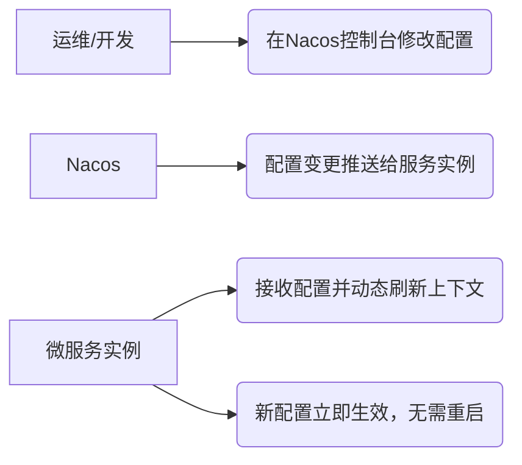

# Nacos 介绍

## 一、Nacos 基础认知

### 1. 什么是Nacos？

Nacos 是 **N**aming（命名）+ **Co**nfig（配置）+ **s**ervice（服务）的组合缩写，是阿里巴巴开源的**一站式微服务治理平台**，核心定位是：
> 动态服务发现、配置管理和服务管理平台，用于构建、交付和管理微服务架构。

- **开发者**：阿里巴巴（2018年开源，现已纳入CNCF沙箱项目）；
- **核心目标**：解决微服务架构中「服务注册发现」和「配置中心」两大核心问题，替代传统的 Eureka + Spring Cloud Config 组合；
- **底层语言**：Java（易扩展、与Spring生态无缝兼容）；
- **官方文档**：<https://nacos.io/zh-cn/docs/what-is-nacos.html>

### 2. Nacos 的核心定位

Nacos 是「一站式」的，意味着你无需部署多个组件（如Eureka+Config），仅需一个Nacos即可同时满足：

- 服务注册与发现（对应Eureka/Consul）；
- 配置中心（对应Spring Cloud Config/Apollo）；
- 服务管理（健康检查、元数据管理、流量管控）。

## 二、Nacos 核心功能（核心价值+工作原理）

### 1. 核心功能1：服务注册与发现

#### （1）核心价值

解决微服务架构中「服务之间如何找到对方」的问题，替代Eureka、Consul等组件，支持多种服务通信协议。

#### （2）关键特性

| 特性                | 说明                                                                 |
|---------------------|----------------------------------------------------------------------|
| 多协议支持          | 支持HTTP/REST、Dubbo、gRPC等主流服务通信协议，适配不同微服务场景     |
| 健康检查            | 自动检测服务实例状态（心跳/HTTP/自定义检查），剔除故障实例，避免请求到不可用服务 |
| 负载均衡            | 内置简单负载均衡策略（轮询/随机），也可与Spring Cloud LoadBalancer集成 |
| 动态感知            | 服务实例上下线时，客户端实时感知（推送模式），无需轮询，性能更高       |
| 高可用              | 集群模式下，多节点部署，无单点故障                                   |

#### （3）工作原理



### 2. 核心功能2：配置中心

#### （1）核心价值

解决微服务架构中「配置分散、修改需重启服务、环境隔离困难」的问题，实现配置的集中管理、动态刷新。

#### （2）关键特性

| 特性                | 说明                                                                 |
|---------------------|----------------------------------------------------------------------|
| 动态刷新            | 配置修改后，服务无需重启即可实时生效（支持@RefreshScope注解）         |
| 环境隔离            | 支持「命名空间（Namespace）」隔离开发/测试/生产环境配置               |
| 分组管理            | 支持「分组（Group）」管理不同业务/版本的配置（如V1/V2版本配置）       |
| 配置加密            | 支持敏感配置（如数据库密码）加密存储，防止泄露                       |
| 版本管理            | 配置修改记录可追溯，支持回滚到历史版本                               |
| 配置热加载          | 服务启动时自动加载Nacos配置，覆盖本地配置                             |

#### （3）工作原理



### 3. 核心功能3：服务管理

Nacos 提供可视化控制台，支持：

- 服务元数据管理：自定义服务标签（如服务所属团队、版本）；
- 服务流量管控：临时屏蔽某个服务实例（灰度发布/故障排查）；
- 服务健康监控：可视化展示服务实例的在线状态、健康检查结果；
- 配置历史查询：查看配置的修改记录、回滚操作。

## 三、Nacos 核心优势（对比传统方案）

| 对比维度            | Nacos                          | Eureka + Spring Cloud Config    |
|---------------------|--------------------------------|---------------------------------|
| 功能完整性          | 一站式（注册+配置+服务管理）| 拆分（注册用Eureka，配置用Config） |
| 配置动态刷新        | 原生支持，实时推送             | 需要手动集成Bus，配置刷新延迟    |
| 性能                | 推送模式，实例变化实时感知     | 轮询模式，有延迟                |
| 易用性              | 控制台可视化操作，配置简单     | 配置繁琐，无统一控制台          |
| 高可用              | 集群部署简单，支持数据持久化   | Eureka集群配置复杂，Config需配Git |
| 生态兼容            | 完美适配Spring Cloud Alibaba   | 需单独适配，兼容性一般          |

## 四、Nacos 部署方式（主流3种）

### 1. 单机部署（开发/测试环境）

```bash
# 1. 下载安装包（推荐稳定版）
wget https://github.com/alibaba/nacos/releases/download/2.3.2/nacos-server-2.3.2.tar.gz

# 2. 解压
tar -zxvf nacos-server-2.3.2.tar.gz

# 3. 单机启动（Linux/Mac）
cd nacos/bin
sh startup.sh -m standalone

# Windows启动
cd nacos/bin
startup.cmd -m standalone

# 4. 访问控制台：http://localhost:8848/nacos
# 默认账号/密码：nacos/nacos
```

### 2. 集群部署（生产环境）

核心是配置集群节点列表、数据源（推荐MySQL），保证数据持久化和高可用，步骤：

1. 配置`conf/cluster.conf`，写入所有Nacos节点IP:端口；
2. 配置`conf/application.properties`，指定MySQL数据源（存储配置和服务数据）；
3. 启动所有Nacos节点，集群自动组网。

### 3. Docker部署（快速试用）

```bash
# 单机版Docker启动
docker run -d \
  --name nacos-standalone \
  -p 8848:8848 \
  -e MODE=standalone \
  -e SPRING_DATASOURCE_PLATFORM=mysql \
  nacos/nacos-server:v2.3.2
```

## 五、Nacos 在Spring微服务中的核心使用

### 前置条件

1. 项目引入Spring Cloud Alibaba依赖管理：

```xml
<dependencyManagement>
    <dependencies>
        <dependency>
            <groupId>com.alibaba.cloud</groupId>
            <artifactId>spring-cloud-alibaba-dependencies</artifactId>
            <version>2022.0.0.0-RC2</version>
            <type>pom</type>
            <scope>import</scope>
        </dependency>
    </dependencies>
</dependencyManagement>
```

### 1. 集成Nacos服务注册与发现

#### （1）引入依赖

```xml
<dependency>
    <groupId>com.alibaba.cloud</groupId>
    <artifactId>spring-cloud-starter-alibaba-nacos-discovery</artifactId>
</dependency>
```

#### （2）配置application.yml

```yaml
spring:
  application:
    name: user-service # 服务名（核心，消费者通过此名称调用）
  cloud:
    nacos:
      discovery:
        server-addr: localhost:8848 # Nacos地址
        namespace: dev # 可选：指定命名空间（环境隔离）
        group: DEFAULT_GROUP # 可选：指定分组
```

#### （3）启动类加注解

```java
import org.springframework.boot.SpringApplication;
import org.springframework.boot.autoconfigure.SpringBootApplication;
import org.springframework.cloud.client.discovery.EnableDiscoveryClient;

@SpringBootApplication
@EnableDiscoveryClient // 开启服务注册发现
public class UserServiceApplication {
    public static void main(String[] args) {
        SpringApplication.run(UserServiceApplication.class, args);
    }
}
```

启动后，可在Nacos控制台「服务管理→服务列表」看到`user-service`已注册。

### 2. 集成Nacos配置中心

#### （1）引入依赖

```xml
<dependency>
    <groupId>com.alibaba.cloud</groupId>
    <artifactId>spring-cloud-starter-alibaba-nacos-config</artifactId>
</dependency>
```

#### （2）配置bootstrap.yml（优先级高于application.yml）

```yaml
spring:
  application:
    name: user-service
  cloud:
    nacos:
      config:
        server-addr: localhost:8848
        namespace: dev # 环境隔离
        group: DEFAULT_GROUP # 分组
        file-extension: yaml # 配置文件格式（yaml/properties）
```

#### （3）在Nacos控制台添加配置

- 配置ID：`user-service.yaml`（规则：${spring.application.name}.${file-extension}）；
- 配置内容：

```yaml
# 自定义配置
user:
  name: zhangsan
  age: 20
# 数据源配置（可替代本地application.yml中的配置）
spring:
  datasource:
    url: jdbc:mysql://localhost:3306/user_db
    username: root
    password: 123456
```

#### （4）动态刷新配置

在需要动态刷新的类上添加`@RefreshScope`注解：

```java
import org.springframework.beans.factory.annotation.Value;
import org.springframework.cloud.context.config.annotation.RefreshScope;
import org.springframework.web.bind.annotation.GetMapping;
import org.springframework.web.bind.annotation.RestController;

@RestController
@RefreshScope // 开启配置动态刷新
public class UserController {
    @Value("${user.name}")
    private String userName;

    @GetMapping("/user/name")
    public String getUserName() {
        return userName;
    }
}
```

修改Nacos控制台的`user.name`配置后，无需重启服务，访问`/user/name`即可看到新值。

## 六、Nacos 典型应用场景

1. **微服务注册发现**：替代Eureka，实现服务的动态注册、发现、负载均衡；
2. **配置集中管理**：将多环境、多服务的配置集中存储在Nacos，避免配置分散在各服务；
3. **动态配置更新**：如秒杀活动中动态调整限流阈值、数据源连接池大小，无需重启服务；
4. **服务灰度发布**：通过Nacos屏蔽部分服务实例，实现灰度发布（先发布少量实例验证）；
5. **服务健康监控**：通过Nacos控制台实时查看服务实例的在线状态，快速定位故障实例。

---

### 总结

1. Nacos 是阿里巴巴开源的一站式微服务治理平台，核心解决「服务注册发现」和「配置中心」两大问题，替代传统的Eureka+Config组合；
2. Nacos 核心优势是「一站式、动态刷新、高可用、易用性强」，完美适配Spring Cloud Alibaba生态；
3. 在Spring微服务中，Nacos注册中心需配置`nacos-discovery`依赖+`@EnableDiscoveryClient`，配置中心需配置`nacos-config`依赖+`bootstrap.yml`+`@RefreshScope`实现动态刷新。

如果需要进一步了解Nacos集群部署的详细配置、配置加密、服务健康检查规则等进阶内容，我可以针对性讲解。
