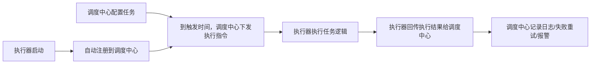

# XXL-Job

## 一、XXL-Job 到底是什么？

XXL-Job是由国内开发者许雪里（XXL）开源的**分布式任务调度平台**，核心解决传统定时任务（如JDK的`Timer`、Spring的`@Scheduled`）在分布式系统中的痛点：

- 通俗比喻：把XXL-Job看作“分布式系统的定时任务管家”——**调度中心（总部）** 统一管理所有定时任务，**执行器（分公司）** 负责执行具体任务，总部可以随时下达指令、查看结果、调整规则，不用逐个修改分公司的配置。
- 对比传统定时任务的核心优势：

  | 特性                | 传统定时任务（@Scheduled） | XXL-Job                  |
  |---------------------|----------------------------|--------------------------|
  | 分布式管理          | 无（需手动改每个服务配置） | 可视化控制台统一管理     |
  | 动态调整            | 改代码重启服务             | 网页端随时修改/启停任务  |
  | 故障容错            | 单点故障任务直接停         | 支持执行器集群、失败重试 |
  | 大数据量处理        | 单机执行效率低             | 分片执行，多机器并行处理 |
  | 执行监控&报警       | 无原生支持                 | 完整日志+邮件/钉钉报警   |

简单来说：单机定时任务能做的，XXL-Job都能做；分布式场景下需要的“统一管理、容错、分片”，XXL-Job专门解决。

## 二、XXL-Job 核心架构（新手必懂）

XXL-Job的核心是“调度中心+执行器”的分离架构，两个角色分工明确：

| 角色         | 核心作用（通俗解释）| 部署方式                  |
|--------------|-------------------------------------------|---------------------------|
| 调度中心     | 任务的“总部”：管理任务、触发任务、统计执行结果、发送报警 | 独立部署（可集群，避免单点） |
| 执行器       | 任务的“分公司”：接收调度中心指令、执行具体业务逻辑 | 嵌入业务服务部署（多节点集群） |

### 核心执行流程（可视化）



## 三、XXL-Job 核心概念（快速理解）

| 概念         | 通俗解释                                  | 典型使用场景                |
|--------------|-------------------------------------------|-----------------------------|
| 任务Handler  | 任务的“唯一标识”，对应代码中具体的执行方法 | @XxlJob("demoJob") 中的demoJob |
| CRON表达式   | 任务触发规则（如`*/5 * * * * ?`=每5秒执行） | 定时任务的核心触发方式      |
| 路由策略     | 调度中心选择哪个执行器节点执行任务        | 轮询、随机、故障转移        |
| 分片广播     | 一个任务触发后，所有执行器节点都执行      | 多机器同时清理本地日志      |
| 分片执行     | 一个大任务拆分成N片，多节点各执行一片     | 1000万数据拆10片，10节点并行处理 |
| 失败重试     | 任务执行失败后自动重试的次数              | 接口调用失败，重试3次       |

## 四、XXL-Job 实战（Spring Boot 集成）

### 前置条件

- 安装MySQL（5.7+）：调度中心需要存储任务配置、执行日志；
- 基础环境：JDK8+、Maven3.6+、Spring Boot 2.x。

### 步骤1：部署调度中心（总部）

1. **下载源码**：从GitHub拉取XXL-Job源码（<https://github.com/xuxueli/xxl-job），推荐稳定版本（如2.4.0）；>
2. **初始化数据库**：源码中`doc/db/tables_xxl_job.sql`文件，导入到MySQL（这是调度中心的核心表，存储任务、执行器、日志等）；
3. **配置调度中心**：修改`xxl-job-admin`模块的`application.properties`，配置数据库连接：

   ```properties
   # 数据源配置（改成你的MySQL信息）
   spring.datasource.url=jdbc:mysql://127.0.0.1:3306/xxl_job?useUnicode=true&characterEncoding=UTF-8&autoReconnect=true&serverTimezone=Asia/Shanghai
   spring.datasource.username=root
   spring.datasource.password=你的MySQL密码
   spring.datasource.driver-class-name=com.mysql.cj.jdbc.Driver
   ```

4. **启动调度中心**：运行`xxl-job-admin`模块的`XxlJobAdminApplication`类，默认端口8080；
5. **验证启动**：访问 <http://localhost:8080/xxl-job-admin> ，默认账号`admin`，密码`123456`，能登录即成功。

### 步骤2：Spring Boot 集成执行器（分公司）

#### 2.1 引入依赖（Maven）

```xml
<!-- XXL-Job 核心依赖（版本要和调度中心一致） -->
<dependency>
    <groupId>com.xuxueli</groupId>
    <artifactId>xxl-job-core</artifactId>
    <version>2.4.0</version>
</dependency>
```

#### 2.2 配置执行器（application.yml）

```yaml
xxl:
  job:
    admin:
      addresses: http://127.0.0.1:8080/xxl-job-admin # 调度中心地址（集群用逗号分隔）
    executor:
      appname: xxl-job-demo-executor # 执行器名称（必须和调度中心配置一致）
      address: '' # 执行器地址，为空则自动注册
      ip: '' # 自动获取本机IP
      port: 9999 # 执行器端口（避免冲突即可）
      logpath: /data/applogs/xxl-job/jobhandler # 任务日志路径（本地测试可改成本地路径，如D:/xxl-job-logs）
      logretentiondays: 30 # 日志保留30天
    accessToken: '' # 通信令牌（调度中心没配的话留空）
```

#### 2.3 配置执行器Bean（配置类）

```java
import com.xxl.job.core.executor.impl.XxlJobSpringExecutor;
import org.slf4j.Logger;
import org.slf4j.LoggerFactory;
import org.springframework.beans.factory.annotation.Value;
import org.springframework.context.annotation.Bean;
import org.springframework.context.annotation.Configuration;

/**
 * XXL-Job 执行器核心配置
 */
@Configuration
public class XxlJobConfig {
    private static final Logger logger = LoggerFactory.getLogger(XxlJobConfig.class);

    @Value("${xxl.job.admin.addresses}")
    private String adminAddresses;

    @Value("${xxl.job.executor.appname}")
    private String appname;

    @Value("${xxl.job.executor.ip}")
    private String ip;

    @Value("${xxl.job.executor.port}")
    private int port;

    @Value("${xxl.job.accessToken}")
    private String accessToken;

    @Value("${xxl.job.executor.logpath}")
    private String logPath;

    @Value("${xxl.job.executor.logretentiondays}")
    private int logRetentionDays;

    /**
     * 初始化XXL-Job执行器
     */
    @Bean
    public XxlJobSpringExecutor xxlJobExecutor() {
        logger.info(">>>>>>>>>> XXL-Job 执行器初始化开始 <<<<<<<<<<");
        XxlJobSpringExecutor executor = new XxlJobSpringExecutor();
        executor.setAdminAddresses(adminAddresses);
        executor.setAppname(appname);
        executor.setIp(ip);
        executor.setPort(port);
        executor.setAccessToken(accessToken);
        executor.setLogPath(logPath);
        executor.setLogRetentionDays(logRetentionDays);
        logger.info(">>>>>>>>>> XXL-Job 执行器初始化完成 <<<<<<<<<<");
        return executor;
    }
}
```

#### 2.4 编写具体任务（核心业务逻辑）

```java
import com.xxl.job.core.context.XxlJobHelper;
import com.xxl.job.core.handler.annotation.XxlJob;
import org.slf4j.Logger;
import org.slf4j.LoggerFactory;
import org.springframework.stereotype.Component;

import java.time.LocalDateTime;

/**
 * XXL-Job 任务示例（两种常见类型）
 */
@Component
public class DemoXxlJobHandler {
    private static final Logger logger = LoggerFactory.getLogger(DemoXxlJobHandler.class);

    /**
     * 示例1：简单定时任务（每5秒执行一次）
     * @XxlJob注解：指定任务的唯一标识（Handler名称），需和调度中心配置一致
     */
    @XxlJob("demoSimpleJob")
    public void demoSimpleJob() {
        // 1. 获取调度中心配置的任务参数
        String jobParam = XxlJobHelper.getJobParam();
        logger.info("【简单任务】开始执行，参数：{}，执行时间：{}", jobParam, LocalDateTime.now());

        try {
            // 2. 核心业务逻辑（这里模拟处理数据）
            Thread.sleep(1000); // 模拟任务耗时
            logger.info("【简单任务】执行成功！");

            // 3. 标记任务执行成功（会回传给调度中心）
            XxlJobHelper.handleSuccess("任务执行成功，参数：" + jobParam);
        } catch (Exception e) {
            logger.error("【简单任务】执行失败", e);
            // 4. 标记任务失败（触发重试，若调度中心配置了重试次数）
            XxlJobHelper.handleFail("任务执行失败：" + e.getMessage());
        }
    }

    /**
     * 示例2：分片任务（适合大数据量并行处理）
     * 比如：1000万条数据拆10片，10个执行器节点各处理100万
     */
    @XxlJob("demoShardingJob")
    public void demoShardingJob() {
        // 获取分片信息：分片索引（0~n-1）、总分片数
        int shardIndex = XxlJobHelper.getShardIndex();
        int shardTotal = XxlJobHelper.getShardTotal();

        logger.info("【分片任务】执行，分片索引：{}，总分片数：{}，执行时间：{}",
                shardIndex, shardTotal, LocalDateTime.now());

        // 业务逻辑：根据分片索引处理对应数据范围
        // 示例：shardTotal=3时，索引0处理0~333万，索引1处理334~666万，索引2处理667~1000万
        XxlJobHelper.handleSuccess("分片任务执行成功！");
    }
}
```

### 步骤3：调度中心配置任务（关键）

1. **注册执行器**：
   - 登录调度中心 → 执行器管理 → 新增；
   - 执行器名称：填`xxl-job-demo-executor`（和yml中appname一致）；
   - 注册方式：选“自动注册” → 保存；
   - 刷新后能看到“在线机器地址”，说明执行器已成功注册。
2. **创建定时任务**：
   - 任务管理 → 新增；
   - 核心配置（必选）：
     - 执行器：选择刚创建的`xxl-job-demo-executor`；
     - 任务描述：比如“测试简单定时任务”；
     - 调度类型：CRON；
     - CRON表达式：`*/5 * * * * ?`（每5秒执行一次）；
     - 任务Handler：`demoSimpleJob`（和@XxlJob注解值一致）；
     - 任务参数：可选填（如“test123”）；
     - 失败重试次数：3（失败后重试3次）；
   - 保存 → 启动任务。
3. **查看执行结果**：
   - 点击任务后的“执行日志”，可查看执行状态、日志、耗时；
   - 业务服务控制台也能看到任务执行的打印日志。

## 五、XXL-Job 典型使用场景

1. **数据同步**：每天凌晨同步订单/用户数据到数据仓库；
2. **定时清理**：每周清理过期日志、无效订单、缓存数据；
3. **大数据分片处理**：批量发送优惠券、批量更新用户积分（拆分片并行执行）；
4. **监控告警**：每分钟检查系统健康状态，异常则触发钉钉/邮件报警；
5. **定时推送**：每小时推送待处理工单给客服系统；
6. **定时计算**：每天计算用户成长值、账单汇总。

## 总结

1. XXL-Job是Java后端主流的分布式任务调度平台，核心解决单机定时任务“无法统一管理、无容错、效率低”的问题；
2. 核心架构分**调度中心（管理任务）** 和**执行器（执行任务）**，执行器自动注册，调度中心统一触发；
3. Spring Boot集成只需3步：引依赖 → 配执行器 → 写@XxlJob任务，再到调度中心配置CRON规则即可运行。

如果想深入了解“任务失败重试、报警配置、分片逻辑设计”等细节，我可以再针对性讲解～
