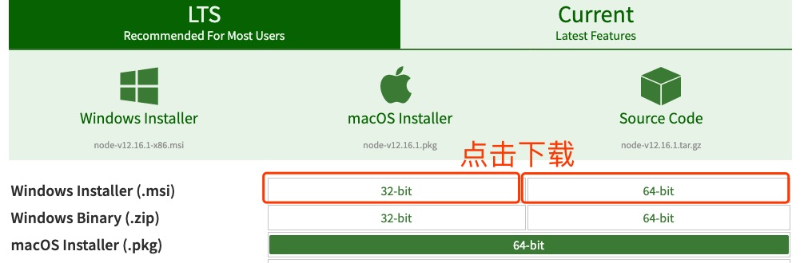

# NodeJs安装配置

 Windows 和 Linux 上安装 Node.js 的方法
> 复制自菜鸟文档

## Windows 上安装 Node.js

你可以采用以下两种方式来安装。

### 1、Windows 安装包(.msi)



本文实例以 `v0.10.26` 版本为例，其他版本类似， 安装步骤：

1. 双击下载后的安装包 v0.10.26，一直下一步
2. 检测PATH环境变量是否配置了Node.js，打开控制台输入`node -v`，如果没有配置，那么配置环境变量，路径为node安装后的bin目录。

### 2、Windows 二进制文件 (.exe)安装

1. 下载exe安装文件
2. 点击exe文件安装即可。
3. 配置全局环境变量，路径为node安装后的bin目录。

---

## Linux 上安装 Node.js

### Linux系统

Node 官网已经把 linux 下载版本更改为已编译好的版本了，我们可以直接下载解压后使用：

```shell
# wget https://nodejs.org/dist/v10.9.0/node-v10.9.0-linux-x64.tar.xz    // 下载
# tar xf  node-v10.9.0-linux-x64.tar.xz       // 解压
# cd node-v10.9.0-linux-x64/                  // 进入解压目录
# ./bin/node -v                               // 执行node命令 查看版本
v10.9.0
```

解压文件的 bin 目录底下包含了 node、npm 等命令，我们可以使用 ln 命令来设置软连接：

```shell
ln -s /usr/software/nodejs/bin/npm   /usr/local/bin/ 
ln -s /usr/software/nodejs/bin/node   /usr/local/bin/
```

### Ubuntu 源码安装 Node.js

以下部分我们将介绍在 Ubuntu Linux 下使用源码安装 Node.js 。 其他的 Linux 系统，如 Centos 等类似如下安装步骤。

在 Github 上获取 Node.js 源码：

```shell
sudo git clone https://github.com/nodejs/node.git
```

修改目录权限：

```shell
sudo chmod -R 755 node
```

使用 **./configure** 创建编译文件，并按照：

```shell
#
$ cd node
$ sudo ./configure
$ sudo make
$ sudo make install
```

查看 node 版本：

```shell
node --version
```

### Ubuntu apt-get 命令安装

命令格式如下：

```shell
sudo apt-get install nodejs
sudo apt-get install npm
```

### CentOS 下源码安装 Node.js

1. 官网下载源码

    ```shell
    cd /usr/local/src/
    wget http://nodejs.org/dist/v0.10.24/node-v0.10.24.tar.gz
    ```

2. 解压源码

    ```shell
    tar zxvf node-v0.10.24.tar.gz
    ```

3. 编译安装

    ```shell
    cd node-v0.10.24
    ./configure --prefix=/usr/local/node/0.10.24
    make
    make install
    ```

4. 配置NODE_HOME，进入profile编辑环境变量

    ```shell
    vim /etc/profile
    ```

    设置 nodejs 环境变量，在 `export PATH USER LOGNAME MAIL HOSTNAME HISTSIZE HISTCONTROL` 一行的上面添加如下内容:

    ```shell
    #set for nodejs
    export NODE_HOME=/usr/local/node/0.10.24
    export PATH=$NODE_HOME/bin:$PATH
    ```

    :wq保存并退出，编译/etc/profile 使配置生效

    ```shell
    source /etc/profile
    ```

    验证是否安装配置成功

    ```shell
    node -v
    ```

    输出版本号，表示配置成功

    npm模块安装路径

    ```shell
    /usr/local/node/0.10.24/lib/node_modules/
    ```

    注：Nodejs 官网提供了编译好的 Linux 二进制包，你也可以下载下来直接应用。

### Mac OS 上安装

可以通过以下两种方式在 Mac OS 上来安装 node：

1. 在官方下载网站下载 pkg 安装包，直接点击安装即可。
2. 使用 brew 命令来安装：

    ```shell
    brew install node
    ```
