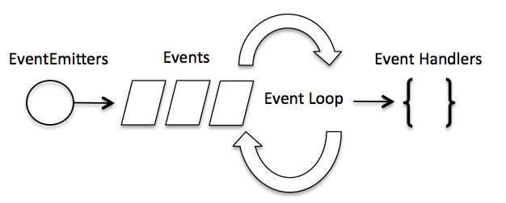

# 事件

nodejs 是js语法，所以是单进程单线程应用程序，通过V8引擎提供的异步执行接口处理并发。由此引出了事件机制，设计模式为观察者模式，每个异步事件设定一个事件观察者也就是回调函数，通过事件观察者处理异步事件的结果。

## 事件原理

Node.js 之所以能够实现高并发处理，主要依赖于其**事件驱动**和**非阻塞I/O**的架构设计。

1. 什么是事件驱动？

    答：
    事件驱动图 

    通俗来讲就是，设定循环队列，不断接收事件，然后转交给底层，底层将处理结果发送给上层（哪个事件先处理完，就先发哪个），上层再调用回调函数。

2. 什么是非阻塞I/O？

    答：I/O操作 都是非阻塞式的，Node.js 不等待其完成，继续执行后面的代码，结果通过回调函数返回，从而不会阻塞线程。

3. nodejs 虽然是单线程，但为什么他支持高并发？

    答：Node.js 标准库由JS编写。在其源码的lib目录中的Node bindings 处理JS与底层C/C++的交互（类似java的JNI）。下面说关键的`Libuv`库，它为 Node.js 提供了跨平台，线程池，事件池，异步 I/O 等能力，是 Node.js 如此强大的关键，这个库真正的处理并发事件和阻塞耗时处理（其实就是底层C/C++的能力，上层通过回调接收处理后的结果）。

更细的原理说明：

1. 事件驱动模型：Node.js 使用了一个事件循环（Event Loop）来处理事件和执行回调函数。这种模型允许 Node.js 在等待某些操作（如I/O操作）完成时，继续处理其他请求。当I/O操作完成时，相应的回调函数会被放入事件队列中，等待事件循环处理
2. 非阻塞I/O：Node.js 的 I/O 操作是非阻塞的，这意味着当一个I/O请求发出后，Node.js 不会等待其完成，而是立即继续执行后续代码。一旦I/O操作完成，相关的回调函数会被调用。
3. 单线程执行栈：Node.js 有一个主线程（执行栈），用于执行 JavaScript 代码。所有的异步操作（如网络请求、文件读写等）都不会阻塞这个主线程，而是在后台线程完成后，通过事件循环回调到主线程。
4. 事件队列和回调函数：Node.js 维护了一个事件队列，当异步操作（如I/O请求）发起时，它们会被放入事件队列中。事件循环会不断检查这个队列，并执行队列中的回调函数。
5. libuv库：libuv 是 Node.js 的底层库，负责提供跨平台的异步I/O功能。它通过线程池和事件循环机制，使得 Node.js 能够有效地处理大量并发请求。

6. 线程池：Node.js 内部使用了一个线程池来处理那些需要多线程处理的任务。当有多个异步操作同时进行时，它们可以被分配到不同的线程上并行执行，这样可以大大提高处理效率。

7. V8引擎：Node.js 基于 Google 的 V8 JavaScript 引擎，这个引擎提供了高效的 JavaScript 执行环境。V8 引擎解析 JavaScript 代码，并调用相应的 Node API 来执行任务。

8. 性能优化：Node.js 还提供了一些性能优化的手段，如使用 `process.nextTick()` 来安排在当前执行栈清空后的回调函数执行，以及通过集群（cluster）模块来利用多核CPU的优势

总结来说，Node.js 的高并发能力主要得益于其事件驱动和非阻塞I/O的架构，以及内部的线程池和事件循环机制。这些设计使得 Node.js 能够在保持单线程简单性的同时，有效地处理大量的并发请求。

---

## events

事件模块，引入方式：`require('events')`

## EventEmitter

所有的事件都是events.EventEmitter 的实例。EventEmitter 的核心就是事件触发与事件监听器功能的封装。

### 示例

```js
// require('events') 引入 events 模块
var EventEmitter = require('events').EventEmitter; 
//创建EventEmitter 对象
var event = new EventEmitter(); 
//通过EventEmitter注册 'some_event' 事件监听。后面的是回调函数，可以有任意参数
event.on('some_event', function() { 
    console.log('some_event 事件触发'); 
}); 

// 可以注册多个事件，当事件触发时，注册到这个事件的事件监听器被依次调用，事件参数作为回调函数参数传递
emitter.on('someEvent', function(arg1, arg2) { //这里参数就是事件参数
    console.log('listener2', arg1, arg2); 
}); 

setTimeout(function() { 
    event.emit('some_event'); //发送事件
}, 1000); 
```

### emitter方法

1. addListener(event, listener)
为指定事件添加一个监听器到监听器数组的尾部。

2. on(event, listener)
为指定事件注册一个监听器，接受一个字符串 event 和一个回调函数。

    ```js
    server.on('connection', function (stream) {
    console.log('someone connected!');
    });
    ```

3. once(event, listener)
为指定事件注册一个单次监听器，即 监听器最多只会触发一次，触发后立刻解除该监听器。

    ```js
    server.once('connection', function (stream) {
    console.log('Ah, we have our first user!');
    });
    ```

4. removeListener(event, listener)
移除指定事件的某个监听器，监听器必须是该事件已经注册过的监听器。它接受两个参数，第一个是事件名称，第二个是回调函数名称。

    ```js
    var callback = function(stream) {
    console.log('someone connected!');
    };
    server.on('connection', callback);
    // ...
    server.removeListener('connection', callback);
    ```

5. removeAllListeners([event])
移除所有事件的所有监听器， 如果指定事件，则移除指定事件的所有监听器。

6. setMaxListeners(n)
默认情况下， EventEmitters 如果你添加的监听器超过 10 个就会输出警告信息。setMaxListeners 函数用于改变监听器的默认限制的数量。

7. listeners(event)
返回指定事件的监听器数组。

8. emit(event, [arg1], [arg2], [...])
按监听器的顺序执行执行每个监听器，如果事件有注册监听返回 true，否则返回 false。

9. listenerCount(event)
返回指定事件的监听器数量。

### 事件补充

1. newListener - 该事件在添加新监听器时被触发。
    * event - 字符串，事件名称
    * listener - 处理事件函数

2. removeListener - 从指定监听器数组中删除一个监听器。需要注意的是，此操作将会改变处于被删监听器之后的那些监听器的索引。
    * event - 字符串，事件名称
    * listener - 处理事件函数

### error事件

EventEmitter 定义了一个特殊的事件，名称为`error`，它包含了错误的语义，我们在遇到 异常的时候通常会触发 error 事件。当 error 被触发时，EventEmitter 规定如果没有响 应的监听器，Node.js 会把它当作异常，退出程序并输出错误信息。我们一般要为会触发 error 事件的对象设置监听器，避免遇到错误后整个程序崩溃。

触发错误事件：

```js
var events = require('events'); 
var emitter = new events.EventEmitter(); 
emitter.emit('error'); 
```

### 继承 EventEmitter

大多数时候我们不会直接使用 EventEmitter，而是在对象中继承它。包括 fs、net、 http 在内的，只要是支持事件响应的核心模块都是 EventEmitter 的子类。

为什么要这样做呢？原因有两点：

答：首先，具有某个实体功能的对象实现事件符合语义， 事件的监听和发生应该是一个对象的方法。其次 JavaScript 的对象机制是基于原型的，支持 部分多重继承，继承 EventEmitter 不会打乱对象原有的继承关系。
