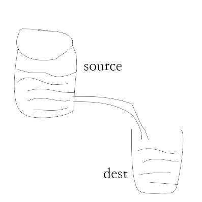

# Stream

Stream 是一个抽象接口，Node 中有很多对象实现了这个接口。例如，对http 服务器发起请求的request 对象就是一个 Stream，还有stdout（标准输出）。

Node.js，Stream 有四种流类型：

* Readable - 可读操作。
* Writable - 可写操作。
* Duplex - 可读可写操作.
* Transform - 操作被写入数据，然后读出结果。

所有的 Stream 对象都是 EventEmitter 的实例。常用的事件有：

* data - 当有数据可读时触发。
* end - 没有更多的数据可读时触发。
* error - 在接收和写入过程中发生错误时触发。
* finish - 所有数据已被写入到底层系统时触发。

## 从流中读取数据

创建 input.txt 文件，内容如下：

```txt
菜鸟教程官网地址：www.runoob.com
```

创建 main.js 文件, 代码如下：

```js
var fs = require("fs");
var data = '';

// 创建可读流
var readerStream = fs.createReadStream('input.txt');

// 设置编码为 utf8。
readerStream.setEncoding('UTF8');

// 处理流事件 --> data, end, and error
readerStream.on('data', function(chunk) {
   data += chunk;
});

readerStream.on('end',function(){
   console.log(data);
});

readerStream.on('error', function(err){
   console.log(err.stack);
});

console.log("程序执行完毕");
```

以上代码执行结果如下：

```txt
程序执行完毕
菜鸟教程官网地址：www.runoob.com
```

---

## 写入流

创建 main.js 文件, 代码如下：

```js
var fs = require("fs");
var data = '菜鸟教程官网地址：www.runoob.com';

// 创建一个可以写入的流，写入到文件 output.txt 中
var writerStream = fs.createWriteStream('output.txt');

// 使用 utf8 编码写入数据
writerStream.write(data,'UTF8');

// 标记文件末尾
writerStream.end();

// 处理流事件 --> finish、error
writerStream.on('finish', function() {
    console.log("写入完成。");
});

writerStream.on('error', function(err){
   console.log(err.stack);
});

console.log("程序执行完毕");
```

以上程序会将 data 变量的数据写入到 output.txt 文件中。代码执行结果如下：

```shell
$ node main.js 
程序执行完毕
写入完成。
```

查看 output.txt 文件的内容：

```shell
$ cat output.txt 
菜鸟教程官网地址：www.runoob.com
```

---

## 管道流

管道提供了一个输出流到输入流的机制。通常我们用于从一个流中获取数据并将数据传递到另外一个流中。



如上面的图片所示，我们把文件比作装水的桶，而水就是文件里的内容，我们用一根管子(pipe)连接两个桶使得水从一个桶流入另一个桶，这样就慢慢的实现了大文件的复制过程。

示例：

设置 input.txt 文件内容如下：

```txt
菜鸟教程官网地址：www.runoob.com
管道流操作实例
```

创建 main.js 文件, 代码如下：

```js
var fs = require("fs");

// 创建一个可读流
var readerStream = fs.createReadStream('input.txt');

// 创建一个可写流
var writerStream = fs.createWriteStream('output.txt');

// 管道读写操作
// 读取 input.txt 文件内容，并将内容写入到 output.txt 文件中
readerStream.pipe(writerStream);

console.log("程序执行完毕");
```

代码执行结果如下：

```shell
$ node main.js 
程序执行完毕
```

查看 output.txt 文件的内容：

```shell
$ cat output.txt 
菜鸟教程官网地址：www.runoob.com
管道流操作实例
```

---

## 链式流

链式是通过连接输出流到另外一个流并创建多个流操作链的机制。链式流一般用于管道操作。
>个人理解：链式流是管道流的链式调用

示例：用管道和链式来压缩和解压文件。

创建 compress.js 文件, 代码如下：

```js
var fs = require("fs");
var zlib = require('zlib');

// 压缩 input.txt 文件为 input.txt.gz
fs.createReadStream('input.txt')
  .pipe(zlib.createGzip())
  .pipe(fs.createWriteStream('input.txt.gz'));
  
console.log("文件压缩完成。");
```

代码执行结果如下：

```shell
$ node compress.js 
文件压缩完成。
```

执行完以上操作后，我们可以看到当前目录下生成了 input.txt 的压缩文件 input.txt.gz。

接下来，让我们来解压该文件，创建 decompress.js 文件，代码如下：

```js
var fs = require("fs");
var zlib = require('zlib');

// 解压 input.txt.gz 文件为 input.txt
fs.createReadStream('input.txt.gz')
  .pipe(zlib.createGunzip())
  .pipe(fs.createWriteStream('input.txt'));
  
console.log("文件解压完成。");
```

代码执行结果如下：

```shell
$ node decompress.js 
文件解压完成。
```
