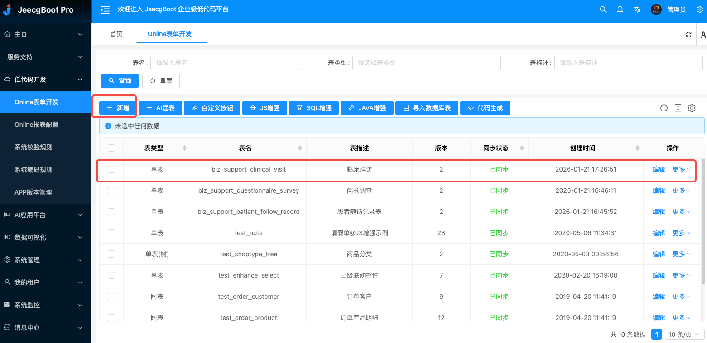
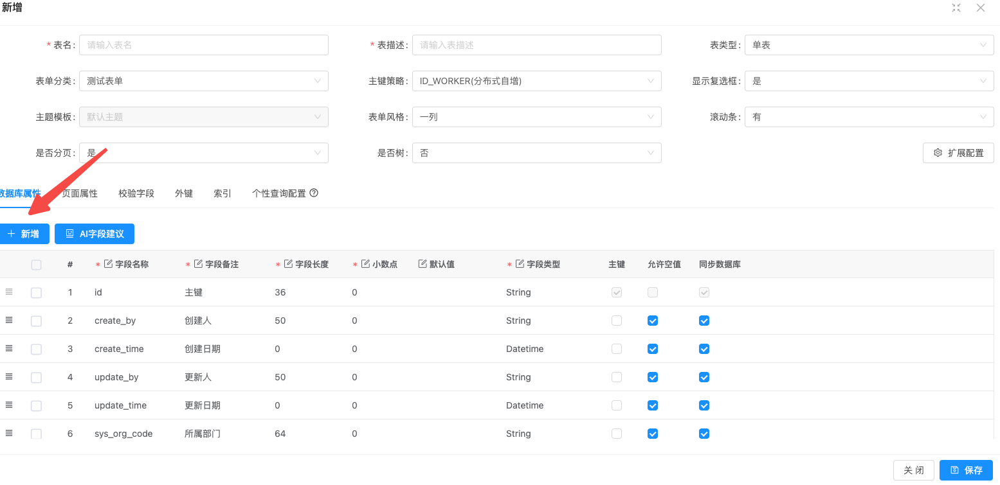
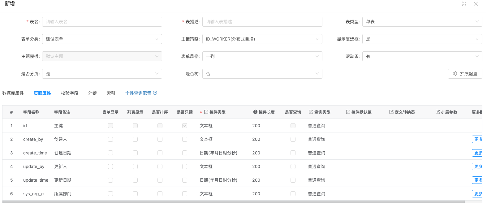
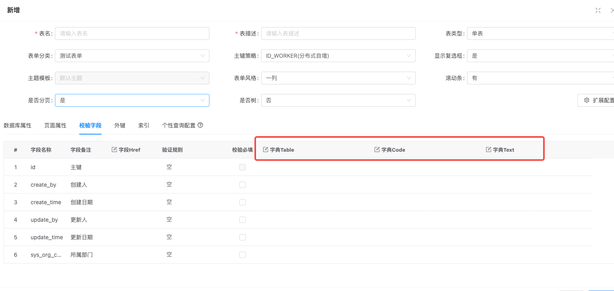
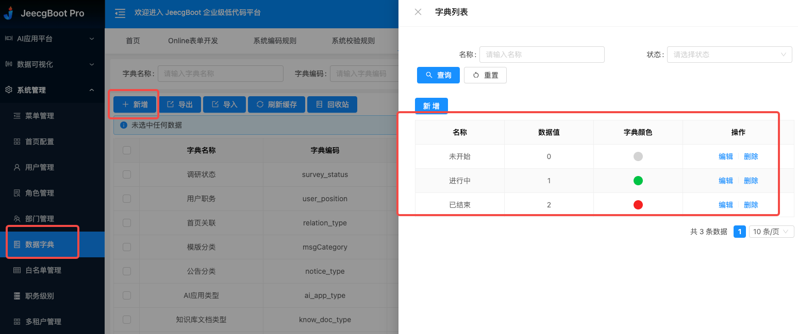
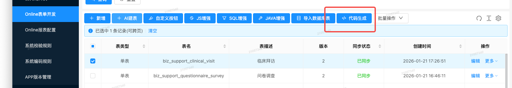
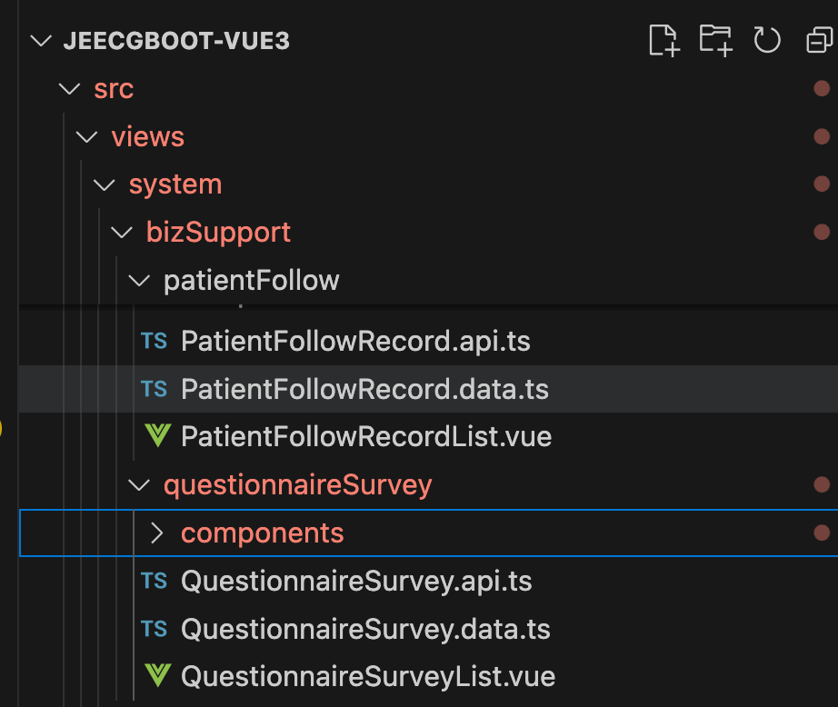

# 笔记-online配置功能

这个功能可以直接在线可视化建立数据库表。同时配合【代码生成】一键生成完整前后端代码。

## 步骤

方式1：可以复制已有类似功能代码，进行手动复制前后端代码,修改命名，具体操作可以看视频学习。

方式2：

1. 进入表单开发页面 
2. 添加新表单，可以手动配置数据库属性 
3. 可以配置前端对应的ui样式，比如选择框、日期等。
4. 可以配置数据关联（字典配置必须与字典列表中的匹配上），比如选择框的sex属性可以录入
5. 字典配置，这样在ui显示选择框直接匹配对于的值。
6. 在onlie表单开发页面，选中你新建的表，点击生成代码,下载
7. 前端配置（生成的Vue3目录就是web端，将代码复制到项目里，位置不做要求），同时执行sql语句，将新功能录入权限管理表
8. 后端配置(vue3,uniapp 外的文件就是后端代码，直接复制到项目下，位置不做要求)
9. 移动端配置，同前端一样。
