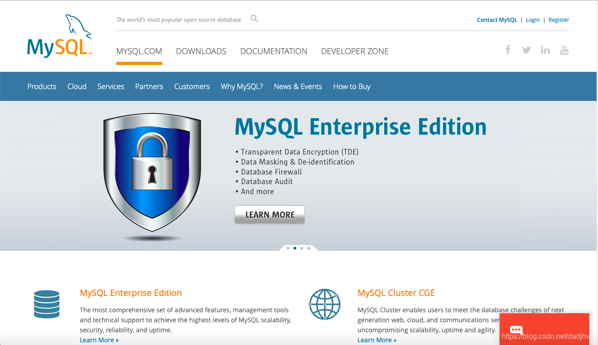
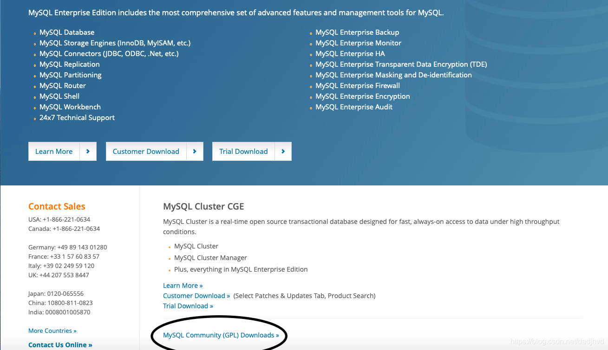
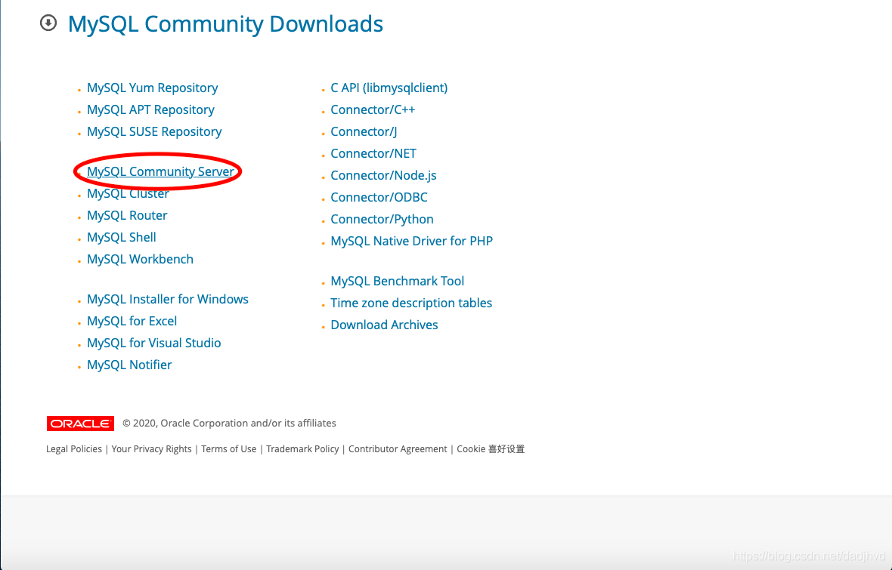
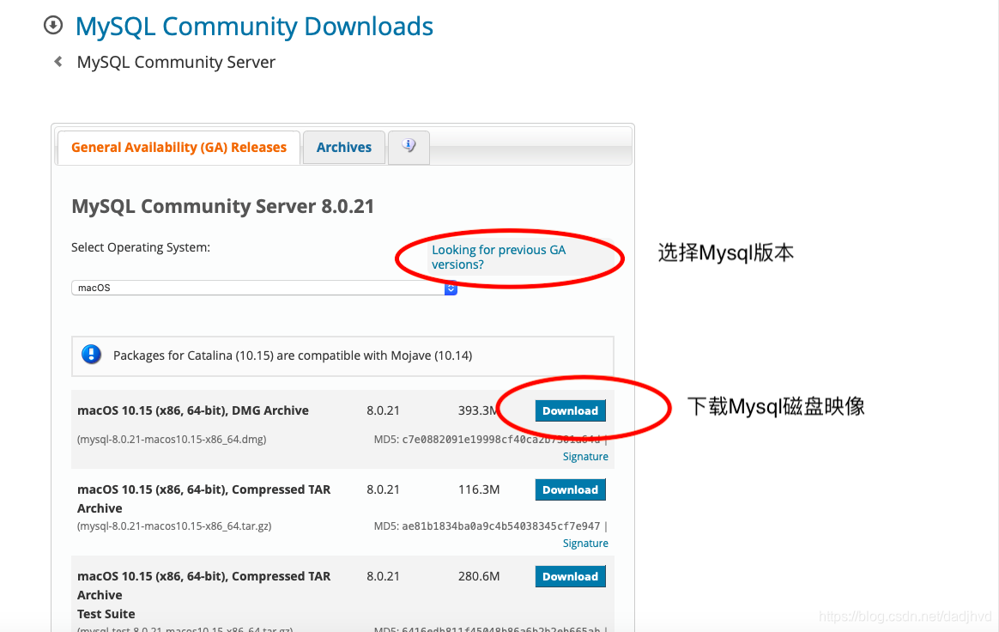

# 安装

## mac 示例

1. 访问：[官网](https://www.mysql.com/)
2. 按流程下载：
    
    
    
    
3. 按提示流程安装，命令安装`mysqld --initialize-insecure`、`mysqld -install`；卸载 `mysqld -remove mysql`
4. 配置`.bash_profile` 作为全局可访问
5. `mysql -u root password 密码` 修改MySQL的管理员密码
6. `mysql -u root -p密码 -h 数据库ip -P端口号` 登录，`-p`登录密码,`-h`,`-P` 如果是本地mysql可省略不写；`exit`退出数据库
7. `net start mysql` 启动MySQL服务；`net stop mysql` 停止

有mysql可视化工具。
