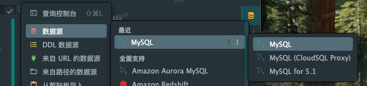
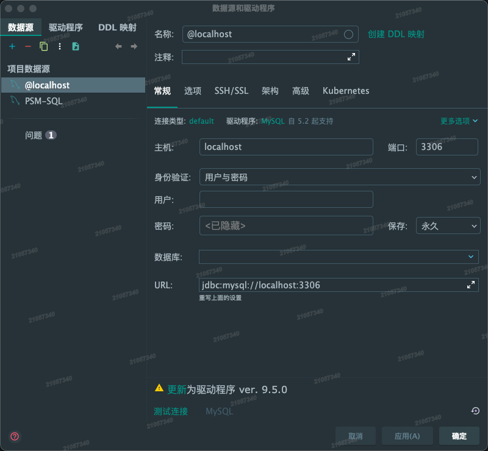
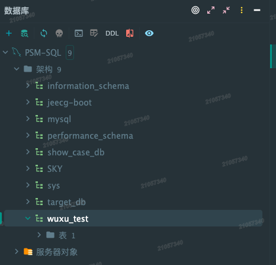
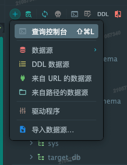

# IDEA使用Mysql

## 1. 打开Mysql面板

## 2.MySQL 数据源配置界面

这个界面是IDE（比如IntelliJ IDEA）里的**MySQL数据源配置界面**，用来设置连接MySQL数据库的参数，下面逐个解释每个选项的含义，以及对应的MySQL终端命令参数：

### 1. 基础标识（和MySQL命令无关，是IDE的配置标识）

- **名称/注释**：
  只是给这个数据源配置起的“别名/备注”，方便你区分多个数据源，和MySQL本身的命令没有关联。

### 2. 「常规」标签下的核心配置（对应MySQL连接命令的参数）

MySQL终端连接命令的基本格式是：
`mysql -h 主机地址 -P 端口 -u 用户名 -p密码 数据库名`
下面的配置对应这个命令里的参数：

| 界面选项       | 含义&对应MySQL命令参数 |
|----------------|------------------------|
| **驱动程序**   | 是连接MySQL的JDBC驱动包（比如`mysql-connector-java`），对应JDBC代码里的驱动类（如`com.mysql.cj.jdbc.Driver`）；和终端命令无关，但这是Java程序连接MySQL的“桥梁”。 |
| **主机**       | MySQL服务所在的主机地址，对应命令里的 `-h 主机地址`（比如这里的`localhost`对应`-h localhost`）。 |
| **端口**       | MySQL服务的监听端口（默认3306），对应命令里的 `-P 端口`（这里的`3306`对应`-P 3306`）。 |
| **身份验证**   | 这里选的“用户与密码”是MySQL最常用的认证方式，对应命令里的用户名+密码认证逻辑。 |
| **用户**       | MySQL的登录用户名，对应命令里的 `-u 用户名`（比如填`root`就对应`-u root`）。 |
| **密码**       | MySQL用户的登录密码，对应命令里的 `-p密码`（比如密码是`123456`就对应`-p123456`）。 |
| **数据库**     | 要默认连接的具体数据库名，对应命令里末尾的“数据库名”（比如填`test`就对应命令最后加`test`，等价于连接后执行`use test;`）。 |
| **URL**        | 是JDBC连接MySQL的标准字符串（格式：`jdbc:mysql://主机:端口/数据库?参数`），相当于把“主机、端口、数据库”等参数整合到一个字符串里（比如完整URL`jdbc:mysql://localhost:3306/test`就包含了主机、端口、数据库），对应JDBC代码里的连接URL。 |

### 其他功能按钮

- **测试连接**：IDE帮你验证当前配置是否能成功连接MySQL，等价于在终端执行`mysql -h 主机 -P 端口 -u 用户 -p密码 数据库`并检查是否能连通。
- **驱动程序更新提示**：提示你更新JDBC驱动包到最新版本（ver.9.5.0），更新后能更好适配MySQL新版本。

## 3.数据库列表界面

## 4.进入查询控制台，即可输入数据库指令

