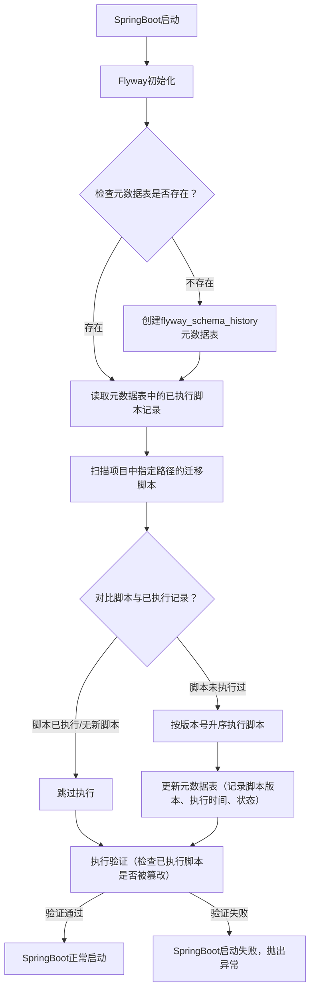

# Flyway 升级

## 一、Flyway 核心定位与解决的问题

Flyway是一款**开源的数据库版本控制工具**，遵循“约定优于配置”的原则，将数据库的所有变更（建表、加字段、改索引、初始化基础数据）都写成**版本化的SQL脚本**，应用启动时自动检测并执行未执行过的脚本，同时记录执行日志，保证：

- 所有数据库变更可追溯、可审计；
- 多环境（开发/测试/生产）数据库结构完全一致；
- 避免手动执行SQL的漏执行、重复执行、顺序错误等问题；
- 应用启动时自动完成数据库同步，无需人工介入。

## 二、Flyway 核心概念（理解的关键）

在使用Flyway前，必须先掌握这几个核心概念：

| 概念                | 通俗解释                                                                 | 核心作用                                                                 |
|---------------------|--------------------------------------------------------------------------|--------------------------------------------------------------------------|
| 元数据表（flyway_schema_history） | Flyway自动创建的系统表，存储所有迁移脚本的执行记录                       | 记录脚本版本、执行时间、状态（成功/失败）、作者等，避免重复执行脚本       |
| 迁移脚本            | 按Flyway规则命名的SQL/Java脚本，包含数据库变更逻辑                       | 数据库变更的载体，是版本化管理的核心                                     |
| 版本号规则          | 脚本命名的核心规范：`V{版本号}__{描述}.sql`（如V1.0.0__init_table.sql） | 定义脚本执行顺序，Flyway按版本号升序执行                                 |
| 基线（Baseline）    | 为已有数据的数据库设置“初始版本”，避免对历史表执行初始化脚本             | 适配“中途接入Flyway”的老项目                                             |
| 迁移（Migration）   | Flyway执行脚本的核心动作，包括“普通迁移”“重复迁移”“撤销迁移”等           | 完成数据库结构/数据的变更                                               |
| 验证（Validate）    | 检查已执行脚本的内容是否被修改，若修改则报错                             | 防止已执行的脚本被篡改，保证数据库变更的一致性                           |

## 三、Flyway 核心执行流程（可视化）

Flyway的执行逻辑非常清晰，应用启动时会按以下步骤完成数据库同步：



## 四、SpringBoot 集成 Flyway 完整实操（核心）

这是最常用的场景，以下步骤可直接复制落地：

### 步骤1：引入依赖（Maven/Gradle）

```xml
<!-- Maven 依赖（SpringBoot 2.x/3.x通用，版本建议选稳定版如9.22.3） -->
<dependency>
    <groupId>org.flywaydb</groupId>
    <artifactId>flyway-core</artifactId>
    <version>9.22.3</version>
</dependency>
<!-- 数据库驱动（以MySQL为例，已引入则无需重复） -->
<dependency>
    <groupId>mysql</groupId>
    <artifactId>mysql-connector-java</artifactId>
    <scope>runtime</scope>
</dependency>
```

### 步骤2：核心配置（application.yml）

Flyway的配置项很多，以下是**生产环境最常用的核心配置**，注释已标注用途：

```yaml
spring:
  # 数据库连接配置（必须，Flyway依赖此连接操作数据库）
  datasource:
    url: jdbc:mysql://127.0.0.1:3306/xxx_db?useUnicode=true&characterEncoding=UTF-8&serverTimezone=Asia/Shanghai
    username: root
    password: your_password
    driver-class-name: com.mysql.cj.jdbc.Driver
  # Flyway核心配置
  flyway:
    enabled: true                          # 是否开启Flyway（生产环境建议开启）
    baseline-on-migrate: true              # 对已有数据的数据库执行baseline（老项目接入必备）
    baseline-version: 1.0.0                # 基线版本（老项目初始版本）
    baseline-description: "初始化基线"      # 基线描述
    clean-disabled: true                   # 禁止执行clean命令（生产环境必须设为true，避免清空数据库）
    validate-on-migrate: true              # 迁移前验证脚本（已执行脚本被篡改则报错）
    encoding: UTF-8                        # 脚本编码
    locations: classpath:db/migration      # 脚本存放路径（默认，可自定义）
    out-of-order: false                    # 禁止乱序执行（必须按版本号升序）
    ignore-missing-migrations: false       # 忽略缺失的迁移脚本（生产环境设为false）
    ignore-future-migrations: true         # 忽略未来版本的脚本（如测试库有更高版本，生产暂不执行）
    connect-retries: 3                     # 数据库连接失败重试次数
    # 自定义元数据表名（默认flyway_schema_history，可修改避免冲突）
    # table: flyway_schema_history_xxx
```

### 步骤3：迁移脚本编写规范（核心中的核心）

Flyway对脚本命名有严格的**约定规则**，错误的命名会导致脚本无法执行，核心命名格式如下：

| 脚本类型       | 命名格式                          | 示例                          | 作用                                                                 |
|----------------|-----------------------------------|-------------------------------|----------------------------------------------------------------------|
| 版本迁移脚本   | `V{版本号}__{描述}.sql`           | V1.0.0__init_table.sql        | 核心变更脚本，按版本号升序执行，**只能执行一次**                     |
| 重复迁移脚本   | `R{版本号}__{描述}.sql`           | R1.0.0__refresh_dict.sql      | 每次应用启动都会执行（适合刷新基础数据、重新计算统计值等）           |
| 撤销迁移脚本   | `U{版本号}__{描述}.sql`           | U1.0.1__rollback_add_phone.sql| 回滚指定版本的变更（需开启undo功能，Flyway Pro/Enterprise版本支持） |
| 基线脚本       | 无特殊格式，通过baseline命令指定  | -                             | 为老数据库设置初始版本时使用                                         |

#### 脚本编写示例：

1. **版本迁移脚本（V1.0.0__init_table.sql）**

```sql
-- 初始化用户表
CREATE TABLE IF NOT EXISTS `sys_user` (
  `id` bigint NOT NULL AUTO_INCREMENT COMMENT '主键ID',
  `username` varchar(50) NOT NULL COMMENT '用户名',
  `password` varchar(100) NOT NULL COMMENT '加密密码',
  `create_time` datetime DEFAULT CURRENT_TIMESTAMP COMMENT '创建时间',
  PRIMARY KEY (`id`),
  UNIQUE KEY `uk_username` (`username`)
) ENGINE=InnoDB DEFAULT CHARSET=utf8mb4 COMMENT='系统用户表';

-- 初始化基础字典数据（基础数据随结构脚本同步）
INSERT INTO `sys_dict` (`dict_type`, `dict_code`, `dict_label`, `sort`)
VALUES 
('user_status', '0', '禁用', 1),
('user_status', '1', '启用', 2)
ON DUPLICATE KEY UPDATE dict_label=VALUES(dict_label), sort=VALUES(sort);
-- 用ON DUPLICATE KEY避免重复插入，多次执行也安全
```

2. **版本迁移脚本（V1.0.1__add_user_phone.sql）**

```sql
-- 给用户表添加手机号字段
ALTER TABLE `sys_user` 
ADD COLUMN `phone` varchar(20) DEFAULT NULL COMMENT '手机号' 
AFTER `password`;

-- 添加手机号索引
CREATE INDEX `idx_user_phone` ON `sys_user`(`phone`);
```

3. **重复迁移脚本（R1.0.0__refresh_user_status.sql）**

```sql
-- 每次启动刷新禁用超期用户状态（示例）
UPDATE `sys_user` 
SET `status` = '0' 
WHERE `last_login_time` < DATE_SUB(NOW(), INTERVAL 90 DAY) 
AND `status` = '1';
```

### 步骤4：启动验证

将SpringBoot项目打包启动（或本地启动），控制台会打印Flyway执行日志，示例如下：

```
# Flyway初始化
Flyway Community Edition 9.22.3 by Redgate
# 扫描到的脚本
Database: jdbc:mysql://127.0.0.1:3306/xxx_db (MySQL 8.0)
Found non-empty schema(s) `xxx_db` but no schema history table. Creating it now with baseline version 1.0.0.
# 执行V1.0.0脚本
Successfully baselined schema with version: 1.0.0
Migrating schema `xxx_db` to version "1.0.0 - init table"
# 执行V1.0.1脚本
Migrating schema `xxx_db` to version "1.0.1 - add user phone"
# 执行成功
Successfully applied 2 migrations to schema `xxx_db`, now at version v1.0.1 (execution time 00:00:01.234)
```

启动后查看数据库，会发现：

- 自动创建`flyway_schema_history`表，记录脚本执行记录；
- `sys_user`表已创建且包含`phone`字段；
- 基础字典数据已插入。

## 四、Flyway 核心功能详解

### 1. 基线（Baseline）

**适用场景**：老项目中途接入Flyway，数据库已有表结构，无需执行初始化脚本。
**操作方式**：

- 配置文件中设置`baseline-on-migrate: true`，Flyway启动时自动为现有数据库设置基线版本；
- 手动执行（命令行）：`flyway baseline -baselineVersion=1.0.0 -baselineDescription="初始基线"`。

### 2. 迁移（Migrate）

Flyway的核心动作，启动时自动执行，也可手动触发：

- **普通迁移**：执行未执行的版本脚本（V开头），按版本号升序；
- **重复迁移**：每次启动执行R开头的脚本；
- **undo迁移**：回滚已执行的脚本（需Flyway Pro/Enterprise版本，社区版无此功能，下文会讲社区版回滚方案）。

### 3. 验证（Validate）

检查已执行脚本的内容是否被篡改（比如有人手动修改了V1.0.0.sql的内容），若篡改则报错，阻止应用启动：

```
Validation failed: Migrations have been applied to the database that are not present in the classpath
```

生产环境必须开启`validate-on-migrate: true`，防止脚本被恶意/误修改。

### 4. 清理（Clean）

删除数据库中所有表（包括数据和结构），**生产环境必须禁用**（`clean-disabled: true`），仅用于开发/测试环境重置数据库。

### 5. 信息（Info）

查看所有脚本的执行状态（已执行/未执行/失败），可通过命令行执行：

```bash
flyway info
```

输出示例：

```
+-----------+---------+---------------------+------+----------------+---------+
| Version   | Type    | Description         | State| Execution Time | Undoable|
+-----------+---------+---------------------+------+----------------+---------+
| 1.0.0     | SQL     | init table          | SUCCESS | 1.234s        | false   |
| 1.0.1     | SQL     | add user phone      | SUCCESS | 0.567s        | false   |
| 1.0.2     | SQL     | add user email      | PENDING | -             | false   |
+-----------+---------+---------------------+------+----------------+---------+
```

## 五、Flyway 高级用法（生产环境常用）

### 1. 多环境配置（开发/测试/生产）

不同环境的脚本可放在不同目录，通过SpringProfile区分：

```yaml
# application-dev.yml（开发环境）
spring:
  flyway:
    locations: classpath:db/migration/dev
# application-test.yml（测试环境）
spring:
  flyway:
    locations: classpath:db/migration/test
# application-prod.yml（生产环境）
spring:
  flyway:
    locations: classpath:db/migration/prod
```

脚本目录结构：

```
resources/
└── db/
    └── migration/
        ├── dev/       # 开发环境专属脚本（如测试数据）
        │   └── V1.0.0__init_test_data.sql
        ├── test/      # 测试环境专属脚本
        │   └── V1.0.0__init_test_data.sql
        └── prod/      # 生产环境脚本（无测试数据）
            ├── V1.0.0__init_table.sql
            └── V1.0.1__add_user_phone.sql
```

### 2. 集群部署适配

多实例部署时，Flyway通过**数据库锁**保证同一脚本只执行一次（底层用`SELECT ... FOR UPDATE`加锁），无需额外配置，只需保证所有实例连接同一个数据库即可。

### 3. 社区版回滚方案（替代Undo）

Flyway社区版不支持U开头的撤销脚本，生产环境回滚建议：

- 编写**反向脚本**：每个版本脚本对应一个反向脚本，示例：
  - 正向脚本：V1.0.1__add_user_phone.sql（加字段）
  - 反向脚本：V1.0.2__rollback_add_user_phone.sql（删字段）
- 执行反向脚本：将反向脚本命名为更高版本，启动应用自动执行，或手动执行。

### 4. 自定义脚本位置

若不想用默认的`classpath:db/migration`，可自定义：

```yaml
spring:
  flyway:
    # 多个位置用逗号分隔
    locations: classpath:sql/migration,file:/opt/sql/migration
```

支持两种路径类型：

- `classpath:`：项目内的资源文件（打包到jar中）；
- `file:`：服务器本地文件（适合生产环境手动放脚本）。

### 5. 忽略指定表

若数据库中有无需Flyway管理的表，可配置忽略：

```yaml
spring:
  flyway:
    ignore-table: [sys_log, temp_table]
```

## 六、生产环境最佳实践 & 避坑要点

### 1. 核心最佳实践

- **脚本一旦执行，禁止修改**：若需调整，新增更高版本的脚本（如V1.0.2__fix_user_phone.sql），绝对不能改已执行的V1.0.1.sql；
- **脚本小步快跑**：大变更拆分成多个小版本脚本（如先加字段，再加索引，再初始化数据），降低风险；
- **执行前备份**：生产环境执行变更前，必须全量备份数据库（如mysqldump）；
- **低峰期执行**：选择业务低峰期（如凌晨）部署，避免变更影响业务；
- **脚本先在测试环境验证**：所有脚本必须在测试环境执行通过，再放到生产环境。

### 2. 常见坑点

- **脚本命名错误**：版本号用下划线（_）而非点（.）、描述用双下划线（__）而非单下划线，如错误：V1_0_0_init_table.sql（正确：V1.0.0__init_table.sql）；
- **编码不一致**：脚本文件编码不是UTF-8，导致中文注释乱码（配置`encoding: UTF-8`）；
- **权限不足**：应用连接数据库的账号没有建表/改表权限，导致脚本执行失败；
- **重复执行插入数据**：未用`ON DUPLICATE KEY`，导致重复插入数据报错；
- **大表变更锁表**：给大表加字段/索引时，未用`ALTER TABLE ... ALGORITHM=INPLACE`（MySQL），导致锁表影响业务。

## 总结

1. Flyway核心是**版本化管理数据库变更脚本**，SpringBoot启动时自动执行未执行的脚本，通过元数据表记录执行状态；
2. 脚本命名必须遵循`V{版本号}__{描述}.sql`规则，生产环境禁用clean、开启validate；
3. 社区版无原生undo功能，需编写反向脚本实现回滚，所有变更需小步快跑、先测后投；
4. 多环境可通过SpringProfile区分脚本目录，集群部署无需额外配置（依赖数据库锁）。

如果需要针对特定数据库（如PostgreSQL/Oracle）的Flyway配置，或生产环境集群部署的具体实操，我可以再细化讲解～
