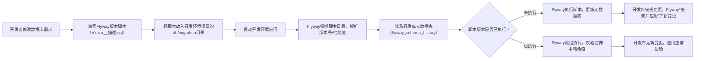

# Flyway怎么觉察数据库变更

## 问题

Flyway 怎么察觉开发版服务数据库的变化，以及在部署到生产服务器上时怎么进行数据库的处理的?

## 解决

你想知道Flyway是如何感知开发环境数据库的变更，以及在项目部署到生产服务器时，该如何基于这些变更安全地处理生产数据库——核心逻辑是：Flyway并非“主动监控”数据库变化，而是通过**版本化脚本+元数据表对比**感知待执行的变更；生产部署时则围绕“脚本验证、数据备份、可控执行、可回滚”的原则处理数据库，保证变更安全落地。

### 一、Flyway如何“察觉”开发环境的数据库变化

Flyway的核心是「**脚本驱动变更**」，它不会实时监控数据库的修改，而是通过“开发者编写变更脚本→Flyway对比脚本与元数据表”的方式，感知哪些变更还未应用到数据库。具体流程如下：

#### 1. 开发环境数据库变更的核心流程（Flyway感知变更的前提）

开发者在开发过程中对数据库的任何修改（建表、加字段、改索引等），都必须写成**Flyway规范的版本化脚本**（这是Flyway能感知变更的基础），而非手动改库后“让Flyway去发现”。完整流程：



#### 2. Flyway“察觉”变更的核心机制

Flyway启动时，通过以下步骤发现“待执行的数据库变更”：

- **步骤1：扫描脚本**：读取项目中`db/migration`目录下的所有脚本，解析出每个脚本的版本号、类型（V/R开头）、内容哈希值；
- **步骤2：对比元数据表**：查询开发库中的`flyway_schema_history`表（Flyway自动创建的“账本”），获取已执行的脚本版本和哈希值；
- **步骤3：识别差异**：
  - 若扫描到的脚本版本号**高于**元数据表中的最高版本 → 判定为“新变更”，需要执行；
  - 若同版本脚本的哈希值与元数据表中记录的不一致 → 判定为“脚本被篡改”，直接报错（开发环境可按需调整，但不建议）；
  - 若所有脚本都已执行且哈希值一致 → 判定为“无新变更”。

#### 3. 开发环境的便捷操作（辅助感知/验证变更）

- **重复执行脚本（R开头）**：若开发中需频繁刷新基础数据（如字典、测试数据），可写`R`开头的重复脚本，Flyway每次启动都会执行，无需改版本号；
- **Clean功能（仅开发/测试环境）**：若开发中想重置数据库（删除所有表，重新执行所有脚本），可开启`flyway.clean-disabled: false`，执行`flyway clean`后重启应用，Flyway会重新执行所有脚本，快速同步最新变更；
- **Info命令**：执行`flyway info`可直观看到“已执行脚本”和“待执行脚本”，清晰感知哪些变更未应用。

### 二、部署到生产服务器时的数据库处理流程

生产环境的核心原则是「**安全第一、可回滚、最小影响**」，所有数据库变更必须先在测试环境验证，再落地生产。完整流程如下：

#### 前置准备：开发→测试环境的变更验证（生产落地的前提）

1. 将开发环境的变更脚本同步到测试环境项目中；
2. 启动测试环境应用，让Flyway自动执行脚本，验证：
   - 脚本无语法错误（如字段类型不兼容、索引名重复）；
   - 变更后业务功能正常（如接口能正常读写新字段）；
   - 脚本执行性能（如大表加索引是否锁表）；
3. 确认测试库与开发库的结构/数据一致，无异常后，再准备生产部署。

#### 步骤1：生产部署前的安全准备（核心）

- **全量备份生产数据库**：这是生产变更的“最后一道防线”，必须执行！

  ```bash
  # 以MySQL为例，备份整个数据库
  mysqldump -h生产库IP -u生产账号 -p 数据库名 > prod_backup_20260123.sql
  ```

- **确认生产环境Flyway配置**（禁用危险功能，保证安全）：

  ```yaml
  spring:
    flyway:
      enabled: true
      clean-disabled: true  # 生产必须禁用clean（防止清空数据库）
      validate-on-migrate: true  # 必须开启（防脚本篡改）
      out-of-order: false  # 禁止乱序执行脚本
      ignore-future-migrations: true  # 忽略测试库有但生产暂不执行的高版本脚本
  ```

- **选择业务低峰期**：如凌晨2-4点，此时业务流量最小，变更影响范围最低。

#### 步骤2：生产环境数据库变更的执行（两种方式，按需选择）

根据变更风险选择执行方式，小变更自动执行，大变更手动执行：

| 执行方式       | 适用场景                          | 操作流程                                                                 |
|----------------|-----------------------------------|--------------------------------------------------------------------------|
| 自动执行（推荐） | 小变更（加字段、小表加索引、基础数据插入） | 1. 打包包含新脚本的项目jar包；<br>2. 上传到生产服务器，启动应用；<br>3. Flyway自动扫描脚本→对比元数据表→执行未执行的脚本→更新元数据表→验证哈希值；<br>4. 应用启动完成。 |
| 手动执行（安全） | 大变更（分表、大表加索引、数据迁移） | 1. 从项目中提取待执行的V版本脚本；<br>2. 生产库账号临时赋权（仅保留改库权限）；<br>3. 按版本号升序手动执行脚本；<br>4. 执行完成后回收账号权限；<br>5. 启动/重启应用，Flyway验证脚本哈希值（确认执行成功）。 |

#### 步骤3：生产部署后的验证（必做）

- **验证数据库变更**：登录生产库，检查：
  - `flyway_schema_history`表中新增脚本的`success`字段为`true`；
  - 表结构/字段/索引与预期一致（如`desc sys_user`查看是否新增`phone`字段）；
  - 基础数据已正确插入（如字典表数据）。
- **验证应用功能**：调用核心接口（如用户注册、订单创建），确认无数据库相关报错（如`Unknown column 'phone' in 'field list'`）；
- **监控业务日志**：观察10-30分钟，确认无数据库连接、SQL执行异常。

#### 步骤4：生产变更失败的回滚预案（核心保障）

若变更执行失败或导致业务异常，立即按以下优先级处理：

1. **执行反向脚本**：每个变更脚本对应一个反向脚本（如`V1.0.2__add_user_phone.sql`对应`V1.0.3__rollback_add_user_phone.sql`），执行反向脚本回滚变更；
2. **恢复数据库备份**：若反向脚本无法解决问题（如数据污染），停止应用，用之前的备份恢复生产库：

   ```bash
   mysql -h生产库IP -u生产账号 -p 数据库名 < prod_backup_20260123.sql
   ```

3. **回滚应用版本**：恢复到变更前的应用版本，保证应用与数据库结构匹配。

### 三、开发/生产环境的Flyway配置差异（关键避坑）

| 配置项                | 开发环境                | 生产环境                | 原因                                                                 |
|-----------------------|-------------------------|-------------------------|----------------------------------------------------------------------|
| clean-disabled        | false（可重置数据库）| true（禁止清空）| 生产库数据不可丢失，禁用clean防止误操作                             |
| validate-on-migrate   | true（可选）| true（必须）| 生产环境防止已执行脚本被篡改，保证变更一致性                         |
| out-of-order          | true（允许乱序调试）| false（禁止乱序）| 生产环境必须按版本号升序执行，避免变更顺序错误                       |
| locations             | classpath:db/migration/dev | classpath:db/migration/prod | 开发环境包含测试数据脚本，生产环境仅保留核心结构/基础数据脚本         |
| baseline-on-migrate   | true                    | true                    | 适配老项目接入Flyway的场景                                           |

### 总结

1. Flyway感知开发库变化的核心是「**版本脚本+元数据表对比**」：开发者需将所有数据库变更写进规范脚本，Flyway启动时通过对比脚本与元数据表，发现并执行未应用的变更；
2. 生产部署处理数据库的核心原则是「**先验证、再备份、低峰执行、全程可回滚**」：
   - 小变更：打包项目后让Flyway自动执行脚本；
   - 大变更：手动执行脚本，且必须先在测试环境验证；
3. 生产环境禁用clean、开启验证，所有变更需有反向脚本/备份作为回滚预案，避免数据丢失或业务异常。
