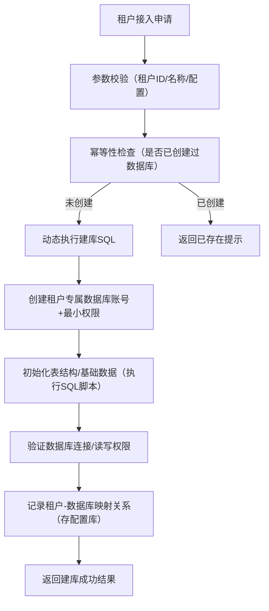

# saas自动配置表

你想知道在SaaS服务中，当新接入一家公司（租户）时，如何**自动化、规范化地动态创建该公司专属的独立数据库**（而非手动登录MySQL执行`CREATE DATABASE`），核心是实现“租户接入→参数校验→自动建库→权限配置→初始化→验证”的全流程自动化，下面结合实战方案和代码示例详细说明：

## 一、动态创建租户数据库的核心流程

整个过程需保证**安全性、幂等性、可追溯性**，流程如下：



## 二、实战实现（以Spring Boot + MySQL为例）

### 1. 前置准备

#### （1）数据库命名规范（核心：唯一、易识别）

制定统一的命名规则，避免冲突和混乱：

```
数据库名：saas_tenant_{租户唯一标识} （比如 saas_tenant_10001、saas_tenant_alibaba）
数据库账号：tenant_{租户唯一标识}_user （比如 tenant_10001_user）
```

- 租户唯一标识：优先用**数字租户ID**（如10001），避免中文/特殊字符；
- 禁止用租户名称直接作为库名（比如“腾讯科技”含特殊字符，易报错）。

#### （2）准备“建库专用账号”

创建一个仅用于“建库/赋权”的MySQL账号（避免用root，遵循最小权限原则）：

```sql
-- 创建建库专用账号（仅允许应用服务器IP登录）
CREATE USER 'saas_admin'@'192.168.1.%' IDENTIFIED BY '你的安全密码';
-- 授予建库、创建用户、赋权的最小权限
GRANT CREATE, CREATE USER, GRANT OPTION ON *.* TO 'saas_admin'@'192.168.1.%';
-- 刷新权限
FLUSH PRIVILEGES;
```

### 2. 核心代码实现（Spring Boot）

#### （1）定义租户建库参数DTO

封装租户接入的核心参数，做基础校验：

```java
import lombok.Data;
import javax.validation.constraints.NotBlank;
import javax.validation.constraints.Pattern;

@Data
public class TenantDbCreateDTO {
    /** 租户唯一ID（数字，如10001） */
    @NotBlank(message = "租户ID不能为空")
    @Pattern(regexp = "^\\d+$", message = "租户ID仅支持数字")
    private String tenantId;
    
    /** 租户名称（用于备注） */
    @NotBlank(message = "租户名称不能为空")
    private String tenantName;
    
    /** 数据库字符集（默认utf8mb4） */
    private String charset = "utf8mb4";
    
    /** 数据库校对规则（默认utf8mb4_unicode_ci） */
    private String collation = "utf8mb4_unicode_ci";
}
```

#### （2）核心建库服务类

实现“建库→创建账号→赋权→初始化”的核心逻辑，注意**防SQL注入、异步执行**：

```java
import org.springframework.beans.factory.annotation.Autowired;
import org.springframework.jdbc.core.JdbcTemplate;
import org.springframework.scheduling.annotation.Async;
import org.springframework.stereotype.Service;
import org.springframework.util.Assert;

import java.util.UUID;

@Service
public class TenantDbService {
    // 建库专用的JdbcTemplate（配置saas_admin账号）
    @Autowired
    private JdbcTemplate saasAdminJdbcTemplate;
    
    // 租户配置库的JdbcTemplate（存储租户-数据库映射关系，独立库）
    @Autowired
    private JdbcTemplate configJdbcTemplate;

    /**
     * 异步创建租户数据库（避免阻塞接口）
     * @param dto 租户建库参数
     */
    @Async
    public void createTenantDatabase(TenantDbCreateDTO dto) {
        // 1. 幂等性检查：判断数据库是否已存在
        String dbName = getDbName(dto.getTenantId());
        if (isDatabaseExists(dbName)) {
            throw new RuntimeException("租户数据库已存在：" + dbName);
        }

        // 2. 动态创建数据库
        String createDbSql = String.format(
            "CREATE DATABASE IF NOT EXISTS %s CHARACTER SET %s COLLATE %s",
            dbName, dto.getCharset(), dto.getCollation()
        );
        saasAdminJdbcTemplate.execute(createDbSql);

        // 3. 创建租户专属数据库账号（密码随机生成，存储到配置库）
        String tenantDbUser = "tenant_" + dto.getTenantId() + "_user";
        String tenantDbPwd = generateRandomPwd(); // 生成随机密码（如32位UUID）
        String createUserSql = String.format(
            "CREATE USER IF NOT EXISTS '%s'@'192.168.1.%%' IDENTIFIED BY '%s'",
            tenantDbUser, tenantDbPwd
        );
        saasAdminJdbcTemplate.execute(createUserSql);

        // 4. 给租户账号赋权（仅当前数据库的增删改查权限，最小权限）
        String grantSql = String.format(
            "GRANT SELECT, INSERT, UPDATE, DELETE ON %s.* TO '%s'@'192.168.1.%%'",
            dbName, tenantDbUser
        );
        saasAdminJdbcTemplate.execute(grantSql);
        saasAdminJdbcTemplate.execute("FLUSH PRIVILEGES");

        // 5. 初始化租户数据库表结构（执行预设的SQL脚本）
        initTenantDbSchema(dbName);

        // 6. 验证数据库可用性（尝试连接并执行简单查询）
        if (!validateTenantDb(dbName, tenantDbUser, tenantDbPwd)) {
            throw new RuntimeException("租户数据库创建失败：连接验证不通过");
        }

        // 7. 记录租户-数据库映射关系（存到配置库，供业务服务调用）
        saveTenantDbConfig(dto.getTenantId(), dbName, tenantDbUser, tenantDbPwd);
    }

    /**
     * 生成数据库名：saas_tenant_10001
     */
    private String getDbName(String tenantId) {
        return "saas_tenant_" + tenantId;
    }

    /**
     * 检查数据库是否已存在
     */
    private boolean isDatabaseExists(String dbName) {
        String sql = "SELECT COUNT(*) FROM INFORMATION_SCHEMA.SCHEMATA WHERE SCHEMA_NAME = ?";
        Integer count = saasAdminJdbcTemplate.queryForObject(sql, Integer.class, dbName);
        return count != null && count > 0;
    }

    /**
     * 生成随机密码（32位UUID）
     */
    private String generateRandomPwd() {
        return UUID.randomUUID().toString().replace("-", "").toLowerCase();
    }

    /**
     * 初始化租户数据库表结构（执行预设的SQL脚本）
     */
    private void initTenantDbSchema(String dbName) {
        // 方式1：执行classpath下的初始化脚本（如schema.sql）
        // Resource schemaResource = new ClassPathResource("sql/tenant_schema.sql");
        // String schemaSql = FileCopyUtils.copyToString(new InputStreamReader(schemaResource.getInputStream()));
        // 替换脚本中的${dbName}占位符，执行SQL...

        // 方式2：调用预设的DDL SQL（示例：创建拜访表）
        String createVisitTableSql = String.format(
            "CREATE TABLE %s.visit (" +
            "id BIGINT PRIMARY KEY AUTO_INCREMENT," +
            "tenant_id VARCHAR(32) NOT NULL," +
            "visit_user VARCHAR(50) NOT NULL," +
            "visit_time DATETIME NOT NULL," +
            "create_time DATETIME DEFAULT CURRENT_TIMESTAMP" +
            ") ENGINE=InnoDB DEFAULT CHARSET=utf8mb4",
            dbName
        );
        saasAdminJdbcTemplate.execute(createVisitTableSql);
    }

    /**
     * 验证租户数据库连接
     */
    private boolean validateTenantDb(String dbName, String user, String pwd) {
        // 构建租户数据库的JDBC连接，执行SELECT 1验证
        // 省略JDBC连接代码，核心是测试连接是否正常
        return true;
    }

    /**
     * 保存租户-数据库映射关系到配置库
     */
    private void saveTenantDbConfig(String tenantId, String dbName, String user, String pwd) {
        String sql = "INSERT INTO saas_tenant_config (tenant_id, db_name, db_user, db_pwd, create_time) " +
                     "VALUES (?, ?, ?, ?, NOW())";
        configJdbcTemplate.update(sql, tenantId, dbName, user, pwd);
    }
}
```

#### （3）对外提供建库接口

```java
import org.springframework.beans.factory.annotation.Autowired;
import org.springframework.validation.annotation.Validated;
import org.springframework.web.bind.annotation.PostMapping;
import org.springframework.web.bind.annotation.RequestBody;
import org.springframework.web.bind.annotation.RestController;

@RestController
public class TenantController {
    @Autowired
    private TenantDbService tenantDbService;

    /**
     * 租户接入：创建专属数据库
     */
    @PostMapping("/tenant/create-db")
    public String createTenantDb(@Validated @RequestBody TenantDbCreateDTO dto) {
        try {
            tenantDbService.createTenantDatabase(dto);
            return "租户数据库创建成功：saas_tenant_" + dto.getTenantId();
        } catch (Exception e) {
            return "创建失败：" + e.getMessage();
        }
    }
}
```

### 3. 关键配置（application.yml）

配置“建库专用JdbcTemplate”和“配置库JdbcTemplate”：

```yaml
spring:
  # 配置库（存储租户-数据库映射关系）
  datasource:
    config:
      driver-class-name: com.mysql.cj.jdbc.Driver
      url: jdbc:mysql://127.0.0.1:3306/saas_config?useUnicode=true&characterEncoding=utf8mb4
      username: root
      password: root123
    # 建库专用数据源（saas_admin账号）
    admin:
      driver-class-name: com.mysql.cj.jdbc.Driver
      url: jdbc:mysql://127.0.0.1:3306/mysql?useUnicode=true&characterEncoding=utf8mb4
      username: saas_admin
      password: saasAdmin@123
```

## 三、核心注意事项

### 1. 安全性

- **避免SQL注入**：禁止直接拼接租户输入的参数（比如租户名称）到SQL中，仅用租户ID（数字）拼接库名；
- **密码管理**：租户数据库密码随机生成，加密存储到配置库（比如用AES加密），不明文存储；
- **IP限制**：租户数据库账号仅允许应用服务器IP登录（如`192.168.1.%`），禁止`%`任意IP。

### 2. 幂等性

- 建库前必须检查“数据库是否已存在”，避免重复创建；
- 接口需支持幂等调用（比如给租户接入请求加唯一请求ID）。

### 3. 性能与异步

- 建库操作必须**异步执行**（用`@Async`），避免阻塞前端接口；
- 初始化表结构时，若脚本量大，分批执行（比如每10条SQL执行一次）。

### 4. 运维与监控

- **日志记录**：记录每一次建库操作的日志（租户ID、库名、创建时间、执行人），方便追溯；
- **监控告警**：监控建库成功率，失败时触发告警（比如钉钉/邮件通知）；
- **备份**：新创建的租户数据库自动加入备份计划（比如每天凌晨全量备份）。

### 5. 扩展与兼容

- 若租户后期需要扩容（比如升级独立服务器），可通过“数据迁移+修改配置库映射关系”实现；
- 建库脚本版本化管理（比如用Flyway），后期可动态升级租户数据库结构。

## 总结

动态创建SaaS租户数据库的核心是：

1. **规范命名**：用租户ID生成唯一库名，避免冲突；
2. **最小权限**：给租户账号仅分配当前库的增删改查权限，不滥用高权限；
3. **自动化+可验证**：异步执行建库流程，执行后验证可用性，记录映射关系；
4. **安全第一**：防注入、加密存储密码、限制登录IP。

这套方案可直接适配“接入新公司→自动建库→业务系统调用”的全流程，若你需要更细化的代码（比如密码加密、动态加载初始化脚本），可以告诉我。
