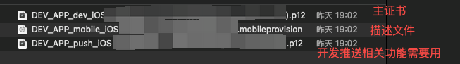

# 导入项目整体流程

1. 下载项目
2. 安装证书：证书是`.p12`文件。证书可以分为开发者、推送证书，同时也需要安装描述文件（这是项目中识别某些配置用的）
    
3. 下载安装配置cocoapods: 这是ios的包管理器，用于管理依赖库
4. 使用cocoapods更新项目依赖。：`pod install --repo-update`(后面的`--repo-update`是配置了更新库，也可以不写)（如果有github库下载问题，可以找一个国内镜像代理地址）
5. pod完成，会在项目根目录生成一个`.xcworkspace`文件，多模块项目需要打开这个文件进行开发。
