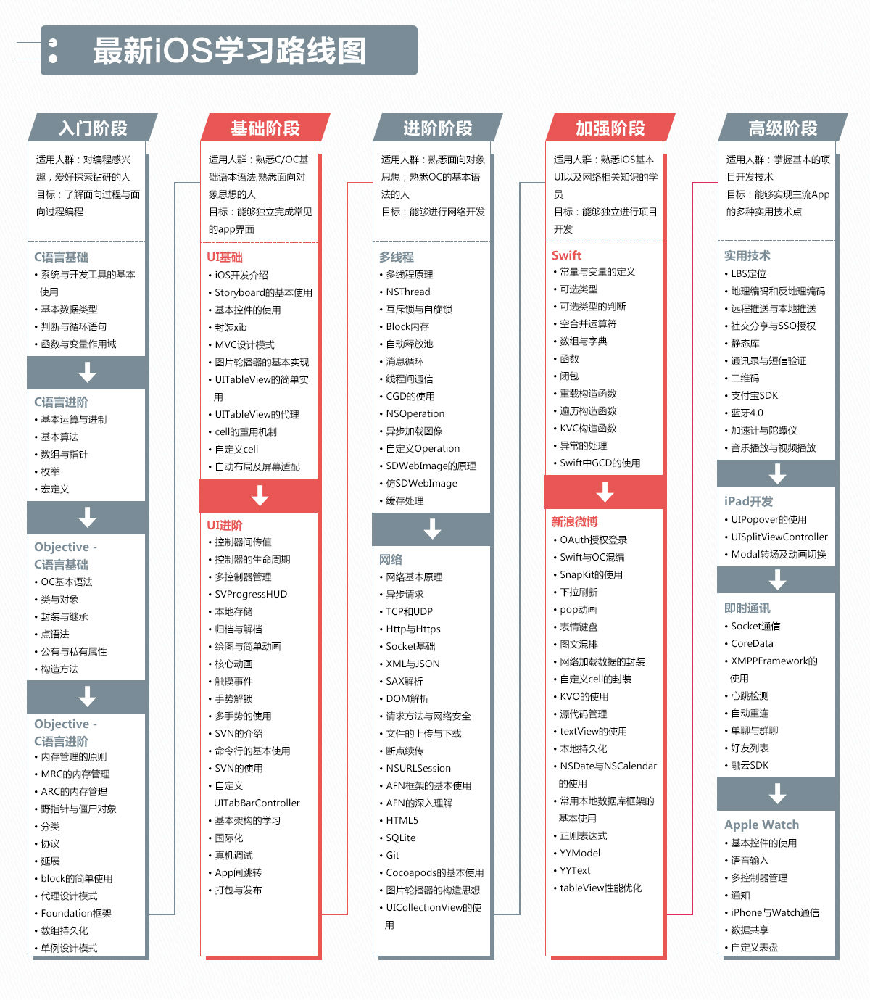

# apple

先学习基础语法，再根据平台(ios,macOS)学习对应UI实现

- [官网](https://developer.apple.com/documentation/)
- [中文官网](https://developer.apple.com/cn/develop/)

开发语言

- Objective-C
- Swift

## 学习路线图

[完整学习路线图](https://www.cnblogs.com/weiboyuan/p/6092320.html)
[OC项目-参考-菜鸟教程-ios](https://www.runoob.com/ios/ios-tutorial.html)
>这个教程很老，仅做参考

如果只要求快速开发应用，掌握以下内容即可：

1. 基础语言：[Objective-C](./Objective-C)、[Swift](./Swift)
2. UI库：UIKit（最基础的库，OC、Swift项目都要用）、snapkit（三方库，使用最多，封装了布局的处理）、SwiftUI（新手直接学这个就行，类似kotlin的compose）
3. 包管理器：cocoapods
