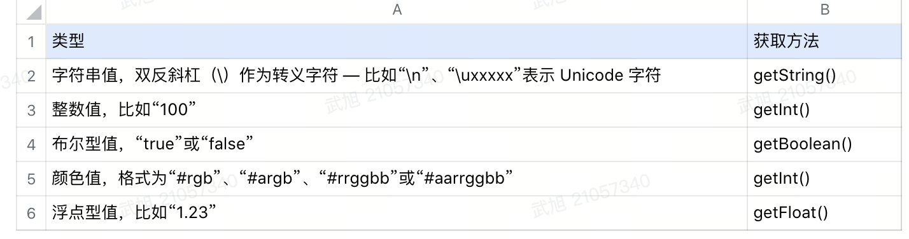

# 安全编码指南

## 多线程同步问题

1. ~~【建议】kotlin协程（Coroutine）使用时会有偶现的崩溃异常：
java.lang.NoClassDefFoundError:kotlinx.coroutines.CoroutineExceptionHandlerImplKt。kotlin官方说是jdk的bug，会导致偶现的崩溃，并且没有复现路径也无法解决。所以建议开发时不用kotlin协程，而改用线程池。
[kotlin官方的issue地址](https://github.com/Kotlin/kotlinx.coroutines/issues/1300)~~

2. 【强制】在使用支持多线程同时调用的集合时，经常出现java.util.ConcurrentModificationException问题。  
此异常出现的原因是：在集合遍历过程中同时执行了插入或删除元素的操作。解决方案有多种可供选择，例如：在集合遍历时不同时执行插入或删除操作；使用线程安全的集合；在进行集合插入和删除的代码上添加同步锁（synchronized、lock）。  

    常用的ArrayList、HashMap、HashSet、LinkedList都不是线程安全的集合。  

    线程安全的集合主要有：Vector、Hashtable、ConcurrentHashMap、CopyOnWriteArrayList、CopyOnWriteArraySet、ConcurrentSkipListMap、ConcurrentSkipListSet、ConcurrentLinkedQueue、ConcurrentLinkedDeque等。

    正例：  

    ```java
    public class Test {
        @NonNull
        private CopyOnWriteArrayList<String> list = new CopyOnWriteArrayList<>();
        // 代码逻辑...
        public void delItem(@NonNull String item) {
            if (TextUtils.isEmpty(item)) {
                return;
            }
            for (String value : list) {
                if (item.equals(value)) {
                    list.remove(item);
                    break;
                }
            }
        }
    }
    ```

    反例：

    ```java
    public class Test {
        @NonNull
        private ArrayList<String> list = new ArrayList<>();
        // 代码逻辑...
        public void delItem(@NonNull String item) {
            if (TextUtils.isEmpty(item)) {
                return;
            }
            for (String value : list) {
                if (item.equals(value)) {
                    list.remove(item);
                    break;
                }
            }
        }
    }
    ```

3. 【强制】对于禁止二次调用的代码逻辑，必须使用线程安全的方式来判断。

    比如：模块或单例的初始化逻辑，在判断代码是否已经执行过的时候，必须使用AtomicBoolean#compareAndSet方法来代替boolean变量。

    正例：

    ```java
    public class SingletonTest {
        // 是否已经初始化
        private static AtomicBoolean initialized = new AtomicBoolean(false);

        public static void initialize() {
            if (initialized.compareAndSet(false, true)) {
                // 逻辑代码...
            }
        }
    }
    ```

    反例：

    ```java
    public class SingletonTest {
        // 是否已经初始化
        private static boolean initialized = false;

        public static void initialize() {
            if (!initialized) {
                initialized = true;
                // 逻辑代码...
            }
        }
    }
    ```

4. 【建议】公共对象（数组、集合、文件等）或单例的所有方法注意线程安全。公共对象（数组、集合、文件等）或单例提供的外部接口中修改了某些数据，但是修改的数据类型并不是线程安全的，可能导致多线程同时操作时出现异常，甚至崩溃。此时可以根据业务逻辑的复杂情况，采取不同的处理方式。例如：逻辑比较简单的情况下，只需要关注操作的数据是线程安全的类型即可。如果逻辑比较复杂牵涉代码较多，则可以添加不同程度的synchronized同步锁（方法加锁、代码块加锁）。

    正例：

    ```java
    public class SingletonTest {
        public void test(@NonNull String item) {
            if (TextUtils.isEmpty(item)) {
                return;
            }
            synchronized (this) {
                // 不支持多线程同时操作的代码逻辑...
            }
        }
    }
    ```

    反例：

    ```java
    public class SingletonTest {
        public void test(@NonNull String item) {
            if (TextUtils.isEmpty(item)) {
                return;
            }
            // 不支持多线程同时操作的代码逻辑...
        }
    }
    ```

---

## 空指针问题

针对空指针-checkstyle工具检查代码

强制使用 "NotNull", "Nullable", "NonNull" 注解。android工程建议统一使用 androidx 的 annotation 库；java工程使用 Jetbrains 的 annotation 库：

```Groovy
implementation "androidx.annotation:annotation:1.3.0"
implementation "org.jetbrains:annotations:20.1.0"
```

1. 【强制】类的成员变量必须加注解（原生数据类型可忽略）

    ```java
    public class UserInfo {
    // 由于添加为非空注解，如果不初始化会AS会有相关警告，必须合理处理警告
    @NonNull
    private String name;

    private int age;
    }
    ```

2. 【强制】标注为NonNull的成员变量，必须在构造函数中初始化，或者直接赋值初始化，或者使用infer的Initializer注解标注初始化函数
Infer后续会优化 Infer 的提示功能，重新集成到CI，所以checkstyle这一步必须-1
优化好后的 Infer 也会有 -1 功能，所以警告必须处理
注解库：implementation 'com.facebook.infer.annotation:infer-annotation:0.18.0'

    构造函数中初始化：

    ```java
    public class UserInfo {
    @NonNull
    private String name;

    private int age;

    public UserInfo(@NonNull String name, int age) {
        this.name = name;
        this.age = age;
    }
    }
    ```

    直接赋值初始化：

    ```java
    public class UserInfo {
    @NonNull
    private String name = "zhangsan";

    private int age;
    }
    ```

    Initializer注解标注初始化函数：

    ```java
    class Example {
    @NonNull
    private String field1;
    
    private String field2;
    
    // Will be initialized in finishCreation().
    // (It is a good idea to specify that in comments in your real code!)
    @NonNull
    private String field3;
    
    public Example() {
        field1 = "OK: initialized in the constructor";
        // BAD: did not initialize field2!
        // (But OK not to initialize field3).
    }
    
    // This should be called before the object can be used.
    // It is a good idea to always document @Initializer methods for your client).
    @Initializer
    public void finishCreation() {
        field3 = "OK: Nullsafe assumes this will be called after creation";
    }
    }
    ```

3. 【强制】类的成员方法如果有返回值，必须加注解；方法的入参必须也要加；类的静态变量和方法也要加方法如果有返回值：

    ```java
    public class UserInfo {
    @Nullable
    private String address;

    // 由于方法返回值标注为非空，address是可空类型，必须判断null的情况，合理处理警告
    @NonNull
    public String getAddress() {
        if (address == null) {
        // TODO
        } else {
        return address;
        }
    }
    }
    ```

    方法的入参：

    ```java
    public class Test extends AppCompatActivity {
    @Override
    protected void onCreate(@Nullable Bundle savedInstanceState) {
        super.onCreate(savedInstanceState);
        if (savedInstanceState != null) {
        int v = savedInstanceState.getInt("key");
        }
    }
    }
    ```

4. 【强制】集合或数组中获取元素后需要判断是否为null。

    正例：

    ```java
    public class Test extends Activity {
    @NonNull
    private final HashMap<String, String> map = new HashMap<>();
    
    @Override
    protected void onCreate(@Nullable Bundle savedInstanceState) {
        super.onCreate(savedInstanceState);
        @Nullable
        String value = map.get("name");
        if (value != null) {
        Log.d("Test", "value=" + value.toLowerCase());
        }
    }
    }
    ```

    反例：

    ```java
    public class Test extends Activity {
    @NonNull
    private final HashMap<String, String> map = new HashMap<>();
    
    @Override
    protected void onCreate(@Nullable Bundle savedInstanceState) {
        super.onCreate(savedInstanceState);
        @Nullable
        String value = map.get("name");
        Log.d("Test", "value=" + value.toLowerCase());
    }
    }
    ```

5. 【强制】对象比较时，把常量放在equals或equalsIgnoreCase的前面。

    ```java
    public class Test extends AppCompatActivity {
    @NonNull
    private final List<String> list = new ArrayList<>();

    @Override
    protected void onCreate(@Nullable Bundle savedInstanceState) {
        super.onCreate(savedInstanceState);
        if ("zhangsan".equals(list.get(0))) {
        }
    }
    }
    ```

6. 【推荐】使用卫语句及早处理null的情况，视逻辑而定，是否需要提前结束本方法或做异常处理。

    ```java
    public void doSomething(@Nullable DomainA a) {
    if (a == null) {
        return; //log some errorA
    }
    if (a.getB() == null) {
        return; //log some errorB 
    }
    if (!(a.getB().getC instanceof DomainC)) {
        return; //log some errorC
    }
    assignAction;
    otherAction
    doSomethingA();
    doSomethingB();
    doSomethingC();
    }
    ```

7. 【强制】kotlin中的lateinit类型的变量一定要保证在所有情况下都能做到赋值后再调用。必要时需要考虑赋值失败的情况，在使用时添加判空。

---

## 隐性异常未捕获

1. 【强制】调用bindService接口绑定服务时，需要添加异常捕获。因为当remote进程被杀而绑定失败时，将抛出安全异常：java.lang.SecurityException。如果未捕获异常，将导致崩溃。

    ```java
    public void safeBindService(@NonNull Context context, @NonNull Intent intent) {
        try {
            context.bindService(intent, mServiceConnection, Context.BIND_AUTO_CREATE);
        } catch (SecurityException e) {
            Log.e(TAG, "safeBindService", e);
        }
    }
    ```

2. 【强制】隐式启动Activity、Service时需要检查intent有效性，及异常捕获。

    正例：

    ```java
    public void viewUrl(@NonNull String url, @NonNull String mimeType) {
    Intent intent = new Intent(Intent.ACTION_VIEW);
    intent.setDataAndType(Uri.parse(url), mimeType);
    if (getPackageManager().resolveActivity(intent, PackageManager.MATCH_DEFAULT_ONLY) != null) {
        try {
        startActivity(intent);
        } catch (ActivityNotFoundException e) {
        if (Config.LOGD) {
            Log.d(LOGTAG, "activity not found for " + mimeType + " over " + Uri.parse(url). getScheme(), e);
        }
        }
    }
    } 

    public void startService(@NonNull String action，@NonNull Context context) {
    List<ResolveInfo> servicesList = context.getPackageManager().queryIntentServices(intent, 0);
    if (servicesList == null || servicesList.isEmpty()) {
        return;
    }
    intent.setPackage(context.getPackageName());
    context.startService(intent);
    }
    ```

3. 【强制】Http header中不添加超出 ASCII 编码字符集的字符。

4. 【强制】创建通知栏消息时，不使用自定义图标，而改用app图标。因为如果图标加载失败的话，在部分机型上会抛出android.app.

    RemoteServiceException异常，而导致崩溃。所以在创建通知栏消息时，需要改为app图标，因为app图标始终存在，并且会跟随app启动时加载，而其他的普通图片资源则要不能保证会及时加载。如果业务要求必须使用自定义的图标，则必须添加异常捕获，保证所有机型不崩溃。

    正例：

    ```java
    NotificationCompat.Builder builder = new NotificationCompat.Builder(mContext, "notification-channel");
    builder.setContentTitle("已下载(0%)") //设置标题
            .setSmallIcon(mContext.getApplicationInfo().icon) //设置小图标
            .setLargeIcon(BitmapFactory.decodeResource(mContext.getResources(), mContext.getApplicationInfo().icon)) //设置大图标
            .setContentText("正在下载"); //设置内容
    ```

    反例：

    ```java
    NotificationCompat.Builder builder = new NotificationCompat.Builder(mContext, "notification-channel");
    builder.setContentTitle("已下载(0%)") //设置标题
            .setSmallIcon(R.drawable.ic_launcher) //设置小图标
            .setLargeIcon(BitmapFactory.decodeResource(mContext.getResources(), R.drawable.ic_launcher)) //设置大图标
            .setContentText("正在下载"); //设置内容
    ```

5. 【强制】在调用某些敏感权限相关的接口之前，需要先判断是否有相应权限，如果没有权限则先动态申请权限，不然可能抛出：java.lang.SecurityException: Permission Denial异常而导致崩溃。

    正例：

    ```java
    public void openCamera() {
        if (ContextCompat.checkSelfPermission(this, Manifest.permission.CAMERA) == PackageManager.PERMISSION_GRANTED) {
            Intent intent = new Intent(MediaStore.ACTION_IMAGE_CAPTURE);
            startActivityForResult(intent, 1000);
        }
    }
    ```

    反例：

    ```java
    public void openCamera() {
        Intent intent = new Intent(MediaStore.ACTION_IMAGE_CAPTURE);
        startActivityForResult(intent, 1000);
    }
    ```

6. 【强制】子线程禁止操作UI。

    常见于在回调、Handler、Thread、Threadpool中操作UI引起异常。

    正例：

    ```java
    class MainActivity : AppCompatActivity() {
    private val binding by viewBinding<ActivityMainBinding>()

    override fun onCreate(savedInstanceState: Bundle?) {
        super.onCreate(savedInstanceState)
        thread { 
        Thread.sleep(1000)
        binding.btInstallPackages.post {
            binding.btInstallPackages.text = "安装" 
        }
        }
    }

    private fun toast() {
        // 在主线程中弹出
        binding.root.post {
        Toast.makeText(this, "安装中...", Toast.LENGTH_SHORT).show() 
        }
    }
    }
    ```

7. 【强制】使用包装类转换字符串为基本数据类型时，如果字符串不符合数据类型的要求，则将崩溃。所以在转换时需要添加异常捕获。此类包装类主要有：Boolean、Byte、Character、Short、Integer、Float、Double、Long。

    正例：

    ```java
    public int getNumber(@Nullable String number) {
        if (TextUtils.isEmpty(number)) {
            return 0;
        }
        try {
            return Integer.parseInt(number);
        } catch (Exception x) {
            return 0;
        }
    }
    ```

    反例：

    ```java
    public int getNumber(@Nullable String number) {
        if (TextUtils.isEmpty(number)) {
            return 0;
        }
        return Integer.parseInt(number);
    }
    ```

8. 【强制】不要通过 Intent 在 Android 基础组件之间传递大数据(binder transaction 缓存为 1MB)，可能导致TransactionTooLargeException异常。例如大数组，很长的字符串等。
9. 【强制】避免在 Service#onStartCommand()/onBind()方法中执行耗时操作，如果确实有需求，应改用 IntentService 或采用其他异步机制完成。
    正例：

    ```java
    public class MainActivity extends Activity {
        @Override
        public void onCreate(Bundle savedInstanceState) {
            super.onCreate(savedInstanceState);
            setContentView(R.layout.main);
        }

        public void startIntentService() {
            Intent intent = new Intent(this, MyIntentService.class);
            startService(intent);
        }
    }

    public class MyIntentService extends IntentService {
        public MyIntentService() {
            super("MyIntentService");
        }

        @Override
        protected void onHandleIntent(Intent intent) {
            synchronized (this) {
                try {
                // 代码逻辑...
                } catch (Exception e) {
                }
            }
        }
    }
    ```

10. 【强制】避免在 BroadcastReceiver#onReceive()中执行耗时操作，如果有耗时工作，应该创建 IntentService 完成，而不应该在 BroadcastReceiver 内创建子线程去做。

    说明：
    由于该方法是在主线程执行，如果执行耗时操作会导致 UI 不流畅。可以使用IntentService 、创建 HandlerThread 或者调用 Context#registerReceiver(BroadcastReceiver, IntentFilter, String, Handler)方法等方式，在其他 Wroker 线程执行 onReceive 方法。BroadcastReceiver#onReceive()方法耗时超过 10 秒钟，可能会被系统杀死。

    正例：

    ```java
    IntentFilter filter = new IntentFilter();
    filter.addAction(LOGIN_SUCCESS);
    this.registerReceiver(mBroadcastReceiver, filter);
    mBroadcastReceiver = new BroadcastReceiver() {
        @Override
        public void onReceive(Context context, Intent intent) {
            Intent userHomeIntent = new Intent();
            userHomeIntent.setClass(this, UseHomeActivity.class);
            this.startActivity(userHomeIntent);
        }
    };
    ```

    反例：

    ```java
    mBroadcastReceiver = new BroadcastReceiver() {
        @Override
        public void onReceive(Context context, Intent intent) {
            MyDatabaseHelper myDB = new MyDatabaseHelper(context);
            myDB.initData();
            // have more database operation here
        }
    };
    ```

11. 【强制】对于只用于应用内的广播，优先使用 LocalBroadcastManager 进行注册和发送，来替代系统全局广播。因为LocalBroadcastManager 安全性更好，同时拥有更高的运行效率，并且可以避免系统全局广播的android.app.RemoteServiceException: can't deliver broadcast异常。

    正例：

    ```java
    // 发送广播
    Intent intent = new Intent("com.test.action");
    LocalBroadcastManager.getInstance(context).sendBroadcast(intent);

    // 接收广播
    private void registerTestReceiver() {
        IntentFilter intentFilter = new IntentFilter();
        intentFilter.addAction("com.test.action");
        LocalBroadcastManager.getInstance(context).registerReceiver(testReceiver, intentFilter);
    }

    private void unregisterTestReceiver() {
        LocalBroadcastManager.getInstance(context).unregisterReceiver(testReceiver);
    }

    private BroadcastReceiver testReceiver = new BroadcastReceiver() {
        @Override
        public void onReceive(Context context, Intent intent) {
            if (intent.getAction() == null) {
                return;
            }
            if ("com.test.action".equals(intent.getAction())) {
                //TODO: 逻辑处理
            }
        }
    };
    ```

    反例：

    ```java
    // 发送广播
    Intent intent = new Intent("com.test.action");
    context.sendBroadcast(intent);

    // 接收广播
    private void registerTestReceiver() {
        IntentFilter intentFilter = new IntentFilter();
        intentFilter.addAction("com.test.action");
        context.registerReceiver(testReceiver, intentFilter);
    }

    private void unregisterTestReceiver() {
        context.unregisterReceiver(testReceiver);
    }

    private BroadcastReceiver testReceiver = new BroadcastReceiver() {
        @Override
        public void onReceive(Context context, Intent intent) {
            if (intent.getAction() == null) {
                return;
            }
            if ("com.test.action".equals(intent.getAction())) {
                //TODO: 逻辑处理
            }
        }
    };
    ```

12. 【强制】Activity或 Fragment 中动态注册BroadCastReceiver 时，registerReceiver()和 unregisterReceiver()要成对出现。成对的生命周期有：onCreate和onDestroy，onResume和onPause。推荐在onResume中注册广播，在onPause中注销广播。

    说明：
    如果 registerReceiver()和 unregisterReceiver()不成对出现，则可能导致已经注册的receiver 没有在合适的时机注销，导致内存泄漏，占用内存空间，加重 SystemService负担。部分手机系统，比如华为一些机型会对 receiver 进行资源管控，单个应用注册过多 receiver 会触发管控模块抛出异常，应用直接崩溃。

    正例：

    ```java
    public class MainActivity extends Activity {
        private static MyReceiver myReceiver = new MyReceiver();

        @Override
        protected void onResume() {
            super.onResume();
            IntentFilter filter = new IntentFilter("com.example.myservice");
            registerReceiver(myReceiver, filter);
        }

        @Override
        protected void onPause() {
            super.onPause();
            unregisterReceiver(myReceiver);
        }
    }
    ```

    反例：

    ```java
    public class MainActivity extends Activity {
        private static MyReceiver myReceiver;

        @Override
        protected void onResume() {
            super.onResume();
            myReceiver = new MyReceiver();
            IntentFilter filter = new IntentFilter("com.example.myservice");
            registerReceiver(myReceiver, filter);
        }

        @Override
        protected void onDestroy() {
            super.onDestroy();
            unregisterReceiver(myReceiver);
        }
    }
    // Activity的生命周期不对应，可能出现多次onResume造成receiver注册多个，但最终只注销一个，其余receiver产生内存泄漏。
    ```

13. 【强制】对于通过导出组件 intent 传递的序列化对象，必须进行异常捕获，以避免数据非法或类型转换异常导致应用崩溃。

    正例：

    ```java
    public class MainActivity extends Activity {

        protected void onCreate(Bundle savedInstanceState) {
            try {
                Intent intent = getIntent();
                Person person = (Person)mIntent.getSerializableExtra("SER_KEY");
            } catch (Exception x) {
                // ......
            }
        }
    }
    ```

14. 【强制】使用除法或求余运算时，需要保证分母不为0，如果为0则会出现异常：java.lang.ArithmeticException，而导致崩溃。

    正例：

    ```java
    private int getPercent(int actual, int total) {
        int result = -1;
        if (total != 0) {
            result = actual / total;
        }
        return result;
    }
    ```

    反例：

    ```java
    private int getPercent(int actual, int total) {
        int result = actual / total;
        return result;
    }
     ```

15. 【强制】在使用Context（非Activity）的startActivity方法跳转页面时，需要添加FLAG_ACTIVITY_NEW_TASK的flag。不然可能会出现：AndroidRuntimeException异常。

    正例：

    ```java
    public static void startUserActivity(Context context, Class cls) {
        Intent intent = new Intent();
        intent.setClass(context, cls);
        if (!(context instanceof Activity)) {
            intent.setFlags(Intent.FLAG_ACTIVITY_NEW_TASK);
        }
        context.startActivity(intent);
    }
    ```

    反例：

    ```java
    public static void startUserActivity(Context context, Class cls) {
        Intent intent = new Intent();
        intent.setClass(context, cls);
        context.startActivity(intent);
    }
    ```

---

## 集合问题

1. 【强制】在获取集合、数组元素时，需要判断下标有效性。不然可能会出现：java.lang.IndexOutOfBoundsException异常。

    正例：

    ```java
    public void printItem(int index, @NonNull List<String> list) {
    if (index >= 0 && index < list.size()) {
        String item = list.get(index);
        System.out.println(item);
    }
    }

    public void printItem(int index, @NonNull String[] args) {
    if (index >= 0 && index < args.length) {
        String item = args[index];
        System.out.println(item);
    }
    }
    ```

---

## 系统适配问题

1. 【强制】Android及Java版本对应关系，Android 5、6系统使用Java7，因此Java新特性的使用必须兼容到Anroid5、6系统/Java7。
OOM问题

---

## OOM 问题

1. 【强制】批量读取或写入文件时，需要有个数限制，不能同时操作太多的文件。因为每操作一个文件，就会产生一个FD（文件句柄）。而系统给每个进程分配的FD数量是有限制的，当超过数量限制后就会出现OOM的崩溃。
2. 【强制】在使用IO流时，流对象在读写过程中可能出现异常，导致无法关闭流对象。所以必须在读写完成后或者出现异常后主动关闭IO流，否则会导致内存泄漏以及FD无法回收，进一步导致OOM的崩溃。

    正例：

    ```java
    public static void write2file(File file, String msg) {
        FileOutputStream outputStream = null;
        try {
            outputStream = new FileOutputStream(file, true);
            outputStream.write(msg.getBytes());
        } catch (Exception e) {
            // ...
        } finally {
            if (outputStream != null) {
                try {
                    outputStream.close();
                } catch (Exception e) {
                    // ...
                }
            }
        }
    }
    ```

    反例：

    ```java
    public static void write2file(File file, String msg) {
        FileOutputStream outputStream = null;
        try {
            outputStream = new FileOutputStream(file, true);
            outputStream.write(msg.getBytes());
            outputStream.close();
        } catch (Exception e) {
            // ...
        }
    }
    ```

3. 【强制】新建线程时，必须通过线程池提供（AsyncTask或者ThreadPoolExecutor或者其他形式自定义的线程池），不允许在应用中自行显式创建线程。因为系统给每个进程分配的线程数量也是有限的，当超过数量限制后就会出现OOM的崩溃。

    说明：
    使用线程池的好处是减少在创建和销毁线程上所花的时间以及系统资源的开销，解决资源不足的问题。如果不使用线程池，有可能造成系统创建大量同类线程而导致消耗完内存或者“过度切换”的问题。另外创建匿名线程不便于后续的资源使用分析，对性能分析等会造成困扰。

    正例：

    ```java
    int NUMBER_OF_CORES = Runtime.getRuntime().availableProcessors();
    int KEEP_ALIVE_TIME = 1;
    TimeUnit KEEP_ALIVE_TIME_UNIT = TimeUnit.SECONDS;
    BlockingQueue<Runnable> taskQueue = new LinkedBlockingQueue<Runnable>();
    ExecutorService executorService = new ThreadPoolExecutor(NUMBER_OF_CORES, 
    NUMBER_OF_CORES*2, KEEP_ALIVE_TIME, KEEP_ALIVE_TIME_UNIT, taskQueue, 
    new BackgroundThreadFactory(), new DefaultRejectedExecutionHandler());
    executorService.execute(new Runnnable() {
        @Override
        public void run() {
            //代码逻辑...
        }
    });
    ```

    反例：

    ```java
    new Thread(new Runnable() {
        @Override
        public void run() {
            //代码逻辑...
        }
    }).start();
    ```

4. 【强制】线程池不允许使用 Executors 去创建，而是通过 ThreadPoolExecutor 的方式，这样的处理方式让写的同学更加明确线程池的运行规则，规避资源耗尽的风险。

    说明：
    Executors 返回的线程池对象的弊端如下：
    1. FixedThreadPool 和 SingleThreadPool ： 允许的请求队列长度为Integer.MAX_VALUE，可能会堆积大量的请求，从而导致 OOM。
    2. CachedThreadPool 和 ScheduledThreadPool ： 允许的创建线程数量为Integer.MAX_VALUE，可能会创建大量的线程，从而导致 OOM。

    正例：

    ```java
    int NUMBER_OF_CORES = Runtime.getRuntime().availableProcessors();
    int KEEP_ALIVE_TIME = 1;
    TimeUnit KEEP_ALIVE_TIME_UNIT = TimeUnit.SECONDS;
    BlockingQueue<Runnable> taskQueue = new LinkedBlockingQueue<Runnable>();
    ExecutorService executorService = new ThreadPoolExecutor(NUMBER_OF_CORES, 
    NUMBER_OF_CORES*2, KEEP_ALIVE_TIME, KEEP_ALIVE_TIME_UNIT, 
    taskQueue, new BackgroundThreadFactory(), new DefaultRejectedExecutionHandler());
    ```

    反例：

    ```java
    ExecutorService cachedThreadPool = Executors.newCachedThreadPool();
    ```

---

## 资源回收问题

1. 【强制】页面（Activity、Fragment等）在销毁后，应该及时取消所有的监听器、回调、网络请求等，以免造成内存泄漏，甚至导致崩溃。

---

## 其他

1. AndroidManifest meta-data的值具有数据类型，必须使用相应数据类型方法获取值，使用方式不正确，无法获取到值。
2. AndroidManifest中存储数值类型的字符串时，应注意数字越界问题。比如：
XIAOMI_APPID = "MI-2882303761517332372"，2882303761517332372明显超出了Int类型的数值上限。经测试超过int上限的数值字符串会根据边界转换为float以及long如果继续超过上限对应的value值就会变为Infinity，所以在manifest中进行配置时一定注意纯数字字符串的边界处理问题。目前App中采用的方案是在数据前面添加字符串如“MI-”，读取时应注意字符串“MI”移除。

    

    反例：
    因为 meta-data 中appid 的值103为int类型，通过getString无法获取到。

    ```java
    Androidmanifest定义
    <meta-data name="appid" value="103"/>

    //错误获取方式 103为int类型，getString无法获取到
    ApplicationInfo appInfo = context.getPackageManager().getApplicationInfo(context.getPackageName(), 128);
    String appId = appInfo.metaData.getString("appid");
    ```

3. AndroidManifest中注册的无效权限、action监听应及时移除。

    反例：

    原项目中NotificationFetcher类继承Android系统中的NotificationListenerService类，新需求中将NotificationFetcher相关功能移除下线，于是将NotificationFetcher.java文件及相关文件删除，但未删除AndroidManifest的注册，正常打包编译（不点开AndroidManifest文件的情况下AS编辑器不会标红提示），最终在某些型号手机上出现闪退，原因是AndroidManifest文件中保留有相关权限申请及相关intent-filter监听，导致某些情况下触发相关逻辑，查找NotificationFetcher类，最终出现class类找不到崩溃
