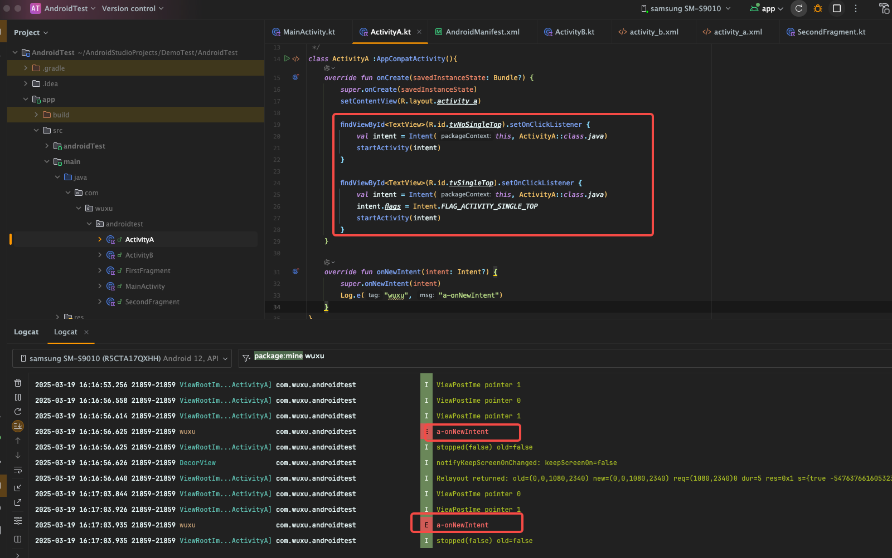

# SingleTask与SingleTop

之前有个理解歧义：SingleTask与SingleTop 可不可以同时使用，同时使用与SingleTask单独使用有啥区别？

可不可以同时使用？

答：

android中Manifest文件不能同时设置不同的launchMode，所以SingleTask与SingleTop 不可以同时使用，但可以通过在清单文件设置一个启动模式，再在intent设定flag方式（仅设定flag，使用与或操作也可以）达成同时使用的处理。

同时使用与SingleTask单独使用有啥区别？

答：

没有区别，经过测试，设定SingleTask无需设定SingleTop。Activity在栈顶，再次start，SingleTask也会触发onNewIntent。测试结果如下：

1. 清单文件设定启动模式为：singleTask
2. 重新启动Activity：

    
