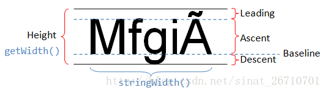
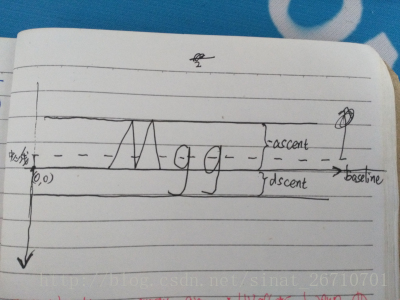

# 自定义View文本居中

>摘录自：<https://blog.csdn.net/sinat_26710701/article/details/70184252>

## 坑

文字不是跟中心对齐的，而是文字底部跟中心线平齐。

## 原因

先解释下，`drawText（String text,float x,float y,Paint paint）`

里面的x参数，在paint未设置setTextAlign 时，默认是从横坐标x点处开始绘制第一个字符串的字符。

如果`paint.setTextAlign(Paint.Align.CENTER);`则是整个字符串的中心点的横坐标是x，但里面的**y参数永远都跟 字符串的Baseline对齐**。
>baseline作为y轴中心

## 解决方法

自定义View时设定文本居中，其实是基线（baseline）对齐，并不是视觉上的对齐，所以需要减去偏移值。

**偏移值 = 中心线与baseline之间的距离 = 中心线到底部的距离 - descent**
>Paint.FontMetrics 可以获取相关参数，ascent是负数，descent正数，二者是相对baseline的距离（y轴向下，将baseline看成坐标0，则往上是负数，往下是正数）。

1. 中心线到底部的距离是 = 整个文字的高度 / 2 ；即（-ascent + descent）/2
2. 中心线与baseline之间的距离 = （-ascent + descent）/ 2 - descent ；即 (-ascent-descent) / 2
3. 只需要在drawText时候将y参数向上提高 中心线与baseline之间的距离即可
