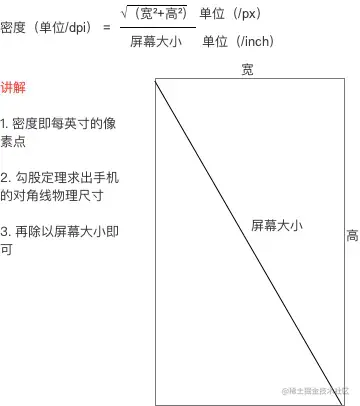

# Android的屏幕适配

Android手机屏幕不同尺寸的设备很多，得针对设备做屏幕适配，否则ui会有问题。

## 注意

1. 要明确设计的逻辑宽度（dp）（也叫设计稿基准宽度）或 设计稿密度。如果仅有px，可以将px转换为sp或dp。
2. 换算公式：
    1. 计算比例 = 屏实际最小宽（dp）/ 设计稿最小宽度（dp）； 计算比例 = 屏实际值（dp）/  屏实际值对应的设计稿(dp)
    2. 设计稿基准密度（这也是屏使用的新密度）=计算比例*屏密度；设计稿基准密度density = 屏幕宽度（px）/ 设计稿宽度（dpi）
    3. 设计稿dpi = 设计稿px值 / 设计稿密度
    3. 真实值（dp）= 设计稿dp * 计算比例

## Android 屏幕概念

1. 屏幕尺寸
2. 屏幕分辨率
3. 屏幕像素密度

### 屏幕尺寸

含义：手机对角线的物理尺寸
单位：`英寸（inch)`,1英寸=2.54cm
安卓手机常见的尺寸：5寸、5.5寸、6寸等等

### 屏幕分辨率

* 含义：手机在横向和纵向上的像素点数总和，即：屏幕分辨率=横向像素点数*纵向像素点数
* 单位：`px`,1px=1个像素点，UI设计图会以px作为统一的计量单位
* 安卓手机常见的分辨率：320`*`480、480`*`800、720`*`1280、1080`*`1920、1080`*`2340

### 屏幕像素密度

* 含义：每英寸的像素点数
* 单位：`dpi`,假设设备内每英寸有160个像素，那么该设备的屏幕像素密度=160dpi

### 三者关系

### 密度无关像素

* 含义：与设备的实际物理像素点无关的尺寸单位，density-independent pixel，叫`dp`或`dip`。安卓系统规定：**在dpi为160的设备上，1px等于1dp**。
* 单位：`dp`，可以保证在相同尺寸不同分辨率的设备上，显示相同的效果
* dp和px的转换：遵循如下计算公式：`px = dip * （dpi / 160)`
