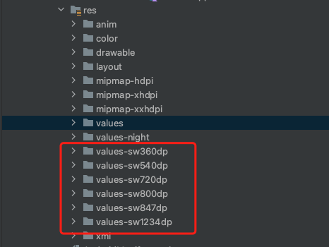
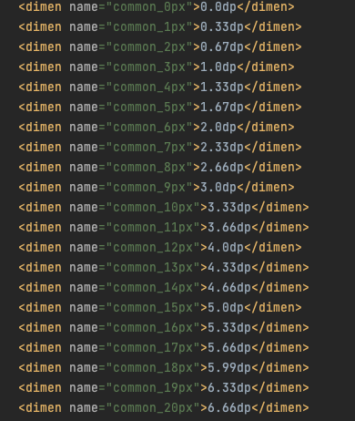
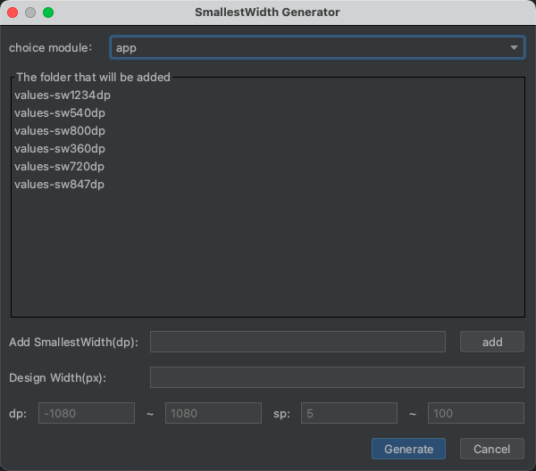

# Android SmallestWidth屏幕适配方案

>本文内容是转载，做下记录

## 原理

该适配方案依据的是最小宽度限定符，即Android系统会识别屏幕可用高度和宽度的最小尺寸的dp值（就是取二者最小值），然后根据识别结果去资源文件中查找对应的限定符文件夹下的资源文件。如果没有找到对应的限定符文件夹，则会向下寻找比目标dp值小的文件夹，例如目标是values-sw360dp文件夹，如果离360dp最近的只有values-sw350dp，那么就会选择values-sw350dp文件夹下的资源文件。

## 实现

1. 首先获取设备的dpi和屏幕的宽度像素值，使用公式：`px = dip * (dpi / 160)`,得到dip的数值。

    例如：设备宽度像素1080px,dpi是480，那么设备屏幕的最小宽度dp就是1080 / (480/160) = 360dp

2. 在项目资源文件夹下创建一个名为"values-sw360dp"(可以随意)的文件夹，然后在这个文件夹下创建dimens.xml文件
3. 把设计图中的标注转化为dimens.xml中对应的dp值。例如：设计图是按照1920*1080的分辨率设计的，根据上面计算的最小宽度dp为360，我们把360dp等分成设计图中的1080份，得到设计图中标注的1px就等于0.33dp，以此类推就可计算出所有px对应的dp数值。
注意事项：需要拷贝任何一个sw文件下的dimens.xml文件，放到values文件夹下，否则会报编译错误。

## 使用插件自动生成

我们可以使用Android studio插件来完成上面的工作，推荐一个插件：SmallestWidth Dimens.

1. Design Width 填入设计的最小宽度。（取宽高最小值）
2. dp 、sp 是具体值的范围。一般 dp:[0-1200],sp:[5-100]
3. 点击Generate即可生成对应文件夹下的dimes文件。
