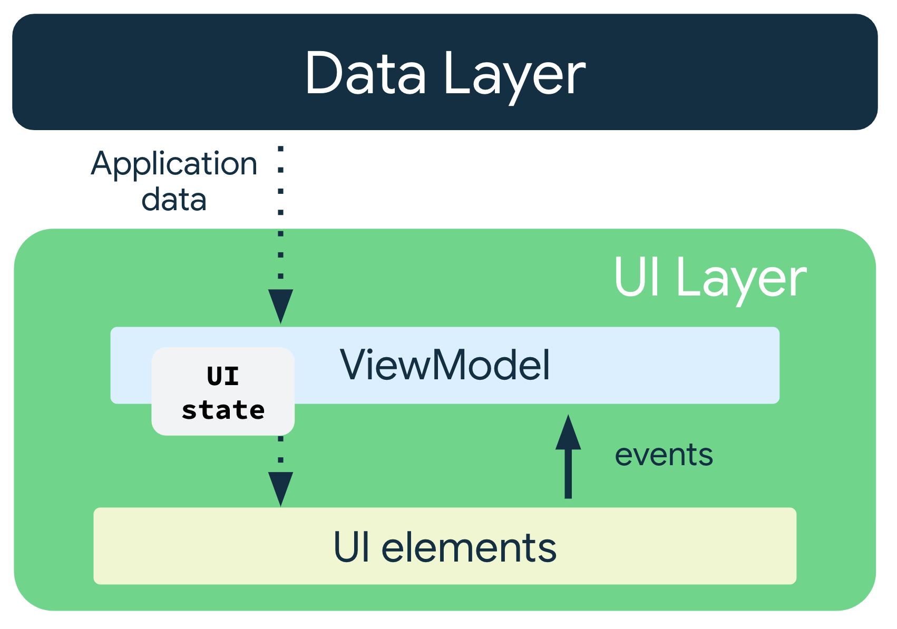

# 整体层级

Android 应用一般有三个层级：界面层（UI Layer）、网域层（Domain Layer）、数据层（Data Layer）


## 1.界面层

1. 界面层分为两部分：UI、状态容器

状态向下流动、事件向上流动的这种模式称为单向数据流 (UDF)。这种模式对应用架构的影响如下：

- ViewModel 会存储并公开界面要使用的状态。界面状态是经过 ViewModel 转换的应用数据。
- 界面会向 ViewModel 发送用户事件通知。
- ViewModel 会处理用户操作并更新状态。
- 更新后的状态将反馈给界面以进行呈现。
- 系统会对导致状态更改的所有事件重复上述操作。

### 1.1 ViewModel

线程处理和并发

在 ViewModel 中执行的所有工作都应具有主线程安全性（即从主线程调用是安全的）。这是因为数据层和网域层负责将工作移至其他线程。

如果 ViewModel 执行长时间运行的操作，则还要负责将相应逻辑移至后台线程。Kotlin 协程是管理并发操作的绝佳方式，Jetpack 架构组件则为其提供内置支持。如需详细了解如何在 Android 应用中使用协程，请参阅 [Android 上的 Kotlin 协程](https://developer.android.google.cn/kotlin/coroutines?hl=zh-cn)。

## 2 网域层

网域层是位于界面与数据层之间的**可选层**。网域层负责封装复杂的业务逻辑，或者由多个 ViewModel 重复使用的简单业务逻辑。此层是可选的，因为并非所有应用都有这类需求。请仅在需要时使用该层，例如处理复杂逻辑或支持可重用性。

用例以其负责的单一操作命名。具体命名惯例：动词原形 + 名词/内容（可选）+ 用例。

例如：FormatDateUseCase、LogOutUserUseCase、GetLatestNewsWithAuthorsUseCase 或 MakeLoginRequestUseCase。

```kotlin
class GetLatestNewsWithAuthorsUseCase(
  private val newsRepository: NewsRepository,
  private val authorsRepository: AuthorsRepository,
  private val formatDateUseCase: FormatDateUseCase
) { /* ... */ }
```


## 3 数据层

数据层主要是：仓库、本地数据源


---

## 详细解释

在现代 Android 开发中，Google 官方推荐的架构采用了清晰的分层设计，将应用代码划分为职责明确的层级。以下是基于最新推荐的 Android 层级结构的详细解释：

### **1. 现代 Android 架构层级**

Android 应用通常分为 **UI 层（Presentation）**、**业务逻辑层（Domain）** 和 **数据层（Data）**，各层通过单向数据流和依赖倒置原则协作。

```txt
UI层 (Presentation)
├─ UI组件 (Activity/Fragment/Compose)
└─ ViewModel (状态管理)

业务逻辑层 (Domain)
└─ UseCase/Interactor (业务逻辑)

数据层 (Data)
├─ Repository (数据协调)
└─ Data Source (数据源)
```

### **2. 各层级详细说明**

#### **8.1.1 UI 层（Presentation Layer）**

**职责**：负责视觉呈现和用户交互，管理与 UI 相关的状态。

**组成部分**：

- **UI 组件**：`Activity`、`Fragment`、Jetpack Compose 函数等。
  - 职责：渲染视图、处理用户输入事件。
  - 特点：轻量级，仅关注 UI 展示，不包含业务逻辑。
- **ViewModel**：
  - 职责：作为 UI 状态的容器，处理与 UI 相关的业务逻辑（如数据转换、分页）。
  - 特点：生命周期感知，与 UI 组件解耦，通过数据流（如 `StateFlow`、`LiveData`）暴露状态。

**示例代码（ViewModel）**：

```kotlin
class UserViewModel : ViewModel() {
    // UI 状态容器
    private val _uiState = MutableStateFlow<UserUiState>(UserUiState.Loading)
    val uiState: StateFlow<UserUiState> = _uiState

    // 依赖 UseCase
    private val getUserUseCase: GetUserUseCase

    init {
        fetchUsers()
    }

    private fun fetchUsers() {
        viewModelScope.launch {
            _uiState.value = UserUiState.Loading
            try {
                // 调用 UseCase 获取数据
                val users = getUserUseCase()
                _uiState.value = UserUiState.Success(users)
            } catch (e: Exception) {
                _uiState.value = UserUiState.Error(e.message)
            }
        }
    }

    fun onRefresh() {
        fetchUsers()
    }
}

// UI 状态模型
sealed class UserUiState {
    object Loading : UserUiState()
    data class Success(val users: List<User>) : UserUiState()
    data class Error(val message: String?) : UserUiState()
}
```

#### **2.2 业务逻辑层（Domain Layer）**

**职责**：封装核心业务逻辑，与 UI 和数据存储解耦。

**组成部分**：

- **UseCase/Interactor**：
  - 职责：处理单一业务逻辑（如登录验证、数据筛选）。
  - 特点：不依赖 Android 框架，可独立测试。
- **领域模型（Domain Model）**：
  - 职责：表示应用的核心业务概念（如 `User`、`Order`）。
  - 特点：与数据层和 UI 层的模型解耦，通过 Mapper 转换。

**示例代码（UseCase）**：

```kotlin
class GetUserUseCase(
    private val userRepository: UserRepository,
    private val networkMonitor: NetworkMonitor // 网络状态监控
) {
    suspend operator fun invoke(): List<User> {
        // 业务逻辑：检查网络状态、应用缓存策略
        if (!networkMonitor.isConnected()) {
            throw NetworkException("No internet connection")
        }
        
        // 获取数据并应用业务规则
        return userRepository.getUsers()
            .filter { it.isActive } // 过滤活跃用户
            .sortedBy { it.name }   // 按名称排序
    }
}
```

#### **2.3 数据层（Data Layer）**

**职责**：负责数据的获取、存储和管理，处理数据源的协调。

**组成部分**：

- **Repository**：
  - 职责：作为数据统一入口，协调多个 Data Source，实现缓存策略。
  - 特点：依赖抽象的 Data Source 接口，不关心数据来源。
- **Data Source**：
  - 职责：与具体数据存储交互（网络、数据库、文件等）。
  - 实现：`RemoteDataSource`（网络）、`LocalDataSource`（本地存储）。
- **Mapper**：
  - 职责：负责不同数据模型间的转换（如 `UserEntity` → `User`）。
  - 实现：通常为纯函数，无状态。

**示例代码（Repository）**：

```kotlin
class UserRepositoryImpl(
    private val remoteDataSource: UserRemoteDataSource,
    private val localDataSource: UserLocalDataSource,
    private val networkToDomainMapper: NetworkToDomainMapper,
    private val entityToDomainMapper: EntityToDomainMapper
) : UserRepository {

    override suspend fun getUsers(): List<User> {
        return try {
            // 策略：优先使用本地缓存，缓存过期或不存在时从网络获取
            val localUsers = localDataSource.getUsers()
            if (localUsers.isNotEmpty() && !isCacheExpired(localUsers)) {
                entityToDomainMapper.map(localUsers)
            } else {
                val networkUsers = remoteDataSource.fetchUsers()
                val entities = networkToDomainMapper.map(networkUsers)
                localDataSource.saveUsers(entities)
                entityToDomainMapper.map(entities)
            }
        } catch (e: Exception) {
            // 错误处理：网络失败时返回本地缓存（如果有）
            val localUsers = localDataSource.getUsers()
            if (localUsers.isNotEmpty()) {
                entityToDomainMapper.map(localUsers)
            } else {
                throw e
            }
        }
    }

    private fun isCacheExpired(users: List<UserEntity>): Boolean {
        // 判断缓存是否过期的逻辑
        return users.firstOrNull()?.lastUpdated ?: 0 < System.currentTimeMillis() - CACHE_TIMEOUT
    }
}
```

### **3. 数据流向与交互模式**

数据在各层之间的流动遵循 **单向数据流（Unidirectional Data Flow）** 原则：

```txt
UI组件 → ViewModel → UseCase → Repository → DataSource
                ↖                  ↙
                  数据流(StateFlow/LiveData)
```

1. **UI 组件**（如 Fragment/Composable）观察 ViewModel 的 `uiState`。
2. **用户交互**（如点击按钮）触发 ViewModel 的方法。
3. **ViewModel** 调用 **UseCase** 执行具体业务逻辑。
4. **UseCase** 通过 **Repository** 获取数据。
5. **Repository** 协调 **Data Source** 获取原始数据（网络或本地）。
6. **数据** 经 Mapper 转换为领域模型后返回给 ViewModel。
7. **ViewModel** 更新 `uiState`，触发 UI 刷新。

### **4. 依赖倒置原则（DIP）**

上层（如 UseCase）依赖抽象接口，而非具体实现：

```kotlin
// 领域层定义接口
interface UserRepository {
    suspend fun getUsers(): List<User>
}

// 数据层实现接口
class UserRepositoryImpl(...) : UserRepository { ... }

// UseCase 依赖抽象接口
class GetUserUseCase(private val userRepository: UserRepository) { ... }
```

### **5. 测试策略**

各层可独立测试，隔离外部依赖：

- **UI 层测试**：使用 Espresso 测试 UI 交互，Mock ViewModel。
- **ViewModel 测试**：使用 JUnit/Mockito 测试 ViewModel 逻辑。
- **UseCase 测试**：纯单元测试，验证业务逻辑正确性。
- **Repository 测试**：验证数据协调逻辑，Mock Data Source。
- **Data Source 测试**：集成测试，验证与真实数据源的交互。

### **6. 分层架构的优势**

1. **关注点分离**：每层专注单一职责，代码更易维护。
2. **可测试性**：各层可独立测试，减少依赖。
3. **可扩展性**：新增数据源或业务逻辑无需重构整个系统。
4. **协作效率**：不同团队可并行开发不同层（如前端和后端）。

### **7. 常见扩展与变体**

- **Clean Architecture**：强化依赖倒置，核心领域层不依赖任何外部组件。
- **MVI（Model-View-Intent）**：在 UI 层使用单向数据流模式，强化状态可追溯性。
- **模块化架构**：将应用拆分为独立模块，每层作为单独模块存在。

### **8. 官方参考**

- [Android Architecture Components](https://developer.android.com/topic/architecture)
- [UI Layer Guide](https://developer.android.com/topic/architecture/ui-layer)
- [ViewModel Documentation](https://developer.android.com/topic/libraries/architecture/viewmodel)

### **总结**

现代 Android 分层架构通过明确的职责划分和依赖管理，使代码更具组织性、可测试性和可维护性。合理的分层设计是构建大型、复杂 Android 应用的基础。
