# 路由协议设计

## 路由库及协议设计方案（v1.0）

---

### 一、核心设计目标

1. **统一路由协议**：标准化所有跳转行为的入口
2. **组件解耦**：消除类间直接依赖
3. **动态能力**：支持热修复/动态路由配置
4. **全场景覆盖**：Activity/Fragment/Web/API/App等
5. **高扩展性**：插件化架构设计

---

### 二、路由协议规范

**URI格式**：`[scheme]://[host][:port]/[path]?[parameters]`

**标准字段定义**：

| 字段       | 说明                   | 示例                  |
|------------|------------------------|-----------------------|
| scheme     | 协议类型               | app/web/service       |
| host       | 功能模块               | user/mall/payment     |
| port       | 子类型标识（可选）     | 8080                  |
| path       | 具体操作路径           | /detail/settings      |
| parameters | 参数键值对（URL编码）  | id=123&type=video     |

**示例**：

```txt
app://user:8080/profile?from=home
web://mall/product?id=456#section3
service://payment/checkout?amount=99.9
```

---

### 三、路由表设计

**路由元数据结构**：

```kotlin
data class RouteMeta(
    val uri: Uri,
    val type: RouteType, // ACTIVITY/FRAGMENT/WEB/SERVICE/APP
    val target: Any, // Class/Method/Url
    val interceptors: List<Class<out RouteInterceptor>>,
    val flags: Int = 0,
    val paramsConfig: Map<String, ParamType> = emptyMap(),
    val requiredPermissions: List<String> = emptyList(),
    val versionCode: Int = 1,
    val description: String = ""
)
```

**路由注册方式**：

1. 注解自动注册（编译期）

    ```kotlin
    @Route(
        uri = "app://main/home",
        interceptors = [AuthInterceptor::class],
        params = ["showAd" to ParamType.BOOL]
    )
    class MainActivity : AppCompatActivity()
    ```

2. 动态注册API

    ```kotlin
    Router.register(
        RouteMeta(
            uri = Uri.parse("service://image/compress"),
            type = RouteType.API,
            target = ImageService::compress,
            paramsConfig = mapOf("quality" to ParamType.INT)
        )
    )
    ```

---

### 四、核心功能实现

**1. 路由分发器（Router）**：

- 路由匹配优先级：
  1. 精确匹配 > 正则匹配 > 模糊匹配
  2. 版本号降级策略
- 跳转上下文管理：

```kotlin
class RouteContext(
    val originUri: Uri,
    val rawParams: Bundle,
    val context: Context,
    val requestCode: Int? = null,
    val fragmentManager: FragmentManager? = null,
    var resultCallback: ((Any?) -> Unit)? = null
)
```

**2. 参数处理系统**：

- 类型自动转换系统：

```kotlin
enum class ParamType {
    STRING, INT, LONG, FLOAT, BOOL, 
    JSON_OBJECT, JSON_ARRAY, PARCELABLE,
    SERIALIZABLE, ENUM, DATE
}

interface ParamConverter<T> {
    fun convert(value: String): T
    fun reverseConvert(value: T): String
}
```

**3. 拦截器链设计**：

```kotlin
interface RouteInterceptor {
    fun intercept(chain: Chain): RouteResponse

    interface Chain {
        fun proceed(request: RouteRequest): RouteResponse
        fun request(): RouteRequest
    }
}
```

典型拦截器实现：

- 权限检查拦截器
- 登录状态拦截器
- 流量保护拦截器
- ABTest路由分配器
- 埋点统计拦截器

---

### 五、全场景实现方案

**1. Activity跳转**：

```kotlin
Router.with(context)
    .to("app://user/profile")
    .addFlags(Intent.FLAG_ACTIVITY_CLEAR_TOP)
    .withParam("user_id", 12345)
    .requestCode(1001)
    .navigation()
```

**2. Fragment加载**：

```kotlin
Router.with(supportFragmentManager)
    .to("app://settings/notification")
    .setContainer(R.id.fragment_container)
    .setTransition(FragmentTransaction.TRANSIT_FRAGMENT_FADE)
    .navigation()
```

**3. Web页面处理**：

```kotlin
Router.build("web://payment/result?order_id=789")
    .setWebFallback("https://m.example.com/payment/result")
    .navigation()
```

**4. API调用**：

```kotlin
val result = Router.create("service://image/compress")
    .withParam("quality", 80)
    .call() as Bitmap
```

**5. 外部App跳转**：

```kotlin
Router.build("app://external/maps")
    .addAlternative(Uri.parse("geo:0,0?q=address"))
    .addFallback {
        Toast.makeText(context, "未安装地图应用", Toast.LENGTH_SHORT).show()
    }
    .navigation()
```

---

### 六、高级特性

**1. 动态路由配置**：

```json
{
  "routes": [
    {
      "pattern": "app://shop/detail_v\\d+",
      "target": "app://shop/detail_v2",
      "type": "REDIRECT",
      "conditions": {
        "os_version": ">9",
        "app_version": ">=3.2.0"
      }
    }
  ]
}
```

**2. 路由监控体系**：

```kotlin
interface RouteMonitor {
    fun onStart(request: RouteRequest)
    fun onSuccess(response: RouteResponse)
    fun onError(response: RouteResponse)
    fun onIntercepted(request: RouteRequest, interceptor: RouteInterceptor)
}
```

**3. 自动降级策略**：

- 多级降级配置：
  1. 相同host备用路径
  2. H5降级页面
  3. 全局错误页面
  4. Toast提示

---

### 七、安全方案

**1. 路由白名单机制**：

```kotlin
@Route(uri = "app://admin/console", 
       permissions = [Permissions.ROUTE_SUPER_ADMIN])
class AdminConsoleActivity
```

**2. 签名校验**：

```kotlin
class SignatureInterceptor : RouteInterceptor {
    override fun intercept(chain: Chain): RouteResponse {
        val request = chain.request()
        if (request.uri.scheme == "secure") {
            if (!verifyHMAC(request.params)) {
                return RouteResponse.code(403)
            }
        }
        return chain.proceed(request)
    }
}
```

---

### 八、性能优化

**路由表加载策略**：

```kotlin
class RouteMapLoader {
    // 按模块分块加载
    fun loadCriticalRoutes() {}
    
    // 后台线程延迟加载
    fun loadNonCriticalRoutes() {}
    
    // 动态路由增量更新
    fun patchRoutes(diff: RouteDiff) {}
}
```

---

### 九、配套工具

1. **路由调试面板**：
   - 实时路由表查看
   - 历史跳转记录追踪
   - Mock参数测试工具

2. **Gradle插件功能**：

   ```groovy
   router {
       enableAPT = true
       enableMonitor = true
       checkUnregisteredRoutes = true
       generateRouteDocument = true
   }
   ```

---

### 十、扩展能力设计

**1. 自定义Scheme处理器**：

```kotlin
class WeChatSchemeHandler : CustomSchemeHandler {
    override fun handle(uri: Uri): Boolean {
        // 处理微信深度链接逻辑
    }
}
```

**2. 路由到Flutter/ReactNative**：

```kotlin
@Route(uri = "flutter://product/detail",
       nativeFallback = "app://native/detail")
class FlutterDetailActivity : FlutterActivity()
```

---

### 十一、测试方案

**自动化测试用例覆盖**：

1. 路由解析正确性测试
2. 参数类型转换测试
3. 拦截器链顺序测试
4. 压力测试（>1000路由项）
5. 异常路径测试（非法URI/缺失参数）

---

该设计方案可实现：

- 平均跳转耗时 < 15ms
- 支持动态路由更新秒级生效
- 100%覆盖所有Android跳转场景
- 提供完整的监控和调试能力

需要根据具体业务需求调整路由匹配策略、安全校验级别和降级方案，建议配合CI/CD实现路由配置的自动化验证和发布。

---

<分隔>**-------------------------------------------------------------------------**<分隔>

---

## 图表补充

以下是针对路由库设计的图表补充说明，采用文字描述形式呈现，开发者可根据描述绘制相应图表：

---

### **图表1：整体架构图（金字塔结构）**

```txt
 _______________________________________
|          应用层（业务模块）           |
|---------------------------------------|
| • 商品模块   • 用户中心   • 支付服务    |
|_______________________________________|
                   ⬇
 _______________________________________
|           路由中间层                  |
|---------------------------------------|
| • 路由分发器    • 参数转换中心         |
| • 拦截器链      • 动态配置管理         |
|_______________________________________|
                   ⬇
 _______________________________________
|         基础支撑层                    |
|---------------------------------------|
| • 注解处理器    • 路由表加载器         |
| • 协议解析器    • 安全校验引擎         |
|_______________________________________|
```

---

### **图表2：URI结构分解图**

```txt
            app://user:8080/profile?uid=123#top
            ┌─┬─┬──┬──────┬─────┬───┬───┐
结构解析 →  │ │ │  │      │     │   │   │
            └─┴─┴──┴──────┴─────┴───┴───┘
             │  │  │      │       │   └── Fragment定位
             │  │  │      │       └────── 参数列表
             │  │  │      └────────────── 操作路径
             │  │  └───────────────────── 端口（可选）
             │  └──────────────────────── 功能模块
             └─────────────────────────── 协议类型
```

---

### **图表3：路由匹配流程图**

```txt
                      ┌───────────────┐
                      │ 开始路由请求    │
                      └──────┬────────┘
                             ↓
                      ┌───────────────┐
                      │ URI标准化处理   │
                      └──────┬────────┘
                             ↓
                   ┌─────────────────────┐
                   │ 精确匹配（完整URI）  │ → 匹配成功 → 执行跳转
                   └─────────────────────┘
                             ↓ No
                   ┌─────────────────────┐
                   │ 正则匹配（动态配置） │ → 匹配成功 → 重定向
                   └─────────────────────┘
                             ↓ No
                   ┌─────────────────────┐
                   │ 模糊匹配（host优先）  │ → 匹配成功 → 降级跳转
                   └─────────────────────┘
                             ↓ No
                      ┌───────────────┐
                      │ 全局降级策略    │
                      └───────────────┘
```

---

### **图表4：拦截器链工作流程**

```txt
           ┌───────────────────────────────────┐
           │         路由请求 Request          │
           └──────────────────┬────────────────┘
                              ↓
           ┌──────────────────┴────────────────┐
           │ 拦截器1（例：权限校验）             │
           │ • 校验通过 → 传递请求               │
           │ • 校验失败 → 返回拦截响应           │
           └──────────────────┬────────────────┘
                              ↓
           ┌──────────────────┴────────────────┐
           │ 拦截器2（例：登录态检查）           │
           └──────────────────┬────────────────┘
                              ↓
           ┌──────────────────┴────────────────┐
           │ 拦截器N（例：埋点统计）            │
           └──────────────────┬────────────────┘
                              ↓
           ┌───────────────────────────────────┐
           │          目标页面/API执行          │
           └───────────────────────────────────┘
```

---

### **图表5：动态路由配置示例（JSON结构）**

```json
// routes_config.json
{
  "version": "3.2.0",
  "routes": [
    {
      "pattern": "^app://shop/detail_v\\d+",
      "target": "app://shop/detail_v2",
      "type": "REDIRECT",
      "conditions": {
        "os_version": ">10",
        "app_version": ">=3.5.0"
      }
    },
    {
      "pattern": "web://fallback/.*",
      "target": "app://common/webview",
      "type": "PROXY"
    }
  ]
}
```

---

### **图表6：路由表加载策略（时序图）**

```txt
App启动 → 主线程加载关键路由（首页/登录页） → 显示首屏
               ⬇
后台线程异步加载非关键路由（设置页/详情页） → 加载完成更新路由表
               ⬇
动态服务器配置 → 增量更新路由规则 → 即时生效
```

---

### **图表7：安全校验流程图**

```txt
         ┌───────────────┐
         │  发起路由请求  │
         └──────┬────────┘
                ↓
  ┌────────────────────────────┐
  │ 白名单校验（permissions字段）│ → 拒绝未授权路由
  └────────────┬───────────────┘
                ↓
  ┌────────────────────────────┐
  │ 签名校验（HMAC验证参数完整性）│ → 拦截非法请求
  └────────────┬───────────────┘
                ↓
       ┌──────────────────┐
       │ 执行目标路由      │
       └──────────────────┘
```

---

### **图表8：配套调试工具界面示意图**

```txt
+-----------------------------+
| 路由调试面板                |
+-----------------------------+
| [搜索框]                    |
|                             |
| 路由列表：                  |
| • app://user/profile        |
| • web://payment/result      |
| • service://image/compress  |
|                             |
| 选中路由详情：              |
| - URI：app://shop/detail    |
| - 类型：Activity            |
| - 参数：{id: Int}          |
| - 拦截器：[权限校验]        |
|                             |
| [模拟跳转] [生成测试用例]    |
+-----------------------------+
```

---

### **图表9：跨平台路由方案**

```txt
           ┌──────────────┐
           │  Native路由   │
           │  (Activity)  │
           └──────┬───────┘
                   ↓
┌───────────────────────────────────┐
│         路由中间层适配器           │
│ ┌─────────────┐  ┌─────────────┐ │
│ │ Flutter路由 │  │ ReactNative │ │
│ │  (Channel)  │  │  (Bridge)   │ │
│ └─────────────┘  └─────────────┘ │
└───────────────────────────────────┘
                   ↓
           ┌──────────────┐
           │ 统一协议处理  │
           │ app://...    │
           └──────────────┘
```

---

### **图表10：性能监控数据看板**

```txt
+---------------------------------+
| 路由性能监控（24小时）           |
+---------------------------------+
| 成功率       | 98.7%            |
| 平均耗时     | 14ms             |
| 拦截次数     | 1,234次          |
| 热点路由TOP5：                  |
| 1. app://main/home (2,345次)    |
| 2. web://mall/index (1,890次)   |
| ...                             |
+---------------------------------+
```

---

这些图表可通过以下方式实现：

1. **架构设计图**：使用PlantUML或Draw.io绘制层级结构
2. **流程图**：用Mermaid语法描述逻辑过程
3. **数据结构图**：使用Markdown表格或JSON示例
4. **交互时序图**：采用UML时序图标准
5. **监控看板**：参考Grafana等可视化工具布局

建议在实际开发中：

1. 为路由表设计自动生成可视化文档
2. 在调试模式添加路由轨迹追踪功能
3. 使用不同颜色区分路由类型（如红色表示API路由，蓝色表示页面路由）

---

## 补充Mermaid图表

以下是使用Mermaid语法绘制的路由库相关图表：

---

### **图表1：整体架构图**


---

### **图表2：路由匹配流程**


---

### **图表3：拦截器链**


---

### **图表4：动态路由配置**


---

### **图表5：安全校验流程**


---

### **图表6：跨平台路由**

```mermaid
erDiagram
    NATIVE {
        string uri
        Activity target
    }
    
    FLUTTER {
        string uri
        string channel
    }
    
    REACT-NATIVE {
        string uri
        string bridge
    }
    
    NATIVE ||--|{ ROUTER_ADAPTER : implements
    FLUTTER ||--|{ ROUTER_ADAPTER : implements
    REACT-NATIVE ||--|{ ROUTER_ADAPTER : implements
    
    ROUTER_ADAPTER {
        string protocol
        handleRequest()
    }
```

---

### **图表7：调试面板**


---

### **图表8：性能监控**

```mermaid
gantt
    title 路由性能趋势（24小时）
    dateFormat  HH:mm
    axisFormat  %H:%M
    
    section 成功率
    99.2%   :a1, 00:00, 4h
    98.7%   :a2, after a1, 4h
    99.5%   :a3, after a2, 4h
    
    section 平均耗时
    16ms    :b1, 00:00, 6h
    14ms    :b2, after b1, 6h
```



---

### **图表9：参数转换系统**


---

### **图表10：路由表加载策略**


---

这些Mermaid图表可以：

1. 直接插入Markdown文档
2. 在支持Mermaid的IDE中实时渲染
3. 通过修改主题配置调整样式
4. 与CI/CD流程集成生成架构文档

建议配合以下工具使用：

```groovy
// build.gradle
dependencies {
    implementation 'com.github.mermaid-js:mermaid-android:3.1.0' // Android端渲染
}
```
