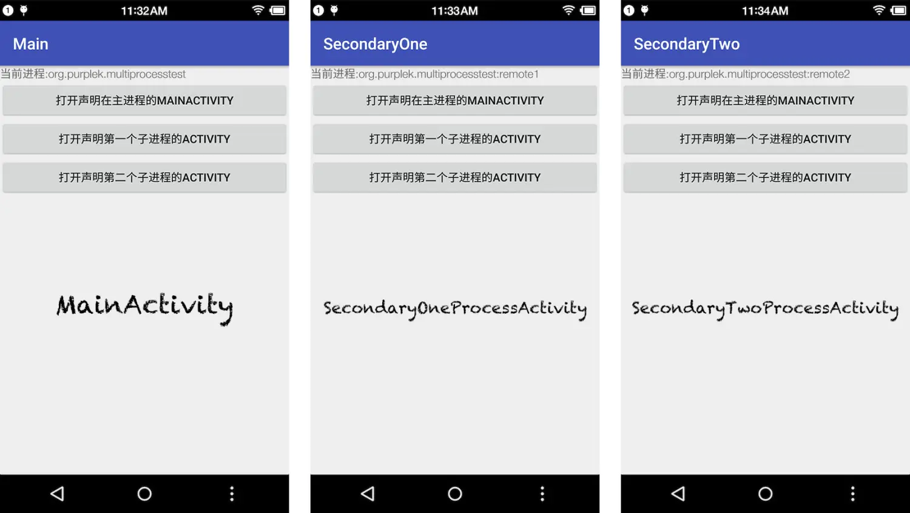
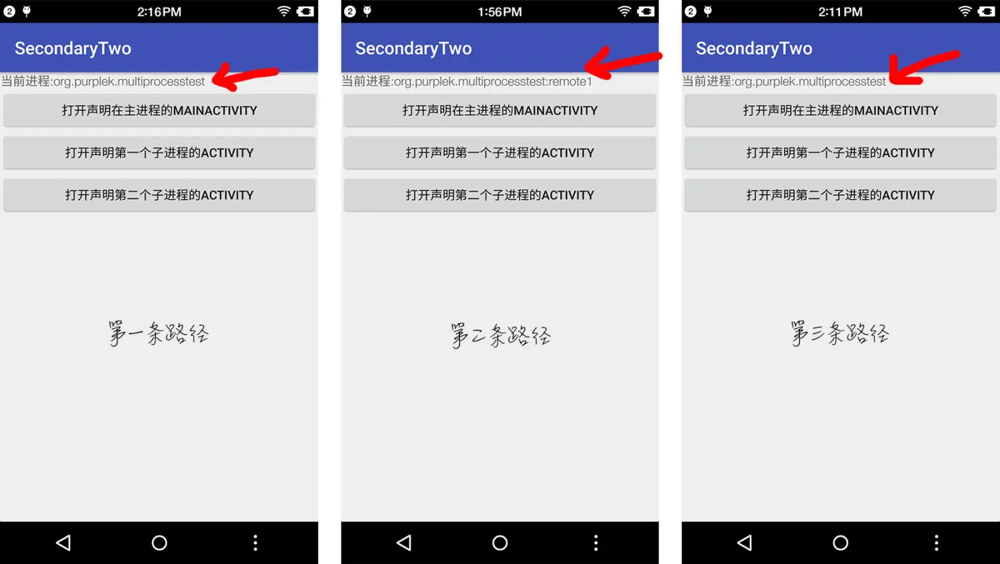
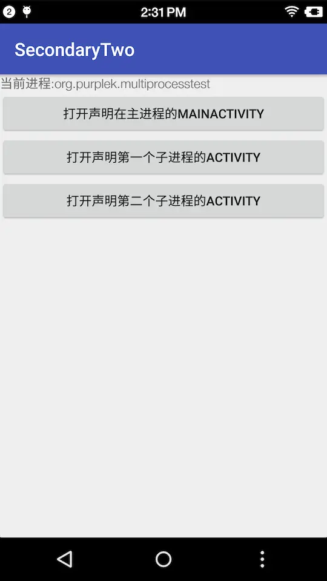
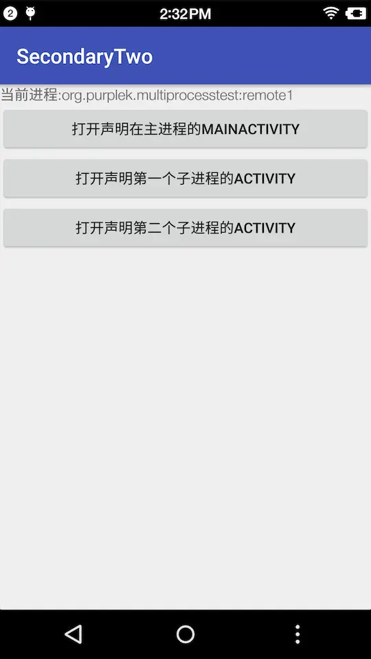

# Manifest-multiprocess

>本文转载自：[Activity中的multiprocess="true"??](https://www.jianshu.com/p/af1426df9ece)，怕作者删掉，这里复制记录。

学习Shadow插件框架时，用到了这个知识

## 以下为原文

### 坑的背景

在下是一个小小的Android研发，前几天有个需求，需要接入Admob广告。我们的App有多个进程。主进程和其中一个子进程都有涉及到广告的逻辑。
​

### 坑是怎样形成的

在接入Admob，成功获取到广告之后，开始调试展示、落地页，等打点是否正常的时候。发现，展示没问题，但是在子进程获取的广告，点击是无法触发打开落地页的。
​
在之前的接入中已经知道了Admob广告在点击之后，是会打开一个Admob sdk中的AdActivity，在AdActivity中会处理一些逻辑，之后才会通过Intent打开Google Play或者浏览器，跳转到落地页。
​

### 如何爬坑

打开Admob的aar包中的AndroidManifest可以发现AdActivity是没有声明进程的，无论在哪个进程打开Activity，都会在主进程打开这个Activity。
​
仔细想想，子进程中获取到的广告，在主进程中根本就没有，AdActivity是在主进程的，所以这样的调用会被判断为非法调用，最终无法打开落地页。
​
最后使用了Activity的属性，在AdActivity中添加multiprocess="true"的声明，就可以解决这个问题，达到在哪个进程打开AdActivity，AdActivity就在哪个进程。
​
但是忠告一句，Admob SDK实际上原生并不支持在子进程获取广告，不排除这样修改后，还会不会出现什么奇葩的问题。
​

### 何为multiprocess

官方定义

`multiprocess`在activity和provider中都能定义。

`android:multiprocess=["true" | "false"]`
​
provider中的定义如下：

```txt
If the app runs in multiple processes, this attribute determines whether multiple instances of the content provder are created. If true, each of the app's processes has its own content provider object. If false, the app's processes share only one content provider object. The default value is false.

Setting this flag to true may improve performance by reducing the overhead of interprocess communication, but it also increases the memory footprint of each process.
```

在Provider中使用可能更为常见，简单来说意思就是如果multiprocess为true，不管在哪个进程中调用provider将会使用该进程中的provider实例，并不会共用，如multiprocess为false，那么provider声明在哪个进程，provider就只会在这个进程中存在实例。
​
activity中的定义如下：

```txt
Whether an instance of the activity can be launched into the process of the component that started it — "true" if it can be, and "false" if not. The default value is "false".

Normally, a new instance of an activity is launched into the process of the application that defined it, so all instances of the activity run in the same process. However, if this flag is set to "true", instances of the activity can run in multiple processes, allowing the system to create instances wherever they are used (provided permissions allow it), something that is almost never necessary or desirable.
```

Activity的话，和provider差不多意思。当声明了multiprocess为true，那么在哪个进程中通过intent打开这个activity，这个activity就存在于哪个进程中。
​

### multiprocess测试

进程测试

新建一个项目，创建几个Activity，分别为

```xml
<activity
    android:name=".MainActivity"
    android:label="Main"
    android:multiprocess="true">
    <intent-filter>
        <action android:name="android.intent.action.MAIN" />
​
        <category android:name="android.intent.category.LAUNCHER" />
    </intent-filter>
</activity>
​
<activity
    android:name=".SecondaryOneProcessActivity"
    android:label="SecondaryOne"
    android:process=":remote1" />
​
<activity
    android:name=".SecondaryTwoProcessActivity"
    android:label="SecondaryTwo"
    android:process=":remote2" />

```

以上Activity继承GetProcessActivity(代码如下):

```java
package org.purplek.multiprocesstest;
​
import android.app.ActivityManager;
import android.content.Intent;
import android.os.Bundle;
import android.os.Process;
import android.support.v7.app.AppCompatActivity;
import android.widget.TextView;
​
import butterknife.BindView;
import butterknife.ButterKnife;
import butterknife.OnClick;
​
public abstract class GetProcessActivity extends AppCompatActivity {
​
    @BindView(R.id.process)
    TextView processTv;
​
    @Override
    protected void onCreate(Bundle savedInstanceState) {
        super.onCreate(savedInstanceState);
        setContentView(R.layout.activity_main);
        ButterKnife.bind(this);
​
        processTv.setText("当前进程:" + getProcessName());
    }
​
    @OnClick(R.id.open_main)
    public void openMain() {
        startActivity(new Intent(this, MainActivity.class));
    }
​
    @OnClick(R.id.open_one)
    public void openRemoteOne() {
        startActivity(new Intent(this, SecondaryOneProcessActivity.class));
    }
​
    @OnClick(R.id.open_two)
    public void openRemoteTwo() {
        startActivity(new Intent(this, SecondaryTwoProcessActivity.class));
    }
​
    private String getProcessName() {
        int pid = Process.myPid();
        String processName = null;
        ActivityManager mgr = (ActivityManager) getSystemService(ACTIVITY_SERVICE);
        for (ActivityManager.RunningAppProcessInfo appProcess : mgr.getRunningAppProcesses()) {
            if (appProcess.pid == pid) {
                processName = appProcess.processName;
                break;
            }
        }
        return processName;
    }
}
​
```

在没有使用multiprocess属性的情况下，很明显，各个Activity都会安分的只存在在声明好的进程里。



现在尝试修改一下AndroidManifest.xml，SecondaryTwoProcessActivity中添加multiprocess="true"

```XML

<activity
    android:name=".MainActivity"
    android:label="Main">
    <intent-filter>
        <action android:name="android.intent.action.MAIN" />
​
        <category android:name="android.intent.category.LAUNCHER" />
    </intent-filter>
</activity>
​
<activity
    android:name=".SecondaryOneProcessActivity"
    android:label="SecondaryOne"
    android:process=":remote1" />
​
<activity
    android:name=".SecondaryTwoProcessActivity"
    android:label="SecondaryTwo"
    android:multiprocess="true"
    android:process=":remote2" />
```

再运行一遍。
​
试着从以下路径打开SecondaryTwoProcessActivity(每个路径执行之前都kill掉app重新打开MainActivity)

```txt
MainActivity -> SecondaryTwoProcessActivity
MainActivity -> SecondaryOneProcessActivity -> SecondaryTwoProcessActivity
MainActivity -> SecondaryOneProcessActivity -> MainActivity -> SecondaryTwoProcessActivity
```

​
结果分别如下:
​

​
可见，只要在哪个进程打开声明了`multiprocess="true"`的Activity，那么这个Activity就会在哪个进程，不会再收到android:process="xxxx"的限制。
​

### multiprocess对SingleInstance的影响

​
接下来再试试把AndroidManifest改成下面的样子。
在SecondaryTwoProcessActivity上添加launchMode="SingleInstance"。

```XML
<activity
    android:name=".MainActivity"
    android:label="Main">
    <intent-filter>
        <action android:name="android.intent.action.MAIN" />
​
        <category android:name="android.intent.category.LAUNCHER" />
    </intent-filter>
</activity>
​
<activity
    android:name=".SecondaryOneProcessActivity"
    android:label="SecondaryOne"
    android:process=":remote1" />
​
<activity
    android:name=".SecondaryTwoProcessActivity"
    android:label="SecondaryTwo"
    android:multiprocess="true"
    android:launchMode="singleInstance"  
    android:process=":remote2" />
```

再定义几个路径来打开SecondaryTwoProcessActivity看看结果如何。(每个路径执行之前都kill掉app重新打开MainActivity)

```txt
MainActivity -> SecondaryTwoProcessActivity -> SecondaryOneProcessActivity -> SecondaryTwoProcessActivity
```



两次打开SecondaryTwoProcessActivity的结果都是在主进程。

​

```txt
MainActivity -> SecondaryOneProcessActivity -> SecondaryTwoProcessActivity -> MainActivity -> SecondaryTwoProcessActivity
```



两次打开SecondaryTwoProcessActivity的结果都是在remote1进程。

​
因此可以得出结论：当被声明为multiprocess="true"的Activity，再被添加上SingleInstance的时候，所属进程就是在其还没被打开时，第一个打开这个Activity的进程。
​
声明SingleInstance + multiprocess="true"并没有让Activity在每个进程中SingleInstance，而是在第一个打开它的进程中存在，并保持App中所有进程内SingleInstance

```txt
作者：Mrrr_K
链接：https://www.jianshu.com/p/af1426df9ece
来源：简书
著作权归作者所有。商业转载请联系作者获得授权，非商业转载请注明出处。
```
