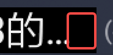
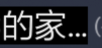

# TextView 省略号尾部有空白

TextView设置Ellipsize为超出展示省略号，发现省略号出现后尾部有一点点空白，导致后面的view 与其边距看上去多了一点点距离。




## 一个简单取巧的解决方案

因为自定义TextView通过mesure、绘制去除尾部距离太麻烦，所以这里取巧方式满足ui要求。

解决方案：收到计算出文本未超出宽度的最大字符串个数，然后手动截取字符串设置其文本。

```kotlin
class TitleTextView : AppCompatTextView {
    constructor(context: Context) : super(context)

    constructor(context: Context, attrs: AttributeSet?) : super(context, attrs)

    constructor(context: Context, attrs: AttributeSet?, defStyleAttr: Int) : super(
        context,
        attrs,
        defStyleAttr
    )

   private val maxWidth = this.context.resources.getDimension(R.dimen.px256)

   private fun calculateCharCountWithinWidth(textView: TextView, text: CharSequence): Int {
        val paint = textView.paint
        return paint.breakText(text, 0, text.length, true, maxWidth, null)
    }

    override fun setText(text: CharSequence, type: BufferType) {
        val count = calculateCharCountWithinWidth(this, text) // 计算出文本未超出宽度的最大字符串个数
        val newString = if (text.length == count) {
            text
        } else {
            text.substring(0, count) + "…" // 如果超出了，那么手动设置末尾省略号
        }
        super.setText(newString, type)
    }
}
```
