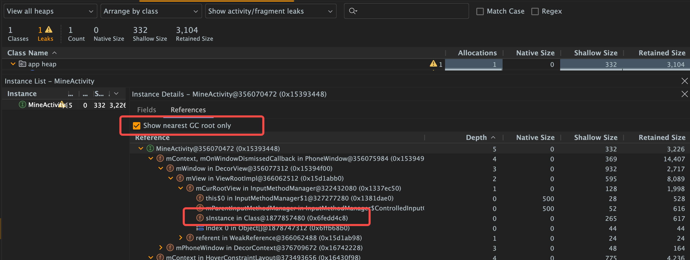

# Android Profiler 内存分析

## 一、内存分析核心流程

1. **复现泄漏场景**：重复触发目标操作（如打开 - 关闭 Activity），观察内存趋势。若 Java 堆内存 GC 后不回落（基线持续上升），则存在泄漏。
2. **生成堆快照**：在 Memory Profiler 点击 “Dump Java Heap”，获取当前堆内存中对象的详细信息。
3. **筛选可疑对象**：在堆快照的 “Class Name” 列表，筛选生命周期明确的组件（如 Activity、Fragment 等），查看其实例数是否随操作增长且不减少。
4. **分析引用链**：选中泄漏对象，切换到 “References” 面板，查看从 GC Roots 到泄漏对象的引用路径，定位泄漏源（如静态变量、线程、未注销监听器等）。
5. **验证修复效果**：修复代码后，重复操作并观察内存趋势，确认泄漏对象实例数不再异常增长。

## 二、关键属性解析

### （一）内存总览指标（趋势图）

|属性|含义|参考值与分析|
| ---- | ---- | ---- |
|Java 堆（Java Heap）|Java 代码中对象（如 Activity、List 等）占用内存，受 GC 管理|正常呈“锯齿状”（增长后因 GC 下降）；若 GC 后不回落、基线持续上升，可能泄漏|
|原生堆（Native Heap）|C/C++ 代码（如 JNI）分配的内存，不受 Java GC 管理|按需增长，释放后下降；持续增长且不释放（如 JNI 层未释放内存），易致 OOM|
|栈内存（Stack）|线程调用栈占用内存，存储局部变量、方法参数等|通常稳定在较小范围（如每个线程几 MB）；突然增大可能是递归过深或栈溢出|
|代码（Code）|应用代码（DEX、JNI 库、资源等）占用内存|启动后变化不大；频繁增长可能是动态加载 dex 或库未释放|
|其他（Other）|未归类内存（如系统分配的缓冲区、共享内存等）|占比通常不大|

### （二）堆快照核心属性（Heap Dump）

|属性|含义|参考值与分析|
| ---- | ---- | ---- |
|Class Name|对象所属类名|关注本应销毁却存活的类（如 Activity、Fragment 等）|
|Alloc Count|该类对象的总分配数量|随操作次数增长且不减少，可能存在泄漏|
|Alloc Size|该类对象分配的总内存大小（浅度大小之和）|大对象（如 Bitmap、大数组）分配过多需警惕|
|Shallow Size|单个对象本身占用内存（不包含引用对象）|基础类型对象大小固定；对象类型通常为 8/16 字节（取决于位数）|
|Retained Size|对象被回收后可释放的总内存（含其引用对象的内存）|泄漏对象的 Retained Size 通常较大（关联大量资源，如 View、Bitmap ）|
|Depth|对象到 GC Roots 的最短引用路径长度|深度为 0 的是 GC Roots（如静态变量、线程对象）；泄漏对象常被深度 0 的对象引用|
|Dominating Size|对象支配的内存（被其唯一引用对象的总内存）|支配大小大的对象若泄漏，影响更严重（如持有大量数据的单例）|

### （三）GC 相关指标

|属性|含义|参考值与分析|
| ---- | ---- | ---- |
|GC 次数与类型|趋势图标记 GC 事件（如 GC_FOR_MALLOC、GC_CONCURRENT 等）|正常应用 GC 频率低（每分钟几次）；频繁 GC 且内存不释放，可能因泄漏致内存紧张|

## 三、定位泄漏位置的方法

1. 选中References
2. 选中show nearest GC root only (作用是最近一次导致泄漏的gc)
3. 在里面看是哪个类强引用了泄漏类。



### （一）筛选泄漏对象

在堆快照的 “Class Name” 列表，筛选生命周期明确的组件（如 Activity、Fragment 等），查看其实例数是否随操作增长且不减少，若有则该类对象可能泄漏。

### （二）分析引用链

选中泄漏对象，切换到 “References” 面板，查看从 GC Roots（如静态变量、活跃线程等）到泄漏对象的引用路径，常见泄漏路径：

- **静态变量引用**：静态变量（如 `public static MainActivity sInstance;` ）作为 GC Root，长期持有 Activity 实例引用。
- **线程未销毁**：Activity 中创建的匿名线程持有 Activity 引用，且线程未终止（如循环未结束），导致 Activity 无法回收。
- **监听器未移除**：注册的系统服务监听器（如 LocationListener ）或第三方库监听器未注销，监听器持有 Activity 引用。
- **Handler 泄漏**：非静态 Handler 持有 Activity 引用，且消息队列中存在未处理消息（Message 持有 Handler 引用 ）。

### （三）结合支配树（Dominator Tree）

按 “Retained Size” 降序排列，快速找到占用大量内存且不该存在的对象，分析其引用链中的“持有者”，定位泄漏源。

## 四、常见泄漏场景及表现

|泄漏场景|Profiler 表现（堆快照）|引用链关键节点|
| ---- | ---- | ---- |
|Activity 被静态变量引用|Activity 实例数随操作增长，GC 后不减少|`static Field` → `Activity` 实例|
|Handler 泄漏|关闭 Activity 后，Handler、Message、Activity 均存活|`Thread`（主线程）→ `MessageQueue` → `Message` → `Handler` → `Activity`|
|未注销的监听器|Listener 实例与 Activity 关联，持续存活|`System Service`（如 LocationManager ）→ `Listener` → `Activity`|
|单例持有 Context|单例对象存活，且引用的 Context（如 Activity ）未释放|`Singleton` 实例 → `Context`（Activity）|

通过熟练掌握上述 Android Profiler 内存分析的属性及方法，可高效定位和解决内存泄漏问题，保障应用性能与稳定性。

---

## 示例

如上面图片中泄漏位置，是由于InputMethodManager导致的，那么可以在Activity的onDestory()方法中主动释放焦点

```java
@Override
protected void onDestroy() {
    super.onDestroy();
    // 清除所有控件焦点
    View currentFocus = getCurrentFocus();
    if (currentFocus != null) {
        currentFocus.clearFocus();
    }
    // 关闭输入法并解除关联
    InputMethodManager imm = (InputMethodManager) getSystemService(Context.INPUT_METHOD_SERVICE);
    if (imm != null) {
        // 解除与当前窗口的关联
        imm.hideSoftInputFromWindow(getWindow().getDecorView().getWindowToken(), 0);
        // 额外清理（针对部分机型的兼容问题）
        imm.restartInput(getWindow().getDecorView());
    }
}
```
