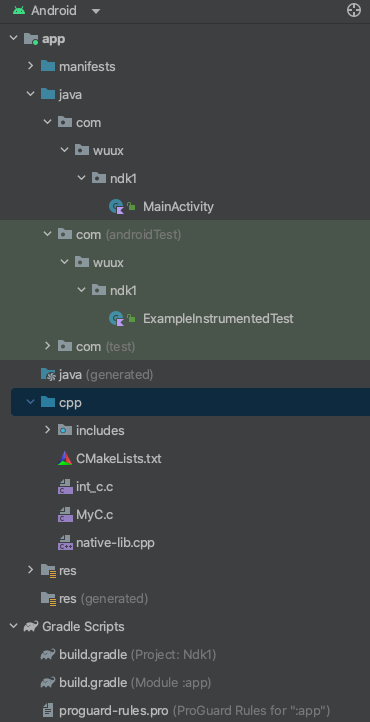

# 编译

1. 参考资料（视频比较老,其他资料比较旧，Android studio高版本已经不适用了，可以作为参考）：[黑马jni视频](https://www.bilibili.com/video/BV1BK4y1j7AW/?p=24&spm_id_from=333.1007.top_right_bar_window_history.content.click&vd_source=3509947f569e04aa5c144447e22d0ceb)，[NDK交叉编译](https://blog.csdn.net/Hi_Red_Beetle/article/details/78994767)，[NDK交叉编译 csdn](https://blog.csdn.net/ezconn/article/details/82529101)

2. JNI 通过配置CMAKELists.txt(android老版本使用Android.mk作为配置文件) ，使用NDK build 进行.so库的构建。

3. 使用  
    1. system.loadLibrary("配置文件中的so库名称")；
    2. java中设定 :static native return_type method_name()
    3. c/c++文件中将全类名（.替换成_）+方法名。函数参数中有（Env* env,jobject thiz,...java方法中的其他参数）

4. 生产不同cpu架构的so文件
    * 新版：build.gradle 中指定编译的cpu版本
    * 旧版：Application.mk 文件中指定： APP_ABI=对应cpu架构。(说明文档可以在ndk文件下的doc中找到)。  
     补充：编译时出现警告，警告可以指定 APP_PLAFORM=min-AndroidVsersion。  

5. android studio如何配置

    * module gradle中配置ndk及cmakelists

    ``` groavy
     externalNativeBuild {
        cmake {
            path file('src/main/cpp/CMakeLists.txt')
            version '3.22.1'
        }
    }
    ```  

    
    >注意，目录中的 wuux 应该改为 wuxu
