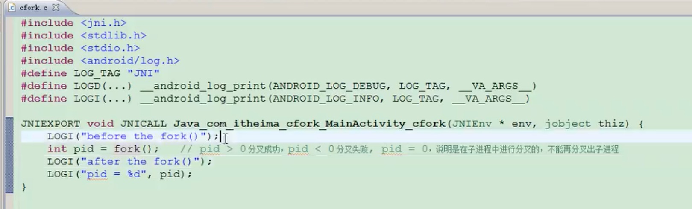

# c中的fork函数

native 可以使用fork()函数，创建子进程。 熟悉c的fork执行流程即可，代码只是一行代码调用，不需要练习。
参考：[c fork 黑马视频讲解](https://www.bilibili.com/video/BV1BK4y1j7AW?p=47&vd_source=3509947f569e04aa5c144447e22d0ceb)

## fork 分析截图  

  

## 用途

c 中的fork很有用  

1. Android 系统层通过这个来创建不同进程，熟悉fork执行流程，方便Android framework的学习。  
2. window中，应用卸载时的弹窗提示用户反馈体验。可以使用fork，当主进程挂掉或应用被卸载，可以使用子进程弹出卸载提示框。

## 案例

    ```cpp
    #include <jni.h>
    #include <cstdio>
    #include <unistd.h>
    #include "stdio.h"
    #include "stdlib.h"
    #include "com_wuxu_jnicpp_Test.h"
    #include "android/log.h"
    #define LOG_DEBUG(...) __android_log_print(ANDROID_LOG_DEBUG,"test", __VA_ARGS__)

    extern "C" {
        JNIEXPORT jstring JNICALL
        Java_com_wuxu_jnicpp_MainActivity_forkProcess(JNIEnv *env, jobject thiz) {
            int pid = fork();
            if (pid == 0){
                //如果pid == 0 ，说明子进程fork了
                while (1){
                    LOG_DEBUG("fork child process");
                    int ppid = getpid(); //获取子进程的父进程号
                    if (ppid == 1){
                        // ppid == 1 表示父进程已不存在，可能被kill或程序被卸载
                        //怎么判断是被kill还是卸载： 使用本地文件来判断，data/data目录下包名文件夹是否存在
                        FILE* file = fopen("/data/data/com.wuxu.jnicpp",
                                        reinterpret_cast<const char *>('r'));
                        if (file != NULL){
                            //文件存在，说明没有被卸载
                            //子进程判断程序被kill，拉活应用 am start -n com.wuxu.jnicpp.MainActivity
                            execlp("am","am","start","-n","com.wuxu.jnicpp.MainActivity",(char*)NULL);//NULL是结束符，表示命令输入结束
                        }else{
                            //程序被卸载
                            //打开一个网页  am start -a android.intent.action.VIEW -d http://www.baidu.com/
                            execlp("am","am","start","-a","android.intent.action.VIEW","-d","http://www.baidu.com/",(char*)NULL);
                        }

                        exit(0);
                    }

                    sleep(2);
                }
            }

            return (*env).NewStringUTF("21");
        }
    }
    ```
