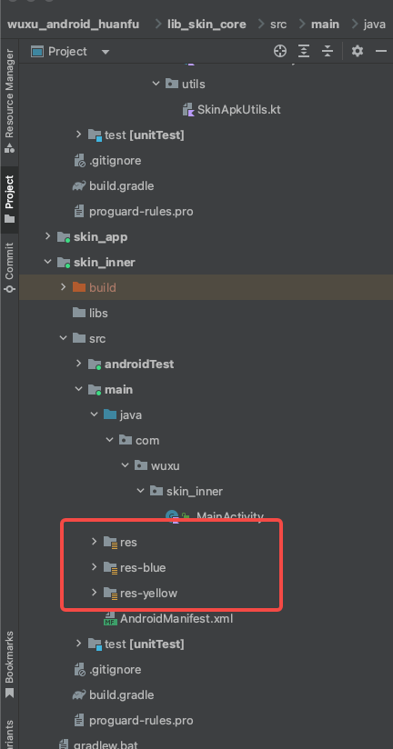
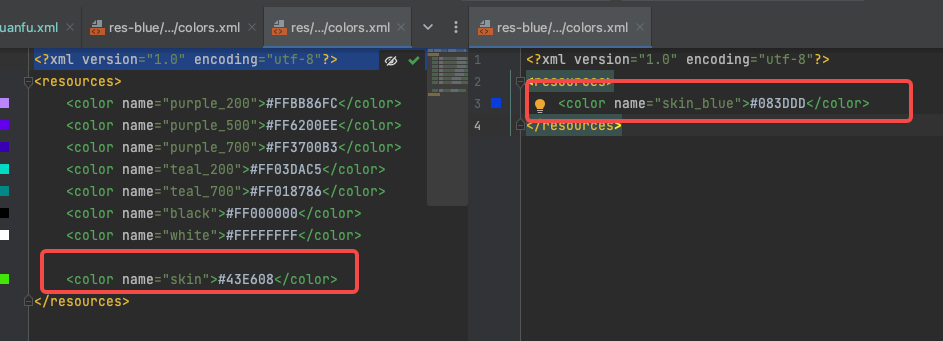
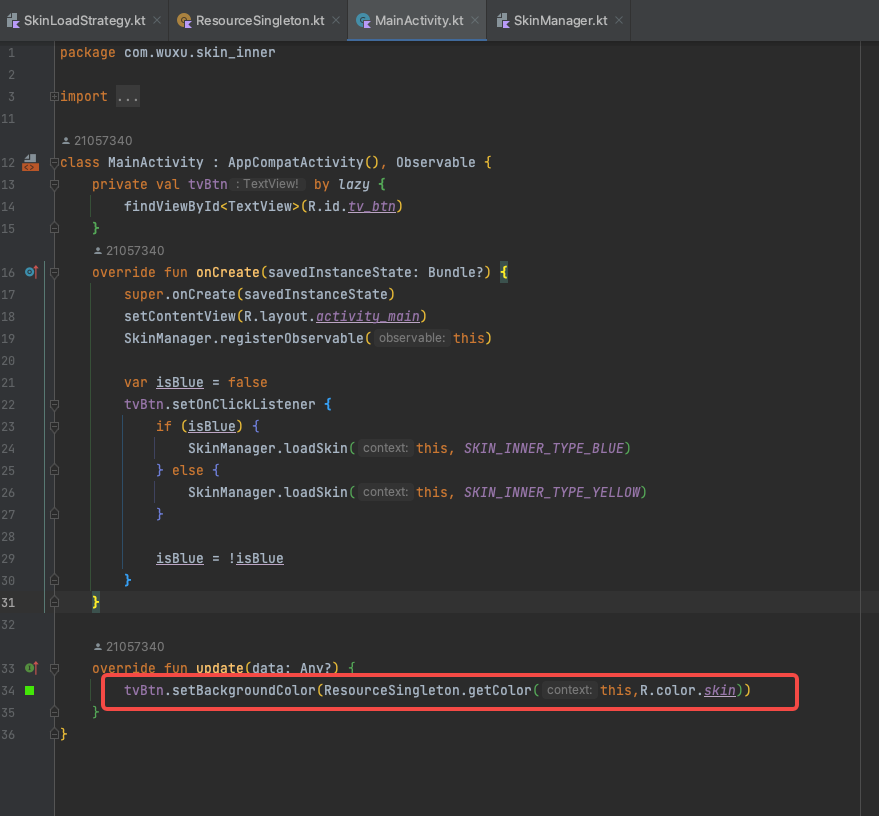
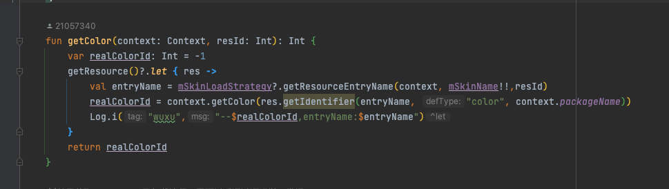

# 应用内换肤

在本apk下，进行换肤处理。原理如下：

1. 设定不同后缀(也可以用前缀，本文我使用后缀来描述。)资源文件夹，只要保证与`res`资源文件不同即可。
2. 不同资源文件夹中的所有资源都要增加后缀标识，避免与原资源文件冲突
3. 页面收到皮肤变化通知刷新ui，
4. 使用当前应用的resources获取【源资源】id对应的名称，将名称增加后缀信息，使用`resourcs.getIdentifier()`动态获取到皮肤资源文件夹中的资源id。

## 1 资源目录设定



项目下的gradle设置资源路径

```grovy
  sourceSets{
        main{
            res.srcDirs=['src/main/res','src/main/res-blue','src/main/res-yellow']
        }
    }
```

## 2 增加后缀标识




## 3 页面刷新UI

收到皮肤变化通知，重新获取资源



## 4 动态获取资源

使用color举例



这里的mSkinLoadStrategy 是上面的SkinInnerLoadStrategy类，至此，一个color资源被替换为新皮肤资源文件下的color。
