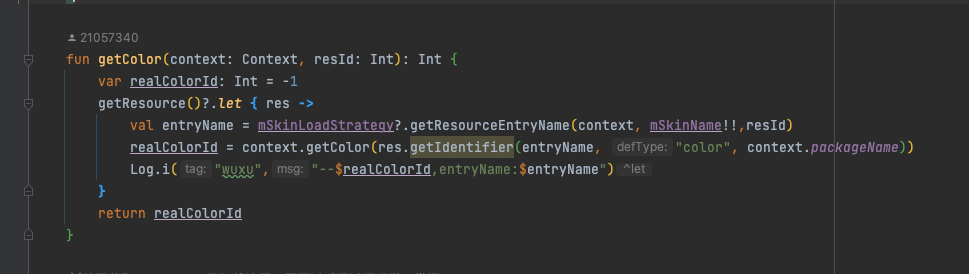

# 皮肤包

又称插件包，大体与应用内换肤实现相同。但是需要增加其他apk的解析获取resources工作。

1. 制作皮肤包，资源名称与宿主应用中相同，或是后缀、前缀，只要方便通过动态资源加载即可。
2. 创建皮肤包对应的resources对象
3. 页面收到皮肤变化通知刷新ui。
4. 使用皮肤包应用的resources获取【源资源】id对应的名称，使用`resourcs.getIdentifier()`动态获取到皮肤资源文件夹中的资源id。

## 1 制作皮肤包

没啥好讲的，根据资源名称规则，创建一个apk，将apk放在某个目录下。

## 2 resources对象获取

1. 获取皮肤包信息，并将皮肤地址设置到sourceDir、publicSourceDir属性中

    ```kotlin
    val skinPackageInfo: PackageInfo? = if (Build.VERSION.SDK_INT >= Build.VERSION_CODES.TIRAMISU) {
            context.packageManager.getPackageArchiveInfo(skinPath, PackageManager.PackageInfoFlags.of(0))
    }else{
        context.packageManager.getPackageArchiveInfo(skinPath,0)
    }

    skinPackageInfo.applicationInfo?.sourceDir = skinPath
    skinPackageInfo.applicationInfo?.publicSourceDir=skinPath
    ```

2. 创建resource对象

    * 如果是已安装应用的，可以通过`packManager.getResourceForApplication`直接获取
    * 非安装应用，需要先通过反射创建`AssetsManager`对象，然后创建出Resources对象

        ```kotlin
        //反射获取非安装应用的resources文件
        val assetManager = AssetManager::class.java.newInstance()
        val addAssetPathMethod= assetManager.javaClass.getDeclaredMethod("addAssetPath",assetManager.javaClass)
        addAssetPathMethod.isAccessible = true
        addAssetPathMethod.invoke(assetManager,skinPath)

        resource = Resources(assetManager,context.resources.displayMetrics,context.resources.configuration)
        ```

## 3 收到通知刷新UI

同应用内换肤相同


## 4 加载资源

同应用内换肤，如果皮肤包与宿主apk中的资源名相同，那么不用特别处理了，直接通过皮肤包的resources对象获取名称即可。




这里的mSkinLoadStrategy 是上面的SkinApkLoadStrategy类，至此，一个color资源被替换为皮肤包下的color资源。
