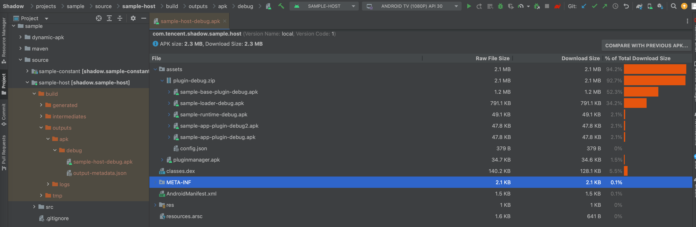

# 使用Shadow框架

## 前言

### 前置知识

必须掌握：

- gradle（shadow中有大量gradle配置操作，要深入学习，才能明白为啥要这样做！）

了解即可：

## 结构说明（重点）

>学习Shadow框架及接入，要提前清楚Shadow的整体结构，会让你事半功倍的！

- 结构图示：待补充

    1. 打包后的apk目录（注意此处是Demo版，咱了解下结构即可，正式的包在assets目录不会有东西的）

        

- 文字说明：Shadow整体按功能分为三大块
  - 宿主（Host）：主APP，也是需要用户安装的apk
  - 插件管理者（Manager）：独立的apk，宿主apk需要实现下载功能，下载并加载插件管理APK，通过插件管理者再进行插件的下载升级、并调用到`插件框架`。
  - 插件包（）：zip文件。包括：插件应用apk、插件框架（runtime.apk、loader.apk）、插件信息配置json文件

### Shadow源码里源码级示例的结构说明

- sample-constant
- sample-host
- sample-host-lib
- sample-manager
- sample-plugin
  - sample-app
  - sample-base
  - sample-base-lib
  - sample-loader
  - sample-runtime

## 接入流程

### 新项目

### 老项目改造

---

## 问题

解决办法：设置java编译版本

