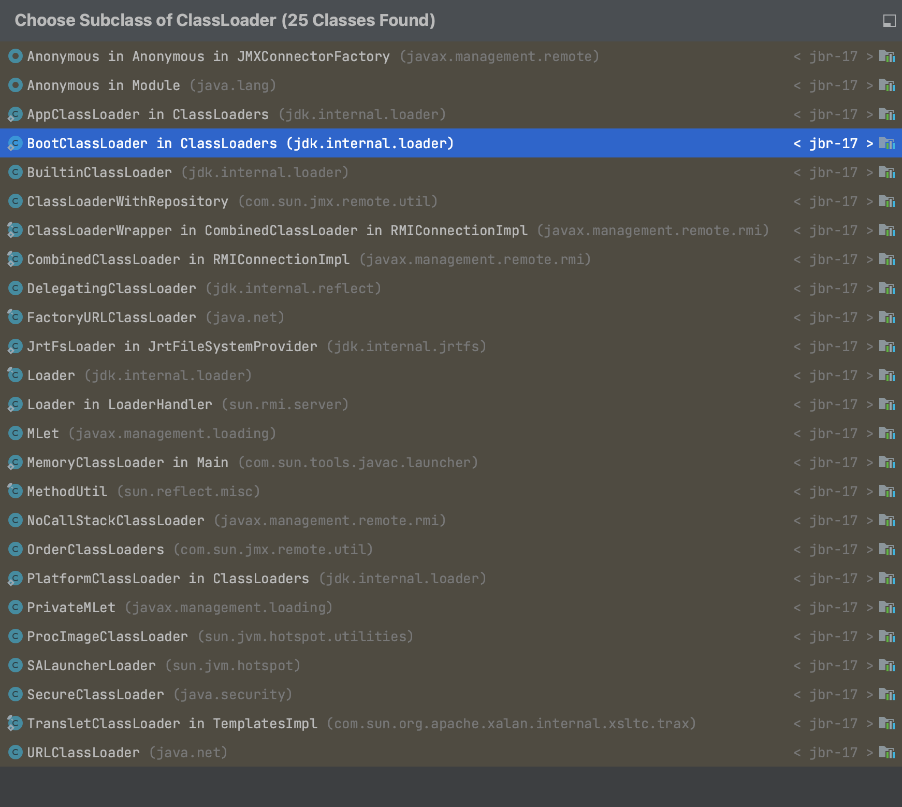
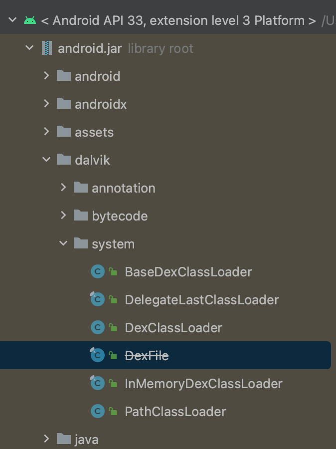

# 安卓中的ClassLoader

学习android中的ClassLoader，需要先明白[Java的ClassLoader加载流程](/3.程序/1.基础/2.基础语言/java/2.%E8%BF%9B%E9%98%B6/%E7%B1%BB%E5%8A%A0%E8%BD%BD)

## 简介

Android中的类加载机制与Java标准类加载机制有所不同（待学习，目前我也不知道有哪些不同），因为Android运行在Dalvik虚拟机或ART（Android Runtime）上，而不是Java虚拟机。

### ClassLoader

继承自ClassLoader：

android SDK 33 中：

### Android ClassLoader 部分类型描述

Android的ClassLoader又有了很多扩展。增加了下面几种类：

- BootClassLoader ：
  - 负责加载Android Framework层的类文件。
  - 实现为单例模式，由于访问修饰符是默认的，所以仅可在同包下使用。

- BaseDexClassLoader ：
  - 是一个抽象类，提供了加载DEX文件的基础实现。
  - 其他ClassLoader如PathClassLoader和DexClassLoader都继承自这个类。

- PathClassLoader ：
  - 继承自BaseDexClassLoader，用于加载已安装APK中的字节码文件。
  - Android使用这个类作为其系统ClassLoader和应用程序ClassLoader。

- DexClassLoader ：
  - 也继承自BaseDexClassLoader，用于加载指定目录中的字节码文件。
  - 通常用于加载未安装APK或从SD卡等位置加载的APK。

- InMemoryDexClassLoader ：
  - 继承自BaseDexClassLoader，用于加载内存中的DEX字节码文件。
  - 在Android 8.0中加入，用于支持动态加载功能。
