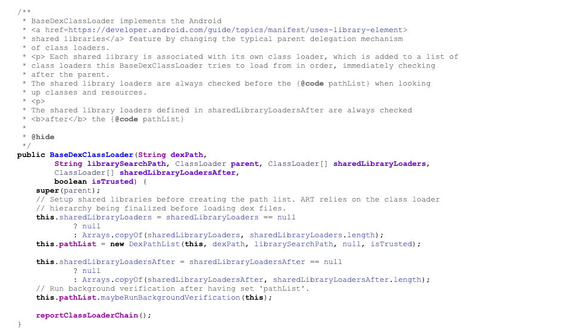

# BaseDexClassLoader 解析

BaseDexClassLoader 是Android类加载体系中的一个重要组成部分，它使得开发者能够加载和运行动态代码，这是Android插件化、热修复等技术的基础。

## 构造方法参数列表



```java
public BaseDexClassLoader(String dexPath,
              String librarySearchPath, ClassLoader parent, ClassLoader[] sharedLibraryLoaders,
              ClassLoader[] sharedLibraryLoadersAfter,
              boolean isTrusted)
```

这个构造函数包含了多个参数，每个参数都有特定的含义和用途：

- dexPath：
  - 一个字符串，指定了包含DEX文件的路径。这可以是单个文件的路径，也可以是多个文件的路径，文件路径之间由系统属性 path.separator 指定的分隔符分隔。
- librarySearchPath：
  - 一个字符串，指定了搜索本机库（如 .so 文件）的路径。这通常用于加载应用程序的原生库。
- parent：
  - ClassLoader 类型的引用，表示这个类加载器的父类加载器。根据类加载的双亲委派模型，如果当前类加载器无法完成类加载，请求会委托给父类加载器。
- sharedLibraryLoaders：
  - 一个 ClassLoader 数组，表示用于加载共享库的类加载器列表。这些类加载器将用于搜索和加载本机库。
- sharedLibraryLoadersAfter：
  - 另一个 ClassLoader 数组，表示在当前类加载器之后用于加载共享库的类加载器列表。这允许在当前类加载器尝试加载库之后，再让其他类加载器尝试。
- isTrusted：
  - 一个布尔值，指示是否信任这个类加载器加载的代码。这个标志影响DEX文件的优化和验证过程。

这个构造函数允许你创建一个类加载器，它能够加载来自特定路径的DEX文件，并且可以指定搜索本机库的路径。sharedLibraryLoaders 和 sharedLibraryLoadersAfter 参数提供了对共享库加载过程的更细粒度控制，允许你定义一个类加载器链，这个链中的每个类加载器都有机会参与库的搜索和加载过程。

isTrusted 参数通常用于系统类加载器，因为它们加载的代码是可信的。对于非系统类加载器，这个标志应该谨慎设置，因为它可能会影响安全策略。

另一个构造方法：

```java
//optimizedDirectory this parameter is deprecated and has no effect since API level 26.
public BaseDexClassLoader(String dexPath, File optimizedDirectory,
              String librarySearchPath, ClassLoader parent) {
    //optimizedDirectory已经被废弃了，源码这里没有任何处理
    this(dexPath, librarySearchPath, parent, null, null, false);
}
```

- File optimizedDirectory：
  - 这是优化目录的路径，用于存放优化后的DEX文件。在Android 4.4（API级别19）及以上版本中，这个目录用于存放ART运行时优化后的ODEX文件。简单来说dex文件会被进一步编译为`.odex`文件，这个参数就是设置`.odex`存放的目录，这也是PathClassLoader与DexClassLoader唯一的区别，8.0以后二者没有区别了，因为源码层不做任何处理，统一设置了存储的位置。
  >optimizedDirectory this parameter is deprecated and has no effect since API level 26.从源码中可知，这个参数已经无效了，即使传入也不会有任何处理。

---

## Android 8.0以前的optimizedDirectory处理

对 DEX 文件的处理链路如下：

```txt
PathClassLoader.constructor / DexClassLoader.constructor -> BaseDexClassLoader.constructor -> DexPathList.constructor -> DexPathList.makeDexElements -> DexPathList.loadDexFile -> DexFile.constructor / DexFile.loadDex -> DexFile.openDexFile -> DexFile.openDexFileNative -> DexFile_openDexFileNative -> ClassLinker::OpenDexFilesFromOat
```

## Android 8.0及以后的optimizedDirectory处理

在 8.0 系统上，optimizedDirectory 被弃用了，传给 DexPathList 的 optimizedDirectory 直接为空，不管外面传进来什么值。 也就是说，在 8.0 上，PathClassLoader 和 DexClassLoader 其实已经没有什么区别了。

对 DEX 文件的处理链路如下：

```txt
DexFile_openDexFileNative -> DexLocationToOdexNames -> OatFileManager::OpenDexFilesFromOat -> OatFileAssistant::OatFileAssistant -> OatFileAssistant::DexLocationToOdexFilename -> DexLocationToOdexNames
```

## 示例

```java
String dexPath = "/sdcard/plugin.apk"; // 插件APK的路径
File optimizedDirectory = context.getCodeCacheDir(); // 优化目录
String librarySearchPath = null; // 库文件搜索路径，如果不需要可以设置为null
ClassLoader parent = getClass().getClassLoader(); // 父类加载器

// 创建BaseDexClassLoader的实例
DexClassLoader classLoader = new DexClassLoader(
        dexPath, 
        optimizedDirectory.getPath(), //8.0以后直接写null
        librarySearchPath, 
        parent
);

// 使用类加载器加载插件中的类
Class<?> pluginClass = classLoader.loadClass("com.example.plugin.ExampleClass");

// 创建插件类的对象
Object pluginObject = pluginClass.newInstance();

// 调用插件对象的方法
// ...
```

## 内容资料参考

- [知乎](https://www.zhihu.com/tardis/sogou/art/80629979)
