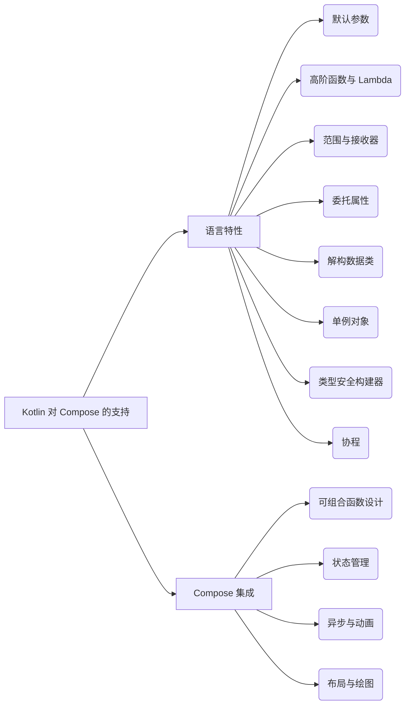

# Kotlin 对 Jetpack Compose 的支持

原地址：<https://developer.android.google.cn/develop/ui/compose/kotlin?hl=zh-cn>

## 一、默认参数：简化函数设计

### 1. 核心特性

- **功能**：为函数参数设置默认值，调用时可省略未传递的参数。
- **优势**：
  - 减少重载函数数量，避免代码冗余。
  - 增强代码可读性，显式传递参数更易理解。
- **Compose 应用**：
  - **示例**：`Text` 组件仅传递 `text` 参数，其他参数使用默认值：

    ```kotlin
    Text(text = "Hello, Android!") // 等价于显式设置所有默认参数
    ```

  - **最佳实践**：可组合函数应合理使用默认参数，平衡灵活性与易用性。

## 二、高阶函数与 Lambda 表达式：声明式编程基础

### 1. 高阶函数

- **定义**：接收或返回函数作为参数的函数。
- **Compose 场景**：
  - 可组合项的事件处理（如 `Button` 的 `onClick` 参数）：

    ```kotlin
    Button(onClick = { /* 点击逻辑 */ }) { Text("Click me") }
    ```

### 2. 尾随 Lambda

- **语法糖**：当高阶函数的最后一个参数是 Lambda 时，可将其移至括号外，甚至省略括号。
- **典型应用**：布局组件的 `content` 参数（如 `Column`、`Row`）：

  ```kotlin
  Column(modifier = Modifier.padding(16.dp)) { // 尾随 Lambda 定义子元素
      Text("Item 1")
      Text("Item 2")
  }
  ```

## 三、范围与接收器：限定上下文逻辑

### 1. 作用域（Scope）

- **定义**：特定可组合项创建的上下文，限定可用的属性和函数。
- **示例**：
  - `RowScope`：提供垂直对齐方式（`Alignment.CenterVertically`），但不支持水平对齐（`ColumnScope` 专有）。
  - `DrawScope`：`Canvas` 的 `drawBehind` 回调中可用 `drawRect` 等绘图函数。

### 2. 接收器 Lambda

- **机制**：Lambda 在特定接收器对象的上下文中执行，可直接调用接收器的成员。
- **代码示例**：

  ```kotlin
  Box(modifier = Modifier.drawBehind { // 接收器为 DrawScope
      drawRect(Color.Gray) // 直接调用 DrawScope 的绘图函数
  })
  ```

## 四、委托属性：状态管理的核心

### 1. 语法与原理

- **语法**：通过 `by` 关键字将属性的实现委托给其他对象。
- **Compose 状态应用**：
  - **状态声明**：使用 `remember` 和 `mutableStateOf` 委托属性，实现响应式更新：

    ```kotlin
    var showDialog by remember { mutableStateOf(false) } // 状态变化触发重组
    ```

  - **原理**：委托对象（如 `State`）跟踪值的变化，并通知 Compose 运行时。

## 五、解构数据类：便捷的数据提取

### 1. 特性

- **功能**：从数据类实例中直接提取属性值，简化变量赋值。
- **Compose 场景**：
  - 处理布局引用（如 `createRefs()` 返回多个引用）：

    ```kotlin
    Row {
        val (imageRef, titleRef, subtitleRef) = createRefs() // 解构获取多个引用
        Image(modifier = Modifier.ref(imageRef), ...)
    }
    ```

## 六、单例对象：全局状态管理

### 1. 定义与用途

- **声明**：使用 `object` 关键字创建单例，全局唯一实例。
- **Compose 应用**：
  - `MaterialTheme`：作为单例提供主题相关属性（`colors`、`typography`），全局可访问：

    ```kotlin
    MaterialTheme {
        Text(color = MaterialTheme.colorScheme.primary, ...) // 访问单例主题属性
    }
    ```

## 七、类型安全构建器与 DSL：简洁的层次结构

### 1. 核心概念

- **DSL（领域特定语言）**：通过 Lambda 表达式构建层次化结构，提升代码可读性。
- **Compose 实现**：
  - **列表组件**：`LazyColumn`/`LazyRow` 使用 DSL 风格定义条目：

    ```kotlin
    LazyColumn {
        item { Header() } // 头布局
        items(messages) { message -> Item(message) } // 列表项
    }
    ```

  - **绘图组件**：`Canvas` 通过接收器 Lambda 实现类型安全的绘图逻辑：

    ```kotlin
    Canvas {
        drawRect(Color.Red) // 接收器为 DrawScope，直接调用绘图方法
    }
    ```

## 八、Kotlin 协程：异步编程的基石

### 1. 协程优势

- **非阻塞异步**：通过 `suspend` 函数和 `CoroutineScope` 处理异步任务，避免回调地狱。
- **Compose 集成 API**：
  - `rememberCoroutineScope`：创建与可组合项生命周期绑定的协程作用域。
  - **示例：并行执行任务**：

    ```kotlin
    val scope = rememberCoroutineScope()
    Button(onClick = {
        scope.launch { // 滚动到顶部
            scrollState.animateScrollTo(0)
        }
        scope.launch { // 并行加载数据
            viewModel.loadData()
        }
    })
    ```

### 2. 协程与动画结合

- **场景**：处理用户输入与动画的异步联动：

  ```kotlin
  @Composable
  fun MoveBoxWhereTapped() {
      val animatedOffset = remember { Animatable(Offset.Zero) }
      Modifier.pointerInput(Unit) {
          while (true) {
              val position = awaitPointerEventScope { awaitFirstDown().position }
              scope.launch { animatedOffset.animateTo(position) } // 协程驱动动画
          }
      }
  }
  ```


