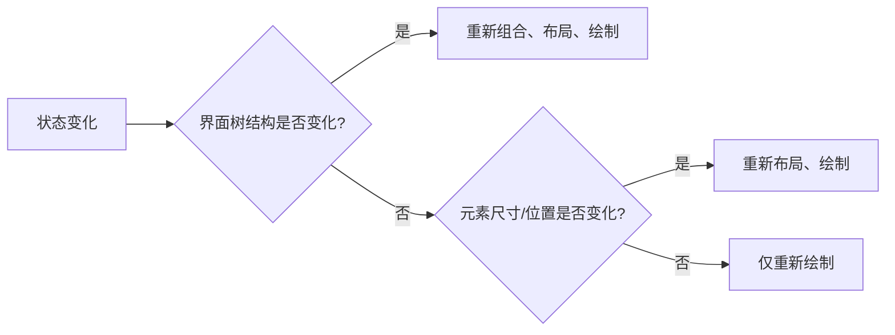

# Compose 的阶段和性能

原地址：<https://developer.android.google.cn/develop/ui/compose/performance/phases?hl=zh-cn>

## 一、Compose 更新帧的三个核心阶段

Compose 在更新界面时遵循以下流水线流程，每个阶段可独立优化：

### 1. **组合阶段（Composition）**

- **目标**：构建或更新界面树（UI Tree），确定当前需要显示的可组合项及其配置。
- **关键行为**：
  - 运行可组合函数，创建或更新界面元素（如 `Text`、`Box`）。
  - 建立状态（`State`）与可组合项的关联，生成 `Composition` 对象。
  - **触发条件**：状态变化、组件首次加载、显式调用 `invalidate`。
- **优化关键**：减少可组合函数内的复杂计算，避免不必要的重组。

### 2. **布局阶段（Layout）**

- **目标**：确定界面树中每个元素的尺寸和位置（`Measure` 和 `Place`）。
- **关键行为**：
  - 调用 `measure` 函数计算组件所需空间（约束条件：最大/最小宽高）。
  - 调用 `place` 函数确定组件在父容器中的位置。
  - **跳过条件**：若组件尺寸和位置未变化，可跳过此阶段（如仅颜色变化）。
- **优化关键**：避免在布局中执行耗时操作，使用 `rememberMeasurePolicy` 缓存测量逻辑。

### 3. **绘制阶段（Drawing）**

- **目标**：将界面元素渲染到屏幕上（基于 Canvas 或硬件加速）。
- **关键行为**：
  - 执行绘制指令（如 `drawRect`、`drawText`）。
  - 处理动画、渐变、阴影等视觉效果。
  - **跳过条件**：若元素视觉属性未变化（如仅数据更新但界面无视觉变化），可跳过此阶段。
- **优化关键**：减少重叠绘制（Overdraw），使用 `clip` 限制绘制范围，启用硬件加速。

### 阶段跳过机制示例



## 二、性能优化的核心原则

### 1. **减少可组合函数内的计算**

- **问题**：可组合函数会在重组时重新执行，频繁计算导致性能损耗（如动画每一帧）。
- **解决方案**：
  - 将耗时计算（如数据转换、复杂逻辑）移至 `ViewModel` 或 `remember` 缓存中。
  - **反例**：

    ```kotlin
    @Composable
    fun Counter(count: Int) {
        // 避免在可组合函数内执行复杂计算
        val text = "Count: ${count.toString().padStart(3, '0')}" 
        Text(text)
    }
    ```

  - **优化后**：

    ```kotlin
    @Composable
    fun Counter(count: Int) {
        // 使用 remember 缓存计算结果
        val formattedText by remember(count) { derivedStateOf { 
            "Count: ${count.toString().padStart(3, '0')}" 
        } }
        Text(formattedText)
    }
    ```

### 2. **延后状态读取（Lazy State Reading）**

- **问题**：过早读取状态可能导致不必要的重组（如父组件状态变化触发子组件重组）。
- **解决方案**：
  - 通过 lambda 向子组件传递状态更新逻辑，而非直接传递状态值。
  - 使用基于 lambda 的修饰符（如 `Modifier.clickable(onClick = { ... })`）。
  - **示例**：

    ```kotlin
    // 父组件直接传递状态（可能触发子组件不必要重组）
    @Composable
    fun Parent() {
        var isExpanded by remember { mutableStateOf(false) }
        Child(isExpanded = isExpanded) 
    }

    @Composable
    fun Child(isExpanded: Boolean) {
        // 即使内容未变，isExpanded 变化会触发重组
        if (isExpanded) { LargeContent() } else { SmallContent() }
    }

    // 优化：传递状态更新逻辑而非状态值
    @Composable
    fun Parent() {
        var isExpanded by remember { mutableStateOf(false) }
        Child(onToggle = { isExpanded = !isExpanded }) 
    }

    @Composable
    fun Child(onToggle: () -> Unit) {
        // 仅在用户交互时触发重组
        Button(onClick = onToggle) { Text("Toggle") }
    }
    ```

### 3. **避免阻塞主线程**

- **问题**：组合/布局阶段执行耗时操作（如网络请求、数据库查询）会导致界面卡顿。
- **解决方案**：
  - 使用协程（`LaunchedEffect`）或 `rememberCoroutineScope` 处理异步任务。
  - 将非界面相关逻辑移至 `ViewModel` 或后台线程。

## 三、阶段性能监控工具

- **Android Studio Profiler**：
  - 查看各阶段耗时（组合、布局、绘制的 FPS 曲线）。
  - 定位频繁重组的组件（`Recomposition Count` 统计）。
- **Compose 调试标记**：
  - 添加 `debugInspectorInfo` 标识可组合项，便于在 Profiler 中识别。

  ```kotlin
  @Composable
  fun MyComponent() {
      Text(
          "Hello",
          debugInspectorInfo = debugInspectorInfo {
              name = "MyComponent"
              properties["textColor"] = Color.Black
          }
      )
  }
  ```

## 四、总结：阶段优化核心思路

| 阶段       | 优化目标                     | 关键方法                                                                 |
|------------|------------------------------|--------------------------------------------------------------------------|
| **组合**   | 减少重组次数                 | 缓存计算结果（`remember`）、拆分可组合项、避免全局状态直接驱动子组件     |
| **布局**   | 减少测量/布局计算           | 使用固定尺寸、缓存测量策略（`rememberMeasurePolicy`）、避免嵌套复杂布局   |
| **绘制**   | 减少绘制指令与重叠渲染       | 合并绘制操作、使用 `Canvas` 硬件加速、避免过度使用 `clip` 和 `shadow`    |

通过理解 Compose 各阶段的职责并遵循优化原则，可显著提升应用流畅度，尤其在列表滑动、动画交互等高频更新场景中效果显著。
