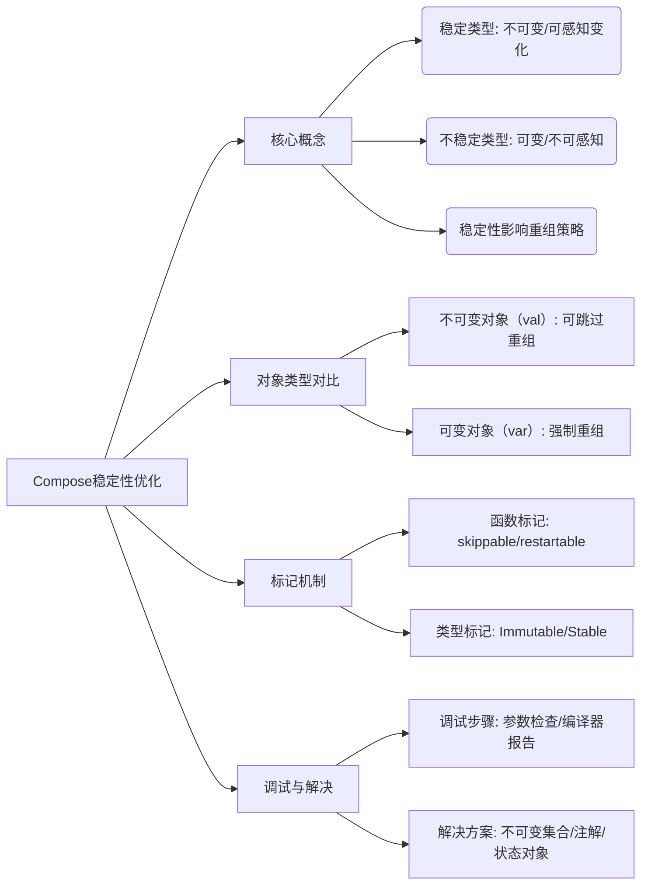

# Compose 中的稳定性

原地址：<https://developer.android.google.cn/develop/ui/compose/performance/stability?hl=zh-cn>

## 一、稳定性核心概念

### 1. 稳定与不稳定类型的定义

- **稳定类型**：不可变类型（如用`val`定义的`data class`）或Compose能感知其值变化的类型（如`MutableState`系列）。
- **不稳定类型**：可变类型（如用`var`定义的类）或Compose无法追踪变化的类型（如普通集合）。

### 2. 稳定性对重组的影响

- **稳定参数**：若可组合项参数稳定，Compose在重组时会对比参数值，未变化则跳过该可组合项。
- **不稳定参数**：参数不稳定时，父项重组会强制触发该可组合项重组，可能导致性能问题。

## 二、不可变对象与可变对象对比

### 1. 不可变对象示例（推荐做法）

```kotlin
// 不可变数据类（用val定义属性）
data class Contact(val name: String, val number: String)

@Composable
fun ContactRow(contact: Contact, modifier: Modifier = Modifier) {
    var selected by remember { mutableStateOf(false) }
    Row(modifier) {
        ContactDetails(contact) // 因contact稳定，重组时若值未变则跳过
        ToggleButton(selected, onToggled = { selected = !selected }) // 参数变化时重组
    }
}
```

- **关键**：不可变对象属性不可修改，Compose可通过引用或值比较判断是否变化，避免无效重组。

### 2. 可变对象示例（不推荐做法）

```kotlin
// 可变数据类（用var定义属性）
data class Contact(var name: String, var number: String)

@Composable
fun ContactRow(contact: Contact, modifier: Modifier = Modifier) {
    var selected by remember { mutableStateOf(false) }
    Row(modifier) {
        ContactDetails(contact) // 因contact不稳定，父项重组时强制重组
        ToggleButton(selected, onToggled = { selected = !selected })
    }
}
```

- **问题**：Compose无法追踪普通可变对象的属性变化，导致即使属性未变也会触发重组。

## 三、Compose的标记机制（实现原理）

### 1. 函数标记

- **`skippable`**：可组合项参数稳定时，Compose可跳过重组（需所有参数值不变）。
- **`restartable`**：作为重组作用域起点，触发其内部可组合项重新执行。

### 2. 类型标记

- **`Immutable`**：值不可变（如基本类型、`String`、用`val`的`data class`），Compose通过值比较判断变化。
- **`Stable`**：允许属性可变，但需通过Compose状态机制（如`MutableState`）通知变化，否则视为不稳定。

## 四、调试稳定性问题

### 1. 常见排查步骤

- 检查可组合项参数是否包含`var`属性的类型或普通可变对象。
- 确认集合类型是否为稳定类型（默认`List/Set/Map`不稳定）。

### 2. 工具与方法

- **编译器报告**：通过`-Pcompose.stabilityReport=stability-report.html`生成报告，查看类型稳定性推断结果。
- **日志与断点**：在可组合项中添加日志或断点，观察重组触发频率。

## 五、解决稳定性问题的实践方案

### 1. 集合处理

- **推荐方案**：
  - 使用Kotlinx不可变集合（如`ImmutableList`）。
  - 对可变集合添加`@Stable`注解（需确保通过Compose状态更新）。
- **示例**：

  ```kotlin
  @Stable
  val mutableList = remember { mutableStateListOf<String>() }
  ```

### 2. 跨模块类型

- **问题**：非Compose模块的类型默认视为不稳定。
- **解决方案**：将界面相关模型类封装在Compose模块内，或添加`@Stable`/`@Immutable`注解。

### 3. 状态对象选择

- 优先使用Compose内置状态类型（如`MutableState`、`SnapshotStateMap`），确保变化可被追踪。

## 六、最佳实践总结

1. **参数设计**：可组合项参数尽量使用稳定类型（不可变对象或Compose状态对象）。
2. **立即修复**：发现无效重组时，检查参数是否为`var`定义的可变类型。
3. **集合与注解**：对集合类型显式声明稳定性（不可变集合或`@Stable`）。
4. **模块隔离**：界面层模型类与业务逻辑分离，避免跨模块不稳定类型传入可组合项。


