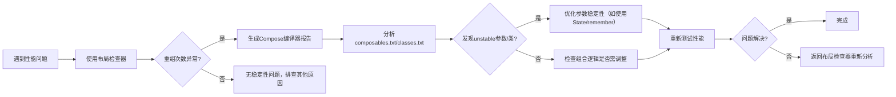

# 诊断稳定性问题

原地址：<https://developer.android.google.cn/develop/ui/compose/performance/stability/diagnose?hl=zh-cn>

## 一、核心要点

### 1. 前置说明

- **目标**：调试因不必要或过度重组导致的Compose性能问题。
- **重要提示**：避免不必要或不成熟的优化，先遵循Compose性能最佳实践。
- **注意事项**：测量性能需参考Macrobenchmark指南。

### 2. 主要工具

|工具|作用|
|----|----|
|**布局检查器**|可视化查看可组合项的重组次数（执行/跳过）|
|**Compose编译器报告**|分析可组合项及类的稳定性推断结果|

## 二、布局检查器使用指南

### 1. 功能

- 显示应用中各可组合项的重组次数（`Recomposition Count`）和跳过次数（`Skipped Count`）。
- 辅助定位频繁重组的组件，如界面中重复更新的模块。

### 2. 示例截图分析

```txt
Component Tree Recomposition counts
- JetsnackApp
  - JetsnackTheme
    - ProvideJetsnackColors
      - MaterialTheme
        - JetsnackScaffold
          - Scaffold
            - NavHost
              - Crossfade
                - LocalOwnersProvider
                  - SaveableStateProvider
                    - Box
                      - Header（Recomposition Count: 112，Skipped Count: 112）
                      - Title（同上）
                      - Body（同上）
                      - Image（同上）
                      - Up（同上）
                      - CartBottomBar（同上）
```

- **关键观察点**：若某组件重组次数显著高于其他组件，可能存在稳定性问题。

## 三、Compose编译器报告详解

### 1. 启用设置

在模块级`build.gradle`中添加配置：

```gradle
composeCompiler {
    reportsDestination = layout.buildDirectory.dir("compose_compiler") // 报告输出目录
    metricsDestination = layout.buildDirectory.dir("compose_compiler") // 指标输出目录
}
```

- **重要提示**：需在**发布构建（release build）**中运行以确保结果准确。

### 2. 生成文件说明

|文件名|内容|
|----|----|
|`<modulename>-classes.txt`|类的稳定性报告（标记`stable`/`unstable`）|
|`<modulename>-composables.txt`|可组合项的可重启性（`restartable`）和可跳性（`skippable`）分析|
|`<modulename>-composables.csv`|CSV格式数据，支持电子表格或脚本处理|

### 3. 可组合项报告示例

#### 示例1：完全稳定的可组合项

```txt
restartable skippable scheme("[androidx.compose.ui.UiComposable]") fun SnackCollection(
  stable snackCollection: SnackCollection // 所有参数均标记为stable
  stable onSnackClick: Function1<Long, Unit>
  ...
)
```

- **结论**：可重启、可跳过，稳定性良好。

#### 示例2：不稳定参数导致不可跳过

```txt
restartable scheme("[androidx.compose.ui.UiComposable]") fun HighlightedSnacks(
  stable index: Int
  unstable snacks: List<Snack> // 关键：参数标记为unstable
  ...
)
```

- **问题**：因`snacks`参数不稳定，Compose无法跳过重组，即使参数未变更。

### 4. 类报告示例

#### 类定义

```kotlin
data class Snack(
    val id: Long,
    val name: String,
    ...
    val tags: Set<String> = emptySet() // 声明为不可变集合
)
```

#### 编译器报告

```txt
unstable class Snack {
  ...
  unstable val tags: Set<String> // 被标记为unstable
  <runtime stability> = Unstable // 类整体不稳定
}
```

- **原因**：标准集合类型（如`Set`/`List`/`Map`）虽声明为不可变，但底层实现可能可变（如`mutableSetOf`），编译器无法推断其不可变性。

## 四、诊断流程图



## 五、最佳实践建议

1. **避免过早优化**：仅在确认存在稳定性问题时使用编译器报告。
2. **优先稳定参数**：将可组合项参数声明为`stable`（如使用`remember`包装可变数据）。
3. **集合类型处理**：对需要稳定性的集合，使用Compose提供的`stableCollection`或自定义`@Stable`注解。
4. **增量验证**：每次优化后通过布局检查器和性能指标验证效果。
