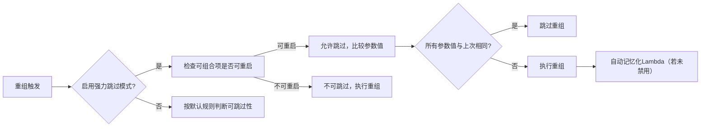

# 强烈的跳过模式

原地址：<https://developer.android.google.cn/develop/ui/compose/performance/stability/strongskipping?hl=zh-cn>

## 一、核心概念

**强力跳过模式（Strong Skipping Mode）**是Compose编译器提供的优化模式，通过以下方式提升重组效率：

1. **放宽可跳过规则**：允许带不稳定参数的可组合项被跳过
2. **自动记忆化Lambda**：对包含不稳定捕获的Lambda进行缓存
3. **默认启用**：Kotlin 2.0.20及以上版本默认开启，以下版本需手动配置

## 二、启用方式

### 1. Kotlin 2.0.20之前版本配置

在模块级`build.gradle`中添加：

```gradle
composeCompiler {
    enableStrongSkippingMode = true // 启用强力跳过模式
}
```

### 2. 版本兼容性

- **Kotlin 2.0.20+**：默认启用，无需额外配置
- **旧版本**：必须显式配置`enableStrongSkippingMode`

## 三、可组合项的可跳过性变化

### 1. 默认规则 vs 强力模式对比

|特性|默认模式|强力跳过模式|
|----|----|----|
|可跳过条件|所有参数均稳定|可重启的可组合项**无条件可跳过**|
|不可重启组件|不可跳过|不可跳过|
|不稳定参数影响|导致不可跳过|不影响可跳过性|

### 2. 强制禁用跳过

如需保留不可跳过行为，使用`@NonSkippableComposable`注解：

```kotlin
@NonSkippableComposable // 标记为不可跳过
@Composable
fun MyNonSkippableComposable() { ... }
```

## 四、参数比较规则

Compose通过以下方式判断是否跳过重组：

1. **不稳定参数**：使用**实例相等性（`===`）**比较（如未标记`@Stable`的对象）
2. **稳定参数**：使用**对象相等性（`equals()`）**比较（如标记`@Stable`的对象或基本类型）

**条件**：所有参数比较结果与上次相同 → 跳过重组

## 五、类稳定性标记

### 1. `@Stable`注解作用

- 强制Compose使用**对象相等性**比较该类实例
- 场景：数据源返回的对象列表（如Room数据库查询结果），避免因单个元素变化导致全量重组

### 2. 示例

```kotlin
@Stable // 标记为稳定类
data class User(
    val id: Long,
    val name: String
)
```

- 未标记时：使用实例相等性（即使内容相同，新实例视为不同）
- 标记后：使用对象相等性（内容相同则视为相同）

## 六、Lambda记忆化机制

### 1. 自动记忆化逻辑

启用强力跳过后，编译器自动将可组合项内的Lambda用`remember`封装：

```kotlin
// 原始代码
@Composable
fun MyComposable(unstable: Unstable, stable: Stable) {
    val lambda = { 
        unstable.doSomething() 
        stable.doAnotherThing() 
    }
}

// 编译后代码（自动添加remember）
@Composable
fun MyComposable(unstable: Unstable, stable: Stable) {
    val lambda = remember(unstable, stable) { // 键为捕获的参数
        { 
            unstable.doSomething() 
            stable.doAnotherThing() 
        }
    }
}
```

### 2. 键比较规则

- **不稳定参数**：作为键时使用实例相等性（`===`）
- **稳定参数**：作为键时使用对象相等性（`equals()`）

### 3. 禁用记忆化

如需阻止特定Lambda被记忆化，使用`@DontMemoize`注解：

```kotlin
val lambda = @DontMemoize { // 禁止自动记忆化
    // 每次重组都会创建新Lambda实例
}
```

## 七、APK大小影响

### 1. 增量原因

- 可跳过的可组合项生成更多控制代码
- Lambda记忆化引入额外的`remember`包装逻辑

### 2. 实测数据

- 典型应用启用后APK增加约**4KB**
- 实际差异取决于原有不可跳过组件数量，通常影响较小

## 八、流程图：强力跳过模式执行逻辑



## 九、最佳实践建议

1. **优先升级Kotlin版本**：利用2.0.20+默认启用的特性，减少配置成本
2. **谨慎标记稳定类**：仅对确实需要对象相等性比较的类使用`@Stable`
3. **细粒度控制Lambda**：对性能敏感的Lambda使用`@DontMemoize`避免不必要缓存
4. **监控APK大小**：通过Android Studio的APK分析工具查看增量是否在可接受范围内
5. **结合布局检查器**：验证重组次数是否因强力模式显著减少
